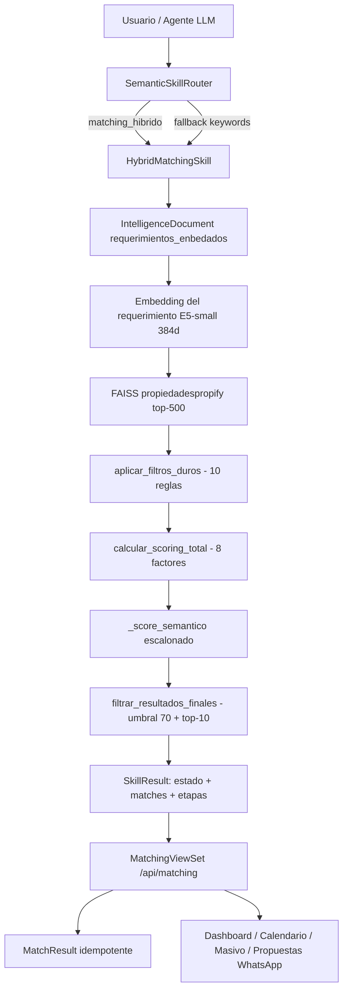

# Análisis completo del sistema de Matching — Propifai (Prometeo)

> Fecha: 2026-09-16 · Incluye el estado post-implementación de las Fases 0–5 del SPEC de matching.

---

## 1. Resumen ejecutivo

El sistema de matching cruza **requerimientos de clientes** (demanda) con **propiedades disponibles** (oferta) y devuelve coincidencias rankeadas por compatibilidad.

Está organizado en **tres capas**:

| Capa | Componente | Ubicación |
|---|---|---|
| **Skills** (interfaz de agentes) | `HybridMatchingSkill` (motor real), `MatchingOfertaDemandaSkill` (deprecado) | [`intelligence/skills/`](webapp/intelligence/skills/matching_hybrid.py:29) |
| **Scoring** (reglas de negocio) | Filtros duros, scoring ponderado, filtrado final | [`matching/scoring.py`](webapp/matching/scoring.py:1) |
| **Presentación/persistencia** | API REST, dashboards, calendario, masivo, propuestas WhatsApp | [`matching/`](webapp/matching/urls.py:15) |

---

## 2. Arquitectura

### 2.1 Skills

- **`HybridMatchingSkill`** ([`matching_hybrid.py`](webapp/intelligence/skills/matching_hybrid.py:29), nombre `matching_hibrido`): motor real v4.
  - **Pipeline**: obtener embedding del requerimiento → FAISS (top-500) → filtros duros → scoring estructural → scoring semántico → filtrado final (umbral 70 + top-10).
  - Opera **100% sobre `IntelligenceDocument` + FAISS**; no consulta `dbpropify_be` directamente.
  - **Estados explícitos** en `SkillResult.data`: `sin_embedding`, `faiss_no_disponible`, `sin_matches`, `matches`.
  - **Evidencia por etapa**: `etapas = {faiss_top, post_filtros, post_umbral}`.
  - **Self-heal on-demand**: si el requerimiento no tiene embedding, lo sincroniza/embebe al instante y reintenta (sin depender de Celery).

- **`MatchingOfertaDemandaSkill`** ([`matching.py`](webapp/intelligence/skills/matching.py:11), nombre `matching_oferta_demanda`): **deprecado en Fase 5**. Era scoring simple en memoria sobre listas; sin llamadas de ejecución en el código.

### 2.2 Scoring ([`scoring.py`](webapp/matching/scoring.py:1))

- **Constantes**: `UMBRAL_MINIMO_SCORE=70`, `TOP_K_MATCHES=10`, tolerancias, `PESOS` (distrito 15, precio 20, habitaciones 15, baños 10, área 10, amenities 10, antigüedad 5, semántico 15).
- **`aplicar_filtros_duros()`**: 10 discriminadores (condición, tipo, forma de pago, presupuesto, habitaciones, baños, área, ascensor, cochera, distrito).
- **`calcular_scoring_total()`**: 8 factores ponderados.
- **`_score_semantico()`**: función escalonada según similitud coseno.
- **`filtrar_resultados_finales()`**: umbral + top-K + ranking.
- **Tipo de cambio configurable** (Fase 3): lee `settings.TIPO_CAMBIO_USD_PEN` (variable de entorno `TIPO_CAMBIO_USD_PEN`, default 3.75).

### 2.3 Wrapper y persistencia

- [`matching/engine.py`](webapp/matching/engine.py:1): wrapper de compatibilidad; `ejecutar_matching_requerimiento()` redirige a `matching_hibrido`; `guardar_resultados_matching()` es **idempotente** (Fase 2: borra resultados previos del requerimiento antes de guardar).
- [`matching/models.py`](webapp/matching/models.py:52): `MatchResult` (score, detalle, ranking, `ejecutado_en`).
- [`matching/views.py`](webapp/matching/views.py:77): `MatchingViewSet` (ejecutar/resumen/guardados/guardar/pipeline…) + dashboards.

---

## 3. Qué afecta y qué hace cada pieza

| Pieza | Hace | Afecta a |
|---|---|---|
| `HybridMatchingSkill` | Busca y rankea propiedades compatibles | Agentes (propiedades/requerimientos), chat, API, calendario |
| `scoring.aplicar_filtros_duros` | Descarta propiedades incompatibles antes de puntuar | Precisión del matching (si es muy agresivo → `sin_matches`) |
| `scoring.calcular_scoring_total` | Puntúa por 8 factores | Orden/ranking de resultados |
| `scoring._score_semantico` | Puntúa por similitud semántica | Recuperación de propiedades parecidas aunque no coincidan en filtros exactos |
| `filtrar_resultados_finales` | Aplica umbral 70% + top-10 | Cuántas propiedades se muestran |
| `ejecutar_matching_requerimiento` | Orquesta skill → resultados | API y comandos (calendario) |
| `guardar_resultados_matching` | Persiste en `MatchResult` (idempotente) | Calendario y dashboard de matches |
| `MatchingViewSet` | API REST + guardado automático | Dashboard web, calendario, propuestas WhatsApp |

---

## 4. Integraciones

- **Registro de skills**: [`intelligence/apps.py:80`](webapp/intelligence/apps.py:80) — registra `HybridMatchingSkill` (y ya no `MatchingOfertaDemandaSkill`).
- **Router semántico**: [`semantic_router.py`](webapp/intelligence/services/semantic_router.py:516) clasifica intención; fallback por keywords ahora incluye matching (Fase 1).
- **Agentes**:
  - `AgentePropiedades` usa `matching_hibrido` ([`propiedades_agent.py:55`](webapp/intelligence/agents/propiedades_agent.py:55)).
  - `AgenteRequerimientos` usa `matching_OD`/`mis_matches` ([`requerimientos_agent.py:53`](webapp/intelligence/agents/requerimientos_agent.py:53)).
  - `SearchAgent` delega en `HybridMatchingSkill` ([`search_agent.py:63`](webapp/intelligence/agents/search_agent.py:63)).
- **Colecciones RAG**: `propiedadespropify` y `requerimientos_enbedados` ([`search_agent.py:252`](webapp/intelligence/agents/search_agent.py:252)).
- **Chat**: [`chat_processor.py:129`](webapp/intelligence/services/chat_processor.py:129) distingue skills de búsqueda vs matching.
- **Memoria episódica**: episode_type `matching` ([`models.py:572`](webapp/intelligence/models.py:572)).
- **Acceso público**: `/matching/` ([`middleware.py:39`](webapp/intelligence/middleware.py:39)).
- **API/UI**: [`matching/urls.py:15`](webapp/matching/urls.py:15).

---

## 5. Cambios aplicados (SPEC Fases 0–5)

| Fase | Cambio | Archivos |
|---|---|---|
| 0 | Diagnóstico: sin bug de pooling; 102/803 sin embedding; fallback sin keywords de matching | — |
| 1 | Estados + evidencia por etapa + self-heal on-demand + badge visual + fallback keywords + backfill (922) | matching_hybrid.py, views.py, engine.py, dashboard.html, semantic_router.py |
| 2 | Idempotencia de `MatchResult` + separación lectura/escritura | engine.py, urls.py |
| 3 | Tipo de cambio configurable por entorno + visible en dashboard | settings.py, scoring.py, engine.py, views.py, dashboard.html |
| 4 | Caché de matches con framework de Django (TTL 300s) | views.py |
| 5 | Deprecación de `matching_oferta_demanda` | apps.py, semantic_router.py |

---

## 6. Cómo probar que funciona

1. **Matching normal**: `GET /api/matching/<requerimiento_id>/ejecutar/` → si hay matches, `resultados` poblado y `parametros.estado = "matches"` con `etapas`.
2. **Sin embedding**: usar un requerimiento sin documento → `parametros.estado = "sin_embedding"` (y el self-heal intenta embebelo en el acto).
3. **FAISS caído**: detener/borrar el índice → `faiss_no_disponible`.
4. **Sin coincidencias reales**: `sin_matches` con `etapas` mostrando `faiss_top > 0` pero `post_filtros = 0` (filtros duros) o `post_umbral = 0` (umbral).
5. **Idempotencia**: ejecutar dos veces el mismo requerimiento → no duplica `MatchResult`.
6. **Dashboard**: el panel muestra el estado y el badge; el tipo de cambio aparece en el header.

---

## 7. Recomendaciones pendientes

- Instrumentar el router para **persistir métricas de uso** (hoy solo contadores en memoria), útil para futuras decisiones de deprecación.
- Evaluar una señal `post_save` de `Requerimiento` para embebido inmediato (hoy el self-heal cubre el caso en el match; no es obligatorio).
- El archivo `webapp/$null` (log basura trackeado) debería eliminarse del repo.
