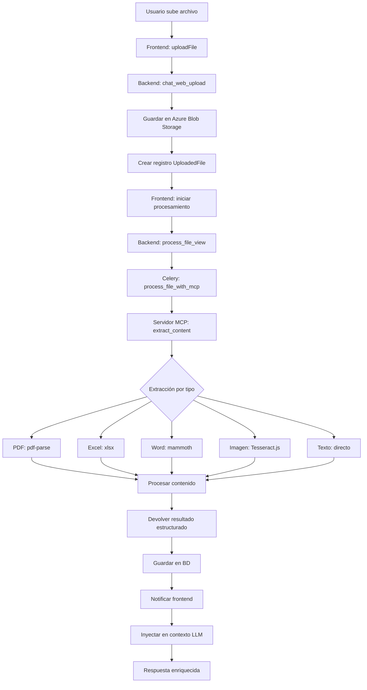

# Plan de Implementación: Procesamiento de Archivos con MCP para Chatbot

## Contexto Actual

El proyecto Propifai ya tiene implementada una funcionalidad básica de subida de archivos en el endpoint `/api/v1/intelligence/chat-web/upload/`. Sin embargo, esta implementación solo guarda archivos temporalmente y no extrae contenido estructurado para enriquecer el contexto del chatbot.

## Objetivo

Implementar un sistema completo de procesamiento de archivos adjuntos mediante Model Context Protocol (MCP) que permita:
1. Subir archivos de diversos formatos (PDF, DOCX, XLSX, TXT, imágenes con OCR)
2. Extraer contenido estructurado automáticamente
3. Inyectar el contexto extraído en las solicitudes del LLM
4. Proporcionar una interfaz de usuario mejorada para la gestión de archivos

## Arquitectura Propuesta

### 1. Backend Django/DRF Extendido

#### Nuevos Modelos
```python
# intelligence/models.py
class UploadedFile(models.Model):
    """Archivo subido por el usuario"""
    id = models.UUIDField(primary_key=True, default=uuid.uuid4, editable=False)
    user = models.ForeignKey(User, on_delete=models.CASCADE, null=True, blank=True)
    conversation = models.ForeignKey('Conversation', on_delete=models.CASCADE, null=True, blank=True)
    original_filename = models.CharField(max_length=255)
    stored_filename = models.CharField(max_length=255)
    file_size = models.IntegerField()
    mime_type = models.CharField(max_length=100)
    file_type = models.CharField(max_length=50)  # pdf, excel, word, image, text
    upload_date = models.DateTimeField(auto_now_add=True)
    processing_status = models.CharField(
        max_length=20,
        choices=[
            ('pending', 'Pendiente'),
            ('processing', 'Procesando'),
            ('completed', 'Completado'),
            ('failed', 'Fallido')
        ],
        default='pending'
    )
    extracted_content = models.TextField(null=True, blank=True)
    metadata = models.JSONField(default=dict)
    azure_blob_url = models.URLField(null=True, blank=True)
    
    class Meta:
        ordering = ['-upload_date']

class FileProcessingJob(models.Model):
    """Trabajo de procesamiento de archivos"""
    file = models.ForeignKey(UploadedFile, on_delete=models.CASCADE)
    job_id = models.UUIDField(default=uuid.uuid4, editable=False)
    status = models.CharField(max_length=20, default='pending')
    mcp_server_url = models.URLField()
    extraction_method = models.CharField(max_length=50)
    started_at = models.DateTimeField(auto_now_add=True)
    completed_at = models.DateTimeField(null=True, blank=True)
    error_message = models.TextField(null=True, blank=True)
    result_data = models.JSONField(null=True, blank=True)
```

#### Serializadores Extendidos
```python
# intelligence/serializers.py
class UploadedFileSerializer(serializers.ModelSerializer):
    class Meta:
        model = UploadedFile
        fields = ['id', 'original_filename', 'file_size', 'mime_type', 
                 'upload_date', 'processing_status', 'extracted_content_preview']
    
    extracted_content_preview = serializers.SerializerMethodField()
    
    def get_extracted_content_preview(self, obj):
        if obj.extracted_content:
            return obj.extracted_content[:200] + '...' if len(obj.extracted_content) > 200 else obj.extracted_content
        return None

class FileProcessingRequestSerializer(serializers.Serializer):
    file_id = serializers.UUIDField()
    extraction_method = serializers.ChoiceField(
        choices=['full_text', 'structured_data', 'tables_only', 'summary']
    )
    include_ocr = serializers.BooleanField(default=False)
```

#### Nuevos Endpoints
```python
# intelligence/urls.py
urlpatterns = [
    # Endpoints existentes...
    path('upload/', chat_web_upload, name='chat_web_upload'),
    path('files/', FileListView.as_view(), name='file_list'),
    path('files/<uuid:file_id>/', FileDetailView.as_view(), name='file_detail'),
    path('files/<uuid:file_id>/process/', ProcessFileView.as_view(), name='process_file'),
    path('files/<uuid:file_id>/content/', FileContentView.as_view(), name='file_content'),
    path('jobs/<uuid:job_id>/status/', JobStatusView.as_view(), name='job_status'),
]
```

### 2. Servidor MCP para Procesamiento de Archivos

#### Estructura del Servidor MCP
```
mcp-file-processor/
├── src/
│   ├── index.ts              # Servidor MCP principal
│   ├── extractors/           # Extractores por tipo de archivo
│   │   ├── pdf-extractor.ts
│   │   ├── excel-extractor.ts
│   │   ├── word-extractor.ts
│   │   ├── image-extractor.ts (OCR)
│   │   └── text-extractor.ts
│   ├── tools/               # Herramientas MCP
│   │   ├── extract-content.ts
│   │   ├── analyze-document.ts
│   │   └── summarize-content.ts
│   └── utils/
│       ├── file-utils.ts
│       └── validation.ts
├── package.json
├── tsconfig.json
└── README.md
```

#### Configuración del Servidor MCP
```typescript
// mcp-file-processor/src/index.ts
import { Server } from "@modelcontextprotocol/sdk/server/index.js";
import { StdioServerTransport } from "@modelcontextprotocol/sdk/server/stdio.js";
import { HttpServerTransport } from "@modelcontextprotocol/sdk/server/http.js";
import { z } from "zod";
import { extractPDFContent } from "./extractors/pdf-extractor.js";
import { extractExcelContent } from "./extractors/excel-extractor.js";
import { extractWordContent } from "./extractors/word-extractor.js";
import { extractImageText } from "./extractors/image-extractor.js";

const server = new Server(
  {
    name: "propifai-file-processor",
    version: "1.0.0",
  },
  {
    capabilities: {
      tools: {
        extract_content: {
          description: "Extrae contenido estructurado de archivos",
          inputSchema: {
            type: "object",
            properties: {
              file_path: { type: "string", description: "Ruta al archivo" },
              file_type: { 
                type: "string", 
                enum: ["pdf", "excel", "word", "image", "text"],
                description: "Tipo de archivo"
              },
              extraction_method: {
                type: "string",
                enum: ["full_text", "structured_data", "tables_only", "summary"],
                default: "full_text"
              },
              include_ocr: { type: "boolean", default: false }
            },
            required: ["file_path", "file_type"]
          }
        },
        analyze_document: {
          description: "Analiza documentos inmobiliarios y extrae datos estructurados",
          inputSchema: {
            type: "object",
            properties: {
              content: { type: "string", description: "Contenido del documento" },
              document_type: {
                type: "string",
                enum: ["property_listing", "contract", "financial", "legal"],
                default: "property_listing"
              }
            },
            required: ["content"]
          }
        }
      }
    }
  }
);
```

#### Extractores Especializados
```typescript
// mcp-file-processor/src/extractors/pdf-extractor.ts
import pdfParse from 'pdf-parse';
import * as fs from 'fs/promises';

export async function extractPDFContent(filePath: string, options: any = {}) {
  try {
    const dataBuffer = await fs.readFile(filePath);
    const data = await pdfParse(dataBuffer);
    
    const result = {
      text: data.text,
      metadata: data.metadata,
      numPages: data.numpages,
      extractedAt: new Date().toISOString()
    };
    
    // Extraer tablas si se solicita
    if (options.extraction_method === 'tables_only') {
      result.tables = extractTablesFromText(data.text);
    }
    
    // Resumir si se solicita
    if (options.extraction_method === 'summary') {
      result.summary = await generateSummary(data.text);
    }
    
    return result;
  } catch (error) {
    throw new Error(`Error procesando PDF: ${error.message}`);
  }
}
```

### 3. Integración Django-MCP

#### Tarea Celery para Procesamiento Asíncrono
```python
# intelligence/tasks.py
from celery import shared_task
import requests
import json
from django.conf import settings

@shared_task
def process_file_with_mcp(file_id, extraction_method='full_text', include_ocr=False):
    """
    Procesa un archivo usando el servidor MCP
    """
    from .models import UploadedFile, FileProcessingJob
    
    try:
        file = UploadedFile.objects.get(id=file_id)
        job = FileProcessingJob.objects.create(
            file=file,
            mcp_server_url=settings.MCP_SERVER_URL,
            extraction_method=extraction_method
        )
        
        # Preparar solicitud al servidor MCP
        mcp_payload = {
            "jsonrpc": "2.0",
            "method": "tools/call",
            "params": {
                "name": "extract_content",
                "arguments": {
                    "file_path": file.get_local_path(),
                    "file_type": file.file_type,
                    "extraction_method": extraction_method,
                    "include_ocr": include_ocr
                }
            },
            "id": str(job.job_id)
        }
        
        # Enviar solicitud al servidor MCP
        response = requests.post(
            f"{settings.MCP_SERVER_URL}/call",
            json=mcp_payload,
            headers={'Content-Type': 'application/json'}
        )
        
        if response.status_code == 200:
            result = response.json()
            if 'result' in result:
                # Guardar contenido extraído
                file.extracted_content = json.dumps(result['result'], ensure_ascii=False)
                file.processing_status = 'completed'
                file.save()
                
                job.status = 'completed'
                job.result_data = result['result']
                job.completed_at = timezone.now()
                job.save()
                
                return {
                    'success': True,
                    'job_id': str(job.job_id),
                    'file_id': str(file_id)
                }
        
        # Si hay error
        job.status = 'failed'
        job.error_message = response.text
        job.save()
        
        return {
            'success': False,
            'error': 'Error procesando archivo con MCP'
        }
        
    except Exception as e:
        return {
            'success': False,
            'error': str(e)
        }
```

#### Vista de Procesamiento de Archivos
```python
# intelligence/views.py
@api_view(['POST'])
@permission_classes([AllowAny])
def process_file_view(request, file_id):
    """
    Inicia el procesamiento de un archivo usando MCP
    """
    try:
        file = UploadedFile.objects.get(id=file_id)
        
        serializer = FileProcessingRequestSerializer(data=request.data)
        if not serializer.is_valid():
            return Response(serializer.errors, status=status.HTTP_400_BAD_REQUEST)
        
        data = serializer.validated_data
        
        # Iniciar tarea Celery
        task = process_file_with_mcp.delay(
            file_id=file_id,
            extraction_method=data.get('extraction_method', 'full_text'),
            include_ocr=data.get('include_ocr', False)
        )
        
        return Response({
            'success': True,
            'job_id': task.id,
            'status': 'processing',
            'message': 'Procesamiento iniciado'
        }, status=status.HTTP_202_ACCEPTED)
        
    except UploadedFile.DoesNotExist:
        return Response({
            'success': False,
            'error': 'Archivo no encontrado'
        }, status=status.HTTP_404_NOT_FOUND)
    except Exception as e:
        return Response({
            'success': False,
            'error': str(e)
        }, status=status.HTTP_500_INTERNAL_SERVER_ERROR)
```

### 4. Frontend Mejorado

#### Modificaciones en chat.js
```javascript
// Funciones nuevas para gestión de archivos
function processFile(fileId, extractionMethod = 'full_text') {
    return fetch(`${apiUrls.base}/files/${fileId}/process/`, {
        method: 'POST',
        headers: {
            'Content-Type': 'application/json',
            'X-CSRFToken': getCsrfToken()
        },
        body: JSON.stringify({
            extraction_method: extractionMethod,
            include_ocr: true
        })
    })
    .then(response => response.json())
    .then(data => {
        if (data.success) {
            return pollJobStatus(data.job_id);
        }
        throw new Error(data.error || 'Error procesando archivo');
    });
}

function pollJobStatus(jobId, maxAttempts = 30, interval = 2000) {
    return new Promise((resolve, reject) => {
        let attempts = 0;
        
        const checkStatus = () => {
            fetch(`${apiUrls.base}/jobs/${jobId}/status/`)
                .then(response => response.json())
                .then(data => {
                    if (data.status === 'completed') {
                        resolve(data.result);
                    } else if (data.status === 'failed') {
                        reject(new Error(data.error_message || 'Procesamiento fallido'));
                    } else if (attempts >= maxAttempts) {
                        reject(new Error('Tiempo de espera agotado'));
                    } else {
                        attempts++;
                        setTimeout(checkStatus, interval);
                    }
                })
                .catch(reject);
        };
        
        checkStatus();
    });
}

function injectFileContext(fileContent, conversationId) {
    // Inyectar contenido extraído en el contexto de la conversación
    return fetch(`${apiUrls.base}/conversations/${conversationId}/context/`, {
        method: 'POST',
        headers: {
            'Content-Type': 'application/json',
            'X-CSRFToken': getCsrfToken()
        },
        body: JSON.stringify({
            type: 'file_content',
            content: fileContent,
            source: 'file_upload'
        })
    });
}
```

#### Interfaz de Usuario Mejorada
```html
<!-- Nueva sección en chat.html -->
<div class="file-processing-panel" id="file-processing-panel">
    <div class="panel-header">
        <h4>Procesamiento de Archivos</h4>
        <button class="btn-close" id="close-file-panel">×</button>
    </div>
    <div class="panel-body">
        <div class="file-queue" id="file-queue">
            <!-- Archivos en cola de procesamiento -->
        </div>
        <div class="processing-options">
            <h5>Opciones de Extracción</h5>
            <div class="form-check">
                <input type="radio" name="extraction-method" value="full_text" checked>
                <label>Texto completo</label>
            </div>
            <div class="form-check">
                <input type="radio" name="extraction-method" value="structured_data">
                <label>Datos estructurados</label>
            </div>
            <div class="form-check">
                <input type="radio" name="extraction-method" value="tables_only">
                <label>Solo tablas</label>
            </div>
            <div class="form-check">
                <input type="checkbox" name="include-ocr" checked>
                <label>Incluir OCR para imágenes</label>
            </div>
        </div>
        <button class="btn btn-primary" id="process-files-btn">
            Procesar Archivos
        </button>
    </div>
</div>
```

### 5. Flujo de Datos Completo



### 6. Consideraciones de Seguridad

#### Validaciones de Archivos
1. **Tamaño máximo**: 10MB por archivo
2. **Tipos permitidos**: PDF, DOCX, XLSX, TXT, JPG, PNG, GIF
3. **Sanitización de nombres**: Remover caracteres especiales
4. **Virus scanning**: Integración con ClamAV (opcional)

#### Autenticación y Autorización
1. **CSRF tokens**: Requeridos para todas las operaciones
2. **Rate limiting**: Máximo 10 archivos por minuto por usuario
3. **Validación de contenido**: Rechazar archivos con contenido malicioso
4. **Logging**: Registrar todas las operaciones de subida y procesamiento

### 7. Manejo de Errores

#### Errores Comunes y Soluciones
1. **Archivo demasiado grande**: Retornar error 413 con mensaje claro
2. **Tipo no soportado**: Listar tipos permitidos en el mensaje de error
3. **Procesamiento fallido**: Reintentar automáticamente (máximo 3 intentos)
4. **Timeout MCP**: Configurar timeout de 30 segundos y reintentar

#### Monitoreo
1. **Health checks**: Verificar que el servidor MCP esté disponible
2. **Métricas**: Tiempo de procesamiento, tasa de éxito, tipos de archivo procesados
3. **Alertas**: Notificar cuando la tasa de fallos supere el 5%

### 8. Escalabilidad

#### Arquitectura Escalable
1. **Múltiples instancias MCP**: Balancear carga entre servidores MCP
2. **Colas de procesamiento**: Usar Celery con Redis para manejar picos
3. **Cache de resultados**: Cachear contenido extraído por 24 horas
4. **Storage distribuido**: Azure Blob Storage con CDN para archivos grandes

#### Optimizaciones de Rendimiento
1. **Procesamiento paralelo**: Procesar múltiples archivos simultáneamente
2. **Streaming**: Procesar archivos grandes por chunks
3. **Compresión**: Comprimir contenido extraído antes de almacenar
4. **Indexación**: Indexar contenido para búsqueda rápida

### 9. Roadmap de Implementación

#### Fase 1: Fundamentos (Semanas 1-2)
1. **Modelos y migraciones**: Crear modelos UploadedFile y FileProcessingJob
2. **Endpoints básicos**: Implementar upload, list y detail endpoints
3. **Integración Azure Blob**: Configurar almacenamiento en la nube
4. **Frontend básico**: Extender interfaz de subida de archivos

#### Fase 2: Servidor MCP (Semanas 3-4)
1. **Setup TypeScript**: Configurar proyecto MCP con TypeScript
2. **Extractores básicos**: Implementar PDF y texto plano
3. **Integración Django-MCP**: Conectar backend con servidor MCP
4. **Procesamiento asíncrono**: Implementar tareas Celery

#### Fase 3: Formatos Avanzados (Semanas 5-6)
1. **Excel extractor**: Extraer tablas y datos estructurados de XLSX/XLS
2. **Word extractor**: Procesar documentos DOCX/DOC
3. **OCR para imágenes**: Integrar Tesseract.js para extracción de texto
4. **Validación de contenido**: Verificar integridad de datos extraídos

#### Fase 4: Mejoras y Optimización (Semanas 7-8)
1. **Interfaz avanzada**: Panel de procesamiento en tiempo real
2. **Context injection**: Inyectar automáticamente contenido en conversaciones
3. **Cache y optimización**: Implementar cache y compresión
4. **Monitoreo y alertas**: Dashboard de métricas y alertas

### 10. Dependencias Requeridas

#### Backend (requirements.txt)
```
# Procesamiento de archivos
pdf-parse==1.0.0
openpyxl==3.1.2
python-docx==1.1.0
Pillow==10.3.0  # Para imágenes
pytesseract==0.3.10  # OCR (requiere Tesseract instalado)

# Azure
azure-storage-blob==12.23.0

# Celery
celery==5.4.0
redis==5.0.1

# Validación
python-magic==0.4.27
```

#### Frontend (package.json)
```json
{
  "dependencies": {
    "@modelcontextprotocol/sdk": "^0.6.0",
    "pdf-parse": "^1.1.1",
    "xlsx": "^0.18.5",
    "mammoth": "^1.6.0",
    "tesseract.js": "^5.0.0",
    "axios": "^1.6.0"
  }
}
```

### 11. Pruebas y QA

#### Pruebas Unitarias
1. **Validación de archivos**: Testear tipos, tamaños y nombres
2. **Extractores**: Verificar extracción correcta por tipo de archivo
3. **Integración MCP**: Testear comunicación backend-MCP
4. **Procesamiento asíncrono**: Verificar flujo completo Celery

#### Pruebas de Integración
1. **Flujo completo**: Subida → procesamiento → inyección de contexto
2. **Múltiples archivos**: Procesamiento concurrente
3. **Archivos grandes**: Manejo de archivos de 10MB+
4. **Recuperación de errores**: Fallos de red, timeout, formatos corruptos

#### Pruebas de Carga
1. **Múltiples usuarios**: 10+ usuarios subiendo simultáneamente
2. **Archivos pesados**: Procesamiento de múltiples PDF grandes
3. **Colas largas**: 50+ archivos en cola de procesamiento

### 12. Documentación

#### Documentación Técnica
1. **API documentation**: OpenAPI/Swagger para nuevos endpoints
2. **Setup MCP**: Guía de instalación y configuración del servidor MCP
3. **Guía de desarrollo**: Cómo agregar nuevos extractores de archivos
4. **Troubleshooting**: Solución de problemas comunes

#### Documentación de Usuario
1. **Guía de uso**: Cómo subir y procesar archivos en el chatbot
2. **Formatos soportados**: Lista completa de tipos de archivo
3. **Límites y restricciones**: Tamaños máximos y consideraciones
4. **Ejemplos de uso**: Casos prácticos de procesamiento de archivos

### 13. Conclusión

La implementación de procesamiento de archivos mediante MCP proporcionará al chatbot de Propifai capacidades avanzadas para entender y procesar documentos inmobiliarios. Esta arquitectura:

1. **Escalable**: Puede manejar múltiples tipos de archivo y grandes volúmenes
2. **Extensible**: Fácil de agregar nuevos extractores y formatos
3. **Robusta**: Incluye manejo de errores, monitoreo y recuperación
4. **Integrada**: Se conecta naturalmente con el flujo existente del chatbot

La implementación por fases permite entregar valor incremental mientras se mantiene la estabilidad del sistema en producción.

### 14. Arquitectura como Servicio Centralizado

#### Visión: MCP como Plataforma de Procesamiento
El servidor MCP debe diseñarse como un **servicio centralizado** que pueda ser consumido por múltiples aplicaciones dentro del ecosistema Propifai:

1. **Propify (actual)**: Chatbot y gestión de propiedades
2. **CRM (futuro)**: Gestión de clientes y documentos
3. **ACM**: Análisis comparativo de mercado
4. **Meta Ads**: Dashboard de publicidad
5. **Otras apps futuras**: Cualquier aplicación que necesite procesamiento de documentos

#### Componentes para Multi-Aplicación

##### Cliente MCP Reutilizable
```python
# mcp_client/__init__.py
class MCPClient:
    """Cliente reutilizable para cualquier aplicación Django"""
    
    def __init__(self, base_url=None, api_key=None):
        self.base_url = base_url or settings.MCP_SERVER_URL
        self.api_key = api_key or settings.MCP_API_KEY
        self.session = requests.Session()
    
    def extract_content(self, file_path, file_type, extraction_method='full_text',
                       context=None, app_id=None):
        """
        Extrae contenido de archivos para cualquier aplicación
        
        Args:
            file_path: Ruta al archivo
            file_type: Tipo de archivo (pdf, excel, word, image, text)
            extraction_method: Método de extracción
            context: Contexto específico de la aplicación
            app_id: Identificador de la aplicación (propify, crm, acm, meta_ads)
        """
        payload = {
            "jsonrpc": "2.0",
            "method": "tools/call",
            "params": {
                "name": "extract_content",
                "arguments": {
                    "file_path": file_path,
                    "file_type": file_type,
                    "extraction_method": extraction_method,
                    "context": context or {},
                    "app_id": app_id
                }
            },
            "id": str(uuid.uuid4())
        }
        
        response = self.session.post(
            f"{self.base_url}/call",
            json=payload,
            headers={
                'Content-Type': 'application/json',
                'Authorization': f'Bearer {self.api_key}'
            }
        )
        
        return response.json()
    
    def get_app_specific_tool(self, app_id, tool_name, **kwargs):
        """Obtiene herramienta específica para una aplicación"""
        # Implementación para herramientas especializadas por app
        pass
```

##### Configuración por Aplicación en el Servidor MCP
```typescript
// mcp-file-processor/src/app-contexts/
interface AppContext {
  app_id: string;
  business_rules: Record<string, any>;
  transformation_rules: Record<string, any>;
  validation_schemas: Record<string, any>;
}

const APP_CONTEXTS: Record<string, AppContext> = {
  propify: {
    app_id: 'propify',
    business_rules: {
      property_types: ['casa', 'departamento', 'terreno', 'local'],
      currencies: ['PEN', 'USD'],
      locations: ['Cayma', 'Yanahuara', 'Cercado', /* ... */]
    },
    transformation_rules: {
      normalize_property_data: (data) => { /* ... */ },
      validate_price_per_m2: (data) => { /* ... */ }
    }
  },
  crm: {
    app_id: 'crm',
    business_rules: {
      document_types: ['dni', 'contrato', 'estado_financiero', 'propuesta'],
      client_categories: ['lead', 'prospecto', 'cliente', 'excliente']
    },
    transformation_rules: {
      extract_client_info: (data) => { /* ... */ },
      normalize_contact_data: (data) => { /* ... */ }
    }
  },
  acm: {
    app_id: 'acm',
    business_rules: {
      analysis_types: ['precio_m2', 'tendencias', 'comparativa_zona'],
      data_sources: ['urbania', 'adondevivir', 'remax', 'propia']
    }
  },
  meta_ads: {
    app_id: 'meta_ads',
    business_rules: {
      report_types: ['campaign_performance', 'audience_insights', 'roi_analysis'],
      metrics: ['impressions', 'clicks', 'conversions', 'spend']
    }
  }
};
```

#### Herramientas Especializadas por Aplicación
```typescript
// mcp-file-processor/src/tools/app-specific/
export const propifyTools = {
  extract_property_listing: {
    description: "Extrae datos de listados inmobiliarios para Propify",
    handler: async (args: any) => {
      const content = await extractContent(args.file_path, args.file_type);
      return transformForPropify(content, APP_CONTEXTS.propify);
    }
  },
  analyze_property_document: {
    description: "Analiza documentos de propiedades para Propify",
    handler: async (args: any) => {
      // Lógica específica para Propify
    }
  }
};

export const crmTools = {
  extract_client_document: {
    description: "Extrae datos de documentos de clientes para CRM",
    handler: async (args: any) => {
      const content = await extractContent(args.file_path, args.file_type);
      return transformForCRM(content, APP_CONTEXTS.crm);
    }
  },
  process_contract: {
    description: "Procesa contratos para el CRM",
    handler: async (args: any) => {
      // Lógica específica para contratos en CRM
    }
  }
};

export const acmTools = {
  analyze_market_report: {
    description: "Analiza reportes de mercado para ACM",
    handler: async (args: any) => {
      // Lógica específica para ACM
    }
  }
};

export const metaAdsTools = {
  process_ad_report: {
    description: "Procesa reportes de publicidad para Meta Ads",
    handler: async (args: any) => {
      // Lógica específica para Meta Ads
    }
  }
};
```

#### Sistema de Autenticación Multi-Aplicación
```python
# mcp_client/auth.py
class MCPAuthMiddleware:
    """Middleware para autenticación entre aplicaciones"""
    
    def __init__(self):
        self.app_registry = {
            'propify': {
                'api_key': settings.PROPIFY_MCP_API_KEY,
                'allowed_ips': ['10.0.0.0/8', '192.168.0.0/16'],
                'rate_limit': '100/hour'
            },
            'crm': {
                'api_key': settings.CRM_MCP_API_KEY,
                'allowed_ips': ['*'],  # Configurar según despliegue
                'rate_limit': '50/hour'
            },
            'acm': {
                'api_key': settings.ACM_MCP_API_KEY,
                'allowed_ips': ['10.0.0.0/8'],
                'rate_limit': '200/hour'
            }
        }
    
    def authenticate_request(self, request):
        api_key = request.headers.get('Authorization', '').replace('Bearer ', '')
        app_id = request.headers.get('X-App-Id')
        
        if not api_key or not app_id:
            return False
        
        app_config = self.app_registry.get(app_id)
        if not app_config or app_config['api_key'] != api_key:
            return False
        
        # Validar IP si está configurado
        if app_config['allowed_ips'] != ['*']:
            client_ip = request.META.get('REMOTE_ADDR')
            if not self._ip_in_range(client_ip, app_config['allowed_ips']):
                return False
        
        return True
```

#### 15. Plan de Expansión a Otras Aplicaciones

##### Fase 1: Core MCP + Propify (Semanas 1-8)
- Implementar servidor MCP base con extractores genéricos
- Integración completa con chatbot Propify
- Cliente Python reutilizable

##### Fase 2: SDK y Documentación (Semanas 9-10)
- Crear SDK Python instalable (`pip install propifai-mcp-client`)
- Documentación API completa
- Ejemplos de integración para diferentes tipos de apps

##### Fase 3: Integración CRM (Semanas 11-12)
- Herramientas específicas para CRM
- Procesamiento de contratos y documentos de clientes
- Integración con modelos del CRM

##### Fase 4: ACM y Meta Ads (Semanas 13-14)
- Herramientas para análisis de mercado
- Procesamiento de reportes de publicidad
- Dashboards enriquecidos con datos extraídos

##### Fase 5: Plataforma como Servicio (Semanas 15-16)
- Panel de administración multi-app
- Métricas de uso por aplicación
- Billing y límites de uso

#### 16. Consideraciones para Aplicaciones Futuras

##### Independencia de Framework
- **Cliente Python**: Para aplicaciones Django/Flask/FastAPI
- **Cliente JavaScript/TypeScript**: Para aplicaciones React/Vue/Node.js
- **Cliente REST**: API HTTP estándar para cualquier lenguaje

##### Versionado de API
```python
# Ejemplo de versionado en el cliente
client_v1 = MCPClient(version='v1', base_url='...')
client_v2 = MCPClient(version='v2', base_url='...')

# O en las URLs
# /api/v1/mcp/call  (actual)
# /api/v2/mcp/call  (futuro con breaking changes)
```

##### Monitoreo Multi-Aplicación
```python
# Métricas por aplicación
metrics = {
    'propify': {
        'requests_today': 150,
        'success_rate': 0.98,
        'avg_processing_time': 2.5,
        'top_file_types': ['pdf', 'xlsx']
    },
    'crm': {
        'requests_today': 45,
        'success_rate': 0.95,
        'avg_processing_time': 3.2,
        'top_file_types': ['pdf', 'docx']
    }
}
```

##### Gobernanza y Cuotas
```python
class AppQuotaManager:
    """Gestor de cuotas por aplicación"""
    
    def __init__(self):
        self.quotas = {
            'propify': {'daily': 1000, 'monthly': 30000},
            'crm': {'daily': 500, 'monthly': 15000},
            'acm': {'daily': 200, 'monthly': 6000},
            'meta_ads': {'daily': 300, 'monthly': 9000}
        }
    
    def check_quota(self, app_id):
        # Verificar si la app tiene cuota disponible
        pass
    
    def increment_usage(self, app_id, file_size):
        # Incrementar contador de uso
        pass
```

---
**Nota**: Este plan asume que el servidor MCP se ejecutará como un **servicio centralizado** en un contenedor Docker, accesible por múltiples aplicaciones a través de HTTP. Para entornos de producción, considerar:
- Balanceador de carga para múltiples instancias MCP
- Sistema de autenticación API Key por aplicación
- Monitoreo y métricas por aplicación
- Cuotas y límites de uso configurables
- SDKs para diferentes lenguajes y frameworks

Esta arquitectura permite que el MCP sea una **plataforma de procesamiento de documentos** para todo el ecosistema Propifai, no solo para el chatbot actual.