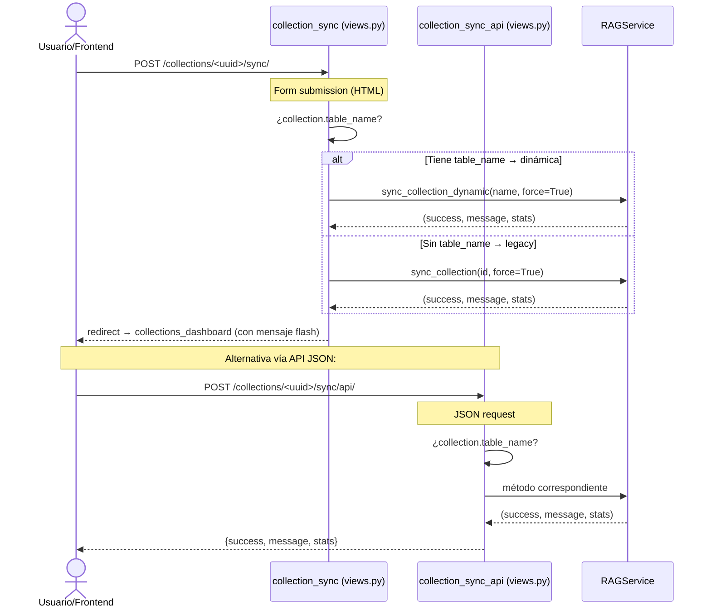

# PLAN DE CORRECCIÓN: Sincronización de Colecciones RAG

> **Problema:** No se puede sincronizar la colección `c4856091-...` (ni ninguna colección dinámica) desde la interfaz web.
> **Archivo afectado principal:** [`webapp/intelligence/views.py`](webapp/intelligence/views.py)
> **Servicio afectado:** [`webapp/intelligence/services/rag.py`](webapp/intelligence/services/rag.py)
> **Prioridad:** ALTA — Impide la ingesta de datos en el sistema RAG

---

## 1. DIAGNÓSTICO COMPLETO

### Problema 1 (BUG GRAVE): La vista [`collection_sync`](webapp/intelligence/views.py:622) trata una tupla como dict

**Código actual (roto) — líneas 628-629:**
```python
result = RAGService.sync_collection(collection_id)
if result.get('success'):  # ← ERROR: result es tuple, no tiene .get()
```

[`sync_collection()`](webapp/intelligence/services/rag.py:432) retorna:
```python
return True, "Sincronización completada exitosamente", stats
#    ^^^^^ tupla (bool, str, dict)
```

El método `.get()` no existe en `tuple`. Esto lanza un `AttributeError` que es capturado por el `except Exception` genérico en línea 637, mostrando un mensaje de error inespecífico.

### Problema 2 (BUG DE ARQUITECTURA): Usa `sync_collection()` legacy para colecciones dinámicas

La colección `c4856091-...` fue creada con [`create_collection_dynamic()`](webapp/intelligence/services/rag.py:999), lo que significa que tiene:
- `table_name` definido
- `field_definitions` con tipos de campos
- Posibles `table_relationships` (FK a resolver)
- `display_fields` y `filter_fields`

Pero la vista llama a [`sync_collection()`](webapp/intelligence/services/rag.py:432) (legacy) que:
1. **No resuelve FK** — las relaciones entre tablas se ignoran
2. **Escribe en `metadata_json`** en lugar de `field_values` — los datos quedan en el campo incorrecto
3. **No usa prefijo `"passage:"`** en el embedding (requerido por `multilingual-e5-large`)
4. **No reconstruye el índice FAISS** después del sync
5. **No inyecta `semantic_tags`** en el contenido del embedding

### Problema 3 (FALTA FUNCIONALIDAD): No hay endpoint API que retorne JSON

El endpoint solo maneja `POST` y redirige (`redirect`) a una página HTML. Si el frontend intenta sincronizar vía AJAX/fetch, recibe una redirección HTTP 302 en lugar de una respuesta JSON con `{success, message, stats}`.

---

## 2. CAMBIOS REQUERIDOS

### 2.1. Corregir [`collection_sync`](webapp/intelligence/views.py:622)

**Archivo:** `webapp/intelligence/views.py`
**Líneas:** 622-639

**Cambio:** Desempaquetar correctamente la tupla y detectar si la colección es dinámica.

```python
def collection_sync(request, collection_id):
    """Sincronizar una colección con su tabla."""
    collection = get_object_or_404(IntelligenceCollection, id=collection_id)
    if request.method == 'POST':
        try:
            from .services.rag import RAGService
            # Detectar tipo de colección
            if collection.table_name:
                # Colección dinámica → sync_collection_dynamic
                success, message, stats = RAGService.sync_collection_dynamic(
                    collection_name=collection.name,
                    force_full_sync=True,
                )
            else:
                # Colección legacy → sync_collection
                success, message, stats = RAGService.sync_collection(
                    collection_id=collection_id,
                    force_full_sync=True,
                )

            if success:
                messages.success(
                    request,
                    f'Colección sincronizada: {stats.get("total_processed", 0)} documentos procesados, '
                    f'{stats.get("created", 0)} creados, {stats.get("errors", 0)} errores.'
                )
            else:
                messages.error(request, f'Error en sincronización: {message}')
        except Exception as e:
            messages.error(request, f'Error al sincronizar: {str(e)}')
    return redirect('intelligence:collections_dashboard')
```

### 2.2. Crear endpoint API para sync con respuesta JSON

**Archivo:** `webapp/intelligence/views.py`
**Insertar después de** `collection_sync` (aproximadamente línea 640)

**Nueva función:**
```python
from rest_framework.decorators import api_view, permission_classes
from rest_framework.permissions import AllowAny
from rest_framework.response import Response
from rest_framework import status

@api_view(['POST'])
@permission_classes([AllowAny])
@authentication_classes([])
def collection_sync_api(request, collection_id):
    """
    API endpoint para sincronizar una colección.
    Retorna JSON en lugar de redirección HTML.
    POST /api/v1/intelligence/collections/<uuid>/sync/api/
    """
    try:
        collection = get_object_or_404(IntelligenceCollection, id=collection_id)
        from .services.rag import RAGService

        force_full = request.data.get('force_full_sync', False)
        database_alias = request.data.get('database_alias')

        if collection.table_name:
            success, message, stats = RAGService.sync_collection_dynamic(
                collection_name=collection.name,
                force_full_sync=force_full,
                database_alias=database_alias,
            )
        else:
            success, message, stats = RAGService.sync_collection(
                collection_id=collection_id,
                force_full_sync=force_full,
            )

        return Response({
            'success': success,
            'message': message,
            'stats': stats,
            'collection_id': str(collection.id),
            'collection_name': collection.name,
        })

    except IntelligenceCollection.DoesNotExist:
        return Response({
            'success': False,
            'error': 'Colección no encontrada'
        }, status=status.HTTP_404_NOT_FOUND)
    except Exception as e:
        return Response({
            'success': False,
            'error': str(e)
        }, status=status.HTTP_500_INTERNAL_SERVER_ERROR)
```

### 2.3. Registrar nuevo endpoint en [`intelligence/urls.py`](webapp/intelligence/urls.py)

**Archivo:** `webapp/intelligence/urls.py`
**Insertar después de** línea 35 (sync existente):

```python
path('collections/<uuid:collection_id>/sync/api/', views.collection_sync_api, name='collection_sync_api'),
```

### 2.4. Verificar compatibilidad de [`sync_collection_dynamic()`](webapp/intelligence/services/rag.py:1112)

**Archivo:** `webapp/intelligence/services/rag.py`

La función [`sync_collection_dynamic()`](webapp/intelligence/services/rag.py:1112) actualmente acepta `collection_name` (string), pero la vista tiene el `collection_id` (UUID). Revisar que la búsqueda por nombre funcione correctamente (línea 1139):

```python
collection = IntelligenceCollection.objects.get(name=collection_name, is_active=True)
```

✅ Esto es correcto — ya que `collection.name` es único según el modelo.

---

## 3. FLUJO CORREGIDO



---

## 4. ARCHIVOS A MODIFICAR

| Archivo | Cambio | Líneas |
|---|---|---|
| [`webapp/intelligence/views.py`](webapp/intelligence/views.py) | Corregir `collection_sync` (tupla → desempaquetado + detección dinámica) | 622-639 |
| [`webapp/intelligence/views.py`](webapp/intelligence/views.py) | Agregar nueva función `collection_sync_api` | ~640-690 |
| [`webapp/intelligence/urls.py`](webapp/intelligence/urls.py) | Agregar ruta `collections/<uuid>/sync/api/` | ~36 |

**Ninguna modificación a modelos ni a RAGService** — solo se corrige la orquestación en la vista.

---

## 5. PRUEBAS

### 5.1. Prueba manual de la corrección

```python
# Desde shell de Django o script de prueba
from intelligence.services.rag import RAGService

# Probar sync dinámico
success, message, stats = RAGService.sync_collection_dynamic(
    collection_name='propiedades_propifai',
    force_full_sync=True,
)
print(f"Success: {success}")
print(f"Message: {message}")
print(f"Stats: {stats}")
```

### 5.2. Prueba del endpoint API

```bash
curl -X POST \
  'https://acm.propifai.com/api/v1/intelligence/collections/c4856091-0ed2-493f-b391-c0b2f727ddc8/sync/api/' \
  -H 'Content-Type: application/json' \
  -d '{"force_full_sync": true}'
```

Respuesta esperada:
```json
{
  "success": true,
  "message": "Sincronización dinámica completada exitosamente",
  "stats": {
    "total_processed": 150,
    "created": 150,
    "updated": 0,
    "skipped": 0,
    "errors": 0
  },
  "collection_id": "c4856091-...",
  "collection_name": "nombre_coleccion"
}
```

---

## 6. RIESGOS

| Riesgo | Probabilidad | Mitigación |
|---|---|---|
| `sync_collection_dynamic` falla si la tabla no existe en BD | Baja | La colección ya existe y tiene datos |
| El sync procesa duplicados si ya hay documentos | Baja | El método ya maneja upsert por source_id |
| Timeout en sync de colecciones grandes (>10k registros) | Media | Ejecutar via Celery en el futuro, por ahora funciona síncrono |
| El endpoint API no tiene autenticación | Media | Usar `@permission_classes([AllowAny])` + `@authentication_classes([])` como los otros endpoints del chat |

---

## 7. RESUMEN DE CAMBIOS (diff)

### views.py — Líneas 622-639 (reemplazar)

```diff
 def collection_sync(request, collection_id):
     """Sincronizar una colección con su tabla."""
     collection = get_object_or_404(IntelligenceCollection, id=collection_id)
     if request.method == 'POST':
         try:
             from .services.rag import RAGService
-            result = RAGService.sync_collection(collection_id)
-            if result.get('success'):
+            if collection.table_name:
+                success, message, stats = RAGService.sync_collection_dynamic(
+                    collection_name=collection.name,
+                    force_full_sync=True,
+                )
+            else:
+                success, message, stats = RAGService.sync_collection(
+                    collection_id=collection_id,
+                    force_full_sync=True,
+                )
+            if success:
                 messages.success(
                     request,
-                    f'Colección sincronizada: {result.get("processed", 0)} documentos procesados, '
-                    f'{result.get("errors", 0)} errores.'
+                    f'Colección sincronizada: {stats.get("total_processed", 0)} documentos procesados, '
+                    f'{stats.get("created", 0)} creados, {stats.get("errors", 0)} errores.'
                 )
             else:
-                messages.error(request, f'Error en sincronización: {result.get("error", "Desconocido")}')
+                messages.error(request, f'Error en sincronización: {message}')
         except Exception as e:
             messages.error(request, f'Error al sincronizar: {str(e)}')
     return redirect('intelligence:collections_dashboard')
```

### urls.py — Agregar línea 36

```diff
     path('collections/<uuid:collection_id>/sync/', views.collection_sync, name='collection_sync'),
+    path('collections/<uuid:collection_id>/sync/api/', views.collection_sync_api, name='collection_sync_api'),
     path('collections/<uuid:collection_id>/stats/', views.collection_stats, name='collection_stats'),
```

---

## 8. CONCLUSIÓN

Son **3 cambios pequeños** pero críticos:

1. **Corregir** [`collection_sync`](webapp/intelligence/views.py:622) — desempaquetar tupla y detectar colección dinámica
2. **Agregar** [`collection_sync_api`](webapp/intelligence/views.py:~640) — endpoint JSON para sync desde frontend
3. **Registrar** nueva URL en [`urls.py`](webapp/intelligence/urls.py)

Ningún modelo, servicio RAG o base de datos necesita cambios.
