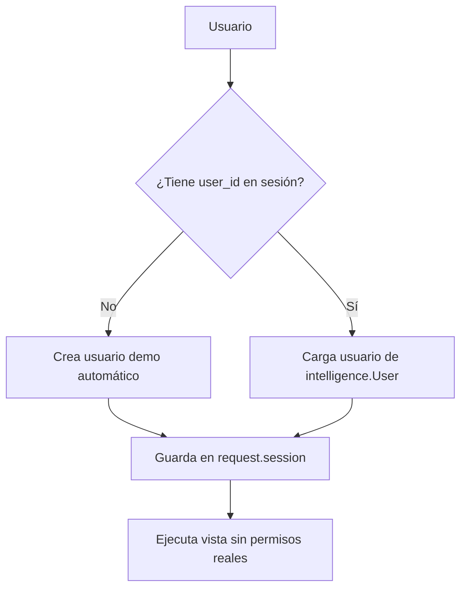
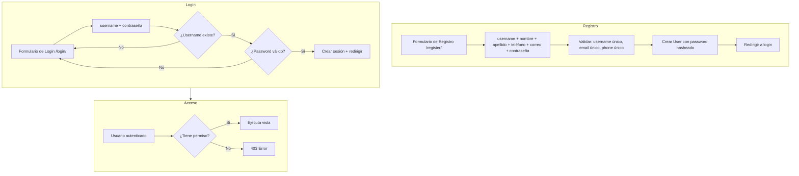
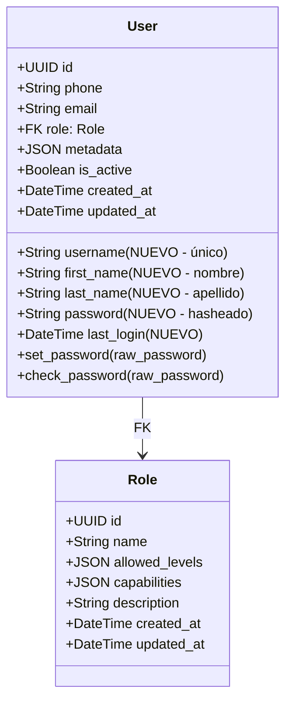

# SPEC-009: Sistema de Login, Registro y Gestión de Roles

## 1. Diagnóstico del Estado Actual

### Problemas Identificados

1. **No hay login ni registro**: El proyecto usa un modelo [`User`](webapp/intelligence/models.py:39) propio con solo `phone` y `email`, sin `username`, `password` ni autenticación.
2. **Usuario demo automático**: En [`chat_web`](webapp/intelligence/views.py:2010-2022), si no hay usuario en sesión, se crea uno demo con `phone='51999999999'`.
3. **Roles desacoplados**: El modelo [`Role`](webapp/intelligence/models.py:6) existe y [`permissions.py`](webapp/intelligence/permissions.py) tiene decoradores, pero el sistema de permisos usa [`get_user_role`](webapp/intelligence/permissions.py:17) que simula roles desde la sesión.
4. **Vistas sin protección**: Las vistas en [`webapp/views.py`](webapp/views.py:14) no tienen decoradores de permisos.

### Arquitectura Actual

## 2. Solución Propuesta

### Estrategia General

Extender el modelo [`User`](webapp/intelligence/models.py:39) existente añadiendo campos nuevos. **NO** migrar a `django.contrib.auth.User` para no romper relaciones FK existentes.

### Flujo de Registro y Login

### Modelo de Datos Extendido

## 3. Plan de Implementación

### Fase 1: Extender Modelo User

**Archivo:** [`webapp/intelligence/models.py`](webapp/intelligence/models.py:39)

**Campos a añadir:**
| Campo | Tipo | Restricciones |
|-------|------|---------------|
| `username` | `CharField(max_length=50)` | `unique=True`, `null=False` |
| `first_name` | `CharField(max_length=100)` | `blank=True` |
| `last_name` | `CharField(max_length=100)` | `blank=True` |
| `password` | `CharField(max_length=128)` | `blank=True, null=True` |
| `last_login` | `DateTimeField` | `blank=True, null=True` |

**Métodos a añadir:**
- `set_password(self, raw_password)` → usa `django.contrib.auth.hashers.make_password`
- `check_password(self, raw_password)` → usa `django.contrib.auth.hashers.check_password`

**Migración:** `python manage.py makemigrations intelligence`

### Fase 2: Sistema de Autenticación

**Archivo nuevo:** [`webapp/intelligence/authentication.py`](webapp/intelligence/authentication.py)

Funciones:
- `authenticate_user(username, password)` → busca por `username`, verifica password
- `login_user(request, user)` → crea sesión, guarda `user_id`
- `logout_user(request)` → limpia sesión
- `get_authenticated_user(request)` → obtiene User desde sesión

### Fase 3: Vistas de Registro y Login

**Archivo a modificar:** [`webapp/intelligence/views.py`](webapp/intelligence/views.py)

Vistas nuevas:
- `register_view(request)` — GET: formulario, POST: crea usuario
- `login_view(request)` — GET: formulario, POST: autentica
- `logout_view(request)` — cierra sesión

**Archivo nuevo:** [`webapp/templates/intelligence/register.html`](webapp/templates/intelligence/register.html)
- Campos: `username`, `first_name` (nombre), `last_name` (apellido), `phone` (teléfono), `email` (correo), `password1`, `password2` (confirmación)

**Archivo nuevo:** [`webapp/templates/intelligence/login.html`](webapp/templates/intelligence/login.html)
- Campos: `username`, `password`

**Archivo a modificar:** [`webapp/intelligence/urls.py`](webapp/intelligence/urls.py)
- `path('register/', views.register_view, name='register')`
- `path('login/', views.login_view, name='login')`
- `path('logout/', views.logout_view, name='logout')`

### Fase 4: Middleware de Autenticación

**Archivo nuevo:** [`webapp/intelligence/middleware.py`](webapp/intelligence/middleware.py)

Middleware que:
- Verifica `user_id` en sesión
- Redirige a `/login/` si no hay sesión (excepto rutas públicas: login, register, static, admin)
- Adjunta `request.current_user` y `request.user_role`

**Archivo a modificar:** [`webapp/settings.py`](webapp/settings.py)
- Añadir middleware a `MIDDLEWARE`
- `LOGIN_URL = '/login/'`

### Fase 5: Integrar Decoradores de Permisos

**Archivo a modificar:** [`webapp/intelligence/permissions.py`](webapp/intelligence/permissions.py)

- Modificar [`get_user_role`](webapp/intelligence/permissions.py:17) para usar `request.current_user.role`
- Los decoradores existentes (`admin_required`, `level_required`) ahora usan el rol real

### Fase 6: Proteger Vistas Existentes

**Archivo a modificar:** [`webapp/views.py`](webapp/views.py)
- Añadir `@login_required` a `home()`, `fuentes_web()`, `capturas_view()`

**Archivo a modificar:** [`webapp/intelligence/views.py`](webapp/intelligence/views.py)
- Reemplazar lógica de usuario demo (líneas 1997-2022) por autenticación real

### Fase 7: Panel de Administración de Usuarios

**Archivos nuevos:**
- [`webapp/templates/intelligence/user_list.html`](webapp/templates/intelligence/user_list.html)
- [`webapp/templates/intelligence/user_form.html`](webapp/templates/intelligence/user_form.html)

**Vistas CRUD:**
- `user_list` — solo admin
- `user_create` — crear usuario con todos los campos
- `user_edit` — editar usuario
- `user_delete` — eliminar con confirmación
- `user_set_password` — cambiar contraseña

### Fase 8: Seed de Usuario Admin

**Archivo nuevo:** [`webapp/intelligence/management/commands/crear_admin.py`](webapp/intelligence/management/commands/crear_admin.py)

Comando: `python manage.py crear_admin`
- Crea rol `Administrador` con niveles `[1,2,3,4,5]`
- Crea usuario admin con username, email, password
- Asigna rol Administrador

## 4. Resumen de Archivos

| Archivo | Acción |
|---------|--------|
| `webapp/intelligence/models.py` | MODIFICAR — añadir username, first_name, last_name, password, last_login, set_password, check_password |
| `webapp/intelligence/authentication.py` | CREAR — authenticate_user, login_user, logout_user, get_authenticated_user |
| `webapp/intelligence/middleware.py` | CREAR — AuthenticationMiddleware |
| `webapp/intelligence/permissions.py` | MODIFICAR — get_user_role usa request.current_user.role |
| `webapp/intelligence/views.py` | MODIFICAR — register_view, login_view, logout_view, CRUD usuarios |
| `webapp/intelligence/urls.py` | MODIFICAR — rutas register, login, logout, CRUD |
| `webapp/settings.py` | MODIFICAR — middleware, LOGIN_URL |
| `webapp/views.py` | MODIFICAR — decoradores login_required |
| `webapp/templates/intelligence/register.html` | CREAR — formulario de registro |
| `webapp/templates/intelligence/login.html` | CREAR — formulario de login |
| `webapp/templates/intelligence/user_list.html` | CREAR — lista de usuarios admin |
| `webapp/templates/intelligence/user_form.html` | CREAR — formulario de usuario admin |
| `webapp/intelligence/management/commands/crear_admin.py` | CREAR — seed de admin |

## 5. Orden de Implementación

1. **Fase 1** → Modelo (migración)
2. **Fase 2** → Sistema de autenticación (authentication.py)
3. **Fase 3** → Vistas de registro y login + templates
4. **Fase 4** → Middleware
5. **Fase 5** → Decoradores de permisos
6. **Fase 6** → Proteger vistas existentes
7. **Fase 7** → CRUD de usuarios
8. **Fase 8** → Seed de admin
