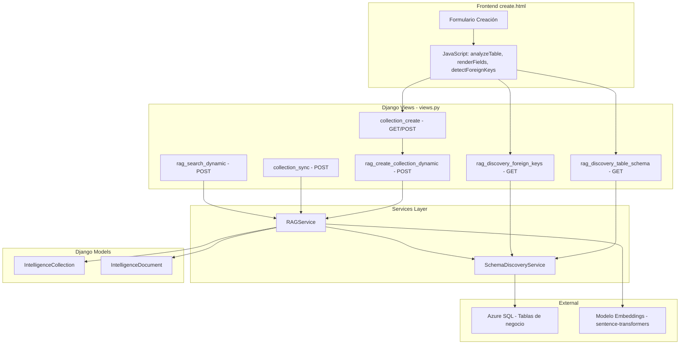
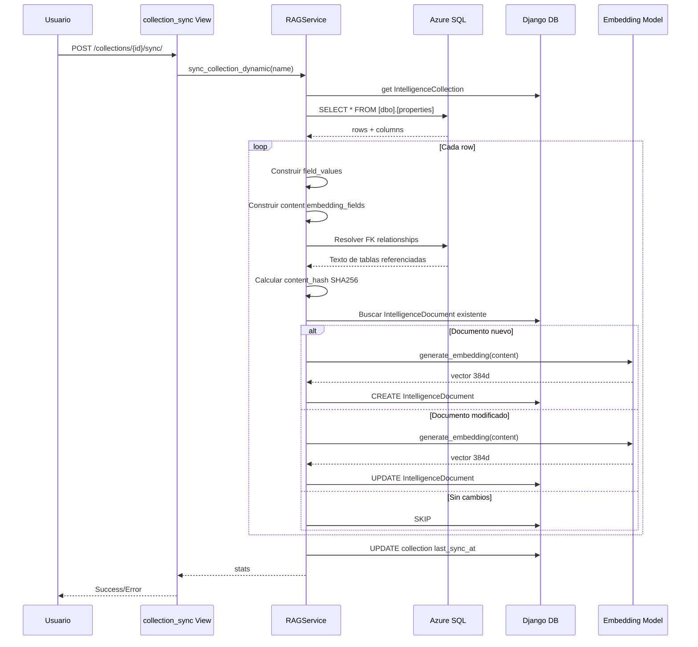

# Análisis de Arquitectura: Colecciones RAG y Embeddings

> **Fecha:** 2026-05-03
> **Propósito:** Documentar la arquitectura completa del sistema de colecciones vectoriales y embeddings en Propifai Intelligence Layer.

---

## 1. Visión General

El sistema de colecciones RAG permite indexar tablas de Azure SQL en una base de datos vectorial local (SQL Server vía Django ORM) para búsqueda semántica. El flujo completo es:

```
Tabla Azure SQL → Schema Discovery → Creación de Colección → Sync → Embeddings → Búsqueda Semántica
```

---

## 2. Modelos de Datos

### 2.1 [`IntelligenceCollection`](webapp/intelligence/models.py:233)
Modelo central que define una colección vectorial. Almacena:

| Campo | Tipo | Propósito |
|---|---|---|
| `name` | CharField(100, unique) | Nombre único de la colección |
| `table_name` | CharField(200, nullable) | Nombre exacto de la tabla en Azure SQL |
| `source_sql` | TextField | Query SQL que extrae datos (se auto-genera) |
| `field_definitions` | JSONField | Definición completa de TODOS los campos de la tabla |
| `embedding_fields` | JSONField(list) | **Campos usados para generar el embedding** |
| `display_fields` | JSONField(list) | Campos mostrados en resultados de búsqueda |
| `filter_fields` | JSONField(list) | Campos disponibles para filtrar resultados |
| `table_relationships` | JSONField(list) | Relaciones FK para resolver durante sync |
| `access_level` | IntegerField(1-5) | Nivel de acceso mínimo requerido |

### 2.2 [`IntelligenceDocument`](webapp/intelligence/models.py:323)
Almacena cada registro indexado:

| Campo | Tipo | Propósito |
|---|---|---|
| `collection` | FK → IntelligenceCollection | Colección padre |
| `source_id` | CharField(200) | ID del registro en la tabla origen |
| `field_values` | JSONField | **Valores de TODOS los campos (nombres reales)** |
| `content` | TextField | Texto concatenado de `embedding_fields` + FK resueltos |
| `embedding` | BinaryField | Vector de 384 floats (all-MiniLM-L6-v2) |
| `content_hash` | CharField(64) | SHA256 del content para detectar cambios |

---

## 3. Flujo de Creación de Colección

### 3.1 Frontend ([`create.html`](webapp/intelligence/templates/intelligence/collections/create.html))

```
Usuario selecciona tabla → analyzeTable(tableName, schema)
                                    │
                                    ▼
                    GET /api/v1/intelligence/rag/tables/{table}/schema/
                                    │
                                    ▼
                    Backend devuelve: columns + field_analysis + suggestions
                                    │
                                    ▼
                    renderFields() → Crea checkboxes por campo
                    Marca checkboxes según suggested_for_*
                                    │
                                    ▼
                    populateSelectOptions() → Llena <select multiple>
                    updateSelectOptions() → Sincroniza selects con checkboxes
                                    │
                                    ▼
                    detectForeignKeys() → GET .../foreign-keys/
                                    │
                                    ▼
                    renderRelationships() → Muestra relaciones FK
                                    │
                                    ▼
                    Usuario completa formulario y envía POST
```

### 3.2 Backend ([`rag_create_collection_dynamic`](webapp/intelligence/views.py:1031))

```
POST /api/v1/intelligence/collections/create/
    │
    ├─→ RAGService.create_collection_dynamic()
    │       │
    │       ├─→ Valida nombre único
    │       ├─→ Valida que la tabla existe (SchemaDiscoveryService.validate_table)
    │       ├─→ Obtiene field_definitions (SchemaDiscoveryService.analyze_table_schema)
    │       ├─→ Valida que embedding_fields, display_fields, filter_fields existen
    │       ├─→ Genera source_sql automático: SELECT * FROM [schema].[table]
    │       └─→ Crea IntelligenceCollection en BD
    │
    └─→ Response con datos de la colección creada
```

### 3.3 Schema Discovery ([`SchemaDiscoveryService`](webapp/intelligence/services/schema_discovery.py:20))

```
analyze_table_schema(table, schema, database_alias)
    │
    ├─→ validate_table() → Verifica que la tabla existe
    ├─→ get_table_columns() → Obtiene columnas de INFORMATION_SCHEMA
    ├─→ detect_primary_key_field() → Encuentra PK
    ├─→ get_sample_data() → 5 filas de muestra
    ├─→ _analyze_field_types() → Clasifica cada campo:
    │       • text_content → suggested_for_embedding=True, suggested_for_display=True
    │       • foreign_key  → suggested_for_filtering=True
    │       • numeric      → suggested_for_display=True, suggested_for_filtering=True
    │       • date         → suggested_for_display=True, suggested_for_filtering=True
    │       • boolean      → suggested_for_filtering=True
    │       • identifier   → Sin sugerencias
    │       • geographic   → suggested_for_embedding=True, suggested_for_display=True, suggested_for_filtering=True
    │       • categorical  → suggested_for_filtering=True, suggested_for_display=True
    │
    └─→ _generate_configuration_suggestions() → Validaciones y advertencias

detect_foreign_keys(table, schema, database_alias)
    │
    ├─→ Busca FK declarativas en INFORMATION_SCHEMA.REFERENTIAL_CONSTRAINTS
    ├─→ Busca FK inferidas (columnas terminadas en _id, _fk)
    ├─→ Para cada FK inferida, llama a _guess_referenced_table()
    │       • Busca tabla con nombre similar (singular/plural)
    │       • Busca tabla con nombre exacto
    │       • Usa _get_columns_flexible() para buscar en múltiples DBs
    └─→ Retorna lista de relaciones detectadas
```

---

## 4. Flujo de Sincronización (Sync)

```
POST /api/v1/intelligence/collections/{id}/sync/
    │
    └─→ RAGService.sync_collection_dynamic(collection_name)
            │
            ├─→ Obtiene IntelligenceCollection (is_active=True)
            ├─→ Determina conexión BD (default o propifai)
            ├─→ Ejecuta source_sql → rows
            ├─→ Para cada row:
            │       │
            │       ├─→ Convierte a dict (column_names → values)
            │       ├─→ Extrae source_id del primary_key
            │       ├─→ Construye field_values (todos los campos)
            │       ├─→ Construye content (solo embedding_fields)
            │       ├─→ Resuelve FK table_relationships:
            │       │       • Para cada relación configurada:
            │       │         SELECT display_fields FROM referenced_table WHERE id = fk_value
            │       │         → Agrega texto resuelto al content
            │       │
            │       ├─→ Calcula content_hash (SHA256)
            │       ├─→ Busca IntelligenceDocument existente
            │       │   ├─→ Si existe y hash = mismo → skip
            │       │   ├─→ Si existe y hash ≠ → update + regenerar embedding
            │       │   └─→ Si no existe → create + generar embedding
            │       │
            │       └─→ generate_embedding(content) → vector 384d
            │
            └─→ Actualiza last_sync_at, last_sync_count
```

### 4.1 Generación de Embeddings ([`RAGService.generate_embedding`](webapp/intelligence/services/rag.py:158))

```
generate_embedding(text)
    │
    ├─→ Verifica caché LRU (max 100 entradas)
    ├─→ Si no está en caché:
    │   ├─→ Inicializa SentenceTransformer (lazy loading)
    │   │   • Modelo: jaimevera1107/all-MiniLM-L6-v2-similarity-es
    │   │   • Dimensiones: 384
    │   │   • Singleton thread-safe con lock
    │   │
    │   ├─→ encode(text) → numpy array
    │   └─→ Convierte a bytes → almacena en caché
    │
    └─→ Retorna bytes del vector
```

---

## 5. Flujo de Búsqueda Semántica

```
POST /api/v1/intelligence/rag/search/
    │
    └─→ RAGService.search_dynamic(query, collection_names, filters, top_k)
            │
            ├─→ generate_embedding(query) → query_vector (384d)
            ├─→ Obtiene documentos de las colecciones especificadas
            ├─→ Aplica filtros (igualdad exacta sobre field_values)
            ├─→ Para cada documento:
            │   ├─→ doc_vector = np.frombuffer(doc.embedding)
            │   ├─→ similarity = cosine_similarity(query_vector, doc_vector)
            │   └─→ Si similarity >= threshold (0.2):
            │       └─→ Retorna field_values (solo display_fields)
            │
            ├─→ Si pocos resultados y text_fallback habilitado:
            │   └─→ _text_search_fallback() → LIKE sobre content
            │
            └─→ Ordena por similarity descendente → top_k resultados
```

---

## 6. Diagrama de Arquitectura



---

## 7. Flujo de Datos en Sync



---

## 8. Análisis de los `<select multiple>` vs Checkboxes

### 8.1 Problema de UX detectado

El formulario de creación tiene **dos representaciones** para la misma configuración:

1. **Checkboxes** (en "Campos Detectados"): Cada campo tiene 3 checkboxes: "Usar para embedding", "Mostrar en resultados", "Usar para filtrado". Son la interfaz visual principal.

2. **`<select multiple>`** (en "Configuración de Campos Clave"): Tres selects (`embedding_fields`, `display_fields`, `filter_fields`) que se sincronizan con los checkboxes vía [`updateSelectOptions()`](webapp/intelligence/templates/intelligence/collections/create.html:1191).

### 8.2 Flujo de sincronización

```
renderFields() → Crea checkboxes, los marca según suggested_for_*
    → Al final, llama updateSelectOptions() (selects aún vacíos)

populateSelectOptions() → Llena selects con opciones (BORRA selecciones previas)

updateSelectOptions() → Sincroniza selects con checkboxes ✅
```

### 8.3 Recomendación

Los `<select multiple>` son redundantes desde la perspectiva del usuario. Sin embargo, son necesarios porque el formulario se envía con `name="embedding_fields"`, `name="display_fields"`, `name="filter_fields"`. Los checkboxes son solo interfaz visual.

**Opción recomendada:** Simplificar a solo checkboxes y agregar campos hidden que se actualicen via JS antes del submit, eliminando los `<select multiple>`.

---

## 9. Puntos Clave y Posibles Mejoras

### 9.1 Fortalezas
- **Arquitectura flexible**: Soporta cualquier tabla de Azure SQL
- **Detección automática de esquema**: `SchemaDiscoveryService` analiza tipos, PKs, FKs
- **Resolución de FK en sync**: Enriquece el embedding con datos de tablas referenciadas
- **Caché de embeddings**: LRU cache para consultas frecuentes
- **Fallback de texto**: Cuando la búsqueda vectorial no encuentra resultados
- **Multi-BD**: Soporta conexiones `default` y `propifai`

### 9.2 Debilidades / Deuda Técnica

1. **Filtrado ineficiente**: El filtrado en `search_dynamic` recorre TODOS los documentos en Python. Para colecciones grandes (>1000 docs), esto será muy lento.

2. **Búsqueda vectorial secuencial**: No hay índice vectorial (pgvector, FAISS). Se calcula similitud de coseno contra TODOS los documentos.

3. **Dos versiones de sync**: `sync_collection` (antigua, usa `metadata_json`) y `sync_collection_dynamic` (nueva, usa `field_values`). La antigua debería deprecarse.

4. **`_get_connection_for_collection` frágil**: Detecta la BD basándose en el nombre de la colección o contenido del SQL. Para tablas de otras BDs, no funcionará.

5. **Sin paginación en sync**: Si una tabla tiene 100k registros, el sync carga todo en memoria.

6. **Sin manejo de errores granular en sync**: Si un registro falla, todo el sync continúa pero no hay reporte detallado de cuáles fallaron.

7. **Hardcoding de `database=propifai` en frontend**: Las URLs de API en `create.html` tienen `database=propifai` hardcodeado (líneas 956, 1238, 1486).

### 9.3 Mejoras Recomendadas

| Prioridad | Mejora | Impacto |
|---|---|---|
| Alta | Agregar índice vectorial (FAISS o pgvector) | Búsqueda rápida en miles de docs |
| Alta | Paginación en sync (procesar en batches) | Evitar OOM en tablas grandes |
| Media | Simplificar UI: eliminar `<select multiple>`, usar solo checkboxes + hidden fields | Mejor UX |
| Media | Deprecar `sync_collection` antigua | Reducir deuda técnica |
| Media | Hacer configurable el `database_alias` en frontend | Soporte multi-BD real |
| Baja | Agregar filtrado por SQL en lugar de Python | Rendimiento en colecciones grandes |
| Baja | Reporte detallado de errores en sync | Debugging más fácil |

---

## 10. Resumen de Archivos Clave

| Archivo | Propósito | Líneas |
|---|---|---|
| [`webapp/intelligence/models.py`](webapp/intelligence/models.py) | Modelos IntelligenceCollection e IntelligenceDocument | 653 |
| [`webapp/intelligence/services/rag.py`](webapp/intelligence/services/rag.py) | RAGService: embeddings, sync, search | 1596 |
| [`webapp/intelligence/services/schema_discovery.py`](webapp/intelligence/services/schema_discovery.py) | SchemaDiscoveryService: análisis de tablas, FK | 969 |
| [`webapp/intelligence/views.py`](webapp/intelligence/views.py) | Vistas CRUD + API endpoints | 3204 |
| [`webapp/intelligence/templates/intelligence/collections/create.html`](webapp/intelligence/templates/intelligence/collections/create.html) | Formulario de creación (frontend JS) | 1623 |
| [`webapp/intelligence/templates/intelligence/collections/list.html`](webapp/intelligence/templates/intelligence/collections/list.html) | Listado de colecciones | 409 |
| [`webapp/intelligence/templates/intelligence/collections/edit.html`](webapp/intelligence/templates/intelligence/collections/edit.html) | Edición de colección | - |
| [`webapp/intelligence/templates/intelligence/collections/confirm_delete.html`](webapp/intelligence/templates/intelligence/collections/confirm_delete.html) | Confirmación de eliminación | - |
| [`webapp/intelligence/templates/intelligence/collections/sync.html`](webapp/intelligence/templates/intelligence/collections/sync.html) | Página de sincronización | - |
