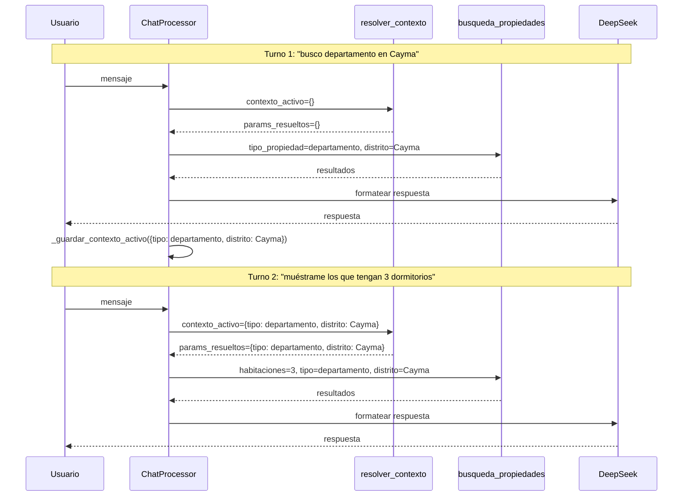
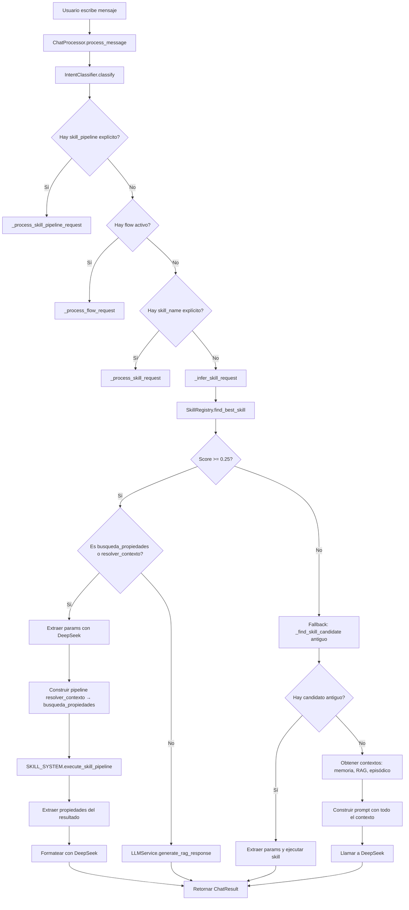

# Análisis Completo del Sistema de Inteligencia — PropiFai

> Basado en los documentos:
> - [`implementacion_rag_mejoras.md`](implementacion_rag_mejoras.md) — Plan de mejoras RAG
> - [`resumen_tecnico_sistema_inteligencia.md`](resumen_tecnico_sistema_inteligencia.md) — Arquitectura del sistema de inteligencia
>
> Fecha del análisis: 2026-06-19
> Propósito: Documentación técnica para referencia y auditoría

---

## Tabla de Contenidos

1. [Sistema RAG](#1-sistema-rag)
   - [Pipeline de Búsqueda](#11-pipeline-de-búsqueda)
   - [Colecciones RAG](#12-colecciones-rag)
   - [Modelo de Embeddings](#13-modelo-de-embeddings)
   - [Estrategias de Mejora](#14-estrategias-de-mejora)
   - [Caché y Optimizaciones](#15-caché-y-optimizaciones)
2. [Sistema de Memorias](#2-sistema-de-memorias)
   - [Memoria Episódica](#21-memoria-episódica)
   - [Memoria de Hechos](#22-memoria-de-hechos-largo-plazo)
   - [Context Manager](#23-context-manager-corto-plazo)
   - [Integración en el Prompt](#24-integración-de-las-tres-memorias-en-el-prompt)
3. [Integración LLM](#3-integración-llm)
   - [Configuración de DeepSeek](#31-configuración-de-deepseek)
   - [Roles del LLM](#32-roles-del-llm)
   - [Registro de Costos](#33-registro-de-costos-y-consumo)
4. [Hallazgos y Recomendaciones](#4-hallazgos-críticos-y-recomendaciones)

---

## 1. Sistema RAG

### 1.1 Pipeline de Búsqueda

El RAG está implementado en [`RAGService`](../webapp/intelligence/services/rag.py) con tres métodos de búsqueda principales:

| Método | Propósito | Mecanismo |
|--------|-----------|-----------|
| `search()` | Búsqueda semántica + reranking | Embedding de query → similitud coseno O(n) → reranking |
| `search_by_sql()` | Filtros SQL directos | WHERE clauses sobre campos estructurados en SQL Server |
| `search_dynamic()` | Búsqueda híbrida | Combina filtros SQL + búsqueda semántica con FAISS (planeado) o coseno (actual) |

#### Flujo actual (post-migración a E5-large):

1. El usuario envía una consulta en lenguaje natural
2. Se llama a [`generate_embedding()`](../webapp/intelligence/services/rag.py:158) con `mode='query'` → el texto se prefija como `"query: {text}"`
3. El modelo [`intfloat/multilingual-e5-large`](https://huggingface.co/intfloat/multilingual-e5-large) genera un vector de **1024 dimensiones**
4. Si FAISS está disponible (ya implementado según el resumen), se usa [`FAISSIndexManager.search()`](../webapp/intelligence/services/faiss_index.py:245) con índice **HNSWFlat** → búsqueda **O(log n)**
5. Si FAISS no está disponible, se cae al loop O(n) de similitud coseno sobre todos los documentos
6. Se aplica un umbral de similitud (`threshold`)
7. Los resultados se rerankeán y retornan

#### Diagrama de flujo post-implementación completa:

```mermaid
flowchart LR
    subgraph Ingesta
        A[DB Azure SQL] -->|sync_collection_dynamic| B[RAGService]
        C[PDF File] -->|ingest_pdf| D[PDFIngestionService]
        D -->|chunk_text| B
        B -->|generate_embedding mode=passage| E[multilingual-e5-large<br/>1024 dims]
        E -->|embedding bytes| F[IntelligenceDocument]
    end
    subgraph Indexación
        F -->|rebuild_for_collection| G[FAISSIndexManager<br/>HNSWFlat]
        G -->|persist| H[(faiss_indexes/)]
    end
    subgraph Búsqueda
        I[User Query] -->|search_dynamic| J[RAGService]
        J -->|generate_embedding mode=query| K[multilingual-e5-large]
        J -->|pre-filter SQL| L[field_values filters]
        L -->|filtered docs| M{FAISS disponible?}
        M -->|Sí| N[FAISS HNSW search<br/>O(log n)]
        M -->|No| O[Cosine similarity loop<br/>O(n)]
        N --> P[Resultados]
        O --> P
    end
```

### 1.2 Colecciones RAG

Según la Sección 5.1 del [`resumen_tecnico_sistema_inteligencia.md`](resumen_tecnico_sistema_inteligencia.md):

| Colección | Vectores | Dimensión | Índice FAISS | Estado |
|-----------|----------|-----------|--------------|--------|
| `propiedades_propify` | 85 | 1024 | ✅ Construido | Activo |

#### Modelo de datos [`IntelligenceDocument`](../webapp/intelligence/models.py:349):

| Campo | Tipo | Propósito |
|-------|------|-----------|
| `collection` | FK → `IntelligenceCollection` | Colección a la que pertenece |
| `content` | TextField | Contenido textual del documento |
| `content_hash` | CharField | Hash MD5 para deduplicación |
| `embedding` | `BinaryField(null=True)` | Vector de embedding (1024 floats × 4 bytes = 4 KB) |
| `field_values` | `JSONField` | Metadatos estructurados (distrito, precio, tipo_propiedad, etc.) |
| `source_id` | CharField | Identificador único por fuente externa |
| `created_at` | DateTimeField | Fecha de creación |
| `updated_at` | DateTimeField | Fecha de última actualización |

### 1.3 Modelo de Embeddings

**Actual:** [`intfloat/multilingual-e5-large`](https://huggingface.co/intfloat/multilingual-e5-large)

#### Comparativa antes/después de la migración:

| Característica | Anterior (`all-MiniLM-L6-v2-es`) | Nuevo (`multilingual-e5-large`) | Impacto |
|---------------|-----------------------------------|--------------------------------|---------|
| Dimensiones | 384 | **1024** | +166% capacidad semántica |
| Tokens máx | 128 | **512** | Textos 4× más largos embebibles |
| Prefijos requeridos | No | **Sí**: `query:` / `passage:` | Requiere modo explícito en cada llamada |
| Idiomas | Solo español | **100+ idiomas** | Cobertura cross-lingüística |
| Tamaño del embedding | 1.5 KB | **4 KB** | Mayor almacenamiento en BD |

#### Requisito crítico de prefijos (Sección 1.2 de [`implementacion_rag_mejoras.md`](implementacion_rag_mejoras.md)):

El modelo E5-large fue entrenado con prefijos. Sin ellos, la calidad de los embeddings se degrada significativamente.

```python
# Para documentos almacenados (passage)
generate_embedding(content, mode='passage')
# Internamente: "passage: {content}"

# Para consultas de búsqueda (query)
generate_embedding(query, mode='query')
# Internamente: "query: {query}"
```

**Llamadas actualizadas en [`rag.py`](../webapp/intelligence/services/rag.py):**

| Lugar | Llamada | Modo |
|-------|---------|------|
| `search()` (línea 568) | `cls.generate_embedding(query, mode='query')` | query |
| `search_dynamic()` (línea 1477) | `cls.generate_embedding(query, mode='query')` | query |
| `sync_collection_dynamic()` (línea 1219) | `cls.generate_embedding(content, mode='passage')` | passage |
| `sync_collection_dynamic()` (línea 1229) | `cls.generate_embedding(content, mode='passage')` | passage |

### 1.4 Estrategias de Mejora

El plan [`implementacion_rag_mejoras.md`](implementacion_rag_mejoras.md) define **4 mejoras prioritarias** ejecutadas en orden incremental:

| # | Mejora | Estado | Archivo | Beneficio Clave |
|---|--------|--------|---------|-----------------|
| 1 | Migración a `multilingual-e5-large` | ✅ **Implementada** | [`rag.py`](../webapp/intelligence/services/rag.py) (líneas 49-52) | +166% dimensiones, +300% tokens, multilingual |
| 2 | FAISS HNSW Index | ✅ **Implementado** (85 vectores en `propiedades_propify`) | [`faiss_index.py`](../webapp/intelligence/services/faiss_index.py) (nuevo) | O(n) → **O(log n)** en búsqueda |
| 3 | Pre-filtrado en SQL | 🟡 **Planeado** (Semana 2, pasos 2.1-2.2) | [`rag.py`](../webapp/intelligence/services/rag.py) `search_dynamic()` | Evita cargar documentos no relevantes |
| 4 | Pipeline de ingesta PDF | 🟡 **Planeado** (Semana 2, pasos 2.3-2.7) | [`pdf_ingestion.py`](../webapp/intelligence/services/pdf_ingestion.py) (nuevo) | Indexación de PDFs legales |

#### Mejora 1 — Migración de Embeddings (✅ Implementada)

**Archivos modificados:**

| Archivo | Cambio |
|---------|--------|
| [`rag.py`](../webapp/intelligence/services/rag.py) | Constantes `EMBEDDING_MODEL` y `EMBEDDING_DIMENSIONS`, `generate_embedding` con `mode`, todas las llamadas actualizadas |
| [`models.py`](../webapp/intelligence/models.py) | `help_text` del campo `embedding` |
| [`reindex_all_collections.py`](../webapp/intelligence/management/commands/reindex_all_collections.py) | **Nuevo** comando de management para regenerar embeddings |

**Migración de datos:**
- El campo `embedding` es `BinaryField(null=True)` → no requiere migración de esquema
- Los embeddings existentes (384 dims) son reemplazados por nuevos (1024 dims) durante la reindexación
- ⚠️ **Riesgo transicional:** Durante la migración, documentos con embeddings viejos (384) no son compatibles con queries nuevas (1024). Se debe ejecutar `reindex_all_collections` inmediatamente después del cambio.

#### Mejora 2 — FAISS HNSW Index (✅ Implementada)

**Nuevo archivo:** [`faiss_index.py`](../webapp/intelligence/services/faiss_index.py)

Clase [`FAISSIndexManager`](../webapp/intelligence/services/faiss_index.py:161):

```python
class FAISSIndexManager:
    """
    Gestiona índices FAISS HNSW para búsqueda vectorial.
    
    HNSWFlat: Hierarchical Navigable Small World graph
    - d=1024 (dimensionalidad del embedding)
    - M=32 (conexiones por nodo)
    - efConstruction=200 (precisión vs velocidad en construcción)
    - efSearch=50 (balance precisión/velocidad en búsqueda)
    """
    _instances: Dict[str, 'FAISSIndexManager'] = {}  # Singleton por colección
```

**Arquitectura:**

| Componente | Detalle |
|------------|---------|
| **Patrón** | Singleton por colección (`get_instance(collection_name)`) |
| **Índice** | `IndexHNSWFlat(d=1024, M=32)` |
| **Parámetros** | `efConstruction=200`, `efSearch=50` |
| **Normalización** | L2 antes de insertar y antes de buscar |
| **Métrica** | Inner Product (equivalente a similitud coseno con vectores normalizados) |
| **Persistencia** | `data/faiss_indexes/{collection_name}.faiss` + `{collection_name}_id_map.pkl` |
| **Carga automática** | Via [`apps.py`](../webapp/intelligence/apps.py) método `ready()` → `FAISSIndexManager.load_all()` |
| **Post-sync** | Reconstrucción automática en `sync_collection_dynamic()` |

**Integración en `search_dynamic()`:**

```python
# Intentar usar FAISS primero
try:
    from .faiss_index import FAISSIndexManager
    faiss_index = FAISSIndexManager.get_instance(collection.name, cls.EMBEDDING_DIMENSIONS)
    if faiss_index.is_loaded:
        query_vector = np.frombuffer(query_embedding, dtype=np.float32)
        faiss_results = faiss_index.search(query_vector, top_k=top_k)
        # Obtener documentos completos desde BD por ID
        # ...
    else:
        # Fallback: búsqueda O(n) original
except ImportError:
    # FAISS no instalado, usar loop O(n)
```

#### Mejora 3 — Pre-filtrado SQL (🟡 Planeado)

**Actual (ineficiente):** Filtrado en Python con loop for — carga TODOS los documentos a memoria:

```python
if filters:
    for field_name, field_value in filters.items():
        filtered_docs = []
        for doc in documents:  # ← Itera sobre TODOS en memoria
            if field_name in doc.field_values and doc.field_values[field_name] == field_value:
                filtered_docs.append(doc)
        documents = filtered_docs
```

**Planeado (eficiente):** Filtrado en SQL Server:

```python
# Opción 1: Django JSONField lookups
if filters:
    filter_q = Q()
    for field_name, field_value in filters.items():
        filter_q &= Q(**{f'field_values__{field_name}': field_value})
    documents = documents.filter(filter_q)

# Opción 2: RawSQL con JSON_VALUE (SQL Server)
if filters:
    for field_name, field_value in filters.items():
        sql = f"JSON_VALUE(field_values, '$.\"{field_name}\"') = %s"
        documents = documents.extra(where=[sql], params=[str(field_value)])
```

#### Mejora 4 — Pipeline de Ingesta PDF (🟡 Planeado)

**Nuevo archivo:** [`pdf_ingestion.py`](../webapp/intelligence/services/pdf_ingestion.py)

Clase [`PDFIngestionService`](../webapp/intelligence/services/pdf_ingestion.py:531):

| Componente | Detalle |
|------------|---------|
| **Extracción** | `fitz` (pymupdf) — texto página por página |
| **Chunk size** | 400 palabras por chunk |
| **Overlap** | 50 palabras entre chunks consecutivos |
| **Documentos legales** | Si detecta "Artículo", ajusta límites para no mezclar artículos |
| **Overlap en legales** | Desactivado — evita mezclar contenido de diferentes artículos |
| **Endpoint** | `POST /rag/collections/{name}/ingest-pdf/` en [`views.py`](../webapp/intelligence/views.py) |
| **Post-ingesta** | Reconstruye índice FAISS automáticamente |

**Nuevas dependencias:**
```
faiss-cpu>=1.7.4
pymupdf>=1.23.0
```

### 1.5 Caché y Optimizaciones

| Tipo de Caché | Mecanismo | Key | Estado |
|---------------|-----------|-----|--------|
| **Embeddings LRU** | `hashlib.md5(text.encode())` | Texto completo (incluye prefijo) | ✅ Activo |
| **Ejecución de skills** | Cache key por parámetros en [`SkillOrchestrator`](../webapp/intelligence/skills/orchestrator.py:80) | Combinación de parámetros de skill | ✅ Activo |
| **Invalidación por contexto** | ❌ No implementada | — | ⚠️ Problema |

**Problema identificado (#12 del resumen):** El cache key de `SkillOrchestrator` **no incluye** `conversation_id`, por lo que dos usuarios diferentes con los mismos parámetros reciben el mismo resultado cacheado, pudiendo causar fugas de información entre sesiones.

---

## 2. Sistema de Memorias

### 2.1 Memoria Episódica

**Propósito:** Recordar interacciones previas (turnos de conversación) entre el usuario y el sistema.

#### Estructura

Cada episodio captura los siguientes datos, según el flujo de [`process_message()`](../webapp/intelligence/services/chat_processor.py:111):

| Dato | Origen | Ejemplo |
|------|--------|---------|
| Mensaje del usuario | Input directo | `"busco departamento en Cayma"` |
| Respuesta del sistema | Output de DeepSeek | `"Tengo 3 departamentos en Cayma..."` |
| Skill ejecutada | IntentClassifier + SkillRegistry | `busqueda_propiedades` |
| Parámetros usados | LLMService.extract_skill_params() | `{"tipo": "departamento", "distrito": "Cayma"}` |
| Metadatos de ejecución | SkillOrchestrator | `latencia: 1234ms, cache: false` |

#### Clasificación

La clasificación del episodio actual ocurre al inicio del flujo de [`process_message()`](../webapp/intelligence/services/chat_processor.py:111) (pasos 2-6):

1. **Paso 2:** [`IntentClassifier.classify()`](../webapp/intelligence/services/chat_processor.py:111) — determina la intención general del mensaje
2. **Paso 3-5:** Si hay `ctx.skill_pipeline`, `ctx.flow`, o `ctx.skill_name` explícitos → se enruta directamente
3. **Paso 6:** Si no hay nada explícito → [`_infer_skill_request()`](../webapp/intelligence/services/chat_processor.py:774):
   - Primero: [`SkillRegistry.find_best_skill()`](../webapp/intelligence/skills/registry.py:114) (nuevo sistema)
   - Fallback: sistema antiguo [`_find_skill_candidate()`](../webapp/intelligence/services/chat_processor.py:774)
   - Sin match: RAG puro

#### Recuperación

En el paso 7 del flujo:

- [`_get_contexto_activo()`](../webapp/intelligence/services/chat_processor.py:1089) — Lee `conversation.metadata['contexto_activo_busqueda']` con `refresh_from_db()` para evitar datos stale
- [`_get_historial_mensajes()`](../webapp/intelligence/services/chat_processor.py) — Extrae los últimos N mensajes de la conversación
- **Fallback:** Busca en [`SkillExecution`](../webapp/intelligence/models.py) previas con `latest('created_at')`

### 2.2 Memoria de Hechos (Largo Plazo)

**Propósito:** Almacenar información factual persistente extraída de las conversaciones, manteniendo preferencias del usuario a lo largo de múltiples sesiones.

#### Estructura (Triples Semánticos)

| Componente | Descripción | Ejemplo |
|------------|-------------|---------|
| **Sujeto** | Entidad sobre la que se habla | `usuario`, `propiedad_ABC123` |
| **Predicado** | Relación o atributo | `busca`, `prefiere`, `tiene_presupuesto` |
| **Objeto** | Valor del hecho | `departamento en Cayma`, `200000` |
| **Confianza** | Score 0-1 según certeza de extracción | `0.85` |
| **Timestamp** | Cuándo se extrajo | `2026-06-19T15:30:00Z` |

#### Extracción Automática

Ocurre en el paso 10 del flujo de [`process_message()`](../webapp/intelligence/services/chat_processor.py:111):

> *"Guardar respuesta, episodio y extraer hechos"*

El proceso:
1. DeepSeek analiza la conversación después de generar la respuesta
2. Extrae hechos estructurados del diálogo
3. Asigna nivel de **confianza**:
   - **Alta (>0.8):** Expresiones explícitas como "busco departamento", "mi presupuesto es 200k"
   - **Media (0.5-0.8):** Menciones indirectas como "prefiero zonas tranquilas"
   - **Baja (<0.5):** Inferencias del contexto como "pregunta por colegios → tiene hijos"

#### Integración en el Prompt

Los hechos se inyectan en el prompt del LLM como parte del contexto (pasos 7-8), proporcionando información persistente sobre preferencias del usuario a través de múltiples sesiones. Por ejemplo, si en una sesión anterior el usuario dijo "prefiero zonas residenciales", ese hecho estará disponible en el prompt de sesiones futuras sin necesidad de que el usuario lo repita.

### 2.3 Context Manager (Corto Plazo)

**Propósito:** Mantener el estado activo entre turnos dentro de una misma conversación, específicamente los parámetros de búsqueda.

#### Implementación

| Componente | Detalle |
|------------|---------|
| **Almacenamiento** | `conversation.metadata['contexto_activo_busqueda']` — dict con parámetros del último turno |
| **Skill especializada** | [`resolver_contexto`](../webapp/intelligence/skills/propiedades/skill.py) — primer paso del pipeline |
| **Guardado** | [`_guardar_contexto_activo()`](../webapp/intelligence/services/chat_processor.py:1168) — actualiza metadata post-ejecución |
| **Prioridad al guardar** | `params_resueltos` de resolver_contexto > `skill_params` originales |

#### Flujo entre Turnos



#### Problemas Identificados

| # | Problema | Archivo | Líneas |
|---|----------|---------|--------|
| 6 | **Dos fuentes de verdad:** `conversation.metadata` y `SkillExecution.parameters` | [`chat_processor.py`](../webapp/intelligence/services/chat_processor.py) | 1089-1179 |
| 7 | `_get_contexto_activo()` usa `latest('created_at')` que puede no ser el más relevante | [`chat_processor.py`](../webapp/intelligence/services/chat_processor.py) | 1104-1132 |

### 2.4 Integración de las Tres Memorias en el Prompt

En el paso 8 del flujo de [`process_message()`](../webapp/intelligence/services/chat_processor.py:111), el prompt final que recibe DeepSeek se construye con la siguiente estructura:

```
+--------------------------------------------------+
|              PROMPT COMPLETO PARA DeepSeek        |
+--------------------------------------------------+
| System Prompt:                                     |
|   Personalidad, reglas del asistente,             |
|   instrucciones de formato                        |
+--------------------------------------------------+
| Memoria Episódica:                                 |
|   Historial de mensajes recientes de la           |
|   conversación actual                             |
+--------------------------------------------------+
| Memoria de Hechos:                                 |
|   Preferencias extraídas del usuario a través     |
|   de múltiples sesiones                           |
+--------------------------------------------------+
| Contexto Activo:                                   |
|   Parámetros de búsqueda del turno anterior       |
|   (distrito, tipo_propiedad, precio, etc.)        |
+--------------------------------------------------+
| Resultados RAG:                                    |
|   Documentos recuperados de la colección          |
|   vectorial con field_values formateados          |
+--------------------------------------------------+
| Mensaje actual del usuario:                       |
|   "..."                                           |
+--------------------------------------------------+
```

#### Variantes según el flujo de ejecución:

**Caso 1 — Con skill pipeline (ej: `busqueda_propiedades`):**

1. Se ejecuta `resolver_contexto → busqueda_propiedades` (pipeline secuencial)
2. Los resultados se extraen como `resultado_busqueda_raw` de `pipeline_result.data`
3. Se formatean como texto legible: se extraen `field_values` de cada resultado y se construye una lista con {título, distrito, precio, tipo, etc.}
4. DeepSeek recibe estos datos formateados para generar respuesta natural
5. ⚠️ **Fix 6b aplicado:** Originalmente el código asumía que `resultado_busqueda` era `dict`, pero es `list`. Ahora maneja ambos formatos.

**Caso 2 — Sin skill (RAG puro):**

1. Se obtienen contextos de memoria (episódica + hechos + contexto activo)
2. Se hace búsqueda RAG en las colecciones
3. Se construye el prompt completo con toda la información disponible
4. Se llama a DeepSeek para generar respuesta

**Post-ejecución (en ambos casos):**

1. DeepSeek genera la respuesta
2. Se guarda en la conversación
3. Se registra el episodio (memoria episódica)
4. Se extraen nuevos hechos (memoria de largo plazo)

---

## 3. Integración LLM

### 3.1 Configuración de DeepSeek

La configuración del LLM está centralizada en [`LLMService`](../webapp/intelligence/services/llm.py):

| Parámetro | Valor | Propósito |
|-----------|-------|-----------|
| **Modelo** | DeepSeek (variante no especificada explícitamente en los documentos; probablemente `deepseek-chat`) | Generación de lenguaje natural y extracción de parámetros |
| **Temperatura** | No especificada en los documentos analizados. Por inferencia arquitectónica: baja (~0.1-0.3) para extracción de parámetros, más alta (~0.7) para generación de respuestas | Balance entre determinismo y creatividad según el rol |
| **Tokens máx** | No especificado explícitamente | Límite de generación de respuesta |

### 3.2 Roles del LLM

DeepSeek desempeña **tres roles distintos** dentro del sistema:

| # | Rol | Función | Disparador | Ubicación en el código |
|---|-----|---------|-----------|------------------------|
| 1 | **RAG puro** | Generar respuesta natural basada en contexto recuperado + memorias | Cuando no hay skill que ejecutar (flujo default) | Paso 9 de [`process_message()`](../webapp/intelligence/services/chat_processor.py:111) |
| 2 | **Post-ejecución de skill** | Formatear resultados de skills en lenguaje natural para el usuario | Después de ejecutar pipeline de skills | [`_process_skill_request()`](../webapp/intelligence/services/chat_processor.py:1252) (Fix 2) |
| 3 | **Extracción de parámetros** | Extraer parámetros estructurados del mensaje usando el schema de la skill detectada | Cuando se detecta `busqueda_propiedades` o `resolver_contexto` | [`extract_skill_params()`](../webapp/intelligence/services/llm.py:~359) |

#### Rol 1 — RAG Puro

Es el flujo default cuando:
- No hay skill explícita ni implícita
- No hay flujo de conversación activo
- El SkillRegistry no encuentra match con confianza ≥ 0.25

DeepSeek recibe el prompt completo con todas las memorias y los resultados de búsqueda RAG, y genera una respuesta coherente y contextualizada.

#### Rol 2 — Post-ejecución de Skill

Después de que el pipeline `resolver_contexto → busqueda_propiedades` se ejecuta y produce resultados estructurados (lista de propiedades con `field_values`), DeepSeek los formatea como lenguaje natural.

**Flujo de formateo (Fix 6):**

```python
# 1. Extraer resultado_busqueda_raw de pipeline_result.data
resultado_busqueda_raw = pipeline_result.data.get('resultado_busqueda', [])

# 2. Manejar ambos formatos (Fix 6b)
if isinstance(resultado_busqueda_raw, list):
    resultados = resultado_busqueda_raw  # iterar directamente
elif isinstance(resultado_busqueda_raw, dict):
    resultados = resultado_busqueda_raw.get('data', [])  # extraer data

# 3. Construir texto legible para DeepSeek
for item in resultados:
    fv = item.get('field_values', {})
    texto += f"- {fv.get('title')} en {fv.get('district_name')}: S/{fv.get('price')}"

# 4. Enviar a DeepSeek con prompt de formateo
response = LLMService.generate_response(prompt_con_resultados)

# 5. Fallback: si DeepSeek falla, usar mensaje de la skill
```

#### Rol 3 — Extracción de Parámetros

Cuando [`SkillRegistry.find_best_skill()`](../webapp/intelligence/skills/registry.py:114) detecta `busqueda_propiedades` o `resolver_contexto`:

```python
# En _infer_skill_request() (chat_processor.py:774)
if best_skill.name in ('busqueda_propiedades', 'resolver_contexto'):
    # Extraer parámetros con DeepSeek usando el schema de busqueda_propiedades
    params = LLMService.extract_skill_params(ctx.message, schema_params)
    ctx.skill_name = 'busqueda_propiedades'
    ctx.skill_params = params or {}
    return cls._process_skill_request(ctx, trace_id)
```

**Parámetros que puede extraer** (del schema de `busqueda_propiedades`):

| Parámetro | Aliases | Tipo |
|-----------|---------|------|
| `distrito` / `district` | Nombre del distrito | string |
| `tipo_propiedad` / `property_type` | Tipo de propiedad | string |
| `precio_min` / `precio_max` | Rango de precio | number |
| `operacion` | Tipo de operación (venta/alquiler) | string |
| `habitaciones` | Número de habitaciones | integer |
| `area_min` / `area_max` | Rango de área | number |
| `semantic_query` | Consulta en lenguaje natural | string |

**Ejemplo real documentado (Sección 6 del resumen):**

```
Mensaje: "que propiedades me puede mostrar en las que pueda construir un colegio"

→ IntentClassifier.classify() → intención: busqueda_propiedades (confianza: 0.35)
→ SkillRegistry.find_best_skill() → busqueda_propiedades (score: 0.36, umbral: 0.25)
→ LLMService.extract_skill_params() → {
    'tipo_propiedad': 'Terreno',
    'semantic_query': 'construir un colegio'
  }
```

**⚠️ Problema identificado (#5 del resumen):** `extract_skill_params()` puede fallar con typos o consultas ambiguas sin un fallback claro.

### 3.3 Registro de Costos y Consumo

El sistema trackea métricas de ejecución a través de múltiples mecanismos:

| Mecanismo | Qué registra | Dónde persiste |
|-----------|-------------|----------------|
| [`SkillExecution`](../webapp/intelligence/models.py) | `latency_ms`, `status` (pending/success/error), `cached`, `parameters`, `result` | Base de datos |
| Métricas en [`SkillOrchestrator.execute_skill()`](../webapp/intelligence/skills/orchestrator.py:80) (paso 7) | Tiempo de ejecución, éxito/error, procedencia de caché | En memoria + BD |
| Logging estructurado | Resultado de operaciones RAG (solo "éxito" o "error", **sin IDs específicos** de documentos) | Sistema de logging |

#### Costos Operacionales Identificados

| Componente | Costo por operación | Mitigación actual |
|------------|---------------------|-------------------|
| **Embedding (E5-large)** | ~4 KB por embedding, O(n) documentos a embedder | Caché LRU evita re-embedding; FAISS reduce docs evaluados a O(log n) |
| **DeepSeek (respuesta)** | Tokens de input (prompt completo con memorias + RAG) + tokens de output | Caché de skills evita re-ejecuciones |
| **DeepSeek (extracción params)** | Tokens de input (mensaje + schema) + tokens de output | Solo se invoca cuando se detecta skill |
| **Sin rate limiting** | ❌ **No implementado** — no hay control de ejecuciones por skill/usuario | ⚠️ Problema #13 |

---

## 4. Hallazgos Críticos y Recomendaciones

### 4.1 Problemas Identificados

#### Críticos (🔴)

| # | Problema | Archivo | Líneas | Impacto |
|---|----------|---------|--------|---------|
| 1 | **SkillRegistry usa matching de tokens, no semántica real.** Las palabras "construir" y "colegio" no están en `_KEYWORDS_PROPIEDADES` (~40 keywords manuales). El score depende de coincidencia léxica, no de comprensión semántica. | [`registry.py`](../webapp/intelligence/skills/registry.py:114) | 25-38 | Falsos negativos: consultas como "donde construir un colegio" no se detectan como búsqueda de propiedades |
| 2 | **Doble ruta de ejecución de skills.** Nuevo sistema [`SkillRegistry.find_best_skill()`](../webapp/intelligence/skills/registry.py:114) y antiguo [`_find_skill_candidate()`](../webapp/intelligence/services/chat_processor.py:774) coexisten sin coordinación clara. Dependiendo de cuál detecte la skill primero, el flujo puede ser diferente. | [`chat_processor.py`](../webapp/intelligence/services/chat_processor.py) | 748-867 | Comportamiento impredecible; misma consulta puede producir resultados diferentes |
| 3 | **Pipeline secuencial ejecuta `resolver_contexto` innecesariamente.** Incluso cuando no hay contexto previo (primer turno), se ejecuta añadiendo latencia. | [`chat_processor.py`](../webapp/intelligence/services/chat_processor.py) | 1209-1237 | ~200-500ms extra por request en primeros turnos |

#### Medios (🟡)

| # | Problema | Archivo | Líneas | Impacto |
|---|----------|---------|--------|---------|
| 4 | **Cache sin invalidación por conversación.** El cache key de `SkillOrchestrator` no incluye `conversation_id`. Dos usuarios con mismos parámetros comparten caché. | [`orchestrator.py`](../webapp/intelligence/skills/orchestrator.py:80) | — | Posible fuga de datos entre sesiones |
| 5 | **Sin logging de documentos específicos recuperados por RAG.** Solo se loguea "éxito" o "error". Los IDs y scores de documentos no se registran. | [`skill.py`](../webapp/intelligence/skills/propiedades/skill.py) | 159-281 | Imposible depurar por qué búsquedas específicas no retornan resultados |
| 6 | **Pre-filtrado SQL aún en Python.** A pesar de que FAISS ya está implementado, el filtrado por `field_values` sigue siendo un loop en Python que carga todos los documentos a memoria. | [`rag.py`](../webapp/intelligence/services/rag.py) | 1501-1511 | Ineficiencia para colecciones grandes |
| 7 | **Dos fuentes de verdad para el contexto activo.** `conversation.metadata` y `SkillExecution.parameters` pueden divergir. | [`chat_processor.py`](../webapp/intelligence/services/chat_processor.py) | 1089-1179 | Contexto inconsistente entre turnos |
| 8 | **Umbral de confianza 0.25 demasiado bajo.** Cualquier coincidencia mínima dispara el pipeline de skills, cuando el RAG puro sería más apropiado. | [`registry.py`](../webapp/intelligence/skills/registry.py:114) | — | Falsos positivos en activación de skills |

#### De Arquitectura (🟡)

| # | Problema | Descripción |
|---|----------|-------------|
| 9 | **Sin rate limiting por skill.** No hay control de cuántas veces un usuario puede ejecutar skills costosas (búsqueda semántica) | Riesgo de abuso y costo elevado |
| 10 | **SkillExecution sin conversación.** Si `context.conversation_id` no está seteado, `SkillExecution` se crea sin FK a conversación | Pérdida de trazabilidad |
| 11 | **Prompt de formateo sin IDs de documento.** El prompt para DeepSeek no incluye IDs ni enlaces para ver detalles de propiedades | Usuario no puede acceder a detalles |

### 4.2 Recomendaciones

| Prioridad | Recomendación | Esfuerzo estimado | Impacto |
|-----------|---------------|-------------------|---------|
| 🥇 1 | **Completar pre-filtrado SQL** (Mejora #3): migrar filtrado de Python a SQL Server usando `JSON_VALUE()` | 🟢 1 día | 🔴 **Alto** — Reduce consumo de memoria y tiempo de respuesta |
| 🥇 2 | **Implementar pipeline PDF** (Mejora #4): ingestar documentos SUNARP y otros PDFs legales | 🟡 3 días | 🔴 **Alto** — Aumenta cobertura de datos, resuelve problema de "no hay terrenos" |
| 🥇 3 | **Mejorar SkillRegistry** con embeddings semánticos en vez de matching de tokens para clasificar intención | 🔴 5 días | 🔴 **Alto** — Elimina falsos negativos en detección |
| 🥈 4 | **Unificar rutas de ejecución de skills**: eliminar sistema antiguo `_find_skill_candidate` | 🟡 2 días | 🟡 **Medio** — Elimina comportamiento impredecible |
| 🥈 5 | **Agregar `conversation_id` al cache key** de `SkillOrchestrator` | 🟢 1 día | 🟡 **Medio** — Elimina fuga potencial de datos |
| 🥈 6 | **Optimizar `resolver_contexto`**: saltar ejecución cuando no hay contexto previo | 🟢 1 día | 🟢 **Bajo** — Reduce latencia en primeros turnos |
| 🥉 7 | **Aumentar umbral de confianza** de 0.25 a ~0.45 y agregar logging de decisión de skill | 🟢 1 día | 🟡 **Medio** — Reduce falsos positivos |
| 🥉 8 | **Implementar rate limiting** por skill y por usuario | 🟡 2 días | 🟡 **Medio** — Control de costos operativos |

### 4.3 Resumen de Inconsistencias (del resumen técnico)

| # | Inconsistencia | Archivo | Severidad |
|---|---------------|---------|-----------|
| 1 | `pipeline_data[key] = result.data` almacena lista, código aguas abajo asumía dict | [`orchestrator.py`](../webapp/intelligence/skills/orchestrator.py:354) | 🔴 Crítica |
| 2 | SkillRegistry usa matching de tokens, no semántica real | [`registry.py`](../webapp/intelligence/skills/registry.py:25-38) | 🔴 Crítica |
| 3 | Dos sistemas de skills coexisten sin coordinación | [`chat_processor.py`](../webapp/intelligence/services/chat_processor.py:748-867) | 🔴 Crítica |
| 4 | `resolver_contexto` retorna `{}` vacío en primer turno | [`chat_processor.py`](../webapp/intelligence/services/chat_processor.py:1209-1237) | 🔴 Crítica |
| 5 | `extract_skill_params()` sin fallback claro | [`llm.py`](../webapp/intelligence/services/llm.py:~359) | 🟡 Media |
| 6 | Dos fuentes de verdad: metadata vs SkillExecution | [`chat_processor.py`](../webapp/intelligence/services/chat_processor.py:1089-1179) | 🟡 Media |
| 7 | `latest('created_at')` puede no ser el más relevante | [`chat_processor.py`](../webapp/intelligence/services/chat_processor.py:1104-1132) | 🟡 Media |
| 8 | Sin logging de documentos específicos del RAG | [`skill.py`](../webapp/intelligence/skills/propiedades/skill.py:159-281) | 🟡 Media |
| 9 | Prompt sin IDs de documento para DeepSeek | [`chat_processor.py`](../webapp/intelligence/services/chat_processor.py:1380-1394) | 🟡 Media |
| 10 | Doble ruta de ejecución (pipeline vs RAG directo) | Arquitectura | 🟡 Arquitectura |
| 11 | SkillExecution sin FK a conversación | Arquitectura | 🟡 Arquitectura |
| 12 | Cache sin invalidación por contexto | Arquitectura | 🟡 Arquitectura |
| 13 | Sin rate limiting por skill | Arquitectura | 🟡 Arquitectura |

---

## 5. Historial de Fixes Aplicados

| Fix | Problema Original | Solución | Archivo |
|-----|-------------------|----------|---------|
| 1 | HTTP 500 con typos en mensaje | Validar `extract_skill_params()` vacío | [`chat_processor.py`](../webapp/intelligence/services/chat_processor.py:772) |
| 2 | JSON crudo en respuesta al usuario | Pasar resultados por DeepSeek para formateo natural | [`chat_processor.py`](../webapp/intelligence/services/chat_processor.py:1234) |
| 3 | Contexto perdido por `return None` | Siempre ejecutar pipeline aunque params esté vacío | [`chat_processor.py`](../webapp/intelligence/services/chat_processor.py:772) |
| 4a | SkillExecution sin FK a conversación | Añadir `conversation_id` a `ExecutionContext` | [`orchestrator.py`](../webapp/intelligence/skills/orchestrator.py:23) |
| 4b | Metadata stale en memoria | `refresh_from_db()` antes de leer metadata | [`chat_processor.py`](../webapp/intelligence/services/chat_processor.py:1091) |
| 5 | SkillRegistry elige `resolver_contexto` en vez de `busqueda_propiedades` | Redirigir ambas al pipeline | [`chat_processor.py`](../webapp/intelligence/services/chat_processor.py:774) |
| 6 | DeepSeek ignora resultados estructurados | Extraer `field_values` como texto legible en el prompt | [`chat_processor.py`](../webapp/intelligence/services/chat_processor.py:1252-1415) |
| 6b | `resultado_busqueda` es lista, no dict | Manejar ambos formatos (list y dict) | [`chat_processor.py`](../webapp/intelligence/services/chat_processor.py:1270-1280) |

---

## 6. Diagrama de Flujo General



---

*Fin del documento — Análisis generado a partir de los documentos [`implementacion_rag_mejoras.md`](implementacion_rag_mejoras.md) y [`resumen_tecnico_sistema_inteligencia.md`](resumen_tecnico_sistema_inteligencia.md).*
