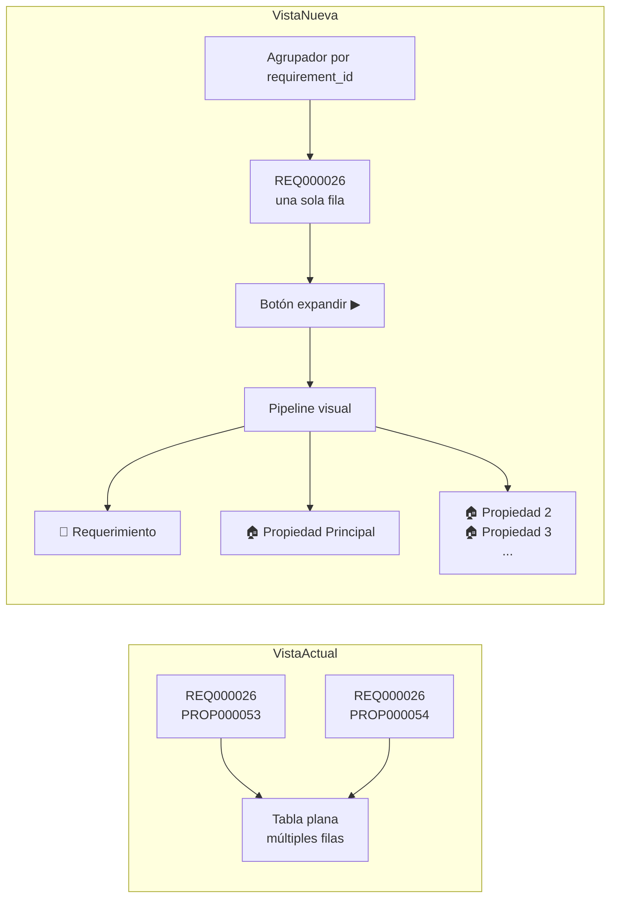
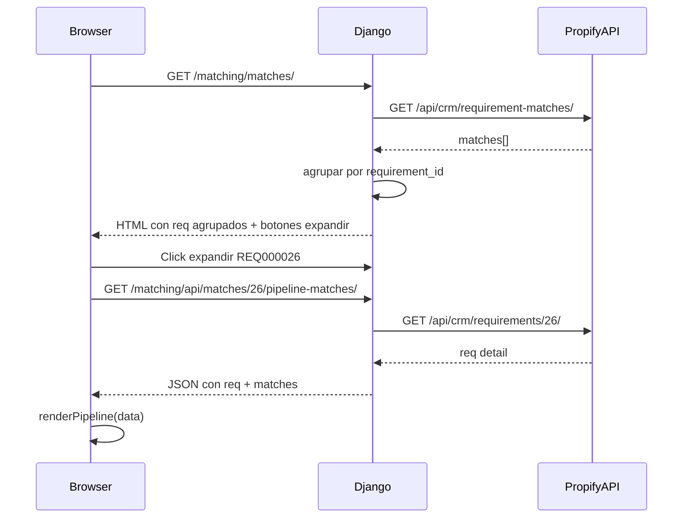

# Plan: Agrupación de Matches por Requerimiento con Pipeline Multi-Rama

## Objetivo
En la vista `/matching/matches/`, agrupar los matches por `requirement_id`:
- Cada requerimiento aparece UNA sola vez
- Al expandir, muestra un pipeline visual con todas las propiedades matcheadas como ramas paralelas
- Similar al diseño del pipeline de `/agentes/32/propuestas/`

## Estado Actual
- La vista `MatchesDashboardView` obtiene matches desde la API de Propify (`/api/crm/requirement-matches/`)
- Actualmente CADA match es una fila en la tabla (un req con N propiedades → N filas)
- No hay agrupación

## Arquitectura Propuesta



## Cambios Necesarios

### 1. Backend: Modificar `views.py` — Agrupar matches por requirement

En `get_context_data()`, después de obtener matches:

```python
# Agrupar matches por requirement_id
req_groups = {}
for m in matches:
    req_id = m.get('requirement')
    if req_id not in req_groups:
        req_groups[req_id] = {
            'requirement_id': req_id,
            'req_code': m.get('req_code', ''),
            'req_assigned': m.get('req_assigned', ''),
            'req_operation': m.get('req_operation', ''),
            'req_property_type': m.get('req_property_type', ''),
            'matches': [],
            'total_matches': 0,
            'best_score': 0,
        }
    req_groups[req_id]['matches'].append(m)
    req_groups[req_id]['total_matches'] = len(req_groups[req_id]['matches'])
    # Score del mejor match
    score = float(m.get('score', 0) or 0)
    if score > req_groups[req_id]['best_score']:
        req_groups[req_id]['best_score'] = score
        req_groups[req_id]['first_match'] = m

# Convertir a lista ordenada
grouped_matches = list(req_groups.values())
```

### 2. Backend: Nuevo endpoint API para pipeline de matches por req

Crear en `views.py` una vista que devuelva JSON con la estructura del pipeline:

```
GET /matching/api/matches/{requirement_id}/pipeline-matches/
→ {
    "requirement": { "code": "REQ000026", "assigned": "...", ... },
    "matches": [
        {
            "property_code": "PROP000053",
            "property_title": "Terreno Industrial...",
            "district": "Cerro Colorado",
            "price": 861300,
            "currency": "USD",
            "score": 100,
            "computed_at": "2026-05-22T14:56"
        },
        ... más propiedades
    ]
}
```

### 3. Template: Rediseñar `matches_dashboard.html`

**Estructura de tabla**:
- Cada fila = UN requerimiento (con su info: código, asignado, operación)
- Columna extra: "Propiedades" (N matches)
- Columna extra: "Mejor Score"
- Columna extra: botón expandir 🔽

**Pipeline visual** (expandible vía JS):

```
┌─────────────────────────────────────────────────────────────┐
│ 📝 REQ000026                                                 │
│ Compra Terreno · Francisco Vicente Valdeiglesias Castro       │
├─────────────────────────────────────────────────────────────┤
│ Pipeline de propiedades matcheadas:                          │
│                                                              │
│  📝          🔗          🏠 PROP000053    🔗   100%          │
│  REQ  ──────────  Terreno Industrial  ────────  Score        │
│                     Cerro Colorado                            │
│                           │                                   │
│                    ┌──────┴──────┐                           │
│                    │             │                            │
│                    ▼             ▼                            │
│  🏠 PROP000054    🏠 PROP000055                               │
│  Terreno Urbano   Otro Terreno                                │
│  Zamacola         Sachaca                                     │
│  95%              88%                                         │
└─────────────────────────────────────────────────────────────┘
```

### 4. CSS/JS: Reutilizar estilos del pipeline existente

Los estilos CSS de `.pipeline-timeline`, `.pipeline-node`, `.pipeline-connector`, `.branch-cards` ya existen en `pipeline_propuestas.html`. Se copian al template de matches.

## Archivos a Modificar/Crear

| Archivo | Acción |
|---------|--------|
| `webapp/matching/views.py` | Modificar `get_context_data` para agrupar + nuevo endpoint API |
| `webapp/matching/urls.py` | Agregar ruta para el endpoint API |
| `webapp/matching/templates/matching/matches_dashboard.html` | Rediseño completo con agrupación y pipeline |
| `webapp/matching/templates/matching/partials/pipeline_matches.html` | NUEVO: partial para el pipeline visual |

## Flujo de Datos



## Notas Técnicas
- El `requirement_id` en la API de Propify es numérico (ej: 26 para REQ000026)
- Los matches ya vienen con datos de propiedad (property_code, property_title, property_district_name, property_price, property_currency_name, score, computed_at)
- Reutilizar el sistema de toggle expand/colapse del pipeline existente
- La agrupación NO afecta la paginación (se agrupan los matches de la página actual)
