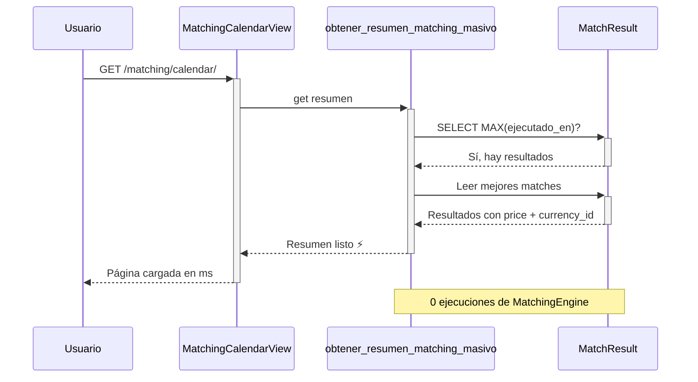
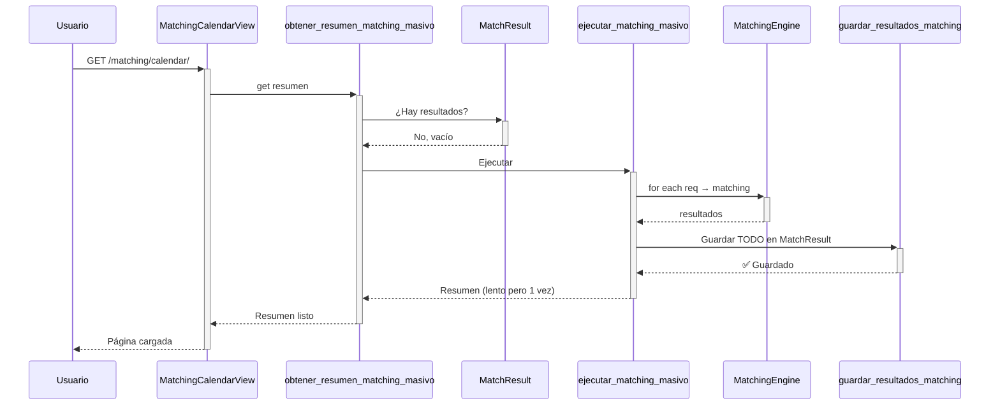
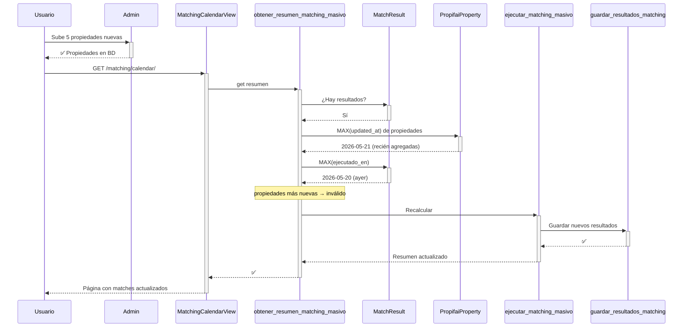

# Plan Completo: Resultados Persistentes de Matching + Fix Moneda

## Situación Actual (PROBLEMAS)

### Problema 1: Matching se recalcula siempre
[`MatchingCalendarView.get_context_data()`](../webapp/matching/views.py:456) llama a [`obtener_resumen_matching_masivo()`](../webapp/matching/engine.py:842) que cada vez ejecuta el matching completo desde cero (~200 reqs × ~78 props = ~15,600 evaluaciones). Los resultados se pierden al terminar el request porque **nunca se guardan en la tabla `MatchResult`**.

### Problema 2: Función `guardar_resultados_matching()` existe pero nadie la llama
En [`engine.py:745`](../webapp/matching/engine.py:745) ya hay una función `guardar_resultados_matching()` que inserta en la tabla `MatchResult`. Pero [`ejecutar_matching_masivo()`](../webapp/matching/engine.py:776) nunca la llama.

### Problema 3: Precios se muestran sin moneda original
- El dict [`mejor_propiedad`](../webapp/matching/engine.py:810) solo incluye `price` pero no `currency_id`.
- La propiedad [`precio_formateado`](../webapp/matching/models.py:114) del modelo siempre fuerza "S/. " aunque la propiedad esté en USD.

### Problema 4: N+1 queries en CalendarView
En [`views.py:469`](../webapp/matching/views.py:469) se hace un `Requerimiento.objects.get()` individual por cada requerimiento.

---

## Solución: Resultados Persistentes en Tabla MatchResult

### Principios
1. **Los resultados del matching se guardan en la tabla `MatchResult` de Azure SQL**
2. **Cuando se carga el calendario, se LEE de la tabla, no se recalcula**
3. **Los datos persisten aunque se reinicie el servidor**
4. **Los precios se muestran en su moneda original** (USD → `$`, PEN → `S/.`) tal cual están en la BD
5. **El motor de matching** internamente sigue convirtiendo a PEN para comparar — eso está BIEN y no se cambia

### Tabla `MatchResult` (ya existe, no necesita migración)

```python
class MatchResult(models.Model):
    requerimiento = models.ForeignKey(Requerimiento, on_delete=models.CASCADE, ...)
    propiedad = models.ForeignKey(PropifaiProperty, on_delete=models.CASCADE, ...)
    score_total = models.DecimalField(max_digits=5, decimal_places=2)
    score_detalle = models.JSONField()
    fase_eliminada = models.CharField(max_length=50, blank=True, null=True)
    porcentaje_compatibilidad = models.DecimalField(max_digits=5, decimal_places=2)
    ejecutado_en = models.DateTimeField(auto_now_add=True)
    ranking = models.PositiveIntegerField(blank=True, null=True)
```

---

## Flujo Completo

### Carga normal del calendario (sin propiedades nuevas)



### Primera carga (tabla vacía)



### Después de agregar propiedades nuevas



---

## Archivos a Modificar (Detalle por línea)

### 1. [`webapp/matching/engine.py`](../webapp/matching/engine.py)

#### 1a. Modificar `ejecutar_matching_masivo()` (línea 776)

**Qué hace ahora**: Itera requerimientos, ejecuta matching, pero NO guarda resultados.

**Qué hará después**:
- Después de ejecutar matching para cada requerimiento, llama a `guardar_resultados_matching()` para guardar en `MatchResult`
- Incluye `currency_id` en el dict `mejor_propiedad`
- Retorna el resumen con moneda incluida

```python
def ejecutar_matching_masivo(requerimientos=None, propiedades=None, limite_por_requerimiento=10):
    # ... mismo código de selección de querysets ...
    
    resultados_masivo = {}
    
    for requerimiento in requerimientos:
        engine = MatchingEngine(requerimiento)
        resultados = engine.ejecutar_matching(propiedades)
        
        # === NUEVO: Guardar resultados en MatchResult ===
        from .engine import guardar_resultados_matching
        try:
            top_resultados = resultados[:limite_por_requerimiento]
            guardar_resultados_matching(requerimiento.id, top_resultados)
        except Exception as e:
            logger.error(f"Error guardando matching para req {requerimiento.id}: {e}")
        # ================================================
        
        # ... mismo código de procesar compatibles ...
        
        if total_compatibles > 0:
            mejor_resultado = compatibles[0]
            mejor_propiedad = {
                'id': mejor_resultado['propiedad'].id,
                'code': mejor_resultado['propiedad'].code,
                'title': mejor_resultado['propiedad'].title,
                'district': mejor_resultado['propiedad'].district,
                'district_name': mejor_resultado['propiedad'].distrito_nombre,
                'price': float(mejor_resultado['propiedad'].price) if mejor_resultado['propiedad'].price else None,
                'currency_id': mejor_resultado['propiedad'].currency_id,  # ← NUEVO
                'property_type': mejor_resultado['propiedad'].tipo_propiedad,
            }
        # ...
        
        resultados_masivo[requerimiento.id] = {
            # ... mismos campos existentes ...
            'mejor_propiedad_precio': mejor_propiedad['price'] if mejor_propiedad else None,
            'mejor_propiedad_moneda_id': mejor_propiedad['currency_id'] if mejor_propiedad else None,  # ← NUEVO
        }
    
    return resultados_masivo
```

#### 1b. Modificar `obtener_resumen_matching_masivo()` (línea 842)

**Qué hace ahora**: Siempre llama a `ejecutar_matching_masivo()`.

**Qué hará después**:
1. Consulta `MatchResult` para ver si hay resultados guardados
2. Si hay resultados Y no hay propiedades nuevas → leer desde `MatchResult`
3. Si NO hay resultados O hay propiedades nuevas → ejecutar matching y guardar

```python
def obtener_resumen_matching_masivo(limite=500):
    try:
        from django.db.models import Max
        
        # 1. Verificar si hay resultados en MatchResult
        ultimo_matching = MatchResult.objects.aggregate(
            max_ejecutado=Max('ejecutado_en')
        )['max_ejecutado']
        
        # 2. Verificar si hay propiedades más nuevas que el último matching
        hay_propiedades_nuevas = False
        if ultimo_matching:
            ultima_propiedad = PropifaiProperty.objects.aggregate(
                max_updated=Max('updated_at')
            )['max_updated']
            if ultima_propiedad and ultima_propiedad > ultimo_matching:
                hay_propiedades_nuevas = True
        
        # 3. Decidir: ¿usar resultados guardados o recalcular?
        if ultimo_matching and not hay_propiedades_nuevas:
            # ✅ Leer desde MatchResult (rápido)
            return _obtener_desde_cache(limite)
        else:
            # 🔄 Recalcular y guardar
            resultados = ejecutar_matching_masivo()
            resumen = list(resultados.values())
            resumen.sort(key=lambda x: x['porcentaje_match'], reverse=True)
            return resumen[:limite]
            
    except Exception as e:
        logger.error(f"Error al obtener resumen de matching masivo: {e}")
        return []
```

#### 1c. Nueva función `_obtener_desde_cache()` (después de línea 840)

```python
def _obtener_desde_cache(limite=500):
    """
    Lee los resultados de matching desde la tabla MatchResult.
    Es rápido porque no ejecuta el motor de matching.
    Los resultados persisten aunque se reinicie el servidor.
    """
    from django.db.models import Max
    
    # Obtener el último ejecutado_en por requerimiento
    ultimos = MatchResult.objects.values(
        'requerimiento_id'
    ).annotate(
        ultimo_ejecutado=Max('ejecutado_en'),
        max_score=Max('score_total')
    ).order_by('-max_score')[:limite]
    
    resumen = []
    for item in ultimos:
        req_id = item['requerimiento_id']
        try:
            req = Requerimiento.objects.get(id=req_id)
        except Requerimiento.DoesNotExist:
            continue
        
        # Obtener el mejor match de ese batch
        mejor = MatchResult.objects.filter(
            requerimiento_id=req_id,
            ejecutado_en=item['ultimo_ejecutado']
        ).order_by('-score_total').first()
        
        if mejor:
            precio = float(mejor.propiedad.price) if mejor.propiedad and mejor.propiedad.price else None
            currency_id = mejor.propiedad.currency_id if mejor.propiedad else None
            
            resumen.append({
                'requerimiento_id': req_id,
                'requerimiento_nombre': str(req),
                'porcentaje_match': float(mejor.score_total),
                'mejor_propiedad_id': mejor.propiedad_id,
                'mejor_propiedad_precio': precio,
                'mejor_propiedad_moneda_id': currency_id,
                'fecha_ultimo_matching': mejor.ejecutado_en.isoformat() if mejor.ejecutado_en else None,
            })
    
    resumen.sort(key=lambda x: x['porcentaje_match'], reverse=True)
    return resumen[:limite]
```

### 2. [`webapp/matching/views.py`](../webapp/matching/views.py)

#### 2a. Eliminar N+1 queries (línea 469)

**Antes**:
```python
for req_id, info in resumen_por_req.items():
    try:
        r = Requerimiento.objects.get(id=req_id)  # ← 1 query por req
```

**Después**:
```python
# Cargar todos los requerimientos en UNA consulta
req_ids = list(resumen_por_req.keys())
requerimientos = Requerimiento.objects.filter(
    id__in=req_ids
).exclude(condicion__in=condicion_excluir)
reqs_map = {r.id: r for r in requerimientos}

for req_id, info in resumen_por_req.items():
    r = reqs_map.get(req_id)
    if not r:
        continue
```

#### 2b. Agregar `currency_id` al contexto de week/day view (líneas 537-549 y 603-615)

```python
reqs_serializados.append({
    # ... mismos campos ...
    'porcentaje_match': info.get('porcentaje_match', 0),
    'mejor_propiedad_codigo': info.get('mejor_propiedad_codigo'),
    'mejor_propiedad_precio': info.get('mejor_propiedad_precio'),
    'mejor_propiedad_moneda_id': info.get('mejor_propiedad_moneda_id'),  # ← NUEVO
})
```

### 3. [`webapp/matching/serializers.py`](../webapp/matching/serializers.py)

Eliminar `precio_formateado` del `PropiedadSimpleSerializer` (línea 14):
- No debe usarse para display porque fuerza "S/. " incorrectamente
- En su lugar, el frontend usa `price` + `currency_id` para mostrar correctamente

```python
class PropiedadSimpleSerializer(serializers.ModelSerializer):
    """Serializer simplificado para propiedades."""
    
    tipo_propiedad = serializers.CharField(read_only=True)
    currency_symbol = serializers.SerializerMethodField()
    # precio_formateado ELIMINADO - no usar para display
    
    class Meta:
        model = PropifaiProperty
        fields = [
            'id', 'code', 'title', 'district', 'price',
            'bedrooms', 'bathrooms', 'built_area', 'antiquity_years',
            'garage_spaces', 'ascensor', 'real_address', 'tipo_propiedad',
            'imagen_url', 'currency_id', 'currency_symbol'
        ]
```

### 4. [`webapp/matching/templates/matching/calendar.html`](../webapp/matching/templates/matching/calendar.html)

El modal (líneas 1179-1316) ya usa `formatPrice(prop.price, prop.currency_id)` y funciona correctamente cuando `currency_id` está presente.

Para las tarjetas de week y day view (alrededor de línea 1083), formatear el precio con su moneda:

```javascript
// Donde se muestra mejor_propiedad_precio
var precioDisplay = '—';
if (req.mejor_propiedad_precio) {
    precioDisplay = formatPrice(req.mejor_propiedad_precio, req.mejor_propiedad_moneda_id);
}
```

---

## Cómo se manejan las propiedades nuevas

1. **Detección automática**: Cuando se carga el calendario, [`obtener_resumen_matching_masivo()`](../webapp/matching/engine.py:842) compara la fecha de la última propiedad actualizada (`MAX(updated_at)` de `PropifaiProperty`) con la fecha del último matching guardado (`MAX(ejecutado_en)` de `MatchResult`).

2. **Si hay propiedades más nuevas**: Se invalida el resultado guardado y se ejecuta matching completo de nuevo, guardando los nuevos resultados.

3. **Si no hay propiedades nuevas**: Se lee directamente de `MatchResult` — instantáneo.

4. **Caso extremo**: Si se elimina una propiedad referenciada en `MatchResult`, el modelo tiene `db_constraint=False`, por lo que no rompe la BD. El código maneja `mejor.propiedad` como `None` y muestra "—" en lugar del precio.

---

## Resumen de cambios (6 archivos)

| # | Archivo | Cambio |
|---|---|---|
| 1 | [`matching/engine.py:776`](../webapp/matching/engine.py:776) | `ejecutar_matching_masivo()` ahora llama a `guardar_resultados_matching()` y añade `currency_id` |
| 2 | [`matching/engine.py:842`](../webapp/matching/engine.py:842) | `obtener_resumen_matching_masivo()` lee de `MatchResult` primero; solo recalcula si hay props nuevas |
| 3 | [`matching/engine.py:840`](../webapp/matching/engine.py:840) (nuevo) | `_obtener_desde_cache()` — helper para leer resultados guardados |
| 4 | [`matching/serializers.py:14`](../webapp/matching/serializers.py:14) | Eliminar `precio_formateado` del serializer |
| 5 | [`matching/views.py:469`](../webapp/matching/views.py:469) | Eliminar N+1 queries, usar `filter(id__in=...)` |
| 6 | [`matching/views.py:537,603`](../webapp/matching/views.py:537) | Pasar `mejor_propiedad_moneda_id` al template |
| 7 | [`matching/templates/matching/calendar.html:1083`](../webapp/matching/templates/matching/calendar.html:1083) | Formatear precio con moneda en week/day cards |

---

## Lo que NO se modifica

| Componente | Razón |
|---|---|
| Modelo `MatchResult` | Ya existe con los campos necesarios |
| Motor de matching interno | La conversión a PEN para comparar es correcta |
| Filtros discriminatorios | Sin cambios |
| Sistema de pesos y scoring | Sin cambios |
| Tabla `PropifaiProperty` | Sin cambios |
| Migraciones | No se necesitan |
