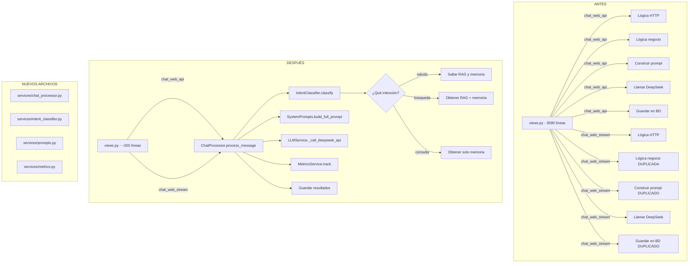

# Plan de Refactorización: Sistema Intelligence

## Diagnóstico de los 5 Problemas + Soluciones

---

## PROBLEMA 1: `views.py` monstruoso (3590 líneas)

### Diagnóstico

El archivo [`intelligence/views.py`](webapp/intelligence/views.py) tiene **3590 líneas** con:
- Lógica de negocio (construir prompts, formatear resultados)
- Lógica de HTTP (validar requests, serializar responses)
- Lógica de persistencia (guardar en BD, memoria episódica)
- Lógica de servicios (llamar a RAG, MemoryService, DeepSeek)
- **Código duplicado** entre `chat_web_api` y `chat_web_stream` (~400 líneas casi idénticas)

### Solución: Extraer a un Service Layer

Crear [`intelligence/services/chat_processor.py`](webapp/intelligence/services/chat_processor.py) que contenga **toda la lógica de negocio** del chat, dejando `views.py` solo para manejo HTTP.

```python
# services/chat_processor.py — NUEVO
class ChatProcessor:
    """
    Procesa mensajes de chat. Contiene toda la lógica de negocio
    que hoy está duplicada en chat_web_api y chat_web_stream.
    """
    
    @classmethod
    def process_message(cls, user, message, conversation, 
                        use_memory=True, use_rag=True, collections=None):
        """
        Flujo completo:
        1. Obtener memoria del usuario
        2. Obtener contexto RAG
        3. Obtener episodios relevantes
        4. Construir prompt
        5. Llamar a DeepSeek
        6. Guardar respuesta
        7. Guardar episodio
        8. Extraer hechos
        """
        pass
    
    @classmethod
    def build_prompt(cls, memory_context, rag_context, episodic_context, 
                     message, user, user_level):
        """Construye el prompt completo con todo el contexto."""
        pass
    
    @classmethod
    def save_results(cls, conversation, message, response_text, 
                     memory_context, rag_context, user, metadata):
        """Guarda todo: mensajes, episodios, hechos."""
        pass
```

### Archivos afectados

| Archivo | Cambio |
|---------|--------|
| [`intelligence/services/chat_processor.py`](webapp/intelligence/services/chat_processor.py) | **CREAR** — ~300 líneas con toda la lógica |
| [`intelligence/views.py`](webapp/intelligence/views.py) | **MODIFICAR** — reducir de 3590 a ~200 líneas (solo HTTP) |
| [`intelligence/services/__init__.py`](webapp/intelligence/services/__init__.py) | **MODIFICAR** — agregar import |

---

## PROBLEMA 2: Prompt del sistema hardcodeado

### Diagnóstico

El system prompt está **duplicado** en 2 lugares:
- [`views.py:2350-2366`](webapp/intelligence/views.py:2350) — en `chat_web_api`
- [`views.py:2748-2764`](webapp/intelligence/views.py:2748) — en `chat_web_stream`

Son **~17 líneas idénticas** de instrucciones. Si hay que cambiar algo, hay que hacerlo en 2 sitios. Además, el prompt de formateo de RAG (líneas 2396-2455) también está duplicado.

### Solución: Centralizar en un archivo de prompts

Crear [`intelligence/services/prompts.py`](webapp/intelligence/services/prompts.py) con todos los prompts como constantes o métodos.

```python
# services/prompts.py — NUEVO
class SystemPrompts:
    """Todos los prompts del sistema centralizados."""
    
    SYSTEM_INSTRUCTION = """Eres el asistente inteligente de Propifai...
    ..."""
    
    @classmethod
    def format_rag_context(cls, rag_results: list) -> str:
        """Formatea resultados RAG para incluirlos en el prompt."""
        pass
    
    @classmethod
    def format_memory_context(cls, memory_context: list) -> str:
        """Formatea contexto de memoria para el prompt."""
        pass
    
    @classmethod
    def build_full_prompt(cls, system: str, memory: str, rag: str, 
                          episodes: str, message: str) -> str:
        """Construye el prompt completo."""
        pass
```

### Archivos afectados

| Archivo | Cambio |
|---------|--------|
| [`intelligence/services/prompts.py`](webapp/intelligence/services/prompts.py) | **CREAR** — ~100 líneas |
| [`intelligence/services/chat_processor.py`](webapp/intelligence/services/chat_processor.py) | **USAR** — importar prompts |
| [`intelligence/views.py`](webapp/intelligence/views.py) | **ELIMINAR** — prompts hardcodeados |

---

## PROBLEMA 3: No hay clasificador de intención

### Diagnóstico

Actualmente el sistema **no clasifica la intención del usuario**. Siempre:
1. Obtiene memoria (siempre)
2. Obtiene RAG (siempre)
3. Obtiene episodios (siempre)
4. Construye prompt con TODO
5. Manda TODO a DeepSeek

Esto es ineficiente porque:
- Si el usuario dice "hola" o "gracias", no necesita RAG ni memoria episódica
- Si el usuario pregunta "cuál es mi nombre", no necesita RAG de propiedades
- Si el usuario pide "busca casas en Cayma", no necesita memoria episódica

### Solución: Clasificador de intención básico (sin LLM)

Crear [`intelligence/services/intent_classifier.py`](webapp/intelligence/services/intent_classifier.py) con reglas simples.

```python
# services/intent_classifier.py — NUEVO
class IntentType(Enum):
    GREETING = "saludo"
    FAREWELL = "despedida"
    THANKS = "agradecimiento"
    PROPERTY_SEARCH = "busqueda_propiedades"
    REQUIREMENT_SEARCH = "busqueda_requerimientos"
    PRICE_QUERY = "consulta_precio"
    USER_INFO = "informacion_usuario"
    GENERAL = "consulta_general"
    UNKNOWN = "no_detectada"

class IntentClassifier:
    """
    Clasifica la intención del mensaje usando reglas + keywords.
    Sin LLM, sin embeddings — rápido y determinístico.
    """
    
    RULES = {
        IntentType.GREETING: {
            'keywords': ['hola', 'buenos días', 'buenas tardes', 'hey', 'qué tal'],
            'skip_rag': True,
            'skip_memory': True,
        },
        IntentType.PROPERTY_SEARCH: {
            'keywords': ['busca', 'encuentra', 'quiero', 'necesito', 'hay'],
            'entities': ['casa', 'departamento', 'terreno', 'local', 'oficina'],
            'skip_rag': False,
            'skip_memory': False,
        },
        ...
    }
    
    @classmethod
    def classify(cls, message: str) -> IntentResult:
        """
        Retorna:
        - intent: IntentType
        - confidence: float
        - extracted_params: dict (zonas, tipos, precios)
        - skip_rag: bool
        - skip_memory: bool
        """
        pass
```

### Archivos afectados

| Archivo | Cambio |
|---------|--------|
| [`intelligence/services/intent_classifier.py`](webapp/intelligence/services/intent_classifier.py) | **CREAR** — ~150 líneas |
| [`intelligence/services/chat_processor.py`](webapp/intelligence/services/chat_processor.py) | **USAR** — clasificar antes de buscar |

---

## PROBLEMA 4: Acoplamiento total (no reusable)

### Diagnóstico

La lógica del chat está **totalmente acoplada** a:
- Django REST Framework (`Response`, `api_view`, `serializers`)
- Estructura de `views.py` (request/response HTTP)
- Formato específico de `ChatRequestSerializer`

No se puede:
- Usar la misma lógica desde un comando de management
- Usar desde un MCP server
- Usar desde una tarea Celery
- Probar unitariamente sin levantar Django

### Solución: ChatProcessor independiente de HTTP

El [`ChatProcessor`](webapp/intelligence/services/chat_processor.py) debe:
- Recibir objetos Python (no requests)
- Devolver objetos Python (no Responses)
- No importar nada de `rest_framework`
- Ser testeable con mocks

```python
# services/chat_processor.py
class ChatProcessor:
    @classmethod
    def process_message(cls, 
                        user: 'User', 
                        message: str, 
                        conversation: 'Conversation',
                        use_memory: bool = True,
                        use_rag: bool = True,
                        collections: list = None
                        ) -> 'ProcessResult':
        """
        Recibe objetos Django, devuelve dataclass.
        Sin dependencia de DRF.
        """
        pass

@dataclass
class ProcessResult:
    success: bool
    response: str
    conversation_id: str
    metadata: dict
    error: str = None
```

### Archivos afectados

| Archivo | Cambio |
|---------|--------|
| [`intelligence/services/chat_processor.py`](webapp/intelligence/services/chat_processor.py) | **CREAR** — sin dependencias de DRF |
| [`intelligence/views.py`](webapp/intelligence/views.py) | **MODIFICAR** — adaptar de Response a ProcessResult |
| Nuevo: comando de management | **CREAR** — `python manage.py chat "mensaje" --user-id X` |

---

## PROBLEMA 5: Sin métricas ni logging estructurado

### Diagnóstico

El logging actual es:
- `import logging` y `logger = logging.getLogger(__name__)` **repetido en múltiples lugares dentro del mismo archivo** (líneas 2208, 2517, 2526, 2533, 2562)
- No hay métricas de: latencia por operación, skills usadas, tasa de éxito/error
- No hay trazabilidad: no se puede saber qué skills se ejecutaron, cuánto tardaron, si fallaron
- Los errores se tragan con `except Exception: pass` (línea 2950)

### Solución: Sistema de métricas y logging centralizado

Crear [`intelligence/services/metrics.py`](webapp/intelligence/services/metrics.py).

```python
# services/metrics.py — NUEVO
import logging
import time
from contextlib import contextmanager
from dataclasses import dataclass, field

logger = logging.getLogger('intelligence')

@dataclass
class MetricRecord:
    operation: str          # "chat.process", "rag.search", "memory.load"
    user_id: str
    success: bool
    latency_ms: float
    metadata: dict = field(default_factory=dict)
    error: str = None

class MetricsService:
    """Registro centralizado de métricas."""
    
    @classmethod
    @contextmanager
    def track(cls, operation: str, user_id: str = None):
        """Context manager que mide latencia y registra resultado."""
        start = time.time()
        try:
            yield
            cls._record(MetricRecord(
                operation=operation,
                user_id=user_id,
                success=True,
                latency_ms=(time.time() - start) * 1000
            ))
        except Exception as e:
            cls._record(MetricRecord(
                operation=operation,
                user_id=user_id,
                success=False,
                latency_ms=(time.time() - start) * 1000,
                error=str(e)
            ))
            raise
    
    @classmethod
    def _record(cls, record: MetricRecord):
        """Guarda la métrica (log + opcionalmente BD)."""
        logger.info(
            f"METRIC | {record.operation} | user={record.user_id} | "
            f"success={record.success} | latency={record.latency_ms:.0f}ms"
            + (f" | error={record.error}" if record.error else "")
        )
```

### Archivos afectados

| Archivo | Cambio |
|---------|--------|
| [`intelligence/services/metrics.py`](webapp/intelligence/services/metrics.py) | **CREAR** — ~80 líneas |
| [`intelligence/services/chat_processor.py`](webapp/intelligence/services/chat_processor.py) | **USAR** — decorar con `@MetricsService.track` |
| [`intelligence/views.py`](webapp/intelligence/views.py) | **ELIMINAR** — `import logging` repetidos |

---

## DIAGRAMA DE LA REFACTORIZACIÓN



---

## PLAN DE IMPLEMENTACIÓN (TODOs)

### Fase 1: Fundación (sin cambiar comportamiento)
- [ ] Crear [`intelligence/services/prompts.py`](webapp/intelligence/services/prompts.py) — centralizar todos los prompts
- [ ] Crear [`intelligence/services/metrics.py`](webapp/intelligence/services/metrics.py) — logging estructurado
- [ ] Crear [`intelligence/services/intent_classifier.py`](webapp/intelligence/services/intent_classifier.py) — clasificador básico

### Fase 2: Service Layer
- [ ] Crear [`intelligence/services/chat_processor.py`](webapp/intelligence/services/chat_processor.py) — toda la lógica de negocio
- [ ] Mover construcción de prompt a `prompts.py`
- [ ] Mover clasificación de intención a `intent_classifier.py`
- [ ] Integrar `metrics.py` en el flujo

### Fase 3: Refactorizar views.py
- [ ] Simplificar `chat_web_api` para que solo llame a `ChatProcessor.process_message`
- [ ] Simplificar `chat_web_stream` para que solo llame a `ChatProcessor.process_message`
- [ ] Eliminar código duplicado (prompts, logging, try/except repetidos)
- [ ] Reducir `views.py` de 3590 a ~200 líneas

### Fase 4: Tests
- [ ] Tests unitarios de `IntentClassifier`
- [ ] Tests unitarios de `ChatProcessor` (con mocks de servicios)
- [ ] Tests de integración de `chat_web_api` (verificar que no se rompe nada)

### Fase 5: Validación
- [ ] Probar que `chat_web_api` funciona igual que antes
- [ ] Probar que `chat_web_stream` funciona igual que antes
- [ ] Verificar que las métricas se registran correctamente
- [ ] Verificar que el clasificador no rompe el flujo normal

---

## PRINCIPIOS DE LA REFACTORIZACIÓN

1. **Zero breakage**: el comportamiento externo NO cambia. Las APIs responden exactamente igual.
2. **Un cambio a la vez**: cada PR/fase es independiente y testeable.
3. **Fallback automático**: si el clasificador falla, se usa el comportamiento anterior (todo incluido).
4. **Métricas no bloqueantes**: si `MetricsService` falla, no afecta la respuesta al usuario.
5. **DRY**: el código duplicado entre `chat_web_api` y `chat_web_stream` se elimina.
6. **Testeable**: `ChatProcessor` se puede testear sin HTTP.
