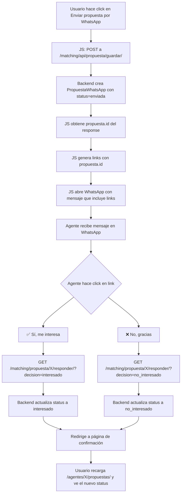

# Plan: Tracking de Respuestas WhatsApp con Enlaces

## Objetivo

Reemplazar las opciones numéricas del mensaje WhatsApp por enlaces clickeables que actualicen automáticamente el estado de la propuesta en la BD y redirijan a una página de confirmación.

---

## 1. Modificaciones al mensaje WhatsApp

### Archivo: `webapp/matching/templates/matching/calendar.html`

**Función:** `enviarPropuestaWhatsApp()` (alrededor de línea 1843)

**Eliminar del mensaje:**
- La línea de imagen SVG (el icono no aplica en texto plano)
- El bloque "🏠 *Mi propiedad es:*" con todos los detalles de propiedad (title, district, price, bedrooms, bathrooms, area, code)
- La línea "🔗 Ver propiedad: https://propifai.com/..."

**Reemplazar:**
- `"¿Te interesa? Responde con el número:"` → `"¿Te interesa? Haz click en el enlace según tu respuesta:"`
- `"1️⃣ ✅ Sí, me interesa"` → `"✅ Sí, me interesa → [LINK_RESPUESTA]"`
- `"2️⃣ ❌ No, gracias"` → `"❌ No, gracias → [LINK_RESPUESTA]"`

**Generación de links:**
```javascript
var baseUrl = window.location.origin;
var linkSi = baseUrl + '/matching/propuesta/' + propuestaId + '/responder/?decision=interesado';
var linkNo = baseUrl + '/matching/propuesta/' + propuestaId + '/responder/?decision=no_interesado';
```

Donde `propuestaId` se obtiene del response del fetch a `/matching/api/propuesta/guardar/`.

---

## 2. Nuevas URLs

### Archivo: `webapp/matching/urls.py`

Agregar:
```python
path('propuesta/<int:pk>/responder/', views.responder_propuesta, name='propuesta-responder'),
path('propuesta/<int:pk>/respuesta/', views.pagina_respuesta, name='propuesta-respuesta'),
```

---

## 3. Nuevas Vistas

### Archivo: `webapp/matching/views.py`

#### `responder_propuesta(request, pk)`
- **Método:** GET
- **Query params:** `decision` = `interesado` | `no_interesado`
- **Lógica:**
  1. Obtener `PropuestaWhatsApp` por `pk`
  2. Validar `decision`
  3. Actualizar `propuesta.status = decision` ('interesado' o 'no_interesado')
  4. Actualizar `propuesta.respondido_en = timezone.now()`
  5. Redirigir a `pagina_respuesta` con la decisión
- **Protección:** `csrf_exempt` (viene de link externo)

#### `pagina_respuesta(request, pk)`
- **Método:** GET
- **Query params:** `decision` = `interesado` | `no_interesado`
- **Template:** `matching/respuesta_propuesta.html`
- **Context:** `decision`, `propuesta`, mensaje acorde

---

## 4. Template de Respuesta

### Nuevo archivo: `webapp/matching/templates/matching/respuesta_propuesta.html`

Página básica y limpia (mismo dark theme) que muestra:
- Si `decision=interesado`: ✅ "Gracias por tu respuesta. Has indicado que SÍ te interesa la propiedad. Nos pondremos en contacto contigo."
- Si `decision=no_interesado`: "Gracias por tu respuesta. Has indicado que NO te interesa la propiedad. Seguiremos buscando opciones para ti."
- Botón: "Volver a Propifai" → redirige a propifai.com

---

## 5. Tracking en Pipeline de Propuestas

### Archivo: `webapp/agentes/templates/agentes/pipeline_propuestas.html`

**No requiere cambios.** Ya obtiene y muestra las `PropuestaWhatsApp` del agente con su status. Cuando alguien haga click en el enlace del WhatsApp:
1. Se llama a `responder_propuesta` que actualiza el status en BD
2. Al recargar la página de pipeline, el nuevo status aparece automáticamente

**Status existentes en el modelo:**
| Status | Label | Se asigna cuando... |
|--------|-------|---------------------|
| `enviada` | Enviada | Por defecto al crear |
| `interesado` | Interesado | Click en "Sí, me interesa" |
| `no_interesado` | No interesado | Click en "No, gracias" |

---

## 6. Flujo Completo



---

## 7. Archivos a Modificar/Crear

| Archivo | Acción |
|---------|--------|
| `webapp/matching/templates/matching/calendar.html` | Modificar función JS `enviarPropuestaWhatsApp()` |
| `webapp/matching/urls.py` | Agregar 2 nuevas rutas |
| `webapp/matching/views.py` | Agregar 2 nuevas vistas |
| `webapp/matching/templates/matching/respuesta_propuesta.html` | **CREAR** - Página de confirmación |

---

## 8. Notas Técnicas

1. Los links se abren en el navegador del agente (no en WhatsApp Web), por lo tanto funcionan en cualquier dispositivo.
2. No se requiere autenticación (AllowAny) porque el agente no está autenticado en el sistema.
3. El `csrf_exempt` es necesario porque la petición viene desde un link externo.
4. El modelo `PropuestaWhatsApp` ya soporta los status `interesado` y `no_interesado` — no requiere migración.
