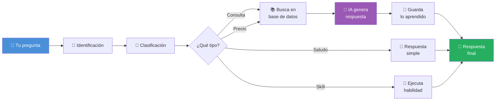

# ¿Cómo funciona el Sistema de Inteligencia de Propifai?

> **Para:** Personas sin conocimientos de software
> **Propósito:** Explicar de forma sencilla cómo el sistema entiende preguntas, busca información y responde como un experto inmobiliario.

---

## El Flujo Completo — De la Pregunta a la Respuesta

Imagina que le preguntas al sistema: **"¿Qué departamentos hay en Cayma con precio menor a 300,000 soles?"**

Esto es lo que pasa por dentro, paso a paso:

```mermaid
flowchart TD
    A[👤 Tú haces una pregunta<br/>en el chat de Propifai] --> B
    
    subgraph B["1️⃣ El sistema te identifica"]
        direction LR
        B1[Revisa quién eres] --> B2[Verifica tu nivel<br/>de acceso] --> B3[¿Tienes permiso<br/>para usar el chat?]
    end
    
    B --> C{¿Estás autorizado?}
    C -->|No| D[❌ Te redirige a<br/>la pantalla de login]
    C -->|Sí| E
    
    subgraph E["2️⃣ Clasifica tu pregunta"]
        direction TB
        E1[Analiza las palabras<br/>clave de tu mensaje] --> E2{¿Qué tipo de<br/>pregunta es?}
        E2 -->|"departamentos, Cayma,<br/>precio, 300,000"| E3[🏠 Búsqueda de<br/>propiedades]
        E2 -->|"hola, buenos días"| E4[👋 Saludo]
        E2 -->|"gracias"| E5[🙏 Agradecimiento]
        E2 -->|"ayuda, qué puedes hacer"| E6[❓ Ayuda]
        E2 -->|"precio promedio en<br/>Yanahuara"| E7[💰 Consulta de<br/>precios]
    end
    
    E --> F{Es una pregunta<br/>normal o un<br/>comando especial?}
    
    F -->|Comando especial| G
    
    subgraph G["3️⃣ Ejecuta una habilidad especial<br/>(Skill)"]
        G1[Identifica qué<br/>habilidad usar] --> G2[Busca en su<br/>memoria cache]
        G2 --> G3{¿Ya había<br/>calculado esto<br/>antes?}
        G3 -->|Sí| G4[⚡ Devuelve el<br/>resultado guardado<br/>- MUY RÁPIDO]
        G3 -->|No| G5[Ejecuta la<br/>habilidad]
        G5 --> G6[Guarda el resultado<br/>para futuras<br/>consultas]
    end
    
    F -->|Pregunta normal| H
    
    subgraph H["3️⃣ Busca en su memoria<br/>lo que sabe de ti"]
        H1[Revisa conversaciones<br/>anteriores contigo] --> H2[Busca datos que<br/>has compartido]
        H2 --> H3[Ej: "El usuario busca<br/>departamento en Cayma,<br/>presupuesto 300,000"]
    end
    
    H --> I
    
    subgraph I["4️⃣ Busca en la base de datos<br/>(Búsqueda Inteligente RAG)"]
        direction TB
        I1[Convierte tu pregunta<br/>a una "huella digital"<br/>matemática] --> I2[Compara esa huella<br/>con todas las<br/>propiedades guardadas]
        I2 --> I3[Encuentra las más<br/>parecidas a lo que<br/>buscas]
        I3 --> I4[Si encuentra pocas,<br/>hace una segunda<br/>búsqueda por palabras]
        I4 --> I5[Combina y ordena<br/>los mejores resultados]
    end
    
    I --> J
    
    subgraph J["5️⃣ Recuerda interacciones<br/>anteriores importantes"]
        J1[Busca episodios<br/>pasados similares] --> J2[Ej: "La semana pasada<br/>el usuario preguntó<br/>por casas en Cayma"]
        J2 --> J3[Evalúa qué tan<br/>importante fue esa<br/>interacción]
    end
    
    J --> K
    
    subgraph K["6️⃣ Arma el mensaje completo<br/>para el experto IA"]
        K1[Instrucciones del<br/>sistema: cómo debe<br/>comportarse] --> K2[+ Datos de<br/>conversaciones<br/>anteriores]
        K2 --> K3[+ Resultados de<br/>la búsqueda en<br/>base de datos]
        K3 --> K4[+ Recuerdos de<br/>interacciones<br/>pasadas]
        K4 --> K5[+ Tu pregunta<br/>actual]
    end
    
    K --> L
    
    subgraph L["7️⃣ Consulta al Experto IA<br/>(DeepSeek - similar a ChatGPT)"]
        L1[Envía todo el<br/>contexto a la<br/>IA] --> L2[La IA analiza y<br/>genera una respuesta<br/>en español]
        L2 --> L3[La respuesta incluye<br/>datos REALES de la<br/>base de datos]
    end
    
    L --> M
    
    subgraph M["8️⃣ Guarda lo aprendido"]
        M1[Guarda la pregunta<br/>y respuesta en el<br/>historial] --> M2[Extrae datos<br/>importantes: "Usuario<br/>quiere Cayma"]
        M2 --> M3[Guarda el episodio<br/>completo para<br/>futuras consultas]
    end
    
    G --> N
    M --> N
    
    N[💬 Tú recibes una respuesta<br/>clara y útil con datos<br/>reales de propiedades]
```

---

## Explicación en Pasos Sencillos

### Paso 1: Identificación 🔐
Cuando entras al chat, el sistema primero verifica quién eres. Si no has iniciado sesión, te pide que lo hagas. Si ya estás identificado, revisa qué nivel de acceso tienes (no todos los usuarios pueden ver toda la información).

### Paso 2: Clasificación de la Pregunta 🧠
El sistema analiza tu mensaje y determina de qué se trata:
- **"departamentos en Cayma"** → Búsqueda de propiedades
- **"hola"** → Saludo (no necesita buscar datos)
- **"gracias"** → Agradecimiento
- **"precio promedio"** → Consulta de precios

Esto lo hace **sin usar IA**, solo con reglas de palabras clave, para ser más rápido.

### Paso 3: ¿Comando Especial o Pregunta Normal? 🔧
Si tu mensaje activa una **habilidad especial (skill)** como:
- **"Analiza esta propiedad"** → Skill de Análisis ACM (calcula cuotas, precio por m², etc.)
- **"Cruza estos requerimientos"** → Skill de Matching (encuentra propiedades que coinciden con lo que busca un cliente)
- **"Reporte de precios en Cayma"** → Skill de Reporte de Precios

...entonces el sistema ejecuta esa habilidad directamente y te da el resultado.

Si es una pregunta normal, sigue al paso 4.

### Paso 4: Busca en su Memoria (lo que sabe de ti) 📝
El sistema revisa conversaciones anteriores que hayas tenido. Por ejemplo, si la semana pasada dijiste "busco departamento en Cayma", el sistema lo recuerda y lo usa para dar una mejor respuesta.

### Paso 5: Búsqueda Inteligente en la Base de Datos 🔍
Aquí ocurre la magia. El sistema:
1. **Convierte tu pregunta a una "huella digital"** (embedding) — una representación matemática de lo que buscas
2. **Compara esa huella con todas las propiedades** guardadas en la base de datos
3. **Encuentra las más parecidas** usando similitud matemática
4. **Si encuentra pocos resultados**, hace una segunda búsqueda por palabras clave
5. **Te devuelve los mejores resultados** ordenados por relevancia

Esto se llama **RAG (Generación Aumentada por Recuperación)** — básicamente, el sistema "busca en sus apuntes" antes de responder.

### Paso 6: Recuerda Interacciones Importantes 🧠
El sistema también busca **episodios completos** de conversaciones anteriores que sean similares a tu pregunta actual. Por ejemplo, si antes preguntaste por casas en Yanahuara y ahora preguntas por departamentos en Cayma, el sistema puede encontrar útil esa conversación anterior.

### Paso 7: Arma el Mensaje Completo 📦
El sistema construye un "mega-mensaje" que incluye:
- **Instrucciones**: cómo debe comportarse el asistente (tono profesional, basarse en datos reales, etc.)
- **Contexto del usuario**: lo que sabe de ti
- **Datos de la base de datos**: las propiedades que encontró
- **Episodios anteriores**: conversaciones relevantes del pasado
- **Tu pregunta**: el mensaje que escribiste

### Paso 8: Consulta al Experto IA 🤖
Todo ese contexto se envía a **DeepSeek** (un modelo de IA similar a ChatGPT, pero optimizado para español y más económico). La IA:
- Analiza toda la información
- Genera una respuesta en español clara y profesional
- **Solo usa los datos reales** que le diste (no inventa nada)
- Menciona precios, ubicaciones y características específicas

### Paso 9: Guarda lo Aprendido 💾
Después de responderte, el sistema:
- Guarda la conversación en el historial
- Extrae **hechos importantes** (ej: "Usuario busca departamento en Cayma, presupuesto 300,000")
- Guarda el **episodio completo** para futuras consultas
- Si el episodio es muy antiguo o poco importante, lo elimina automáticamente

### Paso 10: Recibes tu Respuesta ✅
Finalmente, ves la respuesta en el chat con información real y útil.

---

## ¿Qué son las "Habilidades Especiales" (Skills)?

Son como **herramientas especializadas** que el sistema puede usar para tareas específicas:

| Habilidad | ¿Qué hace? | Ejemplo de uso |
|---|---|---|
| **🔍 Búsqueda Exacta** | Filtra propiedades con criterios precisos | "Encuentra casas en Cayma con 3 dormitorios y precio entre 200,000 y 300,000" |
| **📊 Análisis ACM** | Calcula cuotas, precio por m², recomendaciones financieras | "Analiza esta propiedad de 250,000 soles con 80m² en Yanahuara" |
| **🤝 Matching** | Cruza lo que busca un cliente con propiedades disponibles | "¿Qué propiedades coinciden con este cliente que busca departamento en Miraflores?" |
| **📈 Reporte de Precios** | Genera estadísticas de precios por zona | "Dame el precio promedio de departamentos en Cerro Colorado" |

---

## ¿Qué es la Búsqueda Inteligente (RAG)?

Imagina que eres un experto inmobiliario que tiene una **biblioteca gigante** con información de todas las propiedades. Cuando alguien te pregunta algo:

1. **Sin RAG**: Tendrías que leer toda la biblioteca para encontrar la respuesta → **lento e impreciso**
2. **Con RAG**: Buscas en el índice de la biblioteca, encuentras los libros relevantes, los lees y luego respondes → **rápido y preciso**

Eso es exactamente lo que hace el sistema RAG de Propifai:
- **Busca** en la base de datos las propiedades más relevantes
- **Recupera** la información específica
- **Genera** una respuesta usando IA basada en esa información real

---

## ¿Cómo aprende el sistema de cada conversación?

Cada vez que hablas con el sistema, él:

1. **Guarda el hecho** → "El usuario X busca departamento en Cayma"
2. **Clasifica el episodio** → "Esto fue una búsqueda de propiedad"
3. **Calcula importancia** → ¿Fue una conversación importante? (mencionaste precios, distritos, etc.)
4. **Lo almacena** para futuras referencias
5. **Si hay demasiados recuerdos**, elimina los más antiguos o menos importantes

Con el tiempo, el sistema te conoce mejor y puede darte respuestas más personalizadas.

---

## Resumen Visual Simple



---

*Documento generado el 30 de Abril de 2026*
*Sistema Intelligence de Propifai — Versión para usuarios*
