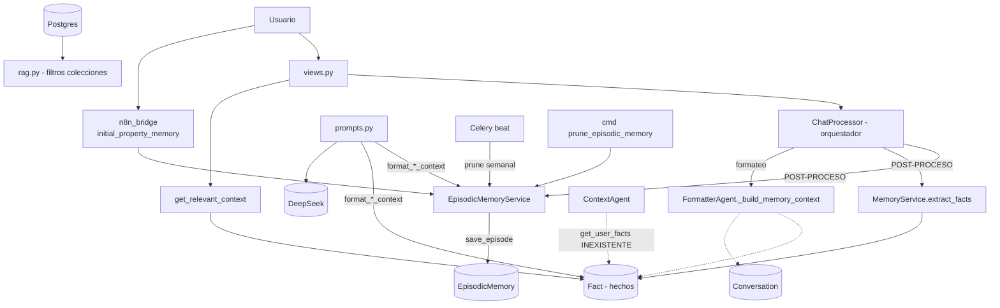

# Sistema de Memorias — Análisis de Estructura y Arquitectura

## 1. Visión general

El sistema de memorias vive en la app Django `intelligence` y está **duplicado idénticamente** en dos rutas:
- `D:\PROMETEO\webapp\intelligence\` ← implementación canónica
- `D:\PROMETEO\elgranextractor\webapp\intelligence\` ← copia redundante (ambos con `git-tracked`)

Hay **4 tipos de memoria** en el sistema, soportados por servicios y modelos propios.

---

## 2. Los 4 subsistemas de memoria

### 2.1 Memoria conversacional (de corto plazo)
**Servicio:** `MemoryService` — `webapp\intelligence\services\memory.py`
**Modelo:** `Conversation` — `webapp\intelligence\models.py:210`

Representa sesiones de chat con mensajes en JSON, resumen de contexto histórico y ventana activa de 24h.

Funciones principales:
- `get_or_create_user()` — busca/crea usuario por phone/email y asigna rol nivel 1
- `get_active_session()` — recupera sesión activa (últimas 24h) o crea una nueva
- `load_conversation_context()` — carga mensajes recientes + top-10 hechos + resumen
- `save_message()` — persiste mensajes; al superar `MAX_MESSAGES_BEFORE_SUMMARY` (20) resume los antiguos y conserva solo los últimos 10
- `_generate_summary()` — genera resumen por reglas (sin LLM; temas: propiedad, presupuesto, ubicación)
- `build_prompt_with_memory()` — arma el prompt LLM con hechos + resumen + conversación (SPEC-002)

### 2.2 Memoria de largo plazo (hechos / semántica factual)
**Servicio:** `MemoryService` (mismo módulo)
**Modelo:** `Fact` — `webapp\intelligence\models.py:251`

Hechos almacenados como **tripletas** `(sujeto, relación, objeto)` con `confidence`.

Funciones:
- `extract_and_save_facts()` — extrae hechos con DeepSeek (JSON) y *fallback* por reglas
- `_extract_facts_with_deepseek()` — prompt de extracción flexible vía `LLMService._call_deepseek_api`
- `_extract_facts_with_rules()` — detecta nombre, área de trabajo, empresa, ubicación, búsqueda de propiedad, presupuesto y eventos
- `get_relevant_context()` — ranking por relevancia (score ponderado: confianza 30%, match exacto 40%, parcial 30%) usando `_calculate_relevance_score()` y `_normalize_text()`
- `add_fact()` — agrega hecho manualmente desde `chat_web`

### 2.3 Memoria episódica
**Servicio:** `EpisodicMemoryService` — `webapp\intelligence\services\episodic_memory.py`
**Modelo:** `EpisodicMemory` — `webapp\intelligence\models.py:552`

Cada episodio es una interacción atómica completa (mensaje + respuesta + contexto enriquecido + contexto RAG usado + contexto de memoria usado + feedback + latencia).

- `save_episode()` — guarda episodio, genera embedding (384 dims vía `RAGService.generate_embedding`), calcula importancia, clasifica tipo con DeepSeek
- `get_relevant_episodes()` / `get_relevant_episodes_static()` — búsqueda semántica por similitud coseno con score combinado (70% similitud + 30% importancia)
- `_classify_episode()` / `_classify_with_rules()` — clasificación de tipo (property_search, price_inquiry, fact_extraction, etc.)
- `_calculate_importance()` — puntuación 0-1 por tipo, precio, distrito, longitud, sentimiento y acciones
- `update_feedback()` — thumbs up/down que ajusta la importancia
- `format_episodes_for_prompt()` — formatea episodios para inyectar al prompt
- **Mantenimiento:** `prune_old_episodes()` (podar >30 días de baja importancia o feedback negativo) y `enforce_max_per_user()` (límite 500/usuario)

### 2.4 Perfil de inteligencia del usuario (memoria de acceso/contexto)
**Servicio:** `permissions.py` (lógica) + `signals.py` (auto-creación)
**Modelo:** `UserIntelligenceProfile` — `webapp\intelligence\models.py:473`

No guarda datos conversacionales sino el **nivel de acceso y dominios** del usuario.
- `can_access_collection()` — evalúa bloqueo explícito → nivel mínimo → pública → extra → dominio
- Auto-creado vía señal `post_save` en `signals.py`

---

## 3. ¿Quién usa cada memoria? (mapa de uso)

### A. Escritura (producción)

| Módulo | Memoria | Función |
|---|---|---|
| `services\chat_processor.py:3045` | Episódica | `save_episode()` en post-procesamiento (`_save_post_process`) |
| `services\chat_processor.py:3059` | Hechos | `extract_and_save_facts()` (mismo post-proceso) |
| `n8n_bridge\services\initial_property_memory.py` | Episódica | `save_episode(episode_type="property_detail", intent="initial_property_interest")` — embudo WhatsApp |
| `views.py:140-157` | Conversacional | Guarda mensaje del usuario directamente en `conversation.messages` |

### B. Lectura (producción)

| Módulo | Memoria | Función |
|---|---|---|
| `views.py:162-163` (endpoint chat compat) | Hechos | `get_relevant_context()` → pasa a `PromptManager.build_full_prompt(...memory_context)` |
| `agents\formatter_agent.py:184` `_build_memory_context()` | Hechos + conversación | Lee top-15 `Fact` + última conversación; usado en `chat_processor.py:1641` |
| `agents\context_agent.py:73` | Hechos | `MemoryService().get_user_facts()` ⚠️ **método inexistente** |
| `services\prompts.py:226,234` | Episódica + hechos | `format_episodic_context()` y `format_memory_context()` (formateadores para prompt) |

### C. Mantenimiento / administración

| Módulo | Uso |
|---|---|
| `colas\tasks.py:688` | `prune_episodic_memory_weekly()` — Celery: `prune_old_episodes` + `enforce_max_per_user` |
| `colas\celery.py:116` | `beat_schedule` `prune-episodic-memory-semanal` |
| `management\commands\prune_episodic_memory.py` | Comando CLI manual de poda |
| `management\commands\sincronizar_rag.py` | Gestión de colecciones/embeddings asociados |
| `admin.py:280,354` | Paneles `EpisodicMemoryAdmin` y `UserIntelligenceProfileAdmin` |
| `views.py:2878` | Endpoint de feedback: `EpisodicMemoryService.update_feedback()` |
| `services\rag.py:2181` | Filtra colecciones usando `UserIntelligenceProfile.can_access_collection()` |

### D. Tests / scripts de verificación (no producción)
- `test_memory_system.py`, `test_memory_extraction.py`, `test_relevant_context.py`, `test_optimizaciones_chat.py`, `test_episodic_memory.py`, `verify_chat_integration.py`, `tests.py` (formateadores de prompt).

---

## 4. Arquitectura / diagrama de flujo



---

## 5. Hallazgos y problemas detectados

1. **Duplicación código:** `elgranextractor\webapp\intelligence` es copia byte-a-byte del sistema de memorias. Riesgo de divergencia.

2. **Memoria episódica solo se escribe, no se lee en el flujo principal.** `get_relevant_episodes()` se usa únicamente en tests y en el command de prune. En `chat_processor.py` solo aparece `save_episode` (línea 3045); la recuperación semántica para construir el prompt no está cableada. El prompt final (líneas 1650-1668) **no incluye** el `memory_context` que se construyó en la 1641 (variable calculada y sin usar).

3. **Bug en `context_agent.py:74`:** llama a `memory.get_user_facts(user_id)` pero `MemoryService` **no define** ese método → siempre falla, capturado por el `except`, con `hechos_usuario` vacío.

4. **Dos caminos paralelos de lectura de hechos:** `views.py:get_relevant_context()` (con scoring semántico) y `FormatterAgent._build_memory_context()` (top-15 por confianza simple). Resultados incoherentes entre endpoints.

5. El resumen de conversación (`_generate_summary`) usa reglas, no LLM, pese a estar descrito como LLM en el docstring.

---

## 6. Resumen de la estructura de archivos

```
webapp/intelligence/
├── models.py                 → Conversation(210), Fact(251), UserIntelligenceProfile(473), EpisodicMemory(552)
├── services/
│   ├── memory.py             → MemoryService (conversacional + hechos)
│   ├── episodic_memory.py    → EpisodicMemoryService
│   ├── prompts.py            → format_memory_context(), format_episodic_context(), build_full_prompt()
│   └── chat_processor.py     → _save_post_process() (escritura), _format_agent_results() (lectura)
├── agents/
│   ├── context_agent.py      → recupera contexto/memoria (con bug get_user_facts)
│   └── formatter_agent.py    → _build_memory_context() (hechos + última conversación)
├── signals.py                → auto-crea UserIntelligenceProfile
├── permissions.py            → control de acceso por perfil
├── views.py                  → endpoint chat: get_relevant_context + feedback episódico
├── admin.py                  → paneles de administración
├── management/commands/
│   ├── prune_episodic_memory.py
│   └── sincronizar_rag.py
└── colas/                    → Celery: prune_episodic_memory_weekly (beat semanal)

webapp/n8n_bridge/services/initial_property_memory.py → escritura episódica embudo WhatsApp
```

**Nota:** `ContextManager` (services/context_manager.py) gestiona el "contexto activo" para el ContextAgent (F2-001) y es la capa complementaria que combina filtros de búsqueda con memoria, aunque no persiste hechos propios.
