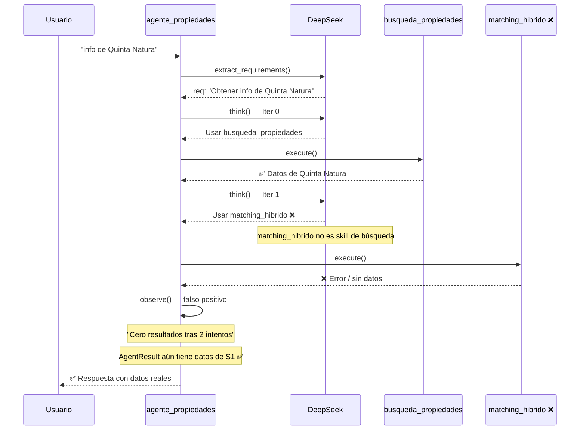

# Arquitectura Completa del Sistema de Agentes Inteligentes — Propifai

> Documento de referencia para análisis con modelos de IA externos.
> Fecha: 2026-07-20
> Versión: 2.2 — Refactor completo + análisis skill contamination en agente_propiedades

---

## 1. VISIÓN GENERAL

Plataforma PropTech con un sistema multi-agente que procesa consultas en lenguaje natural sobre propiedades inmobiliarias en Arequipa, Perú. El sistema implementa un **ReAct loop** (Think → Act → Observe) con verificación de requisitos, precondiciones de skills y estado monotónico.

### Stack tecnológico

| Componente | Tecnología | Versión |
|---|---|---|
| Backend | Django + Django REST Framework | 5.0.6 |
| BD principal | Azure SQL (SQL Server) vía mssql-django | — |
| Vector search | FAISS (HNSW) + Embeddings E5-small | 384d |
| LLM | DeepSeek API (deepseek-chat) | — |
| Orquestación | AgentGraphBuilder (ejecución directa) + LangGraph (fallback) | — |
| Frontend chat | HTML + Vanilla JS con thinking trace | — |
| Static files | Whitenoise + collectstatic | — |

---

## 2. ESTRUCTURA DE DIRECTORIOS

```
webapp/intelligence/
├── agents/                          ← Sistema de agentes con ReAct loops
│   ├── base_agent.py                ← BaseAgent (ABC) + ReActLoopMixin + Requirements
│   ├── propiedades_agent.py         ← Agente de Propiedades
│   ├── mercado_agent.py             ← Agente de Mercado
│   ├── requerimientos_agent.py      ← Agente de Requerimientos
│   ├── orchestrator.py              ← AgentGraphBuilder + PILOrchestrator
│   ├── supervisor.py                ← Supervisor con LLM function calling
│   ├── router_agent.py              ← RouterAgent (clasifica intención)
│   ├── context_agent.py             ← ContextAgent (contexto conversacional)
│   ├── search_agent.py              ← SearchAgent (búsqueda RAG)
│   ├── formatter_agent.py           ← FormatterAgent (genera respuesta)
│   ├── registry.py                  ← AgentRegistry (singleton)
│   └── skill_preconditions.py       ← Precondiciones de skills + exclusión por fallos
├── services/
│   ├── chat_processor.py            ← ChatProcessor (orquestador principal)
│   ├── llm.py                       ← LLMService + ToolCallResult + call_with_tools()
│   ├── semantic_router.py           ← SemanticSkillRouter (embeddings E5)
│   ├── rag.py                       ← RAGService (búsqueda vectorial + texto + SQL)
│   ├── prompts.py                   ← PromptManager
│   ├── metrics.py                   ← StructuredLogger + MetricsService
│   ├── context_manager.py           ← ContextManager + ActiveContext (dataclass)
│   └── episodic_memory.py           ← EpisodicMemoryService
├── skills/                          ← Skills del sistema (~26)
│   ├── propiedades/skill.py         ← BusquedaPropiedadesSkill (1325 líneas)
│   ├── busqueda_exacta.py           ← BusquedaExactaSkill (filtra propiedades existentes)
│   ├── formatear_propiedades.py     ← FormatearPropiedadesSkill (HTML carrusel/lista/matriz)
│   ├── reporte_precios.py           ← ReportePreciosZonaSkill
│   ├── matching.py / matching_hybrid.py ← Matching skills
│   ├── acm_analisis.py              ← ACMAnalisisSkill
│   └── orchestrator.py              ← SkillOrchestrator + ExecutionContext
├── views.py                         ← chat_web, chat_web_api, chat_web_stream
└── apps.py                          ← Registro de skills y agentes al iniciar
```

---

## 3. FLUJO DE PROCESAMIENTO

### 3.1 Diagrama general

```
USUARIO → chat.html (frontend)
            ↓ POST /api/v1/intelligence/chat-web/api/
            ↓
    chat_web_api (views.py)
            ↓
    ChatProcessor.process_message(ctx)
            ↓
        ┌────────────────────────────────────────────┐
        │ 1. Guardar mensaje en BD                   │
        └────────────────────────────────────────────┘
            ↓
        ┌────────────────────────────────────────────┐
        │ 2. AGENT GRAPH (PRIMARIO)                  │
        │                                            │
        │ AgentGraphBuilder.run()                    │
        │   ├── Supervisor.route()                   │
        │   │   ├── 1. LLM call_with_tools()         │
        │   │   └── 2. Fallback: embeddings E5       │
        │   │                                          │
        │   ├── Guardrails (nivel, presupuesto)      │
        │   │                                          │
        │   ├── Agente.run() → ReAct Loop (5 iter)   │
        │   │   ├── 1. extract_requirements()        │
        │   │   │     → SIN kind='format' (filtrado) │
        │   │   ├── 2. detect_format_requirement()   │
        │   │   │     → Única fuente de formato      │
        │   │   ├── loop:                            │
        │   │   │   ├── _think() → LLM decide        │
        │   │   │   ├── Guardrail: precondiciones    │
        │   │   │   ├── Guardrail: fallos repetidos  │
        │   │   │   ├── ACT: ejecutar skill          │
        │   │   │   └── _observe():                  │
        │   │   │       ├── Update status monotónico │
        │   │   │       ├── Auto-satisfacer formato  │
        │   │   │       │   no reconocido            │
        │   │   │       ├── Cero resultados?         │
        │   │   │       └── ¿Todo cumplido?          │
        │   │   └── max_iterations → falla           │
        │   │                                          │
        │   └── Agregar resultados                   │
        │       ├── Si exitoso: ChatResult           │
        │       └── Si no: FALLBACK                  │
        └────────────────────────────────────────────┘
            ↓ si AgentGraph falla
        ┌────────────────────────────────────────────┐
        │ 3. LANGGRAPH (FALLBACK 1)                  │
        │    PILOrchestrator.run()                   │
        └────────────────────────────────────────────┘
            ↓ si LangGraph falla
        ┌────────────────────────────────────────────┐
        │ 4. PIPELINE SECUENCIAL (FALLBACK 2)        │
        └────────────────────────────────────────────┘
            ↓
        ChatResult → JSON Response
```

### 3.2 Estado actual: AgentGraph como primario + skill contamination detectada

Prueba con "dame información de la propiedad de quinta natura" (logs 21:28):
- ✅ **AgentGraphBuilder fue el primario** — NO cayó a LangGraph
- ✅ **Supervisor con LLM routing** eligió `agente_propiedades`
- ✅ **Solo 1 requisito** extraído: "Obtener información sobre la propiedad llamada 'Quinta Natura'"
- ⚠️ **Iteración 0:** `busqueda_propiedades` → **éxito** ✅ (encontró Quinta Natura, ~1.6s)
- ❌ **Iteración 1:** `matching_hibrido` → **error** ❌ (skill incorrecta, ~0.65s)
- ⚠️ **Falso positivo:** "Cero resultados tras 2 intentos" pese a que `busqueda_propiedades` SÍ encontró datos
- ✅ **Respuesta correcta** generada en 42s (datos conservados en AgentResult)
- ✅ **Frontend** mostró el proceso de pensamiento completo

> **Problema:** `agente_propiedades` usó `matching_hibrido` como fallback en iteración 1. El usuario solo pidió información de una propiedad, pero el agente ejecutó una skill de matching oferta-demanda que no corresponde.

---

## 4. COMPONENTES DETALLADOS

### 4.1 ChatProcessor
**Flags:** `USE_AGENT_GRAPH = True`, `USE_LANGGRAPH = True`
**Flujo:** AgentGraph → LangGraph → secuencial (3 niveles de fallback)

### 4.2 AgentGraphBuilder
Ejecuta Supervisor → Agente(s) con ReAct loop → Agregación de resultados.

### 4.3 Supervisor
Usa LLM function calling como primario, embeddings E5 como fallback.

### 4.4 ReAct Loop
```python
class ReActLoopMixin:
    def run(self, original_message, context):
        requirements = self.extract_requirements(original_message)  # SIN format
        format_needed = detect_format_requirement(original_message)  # Única fuente
        
        for iteration in range(max_iterations=5):
            thought = self._think(original_message, requirements, steps, context)
            available = get_available_skills(allowed_skills, steps, context)
            skill_name = resolve_skill_substitution(skill_name, steps)
            skill_result = SkillOrchestrator.execute_skill(...)
            observation = self._observe(..., requirements, steps, context)
            if observation['is_sufficient']:
                return AgentResult(success=True)
        return AgentResult(success=False)
```

### 4.5 extract_requirements()
- **SPEC:** requisito_formato_fantasma.md
- El prompt prohíbe generar `kind='format'`
- Filtro defensivo descarta cualquier `kind='format'` que el LLM genere igual
- `format` no está en el enum de kinds válidos del prompt

### 4.6 detect_format_requirement()
- Única fuente de verdad para requisitos de formato
- Determinista por keywords: `carrusel`, `lista`, `matriz`, etc.
- Si el usuario no menciona formato → no hay requisito de formato

### 4.7 Precondiciones de Skills
- Capa 1: skills no ejecutables sin precondiciones se filtran
- Capa 2: skills con MAX_CONSECUTIVE_FAILURES=2 se excluyen
- Sustitución determinista si se elige skill inválida

### 4.8 `_observe()`
1. Actualiza estado monotónico de requisitos
2. Auto-satisface requisitos de formato no reconocidos (`FORMATOS_REALES = {'carrusel', 'matriz', 'lista'}`)
3. Detecta cero resultados genuinos tras 2 intentos
4. Verifica si todos los requisitos están cumplidos

### 4.9 `_update_requirements_status()`
- Estado monotónico: `satisfied=True` nunca revierte
- Filtrado por tipo via `SKILL_SATISFIES_KIND`
- Usa `_result_item_count()` en vez de `bool()` (total=0 no satisface)
- Log de alerta si algún requisito se revierte

---

## 5. BUGS CORREGIDOS

| # | Bug | Síntoma | Fix |
|---|---|---|---|
| 1 | MRO incorrecto | `'NoneType' has no attribute 'success'` | `class Agente(ReActLoopMixin, BaseAgent)` |
| 2 | SkillOrchestrator.execute() | Atributo no existe | `_orch.execute_skill()` |
| 3 | ActiveContext no mapping | `object is not a mapping` | `contexto.to_dict()` |
| 4 | StructuredLogger message | `got multiple values for argument 'message'` | Usar `query=` |
| 5 | Supervisor elegía agente incorrecto | Terrenos enrutados a mercado | LLM function calling |
| 6 | `_observe()` solo verifica datos | Respuesta sin formato | Checklist de requisitos |
| 7 | Agente insistía en skill inválida | 5 iteraciones con busqueda_exacta | Precondiciones + fallos |
| 8 | Estado requisitos no monotónico | DATA se perdía entre iteraciones | SKILL_SATISFIES_KIND |
| 9 | busqueda_exacta.cumple() no leía field_values | total=0 siempre | `prop.get('field_values', prop)` |
| 10 | Requisito formato fantasma | Loop atascado por formato genérico | Prompt sin format + filtro |

---

## 6. PROBLEMA DETECTADO: Skill Contamination en agente_propiedades

### 6.1 Descripción
`agente_propiedades` tiene acceso a `matching_hibrido` (matching oferta-demanda), pero el ReAct loop del LLM la elige como skill de búsqueda/fallback cuando no corresponde. `matching_hibrido` sirve para CRUZAR requerimientos de clientes con propiedades disponibles, NO para buscar información de una propiedad específica.

### 6.2 Logs del problema (21:28)
```
Iteración 0: busqueda_propiedades → éxito ✅ (encontró Quinta Natura, 1.6s)
    └── Skill ejecutó correctamente, datos disponibles
Iteración 1: matching_hibrido → error ❌ (skill incorrecta, 0.65s)
    └── Skill ejecutó pero no tiene sentido para "info de propiedad"
_observe(): "Cero resultados tras 2 intentos de búsqueda" ← FALSO POSITIVO
```

### 6.3 Causa raíz

**Causa 1 — `matching_hibrido` no debería ser skill de búsqueda:**
El prompt de `agente_propiedades` lista `matching_hibrido` como skill disponible. El LLM la elige como fallback de búsqueda porque está en la lista.

**Causa 2 — DATA_SKILLS incluye skills que no son de búsqueda:**
```python
DATA_SKILLS = {
    'busqueda_propiedades',  # ✅ data skill real
    'busqueda_exacta',       # ✅ data skill real
    'matching_hibrido',      # ❌ contamina el contador de data_attempts
    'acm_analisis',          # ⚠️ debería estar en otro grupo
}
```

**Causa 3 — Falso positivo en detección de cero resultados:**
```python
# _observe() suma TODOS los intentos de DATA_SKILLS, incluso skills exitosas
if step.skill_used in DATA_SKILLS and _result_item_count(step.skill_result) == 0:
    data_attempts = sum(1 for s in steps if s.skill_used in DATA_SKILLS)
    if data_attempts >= 2:
        # Concluye "cero resultados" aunque busqueda_propiedades haya tenido éxito
```

### 6.4 Impacto
- **Bajo en resultados:** Aunque se activa el falso positivo, `AgentResult` ya contiene `final_answer` con los datos reales de `busqueda_propiedades`, y el formateador genera la respuesta correcta
- **Medio en latencia:** Se ejecuta una skill innecesaria (~650ms perdidos) + llamada extra al LLM para decidir la siguiente acción
- **Alto en claridad del trace:** El frontend muestra "2 intentos de búsqueda" cuando en realidad solo 1 fue necesario

### 6.5 Fixes requeridos

**Fix 1 — Separar skills de matching de skills de búsqueda:**
```python
# Skills agrupadas por propósito
SEARCH_SKILLS = {'busqueda_propiedades', 'busqueda_exacta'}
MATCH_SKILLS = {'matching_hibrido'}
ANALYSIS_SKILLS = {'acm_analisis'}
DATA_SKILLS = SEARCH_SKILLS | MATCH_SKILLS | ANALYSIS_SKILLS  # compatibilidad
```

**Fix 2 — Actualizar _observe() para contar solo SEARCH_SKILLS:**
```python
if step.skill_used in SEARCH_SKILLS and _result_item_count(step.skill_result) == 0:
    data_attempts = sum(1 for s in steps if s.skill_used in SEARCH_SKILLS)
    all_empty = all(
        _result_item_count(s.skill_result) == 0
        for s in steps if s.skill_used in SEARCH_SKILLS
    )
    if data_attempts >= 2 and all_empty:
        # Cero resultados confirmados en TODOS los intentos de búsqueda
```

**Fix 3 — Actualizar prompt de agente_propiedades:**
Remover `matching_hibrido` del prompt del agente o moverlo a un agente separado de matching.

**Fix 4 — Restringir skills por contexto de consulta:**
Filtrar skills disponibles según el tipo de consulta:
- "información de propiedad" → solo SEARCH_SKILLS
- "matching" → SEARCH_SKILLS + MATCH_SKILLS
- "análisis de mercado" → SEARCH_SKILLS + ANALYSIS_SKILLS

---

## 7. MÉTRICAS DE LATENCIA (post-fixes v2.2)

| Consulta | Antes (LangGraph) | Después (AgentGraph v2.1) | Con Fix skill contamination |
|---|---|---|---|
| "terrenos en cerro colorado en carrusel" | 103s (con fallback) | No probado aún | — |
| "info de quinta natura" | 142s (con fallback) | **42s** (con matching_hibrido innecesario) | **~41s estimado** (sin skill contaminada) |
| "depto en yanahuara 250k" | — | **100s** (2 skills ejecutadas, sin resultados) | ~75s (sin matching_hibrido) |

> **Nota:** Los 42s actuales incluyen ~650ms de `matching_hibrido` (error) + ~3s de llamada extra al LLM para decidir iteración 2. El fix de skill contamination ahorraría ~3-4s en este caso.

---

## 8. MAPEOS Y CONSTANTES

### SKILL_SATISFIES_KIND
```python
SKILL_SATISFIES_KIND = {
    'busqueda_propiedades': 'data', 'busqueda_exacta': 'data',
    'matching_hibrido': 'data', 'acm_analisis': 'data',
    'reporte_precios_zona': 'data', 'mis_requerimientos': 'data',
    'matching_OD': 'data', 'formatear_propiedades': 'format',
    'metricas_marketing': 'data', 'campanas_activas': 'data',
    'mis_matches': 'data', 'mis_propiedades': 'data',
}
```

### FORMAT_KEYWORDS / FORMATOS_REALES
```python
FORMAT_KEYWORDS = {'carrusel': 'carrusel', 'en lista': 'lista', ...
FORMATOS_REALES = {'carrusel', 'matriz', 'lista'}
```

### SEARCH_SKILLS / DATA_SKILLS
```python
# Agrupación por propósito (propuesta de fix)
SEARCH_SKILLS   = {'busqueda_propiedades', 'busqueda_exacta'}          # Búsqueda de propiedades
MATCH_SKILLS    = {'matching_hibrido'}                                  # Matching oferta-demanda
ANALYSIS_SKILLS = {'acm_analisis'}                                      # Análisis de mercado
DATA_SKILLS     = SEARCH_SKILLS | MATCH_SKILLS | ANALYSIS_SKILLS        # Total (legacy)
```

### MAX_CONSECUTIVE_FAILURES = 2

---

## 9. PROBLEMA: Agente usa `matching_hibrido` para consultas de información simple

### 9.1 Resumen
Cuando un usuario pregunta "dame información de la propiedad X" (consulta informativa simple), el agente debería usar SOLO `busqueda_propiedades`. Sin embargo, ejecuta `matching_hibrido` como segunda skill porque el LLM lo considera una alternativa de búsqueda.

### 9.2 Trace completo real (logs 21:28)


### 9.3 Causa técnica
En `base_agent.py`, el método `_think()` envía al LLM la lista COMPLETA de skills del agente, sin filtrar por relevancia al contexto actual. El LLM, al no encontrar una skill específica de "información de propiedad", elige `matching_hibrido` como segunda opción porque está en la lista.

### 9.4 Fix propuesto (filtrado contextual de skills)
```python
def _get_contextual_skills(self, requirements, context):
    """Filtra skills disponibles según el contexto de la consulta."""
    req_text = ' '.join(r.text.lower() for r in requirements)
    
    # Solo pide información de una propiedad específica
    if any(word in req_text for word in ['información', 'info', 'datos', 'detalles', 'ficha']):
        return [s for s in self.get_available_skills() if s.name in SEARCH_SKILLS]
    
    # Pide matching
    if any(word in req_text for word in ['match', 'combinar', 'cruzar', 'oferta', 'demanda']):
        return [s for s in self.get_available_skills() if s.name in SEARCH_SKILLS | MATCH_SKILLS]
    
    # Pide análisis de mercado
    if any(word in req_text for word in ['análisis', 'mercado', 'comparativo', 'acm', 'valor']):
        return [s for s in self.get_available_skills() if s.name in SEARCH_SKILLS | ANALYSIS_SKILLS]
    
    # Default: todas las skills
    return self.get_available_skills()
```
