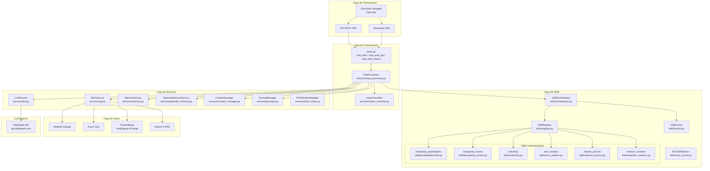
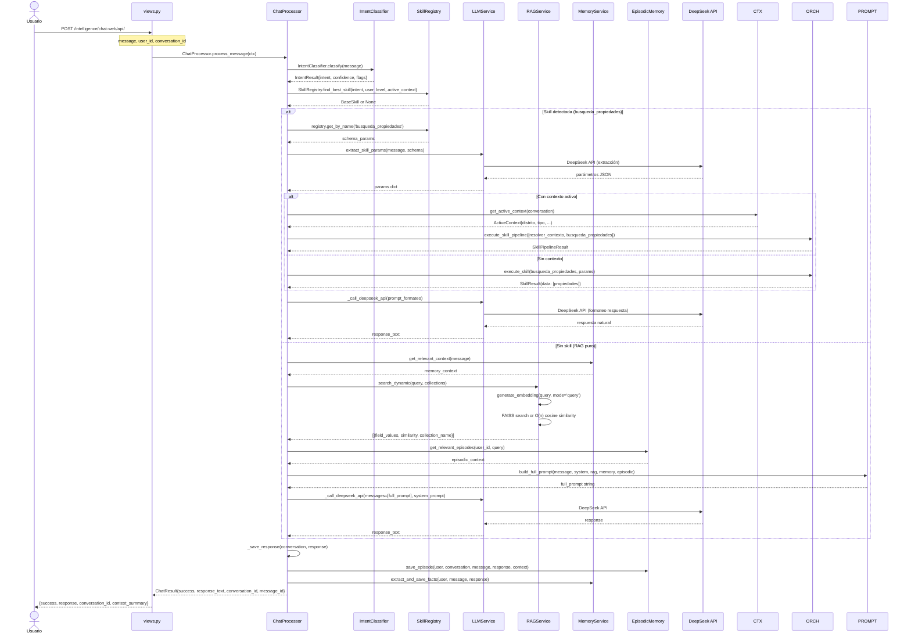
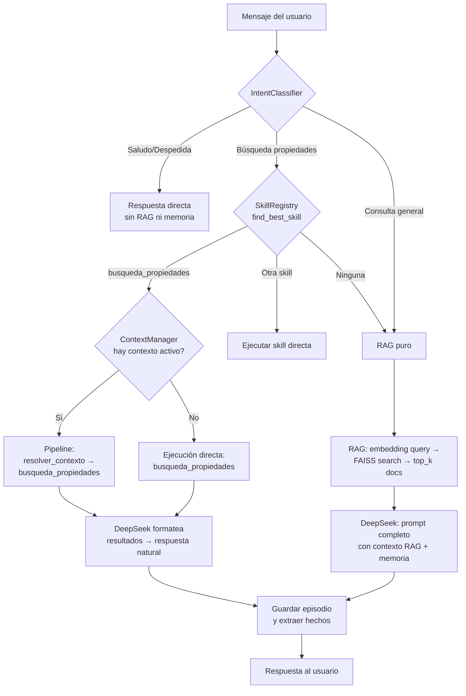
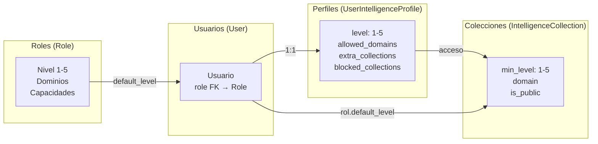
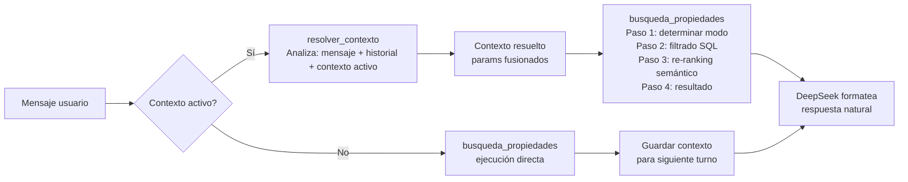

# ARQUITECTURA DEL SISTEMA DE INTELIGENCIA — PROPSIFAI (PROMETEO)

> **App Django:** `intelligence/`
> **URL base:** `/intelligence/`
> **Chat Web:** [`/intelligence/chat-web/`](webapp/intelligence/urls.py:53)
> **Última actualización:** Mayo 2026

---

## 1. VISIÓN GENERAL

El sistema de inteligencia de Propifai es un **chatbot inmobiliario RAG** (Retrieval Augmented Generation) que combina:

- **DeepSeek API** como LLM principal
- **Búsqueda semántica vectorial** con embeddings `multilingual-e5-large` (1024 dimensiones)
- **Índice FAISS HNSW** para búsqueda O(log n)
- **Sistema de Skills** modular para ejecutar acciones específicas (búsqueda de propiedades, matching, ACM)
- **Memoria episódica** para recordar interacciones pasadas
- **Memoria de hechos** (triples sujeto-relación-objeto) para datos del usuario
- **Flujos de conversación** guiados (workflows tipo n8n)
- **Dashboard de administración** con monitoreo de consumo IA, métricas y configuración

---

## 2. ARQUITECTURA EN CAPAS



---

## 3. FLUJO COMPLETO DEL CHAT

### 3.1. Diagrama de secuencia



### 3.2. Pipeline de decisión



---

## 4. COMPONENTES DETALLADOS

### 4.1. [`ChatProcessor`](webapp/intelligence/services/chat_processor.py) — Orquestador Central

| Aspecto | Detalle |
|---|---|
| **Ubicación** | [`services/chat_processor.py`](webapp/intelligence/services/chat_processor.py) |
| **Clase** | `ChatProcessor` — métodos de clase (`@classmethod`) |
| **Dataclass input** | [`ChatContext`](webapp/intelligence/services/chat_processor.py:65) — user, message, conversation, flags, skills, collections |
| **Dataclass output** | [`ChatResult`](webapp/intelligence/services/chat_processor.py:52) — success, response_text, conversation_id, metadata |
| **Métodos clave** | `process_message()` (síncrono), `process_message_stream()` (generador) |

**Flujo interno de `process_message()`:**
1. Guarda mensaje del usuario en la conversación
2. Clasifica intención ([`IntentClassifier`](webapp/intelligence/services/intent_classifier.py))
3. Si hay `skill_pipeline` explícito → lo ejecuta
4. Si hay `flow_name` o flujo activo → procesa flujo conversacional
5. Si hay `skill_name` explícita → ejecuta esa skill
6. Intenta inferir skill ([`_infer_skill_request`](webapp/intelligence/services/chat_processor.py:750)) → usa [`SkillRegistry.find_best_skill()`](webapp/intelligence/skills/registry.py:173)
7. Si no hay skill → obtiene memoria + RAG + episodios → construye prompt → llama DeepSeek
8. Post-procesamiento: guarda episodio, extrae hechos

### 4.2. [`IntentClassifier`](webapp/intelligence/services/intent_classifier.py)

| Aspecto | Detalle |
|---|---|
| **Tipo** | Clasificador basado en reglas + keywords (sin LLM) |
| **Clase** | `IntentClassifier` — métodos de clase |
| **Output** | `IntentResult{intent, confidence, extracted_params, flags}` |
| **Intenciones** | 12 tipos: `GREETING`, `FAREWELL`, `THANKS`, `PROPERTY_SEARCH`, `PRICE_QUERY`, `USER_INFO`, `MARKET_QUERY`, `LEGAL_QUERY`, `PROJECT_QUERY`, `AGENT_QUERY`, `HELP`, `GENERAL` |
| **Flags** | `skip_rag`, `skip_memory`, `skip_episodic`, `requires_rag`, `requires_memory` |

Optimiza el pipeline: si es saludo, no gasta recursos en RAG ni memoria.

### 4.3. Sistema RAG — [`RAGService`](webapp/intelligence/services/rag.py)

| Aspecto | Detalle |
|---|---|
| **Modelo de embeddings** | `intfloat/multilingual-e5-large` (1024 dimensiones) |
| **Prefijos** | `"query: "` para búsquedas, `"passage: "` para documentos |
| **Índice vectorial** | FAISS HNSW (búsqueda O(log n)) |
| **Caché** | LRU para embeddings de consultas frecuentes (max 100) |
| **Fallback** | Búsqueda por texto con keywords (stop words filtradas) |
| **Umbral similitud** | `RAG_SIMILARITY_THRESHOLD` (default 0.2) |
| **Método principal** | [`search_dynamic(query, collection_names, filters, top_k, profile)`](webapp/intelligence/services/rag.py:1675) |

**Pipeline de búsqueda híbrida:**
1. Genera embedding de la query (modo `query`)
2. Filtra colecciones por perfil de inteligencia del usuario
3. Aplica pre-filtrado en SQL (JSONField lookups) si hay filtros
4. Si no hay filtros → FAISS HNSW search (O(log n))
5. Si FAISS no disponible → O(n) cosine similarity
6. Si resultados insuficientes → fallback de texto por keywords

**Sincronización de colecciones:**
- [`sync_collection_dynamic()`](webapp/intelligence/services/rag.py:1112) — ejecuta SQL fuente, genera embeddings, resuelve FK
- [`sync_collection()`](webapp/intelligence/services/rag.py:432) — versión legacy
- Resolución de FK: consulta tablas referenciadas y agrega nombres reales al `field_values`

### 4.4. [`LLMService`](webapp/intelligence/services/llm.py) — Integración DeepSeek

| Aspecto | Detalle |
|---|---|
| **API** | `https://api.deepseek.com/chat/completions` |
| **Modelo** | `deepseek-chat` |
| **Max tokens** | `DEEPSEEK_MAX_TOKENS` (default 2000) |
| **Temperatura** | `DEEPSEEK_TEMPERATURE` (default 0.1) |
| **Streaming** | Soportado vía SSE |
| **Logging** | `AIConsumptionLog` — registro de cada llamada con tokens, costo, duración |

**Métodos clave:**
- [`_call_deepseek_api()`](webapp/intelligence/services/llm.py:67) — llamada base con auto-detección de caller
- [`generate_rag_response()`](webapp/intelligence/services/llm.py:579) — RAG + skill integration
- [`generate_streaming_response()`](webapp/intelligence/services/llm.py:954) — streaming SSE
- [`extract_skill_params()`](webapp/intelligence/services/llm.py:456) — extrae parámetros estructurados con DeepSeek
- [`analyze_query_intent()`](webapp/intelligence/services/llm.py:837) — análisis de intención vía LLM
- [`extract_structured_data()`](webapp/intelligence/services/llm.py:898) — extracción estructurada de datos

### 4.5. Sistema de Skills

#### 4.5.1. Arquitectura

```mermaid
graph LR
    subgraph "SkillRegistry (singleton)"
        REG[SkillRegistry]
        SK1[busqueda_propiedades]
        SK2[busqueda_exacta]
        SK3[matching]
        SK4[acm_analisis]
        SK5[reporte_precios]
        SK6[resolver_contexto]
        SK7[clasificar_intencion_whatsapp]
    end
    
    subgraph "SkillOrchestrator"
        ORCH[SkillOrchestrator]
        CACHE[SkillCache]
    end
    
    subgraph "BaseSkill Contrato"
        BS[BaseSkill<br/>abstract class]
        REQ[name, description, category, access_level]
        MET[execute(), validate_params()]
    end
    
    BS --> SK1
    BS --> SK2
    BS --> SK3
    BS --> SK4
    BS --> SK5
    BS --> SK6
    BS --> SK7
    
    REG --> ORCH
    ORCH --> CACHE
    
    CHAT[ChatProcessor] --> ORCH
    MCP[MCPSkillServer] --> ORCH
```

#### 4.5.2. Skills Implementadas

| Skill | Archivo | Categoría | Descripción |
|---|---|---|---|
| [`busqueda_propiedades`](webapp/intelligence/skills/propiedades/skill.py) | `skills/propiedades/skill.py` | búsqueda | Búsqueda híbrida SQL + semántica de propiedades |
| [`busqueda_exacta`](webapp/intelligence/skills/busqueda_exacta.py) | `skills/busqueda_exacta.py` | búsqueda | Búsqueda exacta por SQL directo |
| [`matching`](webapp/intelligence/skills/matching.py) | `skills/matching.py` | crm | Matching oferta-demanda |
| [`acm_analisis`](webapp/intelligence/skills/acm_analisis.py) | `skills/acm_analisis.py` | reporte | Análisis Comparativo de Mercado |
| [`reporte_precios`](webapp/intelligence/skills/reporte_precios.py) | `skills/reporte_precios.py` | reporte | Reporte de precios por zona |
| [`resolver_contexto`](webapp/intelligence/skills/resolver_contexto.py) | `skills/resolver_contexto.py` | custom | Resuelve referencias ambiguas del contexto conversacional |
| [`clasificar_intencion_whatsapp`](webapp/intelligence/skills/clasificar_intencion_whatsapp.py) | `skills/clasificar_intencion_whatsapp.py` | custom | Clasifica intención de mensajes WhatsApp |

#### 4.5.3. SkillRegistry — Selección de Skill

El [`SkillRegistry`](webapp/intelligence/skills/registry.py) usa un sistema de **score semántico** basado en tokens:

1. Extrae tokens relevantes (≥3 caracteres) del mensaje del usuario
2. Detecta si hay palabras clave del dominio inmobiliario (300+ keywords)
3. Calcula coincidencia de tokens contra la descripción de cada skill
4. Aplica bonus por nombre de skill, categoría y detección de seguimiento (B4)
5. Si el mejor score supera el umbral (`MIN_CONFIDENCE_THRESHOLD` = 0.25), retorna esa skill

**Detección de seguimiento (B4):** Si hay contexto activo y el mensaje no tiene keywords propias, asume continuación de la búsqueda anterior.

#### 4.5.4. SkillOrchestrator

El [`SkillOrchestrator`](webapp/intelligence/skills/orchestrator.py) coordina la ejecución con:

- Validación de existencia y permisos
- Cache inteligente (Redis + local LRU)
- Ejecución secuencial y paralela de pipelines
- Persistencia en `SkillExecution` (para dashboard)
- Métricas de ejecución

#### 4.5.5. SkillCache

El [`SkillCache`](webapp/intelligence/skills/cache.py) tiene doble backend:
- **Redis** (primario) — conexión configurable vía URL
- **Local** (fallback) — diccionario LRU con TTL y limpieza automática

### 4.6. Memoria

#### 4.6.1. Memoria Episódica — [`EpisodicMemoryService`](webapp/intelligence/services/episodic_memory.py)

- Almacena interacciones completas (mensaje + respuesta + contexto)
- Clasifica por tipo: `property_search`, `price_inquiry`, `matching`, etc.
- Calcula puntuación de importancia (0.0-1.0)
- Recuperación por búsqueda semántica sobre el embedding del mensaje del usuario
- Feedback del usuario (thumbs up/down)

#### 4.6.2. Memoria de Hechos — [`MemoryService`](webapp/intelligence/services/memory.py)

- Almacena triples `sujeto-relación-objeto` (ej: "Carlos → busca → departamento en Cayma")
- Confianza ajustable (0.0-1.0)
- Extracción automática de hechos de las conversaciones
- Recuperación por relevancia contextual

#### 4.6.3. ContextManager — [`ContextManager`](webapp/intelligence/services/context_manager.py)

- Mantiene el **contexto activo de búsqueda** entre turnos de conversación
- Normaliza nombres de campo (distrito, tipo_propiedad, etc.)
- Fusión de contexto: hereda filtros del turno anterior + nuevos parámetros
- Fuente de verdad: `SkillExecution.parameters` (última ejecución exitosa) con fallback a `conversation.metadata`

### 4.7. Prompts — [`PromptManager`](webapp/intelligence/services/prompts.py)

| Aspecto | Detalle |
|---|---|
| **Almacenamiento** | `AppConfig.config['system_prompt']` en BD |
| **Modificable** | Desde dashboard, sin deploy |
| **Por app** | Cada app (`chat-web`, `dashboard-admin`) puede tener su propio prompt |
| **Fallback** | `DEFAULT_SYSTEM_PROMPT` si no hay config en BD |
| **Secciones** | `EPISODIC_MEMORY`, `USER_CONTEXT`, `SYSTEM_KNOWLEDGE`, `CURRENT_MESSAGE`, `ASSISTANT_RESPONSE` |

**Formateo de contexto:**
- [`format_rag_context()`](webapp/intelligence/services/prompts.py:259) — resultados RAG → sección "CONOCIMIENTO DEL SISTEMA"
- [`format_memory_context()`](webapp/intelligence/services/prompts.py:221) — hechos + conversaciones → sección "CONTEXTO DEL USUARIO"
- [`format_episodic_context()`](webapp/intelligence/services/prompts.py:213) — episodios relevantes → sección "INTERACCIONES ANTERIORES"

### 4.8. MCPSkillServer — Exposición MCP

El [`MCPSkillServer`](webapp/intelligence/skills/mcp_server.py) expone skills como herramientas MCP (Model Context Protocol), permitiendo que clientes externos (VS Code, Claude Desktop) usen las skills del sistema.

---

## 5. MODELOS DE DATOS

### 5.1. Modelos Principales

| Modelo | Tabla | Propósito |
|---|---|---|
| [`Role`](webapp/intelligence/models.py:30) | `intelligence_roles` | Roles con nivel (1-5), dominios y capacidades |
| [`User`](webapp/intelligence/models.py:78) | `intelligence_users` | Usuarios con username, password, rol |
| [`AppConfig`](webapp/intelligence/models.py:171) | `intelligence_app_configs` | Config de apps (nivel, capacidades, prompts) |
| [`Conversation`](webapp/intelligence/models.py:208) | `intelligence_conversations` | Sesiones de chat con mensajes JSON |
| [`Fact`](webapp/intelligence/models.py:249) | `intelligence_facts` | Hechos en triples (sujeto-relación-objeto) |
| [`IntelligenceCollection`](webapp/intelligence/models.py:297) | `intelligence_collections` | Colecciones vectoriales para RAG |
| [`IntelligenceDocument`](webapp/intelligence/models.py:411) | `intelligence_documents` | Documentos vectorizados con field_values |
| [`UserIntelligenceProfile`](webapp/intelligence/models.py:471) | `intelligence_user_profiles` | Perfil de inteligencia por usuario |
| [`EpisodicMemory`](webapp/intelligence/models.py:550) | `intelligence_episodic_memory` | Memoria episódica de interacciones |
| [`ConversationFlow`](webapp/intelligence/models.py:679) | `intelligence_conversation_flows` | Flujos conversacionales (workflows) |
| [`ConversationFlowState`](webapp/intelligence/models.py:734) | `intelligence_conversation_flow_states` | Estado de flujo por conversación |
| [`SkillExecution`](webapp/intelligence/models.py:787) | `intelligence_skill_execution` | Registro de ejecuciones de skills |
| [`AIConsumptionLog`](webapp/intelligence/models.py:826) | (managed) | Consumo de API DeepSeek (tokens, costo) |

### 5.2. Estructura de Colecciones RAG

Colecciones por defecto:

| Colección | Tabla Origen | Nivel | Pública | Propósito |
|---|---|---|---|---|
| `propiedades_propifai` | `propifai_propiedad` | 1 | Sí | Portfolio propio |
| `propiedades_competencia` | `ingestas_propiedadraw` | 2 | No | Propiedades de competencia |
| `noticias_mercado` | `market_news` | 3 | No | Noticias (pendiente) |

Cada documento almacena:
- `field_values` (JSON): todos los campos de la tabla con nombres reales
- `embedding` (BinaryField): vector de 1024 floats (multilingual-e5-large)
- `content_hash` (SHA256): para detectar cambios en sync
- FK resueltos: campos como `district_name` se agregan automáticamente

---

## 6. ENDPOINTS DEL CHAT

| Endpoint | Método | Propósito |
|---|---|---|
| [`chat-web/`](webapp/intelligence/urls.py:53) | GET | Renderiza template del chat |
| [`chat-web/api/`](webapp/intelligence/urls.py:54) | POST | API síncrona (usa `ChatProcessor.process_message`) |
| [`chat-web/stream/`](webapp/intelligence/urls.py:55) | POST | API streaming SSE (usa `ChatProcessor.process_message_stream`) |
| [`chat-web/upload/`](webapp/intelligence/urls.py:56) | POST | Subida de archivos al chat |

**Formato de request (API síncrona):**
```json
{
  "user_id": "uuid",
  "message": "Busco departamentos en Cayma",
  "conversation_id": "uuid (opcional)",
  "use_memory": true,
  "use_rag": true,
  "collections": ["propiedades_propifai"],
  "skill_name": null,
  "skill_params": {},
  "flow_name": null
}
```

**Formato de response:**
```json
{
  "success": true,
  "conversation_id": "uuid",
  "message_id": "uuid",
  "response": "Tengo disponibles...",
  "metadata": { ... },
  "context_summary": {
    "memory_used": 0,
    "rag_used": 5,
    "collections_used": ["propiedades_propifai"],
    "intent": "busqueda_propiedades",
    "intent_confidence": 0.85
  },
  "timestamp": "2026-05-29T10:00:00"
}
```

---

## 7. SISTEMA DE NIVELES Y PERMISOS



**Niveles de acceso:**
1. **Nivel 1** — Consulta básica (colecciones públicas)
2. **Nivel 2** — Consulta avanzada (colecciones internas)
3. **Nivel 3** — Análisis (datos estratégicos)
4. **Nivel 4** — Edición (modificar datos)
5. **Nivel 5** — Administración total

---

## 8. CONFIGURACIÓN Y MONITOREO

### 8.1. Variables de Entorno

| Variable | Default | Propósito |
|---|---|---|
| `DEEPSEEK_API_KEY` | — | API key de DeepSeek |
| `DEEPSEEK_MAX_TOKENS` | 2000 | Máximo de tokens por respuesta |
| `DEEPSEEK_TEMPERATURE` | 0.1 | Temperatura del modelo |
| `RAG_SIMILARITY_THRESHOLD` | 0.2 | Umbral de similitud para búsqueda |
| `RAG_MAX_RESULTS` | 10 | Máximo de resultados RAG |
| `RAG_BATCH_SIZE` | 100 | Batch size para sync |
| `RAG_EMBEDDING_CACHE_SIZE` | 100 | Tamaño de caché de embeddings |
| `RAG_ENABLE_TEXT_FALLBACK` | true | Fallback de texto cuando vectorial no encuentra |

### 8.2. Dashboards Disponibles

| Ruta | Propósito |
|---|---|
| `/intelligence/` | Dashboard general del sistema |
| `/intelligence/chat-web/` | Chat web interactivo |
| `/intelligence/skills/dashboard/` | Dashboard de skills |
| `/intelligence/skills/metrics/` | Métricas de skills |
| `/intelligence/skills/logs/` | Logs de ejecución de skills |
| `/intelligence/episodic-memory/` | Memoria episódica |
| `/intelligence/consumo-ia/` | Consumo de IA (tokens, costo) |
| `/intelligence/config/` | Configuración del sistema |
| `/intelligence/errors/` | Errores del sistema |

---

## 9. PATRONES Y CONVENCIONES

### 9.1. Patrón de Pipeline para Búsqueda de Propiedades

Cuando se detecta la skill `busqueda_propiedades`:



### 9.2. Datos Curiosos de la Arquitectura

- **No hay tareas Celery** para el chat — todo es síncrono (el streaming usa generadores Python)
- **Singleton para el modelo de embeddings** — se carga lazy (primera búsqueda) con lock para evitar concurrencia
- **SkillRegistry es singleton** — se mantiene en memoria entre requests
- **Los prompts son modificables desde BD** — `AppConfig.config['system_prompt']`, sin deploy
- **El chat crea usuarios anónimos** automáticamente si no hay sesión
- **FAISS se reconstruye después de cada sync** de colección
- **Cada llamada a DeepSeek se registra** en `AIConsumptionLog` con tokens y costo estimado

---

## 10. ARCHIVOS CLAVE

| Archivo | Propósito |
|---|---|
| [`webapp/intelligence/`](webapp/intelligence/) | App Django completa |
| [`urls.py`](webapp/intelligence/urls.py) | ~25 endpoints registrados |
| [`views.py`](webapp/intelligence/views.py) | ~4000 líneas, todas las vistas |
| [`models.py`](webapp/intelligence/models.py) | ~940 líneas, 14 modelos |
| [`services/chat_processor.py`](webapp/intelligence/services/chat_processor.py) | Orquestador central (~1918 líneas) |
| [`services/rag.py`](webapp/intelligence/services/rag.py) | Sistema RAG completo (~1943 líneas) |
| [`services/llm.py`](webapp/intelligence/services/llm.py) | Integración DeepSeek API (~1065 líneas) |
| [`services/prompts.py`](webapp/intelligence/services/prompts.py) | Gestión de prompts (~457 líneas) |
| [`services/intent_classifier.py`](webapp/intelligence/services/intent_classifier.py) | Clasificador de intención (~446 líneas) |
| [`services/context_manager.py`](webapp/intelligence/services/context_manager.py) | Contexto activo de búsqueda (~330 líneas) |
| [`skills/registry.py`](webapp/intelligence/skills/registry.py) | Registro y selección de skills (~452 líneas) |
| [`skills/orchestrator.py`](webapp/intelligence/skills/orchestrator.py) | Orquestador de skills (~605 líneas) |
| [`skills/base.py`](webapp/intelligence/skills/base.py) | Clase base abstracta para skills (~185 líneas) |
| [`skills/cache.py`](webapp/intelligence/skills/cache.py) | Cache inteligente con Redis (~400 líneas) |
| [`skills/propiedades/skill.py`](webapp/intelligence/skills/propiedades/skill.py) | Skill de búsqueda híbrida (~595 líneas) |
