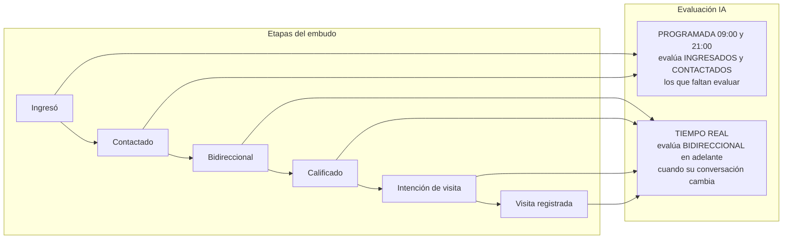
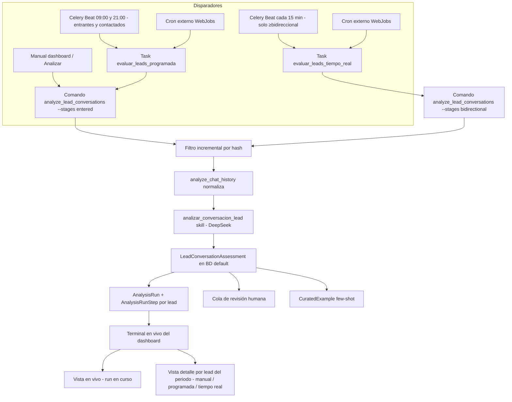
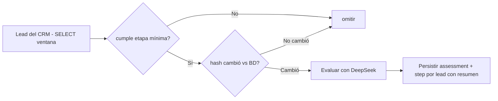

# Plan: Evaluación de leads por IA — tiempo real (≥bidireccional) + programada (entrantes/contactados) 09:00–21:00

> Prometeo · `lead_intelligence` · BD `default` (propiextractor). El CRM se lee solo con SELECT.
> Objetivo: **dos canales de evaluación por IA** con cobertura completa del embudo:
> (1) **tiempo real** para leads que ya pasaron la etapa bidireccional (se
> re-evalúan al instante **solo cuando su conversación cambia**) y (2)
> **programada 09:00 y 21:00** para leads **entrantes y contactados** (los que
> aún no alcanzaron bidireccional y por eso "faltan evaluar"). La **terminal del
> dashboard muestra al detalle cada evaluación individual por lead** de ambos
> canales.

### Regla de oro: nunca re-evaluar sin cambios

En **ambos** canales se aplica el mismo principio: **un lead ya evaluado con la
misma versión del motor solo se re-evalúa si su conversación cambió**. La
comparación se hace por `history_hash` (hash determinista del `chat_history`):

- Si el hash actual **==** al hash ya evaluado en `LeadConversationAssessment`
  (misma `analysis_version`) → **SKIP** (no se llama a DeepSeek, no se crea step
  nuevo, no se gasta).
- Si el hash cambió (mensaje nuevo, editado, reordenado) → **se re-evalúa** y se
  persiste el nuevo assessment + un step por lead en la terminal.

Esto hace que el canal de tiempo real sea barato y lógico: el barrido de cada
15 min solo dispara DeepSeek sobre los leads ≥bidireccional **que efectivamente
cambiaron**, no sobre todos.

---

## 1. Modelo mental (dos canales, un embudo)



**Lógica de por qué:**

- **Entrantes y contactados** son la etapa temprana; la mayoría aún no respondió
  ni mostró interés. No vale la pena gastar DeepSeek en tiempo real sobre ellos;
  se evalúan **2 veces al día (09:00 y 21:00)** para no dejar ninguno sin
  cobertura y detectar cuándo pasan a bidireccional.
- **Bidireccionales en adelante** ya demostraron interés; **cada cambio** en su
  conversación se re-evalúa **en tiempo real** (barrido frecuente o disparo por
  cambio), y **solo si el hash de la conversación cambió** (incremental).

---

## 2. Contexto y estado actual

Ya existe el comando `analyze_lead_conversations` que:

- Trae leads del CRM con `_lead_result_rows` (SELECT sobre `dbo.lead`).
- Normaliza el chat con `analyze_chat_history` (calcula `contacted`,
  `bidirectional`, `qualified`, `visit_intent`, `unattended`...).
- Evalúa con DeepSeek (`analizar_conversacion_lead` skill) y persiste
  `LeadConversationAssessment` en la BD `default`.
- **Ya es incremental** por `conversation_hash`/`history_hash` (no reevalúa sin
  cambios, salvo `--force`).

Modelos existentes (clave para la terminal):

- `AnalysisRun` (BD `default`): una corrida, con `run_type`
  (`incremental|daily|manual`), contadores, `started_at/completed_at`.
- `AnalysisRunStep` (BD `default`): **un paso por lead** (`lead_id`, `status`,
  `message`, `created_at`) → ya da el detalle individual por lead.
- `analysis_progress_api`: devuelve el run en curso + sus steps (terminal viva).

Lo que falta:

1. **Canal programado con el filtro correcto** (entrantes/contactados).
2. **Canal tiempo real** para ≥bidireccional por cambio.
3. **Terminal con detalle por lead** de ambos canales (no solo contadores).

---

## 3. Decisiones de arquitectura

### D1. Broker Celery y ejecución (crítico)

**Estado actual:** `CELERY_BROKER_URL` = `memory://` (sin Redis),
`CELERY_BEAT_SCHEDULER = DatabaseScheduler`, `startup.sh` no arranca worker/beat.
Con `memory://` y sin worker/beat, una tarea programada **no corre sola**.

- **Opción A — Celery Beat real (recomendada):** Redis (Azure Cache for Redis)
  como broker + worker/beat en `startup.sh`; `beat_schedule` con
  `crontab(hour="9,21", minute=0)` para la programada y una entrada de alta
  frecuencia (p. ej. cada 15 min) para el tiempo real.
- **Opción B — Sin broker nuevo:** comando reutilizable disparado por cron
  externo (Azure WebJobs) a las 09:00 y 21:00 (+ cada 15 min para tiempo real).

**Recomendación:** implementar ambos (el comando es la pieza reutilizable) y
registrar tareas + beat_schedule; el cron externo queda como respaldo.

### D2. Comando reutilizable (aditivo, sin regresión)

Flags nuevos en `analyze_lead_conversations` (defaults preservan lo actual):

- `--stages` (default `entered`; `entered|contacted|bidirectional|qualified|visit_intent`):
  filtra por la **etapa mínima** a evaluar.
  - Programada: `--stages entered` → evalúa entrantes y contactados (todo el
    rango temprano).
  - Tiempo real: `--stages bidirectional` → solo ≥bidireccional.
- `--lookback-hours N` (default 0): cuando > 0, filtra en Python las rows por
  `entered_at >= now - N horas`. No toca la SQL.
- El incremental por hash ya es el default.

Usos:
```
# Programada 09:00 y 21:00 — entrantes y contactados recientes
analyze_lead_conversations --stages entered --lookback-hours 24 --workers 2

# Tiempo real — solo ≥bidireccional que cambió
analyze_lead_conversations --stages bidirectional --lookback-hours 6 --workers 2
```

### D3. Terminal consolidada con detalle por lead

Hoy `analysis_progress_api` muestra **un solo run**. Para ver el detalle de cada
evaluación individual por lead de **ambos canales**, se añade un **modo
histórico**:

- **Fuente:** `AnalysisRunStep` (por lead) unido a `AnalysisRun` (`run_type`,
  `started_at`). Cada fila = una evaluación individual de un lead.
- **API (`analysis_progress_api`):** modo en vivo intacto + modo histórico
  (`hist=1` con `from`/`to`) que devuelve los steps de todos los runs del periodo
  con `run_type` y `run_started_at`.
- **Template:** sección "Evaluaciones por lead del periodo": tabla con
  `Tipo` (Manual / Programada / Tiempo real), hora, `lead_id`, `status`,
  `message`; filtros "solo programadas" y "solo tiempo real". La terminal en vivo
  se mantiene con chip Manual/Programada/Tiempo real.
- Se enriquece el `message` del step con un resumen del assessment
  (p. ej. `qualified=confirmed · visit=confirmed`) para que el detalle sea útil.

---

## 4. Compatibilidad y seguridad (NO romper otras funcionalidades)

| Pieza a tocar | Dependencias existentes | Riesgo | Mitigación |
|---|---|---|---|
| `analyze_lead_conversations.py` | `run_analysis` (dashboard), `tasks.py`, uso manual | **Alto** | Flags nuevos con defaults que preservan comportamiento actual; `--stages` default `entered` |
| `_lead_result_rows` | `services.py` (4 usos), 2 comandos más | **Alto** | **NO modificar**; filtro por etapa y lookback en Python dentro del comando |
| `tasks.analizar_conversaciones_lead` | `run_analysis` view | **Alto** | **NO modificar**; crear tareas NUEVAS `evaluar_leads_programada` y `evaluar_leads_tiempo_real` |
| `AnalysisRun.RunType` | dashboard historial | Bajo | Usar `DAILY` para programada; `INCREMENTAL` para tiempo real |
| `AnalysisRunStep.message` | comando actual | Bajo | Añadir resumen del assessment al mensaje (campo ya existe) |
| `conversation_analysis.analyze_chat_history` | muchos callers | **Alto** | **NO modificar** |
| `analysis_progress_api` | terminal actual del dashboard | Medio | Cambios aditivos: respuesta en vivo igual + modo histórico; no romper campos del JS actual |
| `analysis_quality_dashboard.html` | dashboard existente | Medio | Añadir sección de detalle por lead sin tocar contadores ni terminal actual |

**Regla general:** cambios **aditivos**; el dashboard manual (`--from/--to`) y el
JS de la terminal actual siguen funcionando igual.

---

## 5. Arquitectura



Flujo de decisión por lead dentro del comando:



---

## 6. Cambios por archivo

### 6.1 `webapp/lead_intelligence/management/commands/analyze_lead_conversations.py`
- `add_arguments`: añadir `--stages` (default `entered`) y `--lookback-hours`
  (int, default 0).
- `handle`: si `--lookback-hours > 0`, `date_from = now - N horas`, `date_to =
  now`; filtrar rows en Python por `entered_at` (sin tocar `_lead_result_rows`).
- `_process_row`: aplicar filtro de etapa mínima (`_min_stage_ok(stage, row)`).
- Enriquecer `message` del step con resumen del assessment.
- `run_type`: `DAILY` cuando `--stages entered` + lookback; `INCREMENTAL`
  cuando `--stages bidirectional`; si no `MANUAL`.

### 6.2 `webapp/lead_intelligence/tasks.py`
- Nueva tarea `evaluar_leads_programada(lookback_hours=24, stages="entered")`.
- Nueva tarea `evaluar_leads_tiempo_real(lookback_hours=6, stages="bidirectional")`.
- **No tocar** la tarea existente.

### 6.3 `webapp/colas/celery.py`
- Añadir `from celery.schedules import crontab`.
- `beat_schedule`:
  - `'evaluar-entrantes-contactados-09-21'`: `crontab(hour="9,21", minute=0)`,
    queue `analisis`, kwargs `{"lookback_hours": 24, "stages": "entered"}`.
  - `'evaluar-bidireccionales-tiempo-real'`: `crontab(minute="*/15")`,
    queue `analisis`, kwargs `{"lookback_hours": 6, "stages": "bidirectional"}`.

### 6.4 `webapp/lead_intelligence/views.py` (`analysis_progress_api`)
- Mantener el modo en vivo actual intacto.
- Añadir modo histórico (`hist=1` + `from`/`to`): steps de todos los runs del
  periodo con `run_type` y `run_started_at`.
- `analysis_quality_dashboard`: pasar `runs` con `run_type` y el flag de filtro.

### 6.5 `webapp/lead_intelligence/templates/lead_intelligence/analysis_quality_dashboard.html`
- Terminal en vivo: chip Manual/Programada/Tiempo real en el run en curso.
- Sección "Evaluaciones por lead del periodo": tabla con `Tipo`, hora, `lead_id`,
  `status`, `message`; filtros "solo programadas" y "solo tiempo real".
- Historial de corridas: columna "Tipo" (run_type).

### 6.6 `webapp/settings.py`
- Ya lee `CELERY_BROKER_URL` de env. Definir la variable en `.env` si Redis.

### 6.7 `startup.sh` (solo Opción A)
- Arrancar worker + beat antes de `exec gunicorn`, o App Service dedicado.

### 6.8 Tests (`webapp/lead_intelligence/tests.py`)
- Filtro `--stages`: entrante/contactado con `entered` → se evalúa; con
  `bidirectional` → se omite; bidireccional/calificado/visita con
  `bidirectional` → se evalúa.
- `--lookback-hours`: filtra ventana sin romper flujo de fechas.
- Incremental por hash: no reevalúa sin cambios (regresión).
- `analysis_progress_api`: modo histórico devuelve steps con run_type; modo en
  vivo intacto.

---

## 7. Verificación

1. `analyze_lead_conversations --stages entered --lookback-hours 24 --dry-run`
   → lista entrantes y contactados recientes, sin gastar DeepSeek.
2. `analyze_lead_conversations --stages bidirectional --lookback-hours 6 --dry-run`
   → solo ≥bidireccional.
3. Corrida real pequeña → assessments + steps por lead con resumen; repetir sin
   cambios → todos `skipped`.
4. Dashboard: terminal en vivo (Manual/Programada/Tiempo real) + sección
   "Evaluaciones por lead del periodo" con detalle individual y filtros.
5. **No regresión:** resumen, calidad-motor, análisis manual siguen igual.

---

## 8. Riesgos y notas

- **Coste IA**: el tiempo real solo evalúa ≥bidireccional con hash cambiado; la
  programada solo entrantes/contactados recientes. Coste por lead con
  `trace_id="lead:{id}"`.
- **Redis**: sin broker real, la programación y el tiempo real requieren cron
  externo (Opción B).
- **`memory://`**: no hay persistencia de cola en producción actual.
- **`date_entry` vs último mensaje**: `--lookback-hours` usa la fecha de entrada;
  para "conversación que cambió hoy" de un lead viejo hace falta `last_message_at`
  (dirty flags, fase 2).
- Regla de negocio: no tocar `dbpropify_be` (solo SELECT).

---

## 9. Roadmap

1. **Fase 1 (esta iteración):** filtros en el comando (`--stages` + lookback),
   dos tareas Celery, beat_schedule, terminal consolidada por lead (detalle
   individual + filtros) + tests. Todo aditivo, sin regresión.
2. **Fase 2 (si aplica):** tabla "dirty" para marcar leads con cambios y
   procesar solo esos (tiempo real más fino que barrido).
3. **Fase 3 (infra):** decisión Redis + worker/beat en `startup.sh` (o cron externo).
