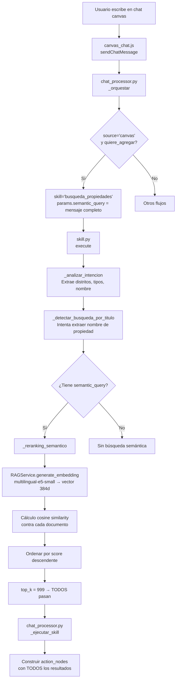

# Lógica Completa de Búsqueda Semántica en Propifai

> **Propósito:** Documentar TODO el flujo desde que el usuario escribe "agrega CABAÑA MARIA al lienzo" hasta que se agregan nodos al canvas.
> **Fecha:** Julio 2026

---

## 1. ARQUITECTURA GENERAL



---

## 2. FLUJO DETALLADO (ARCHIVO POR ARCHIVO)

### A. Frontend: canvas_chat.js

**Archivo:** `webapp/canvas/static/canvas/js/canvas_chat.js`

```javascript
// Lo que envía al backend:
fetch('/api/v1/intelligence/chat-web/api/', {
  body: JSON.stringify({
    message: "agrega CABAÑA MARIA al lienzo",
    metadata: {
      source: 'canvas',
      lienzo_id: 123,
      canvas_context: { propiedades: [...], requerimientos: [...] }
    }
  })
})
```

### B. Orquestador: chat_processor.py

**Archivo:** `webapp/intelligence/services/chat_processor.py`

```python
def _orquestar(cls, ctx):
    es_canvas = ctx.metadata.get('source') == 'canvas'
    mensaje_lower = ctx.message.lower()  # "agrega cabaña maria al lienzo"
    
    # Detectar palabras de acción
    INTENCION_AGREGAR = ['agrega', 'añade', 'pon', ...]
    quiere_agregar = any(p in mensaje_lower for p in INTENCION_AGREGAR)
    
    if es_canvas and quiere_agregar:
        return OrchestrationDecision(
            skill='busqueda_propiedades',
            params={
                'semantic_query': ctx.message,  # ← "agrega CABAÑA MARIA al lienzo"
                'modo_retorno': 'accion_agregar',  # ← indica que es para canvas
            }
        )
```

🔴 **Problema #1:** Se pasa el mensaje COMPLETO como `semantic_query`, incluyendo palabras de acción ("agrega", "al", "lienzo") que NO deberían buscarse.

### C. Skill de Búsqueda: skill.py

**Archivo:** `webapp/intelligence/skills/propiedades/skill.py`

#### Paso 1: execute()

```python
def execute(self, params, context):
    semantic_query = params.get('semantic_query')  # "agrega CABAÑA MARIA al lienzo"
    
    # 1. Analizar intención del mensaje
    filtros_auto = self._analizar_intencion(semantic_query)
    # Busca: distritos, tipos de propiedad, operaciones, y nombre de propiedad
    
    # 2. Si detectó nombre de propiedad, usarlo como semantic_query
    titulo_clean = params.get('titulo_contains')  # "cabaña maria"
    if titulo_clean:
        semantic_query = titulo_clean  # ← SOLO SI logra extraer el nombre
```

🔴 **Problema #2:** Si `_detectar_busqueda_por_titulo` NO logra extraer el nombre (ej: "las orquideas" por el bug de STOP words), `titulo_contains` es `None` y el `semantic_query` sigue siendo el mensaje completo con ruido.

#### Paso 2: _analizar_intencion()

```python
def _analizar_intencion(self, mensaje):
    mensaje_lower = mensaje.lower().strip()
    filtros = {}
    
    # Detectar distritos (Cayma, Yanahuara, etc.)
    for distrito in self.DISTRITOS_AREQUIPA:
        if distrito in mensaje_lower:
            filtros['distrito'] = distrito.title()
    
    # Detectar tipos (casa, departamento, terreno)
    ...
    
    # Detectar nombre de propiedad
    titulo_busqueda = self._detectar_busqueda_por_titulo(mensaje_lower)
    if titulo_busqueda:
        filtros['titulo_contains'] = titulo_busqueda
```

#### Paso 3: _detectar_busqueda_por_titulo() — EL PUNTO CRÍTICO

```python
def _detectar_busqueda_por_titulo(self, mensaje_lower):
    # ESTRATEGIA 1: Buscar DESPUÉS de frases clave
    # Ej: "agrega la propiedad de las orquideas"
    #     → extrae después de "propiedad de "
    FRASES_CLAVE = ['propiedad de ', 'propiedad llamada ', ...]
    for frase in FRASES_CLAVE:
        if frase in mensaje_lower:
            resto = mensaje_lower[idx:].strip()  # "las orquideas"
            for p in resto.split():
                if p_clean in STOP:
                    break  # ← BUG: "las" está en STOP → break → no extrae nada
                palabras.append(p_clean)
    
    # ESTRATEGIA 2: Detectar "cabaña X", "edificio X", etc.
    PREFIJOS_NOMBRE = ['cabaña', 'casona', 'edificio', ...]
    for prefijo in PREFIJOS_NOMBRE:
        if prefijo in mensaje_lower:
            extraer_siguiente_palabra()  # "cabaña maria"
    
    return None  # ← Si ninguna estrategia funciona
```

🔴 **Problema #3 (YA CORREGIDO):** STOP words como "las", "los", "el" rompían la extracción. Ahora se SALTAN (continue) en lugar de romper (break).

🔴 **Problema #4 (ACENTOS CORREGIDO):** "maría" (con acento) no matcheaba con "maria" (sin acento) en la búsqueda textual. Ahora se normaliza con NFKD.

🔴 **Problema #5 (PENDIENTE):** Si ninguna estrategia funciona, no hay Estrategia 3 de respaldo.

#### Paso 4: Búsqueda en BD

```python
# Si hay filtros exactos (distrito, tipo, precio):
if tiene_filtros_exactos:
    documentos = self._filtrar_por_sql(params, colecciones)
else:
    # Sin filtros: TODOS los documentos con embedding
    documentos = [(doc, 0.5) for doc in
        IntelligenceDocument.objects.filter(embedding__isnull=False)]
    # ← 147 documentos si no hay filtros
```

#### Paso 5: Re-ranking Semántico

```python
if tiene_semantica and documentos:
    documentos = self._reranking_semantico(documentos, semantic_query)
    # Genera embedding de "agrega la propiedad de las orquideas" (con ruido)
    # Calcula cosine similarity contra cada documento
    # Ordena por score descendente
```

**Archivo:** `webapp/intelligence/services/rag.py` (generate_embedding)

```python
@classmethod
def generate_embedding(cls, text, mode='query'):
    # Modelo: intfloat/multilingual-e5-small (384 dimensiones)
    # Prefijo: "query: " para búsquedas, "passage: " para documentos
    prefixed = f"{'query' if mode == 'query' else 'passage'}: {text}"
    # → "query: agrega la propiedad de las orquideas"
    # → El embedding incluye TODO el ruido conversacional
    tokens = tokenizer(prefixed, return_tensors='pt', ...)
    with torch.no_grad():
        embedding = model(**tokens).pooler_output
    return embedding.numpy().tobytes()
```

🔴 **Problema #6:** El embedding de "query: agrega la propiedad de las orquideas" incluye "agrega la propiedad de" que NO existe en ningún título de propiedad. La similitud semántica se DILUYE.

#### Paso 6: Top-K (SIN LÍMITE REAL)

```python
top_k = params.get('top_k') or 999  # ← Default 999 = sin límite
if len(documentos) > top_k:
    documentos = documentos[:top_k]
```

🔴 **Problema #7:** No hay `top_k` configurado desde el canvas. Default 999 = todas las propiedades pasan. No hay umbral de similitud mínima.

---

## 3. ¿POR QUÉ FALLA CADA CASO?

| Mensaje del usuario | ¿Qué espera? | ¿Qué pasa? | Causa |
|---|---|---|---|
| "agrega CABAÑA MARIA" | Solo Cabaña María | ✅ Funciona (con acentos fix) | Estrategia 2 detecta "cabaña" + "maria" |
| "agrega la propiedad de las orquideas" | Solo Las Orquídeas | ❌ 147 propiedades | Estrategia 1 se rompía en "las" (STOP) — **CORREGIDO** |
| "agrega las orquideas" (sin "propiedad de") | Solo Las Orquídeas | ❌ 147 propiedades | Ninguna estrategia detecta el nombre + embedding con ruido |
| "busca departamento en Cayma" | Departamentos en Cayma | ✅ | `_analizar_intencion` detecta distrito + tipo |
| "agrega propiedad en Jose Luis Bustamante" | Props en JLB | ❌ variable | Embedding diluido con ruido |

---

## 4. SOLUCIONES PROPUESTAS

### Corrección A (YA APLICADA): Normalización de acentos NFKD
**Dónde:** `skill.py` líneas ~560-605
**Qué hace:** Normaliza acentos (í→i, é→e, ó→o, ú→u, ñ→n) en la búsqueda textual por nombre.
**Para quién:** Cabaña María, Pérez, Corazón, González, etc.

### Corrección B (YA APLICADA): STOP_SKIP en lugar de STOP_BREAK
**Dónde:** `skill.py` líneas ~340-367
**Qué hace:** Los artículos (el, la, los, las, un, una, de, y) se SALTAN, no rompen la extracción.
**Para quién:** "Las Orquideas", "Los Olivos", "El Mirador", "La Campiña"

### Corrección C (PENDIENTE): Limpiar ruido del semantic_query ANTES del embedding
**Dónde:** `skill.py` en `execute()` ANTES de `_reranking_semantico()`
**Qué hace:** Quitar palabras de acción/contexto del `semantic_query` antes de generar el embedding.
**Para quién:** CUALQUIER consulta en lenguaje natural desde el canvas.

```python
PALABRAS_RUIDO = {
    'agrega', 'agregue', 'añade', 'pon', 'mételo', 'trae',
    'busca', 'encuentra', 'muestra', 'lista', 'quiero',
    'al', 'el', 'la', 'los', 'las', 'en', 'de', 'para', 'por',
    'lienzo', 'canvas', 'propiedad', 'propiedades',
    'favor', 'gracias', 'hola',
}

# "agrega la propiedad de las orquideas" → "orquideas"
# "pon CABAÑA MARIA al lienzo" → "CABAÑA MARIA"
```

### Corrección D (PENDIENTE): Umbral de similitud semántica
**Dónde:** `skill.py` después de `_reranking_semantico()`
**Qué hace:** Filtrar documentos con cosine similarity < 0.25 (configurable).
**Para quién:** Evita que propiedades irrelevantes se agreguen al canvas.

```python
UMBRAL_SIMILITUD = 0.25  # Cosine similarity mínimo
documentos = [(d, s) for d, s in documentos if s >= UMBRAL_SIMILITUD]
```

---

## 5. MAPA DE ARCHIVOS

```
webapp/
├── intelligence/
│   ├── skills/
│   │   └── propiedades/
│   │       └── skill.py          ← ★ BÚSQUEDA SEMÁNTICA PRINCIPAL
│   │                              execute(), _reranking_semantico(),
│   │                              _analizar_intencion(),
│   │                              _detectar_busqueda_por_titulo()
│   ├── services/
│   │   ├── rag.py                ← RAGService.generate_embedding()
│   │   │                           search_dynamic()
│   │   ├── faiss_index.py        ← FAISSIndexManager (índice HNSW)
│   │   ├── chat_processor.py     ← ChatProcessor (orquestador)
│   │   │                           _orquestar(), _ejecutar_skill()
│   │   ├── llm.py                ← LLMService (DeepSeek API)
│   │   └── prompts.py            ← PromptManager
│   └── models.py                 ← IntelligenceCollection,
│                                   IntelligenceDocument
└── canvas/
    └── static/canvas/js/
        └── canvas_chat.js        ← Frontend del chat canvas
```

---

## 6. DIAGNÓSTICO: QUÉ FALLA Y POR QUÉ

| # | Problema | Archivo | Línea | Gravedad |
|---|----------|---------|-------|----------|
| 1 | `semantic_query` incluye ruido conversacional | `chat_processor.py` | ~724 | 🔴 Alta |
| 2 | `_detectar_busqueda_por_titulo` sin Estrategia 3 | `skill.py` | ~384 | 🔴 Alta |
| 3 | Sin umbral de similitud mínima en re-ranking | `skill.py` | ~535 | 🔴 Alta |
| 4 | STOP words rompían extracción de nombre | `skill.py` | ~356 | ✅ Corregido |
| 5 | Acentos/ñ no normalizados en búsqueda textual | `skill.py` | ~580 | ✅ Corregido |
| 6 | `top_k` default = 999 (sin límite real) | `skill.py` | ~538 | 🟠 Media |
| 7 | `modo_retorno='accion_agregar'` sin top-K propio | `chat_processor.py` | ~1062 | 🟠 Media |

---

*Documento generado para diagnóstico del sistema de búsqueda semántica de Propifai.*
