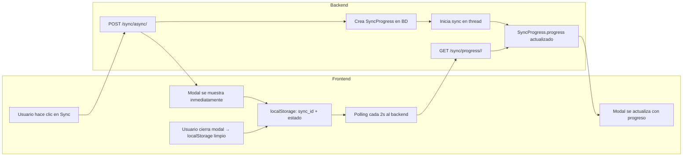
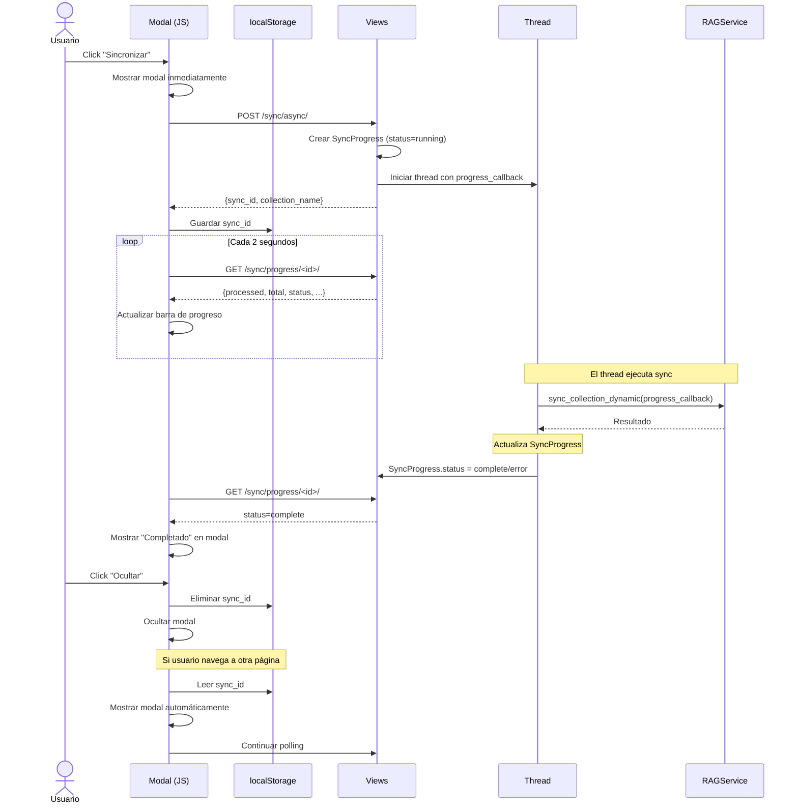

# PLAN: Modal de Progreso de Sincronización con Persistencia

> **Objetivo:** Mostrar una ventana modal con el progreso de sincronización de colecciones RAG, que persista al navegar entre páginas hasta que el usuario la cierre.

---

## 1. ARQUITECTURA



## 2. COMPONENTES

### 2.1. Modelo: [`SyncProgress`](webapp/intelligence/models.py)

Nuevo modelo para tracking de progreso:

```python
class SyncProgress(models.Model):
    id = models.UUIDField(primary_key=True, default=uuid.uuid4)
    collection = models.ForeignKey(IntelligenceCollection, on_delete=models.CASCADE)
    status = models.CharField(max_length=20, choices=[
        ('running', 'Ejecutando'),
        ('complete', 'Completado'),
        ('error', 'Error'),
    ], default='running')
    total_records = models.IntegerField(default=0)
    processed = models.IntegerField(default=0)
    created = models.IntegerField(default=0)
    updated = models.IntegerField(default=0)
    errors = models.IntegerField(default=0)
    current_message = models.TextField(default='')
    started_at = models.DateTimeField(auto_now_add=True)
    completed_at = models.DateTimeField(null=True, blank=True)
    
    class Meta:
        db_table = 'intelligence_sync_progress'
```

### 2.2. Vista: Iniciar sync asíncrono

Nuevo endpoint en [`views.py`](webapp/intelligence/views.py):

```
POST /api/v1/intelligence/collections/<uuid>/sync/async/
```

- Crea registro [`SyncProgress`](webapp/intelligence/models.py)
- Inicia `sync_collection_dynamic` en un **thread** (vía `threading.Thread`)
- Retorna `{sync_id, collection_name}` inmediatamente
- El thread actualiza `SyncProgress` a medida que procesa

### 2.3. Vista: Consultar progreso

```
GET /api/v1/intelligence/collections/sync/progress/<uuid>/
```

- Retorna JSON con estado actual del [`SyncProgress`](webapp/intelligence/models.py)
- `{status, total_records, processed, created, updated, errors, percentage, current_message}`

### 2.4. Modificar [`sync_collection_dynamic`](webapp/intelligence/services/rag.py)

Agregar callback opcional para reportar progreso:

```python
@classmethod
def sync_collection_dynamic(cls, collection_name, force_full_sync=False, 
                            database_alias=None, progress_callback=None):
    ...
    for i, row in enumerate(rows):
        ...
        if progress_callback and i % 5 == 0:  # Cada 5 registros
            progress_callback({
                'processed': i + 1,
                'total': len(rows),
                'current_message': f'Procesando ID {source_id}...',
                'created': stats['created'],
                'updated': stats['updated'],
                'errors': stats['errors'],
            })
    ...
```

### 2.5. Frontend: Modal + localStorage

**Template:** Agregar modal en [`intelligence/base/base.html`](webapp/intelligence/templates/intelligence/base/base.html) (para que aparezca en todas las páginas de intelligence):

```html
<!-- Modal de Sincronización -->
<div class="sync-modal-overlay" id="syncModal" style="display:none;">
    <div class="sync-modal">
        <div class="sync-modal-header">
            <span>🔄 Sincronizando: <span id="syncCollectionName"></span></span>
            <button onclick="dismissSync()">✕</button>
        </div>
        <div class="sync-modal-body">
            <div class="sync-progress-bar">
                <div class="sync-progress-fill" id="syncProgressFill"></div>
            </div>
            <div class="sync-stats">
                <span>Procesados: <strong id="syncProcessed">0</strong>/<span id="syncTotal">0</span></span>
                <span>Creados: <strong id="syncCreated">0</strong></span>
                <span>Actualizados: <strong id="syncUpdated">0</strong></span>
                <span>Errores: <strong id="syncErrors">0</strong></span>
            </div>
            <div class="sync-message" id="syncMessage">Iniciando...</div>
        </div>
        <div class="sync-modal-footer">
            <button class="btn btn-sm" onclick="dismissSync()">Ocultar</button>
        </div>
    </div>
</div>
```

**JavaScript** (en [`intelligence/js/intelligence.js`](webapp/intelligence/static/intelligence/js/intelligence.js)):

```javascript
// Estado de sync en localStorage
const SYNC_STORAGE_KEY = 'propifai_sync_active';

function startSync(collectionId, collectionName) {
    // 1. Mostrar modal inmediatamente
    showSyncModal(collectionName);
    
    // 2. POST al backend
    fetch(`/api/v1/intelligence/collections/${collectionId}/sync/async/`, {
        method: 'POST',
        headers: {'Content-Type': 'application/json'},
        body: JSON.stringify({})
    })
    .then(r => r.json())
    .then(data => {
        // 3. Guardar en localStorage
        localStorage.setItem(SYNC_STORAGE_KEY, JSON.stringify({
            syncId: data.sync_id,
            collectionName: collectionName,
            startedAt: new Date().toISOString()
        }));
        // 4. Iniciar polling
        pollSyncProgress(data.sync_id);
    });
}

function pollSyncProgress(syncId) {
    const interval = setInterval(() => {
        fetch(`/api/v1/intelligence/collections/sync/progress/${syncId}/`)
        .then(r => r.json())
        .then(data => {
            updateSyncModal(data);
            if (data.status !== 'running') {
                clearInterval(interval);
                // Mantener modal pero marcar como completado/error
            }
        });
    }, 2000);
}

function showSyncModal(collectionName) {
    document.getElementById('syncCollectionName').textContent = collectionName;
    document.getElementById('syncModal').style.display = 'flex';
}

function updateSyncModal(data) {
    const pct = data.total > 0 ? (data.processed / data.total * 100) : 0;
    document.getElementById('syncProgressFill').style.width = pct + '%';
    document.getElementById('syncProcessed').textContent = data.processed;
    document.getElementById('syncTotal').textContent = data.total;
    document.getElementById('syncCreated').textContent = data.created;
    document.getElementById('syncUpdated').textContent = data.updated;
    document.getElementById('syncErrors').textContent = data.errors;
    document.getElementById('syncMessage').textContent = data.current_message;
}

function dismissSync() {
    document.getElementById('syncModal').style.display = 'none';
    localStorage.removeItem(SYNC_STORAGE_KEY);
}

// Al cargar página, verificar si hay sync activo
document.addEventListener('DOMContentLoaded', function() {
    const stored = localStorage.getItem(SYNC_STORAGE_KEY);
    if (stored) {
        const syncData = JSON.parse(stored);
        showSyncModal(syncData.collectionName);
        pollSyncProgress(syncData.syncId);
    }
});
```

### 2.6. Modificar botón de sync en templates

Cambiar el botón de sync en [`list.html`](webapp/intelligence/templates/intelligence/collections/list.html) y [`detail.html`](webapp/intelligence/templates/intelligence/collections/detail.html):

```html
<!-- Antes: -->
<a href="" class="btn btn-sm">🔄 Sinc.</a>

<!-- Después: -->
<button onclick="startSync('{{ collection.id }}','{{ collection.name }}')" class="btn btn-sm">
    🔄 Sincronizar
</button>
```

## 3. ARCHIVOS A MODIFICAR/CREAR

| Archivo | Cambio |
|---|---|
| [`models.py`](webapp/intelligence/models.py) | Agregar modelo `SyncProgress` |
| [`views.py`](webapp/intelligence/views.py) | Agregar `collection_sync_async` y `collection_sync_progress` |
| [`urls.py`](webapp/intelligence/urls.py) | Agregar 2 rutas nuevas |
| [`services/rag.py`](webapp/intelligence/services/rag.py) | Agregar parámetro `progress_callback` a `sync_collection_dynamic` |
| [`templates/intelligence/base/base.html`](webapp/intelligence/templates/intelligence/base/base.html) | Agregar HTML del modal |
| [`static/intelligence/js/intelligence.js`](webapp/intelligence/static/intelligence/js/intelligence.js) | Agregar JS de sync + localStorage |
| [`templates/intelligence/collections/list.html`](webapp/intelligence/templates/intelligence/collections/list.html) | Cambiar botón sync por `onclick` |
| [`templates/intelligence/collections/detail.html`](webapp/intelligence/templates/intelligence/collections/detail.html) | Cambiar botón sync por `onclick` |

## 4. FLUJO COMPLETO



## 5. CSS DEL MODAL

Estilo oscuro consistente con el tema GitHub:

```css
.sync-modal-overlay {
    position: fixed; top: 0; left: 0; right: 0; bottom: 0;
    background: rgba(0,0,0,0.6);
    display: flex; align-items: center; justify-content: center;
    z-index: 9999;
}
.sync-modal {
    background: var(--bg-card, #161b22);
    border: 1px solid var(--border-color, #30363d);
    border-radius: 8px;
    width: 480px; max-width: 90vw;
    box-shadow: 0 8px 32px rgba(0,0,0,0.4);
}
.sync-modal-header {
    display: flex; justify-content: space-between; align-items: center;
    padding: 16px 20px;
    border-bottom: 1px solid var(--border-color, #30363d);
    font-weight: 600; color: var(--text-primary, #c9d1d9);
}
.sync-progress-bar {
    height: 8px; background: var(--bg-primary, #0d1117);
    border-radius: 4px; overflow: hidden; margin: 16px 0;
}
.sync-progress-fill {
    height: 100%; background: var(--accent-blue, #58a6ff);
    border-radius: 4px; transition: width 0.3s ease; width: 0%;
}
```

## 6. RIESGOS

| Riesgo | Mitigación |
|---|---|
| Thread muere si el proceso de Django se reinicia | Usar Celery como mejora futura; por ahora el thread es suficiente |
| Múltiples syncs simultáneos para la misma colección | Validar en el endpoint: si ya hay un sync running, rechazar |
| localStorage lleno o deshabilitado | Catch exception y mostrar modal sin persistencia |
| El modal no aparece si JS está deshabilitado | El sync tradicional (redirect) se mantiene como fallback |

## 7. PRIORIDAD DE IMPLEMENTACIÓN

1. **Modelo** `SyncProgress` + migración
2. **Endpoint** `sync/async/` + thread
3. **Endpoint** `sync/progress/<id>/`
4. **Callback** en `sync_collection_dynamic`
5. **Modal HTML** en base template
6. **JavaScript** (polling + localStorage)
7. **Botones** en list.html y detail.html
8. **CSS** del modal
