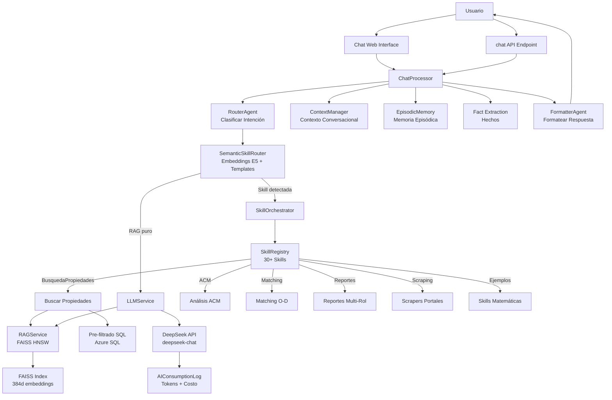

# Propifai Intelligence Layer (PIL) — Arquitectura Completa

> **Última actualización:** Julio 2026
> **App Django:** `webapp/intelligence/`
> **Base de datos:** Tablas con prefijo `intelligence_`
> **LLM Provider:** DeepSeek API (`deepseek-chat`)
> **Embedding Model:** `intfloat/multilingual-e5-small` (384 dimensiones, ~500MB RAM)
> **Vector Index:** FAISS HNSW (O(log n))

---

## Índice

1. [Visión General](#1-visión-general)
2. [Models (Datos)](#2-models-datos)
3. [Sistema de Agentes (LangGraph)](#3-sistema-de-agentes-langgraph)
4. [Sistema de Skills](#4-sistema-de-skills)
5. [Servicios Core](#5-servicios-core)
6. [RAG Pipeline](#6-rag-pipeline)
7. [Sistema Multi-Rol (Niveles 1-5)](#7-sistema-multi-rol-niveles-1-5)
8. [API Endpoints](#8-api-endpoints)
9. [Dashboard Web](#9-dashboard-web)
10. [Inicialización (apps.py)](#10-inicialización-appspy)
11. [Diagramas de Arquitectura](#11-diagramas-de-arquitectura)
12. [Flujo de Conversación Completo](#12-flujo-de-conversación-completo)

---

## 1. Visión General

PIL es el sistema de inteligencia artificial de Propifai. Arquitectura orientada a agentes con las siguientes capacidades:

- **Chat inteligente** con contexto conversacional y memoria episódica
- **Búsqueda semántica (RAG)** sobre propiedades, noticias, normativas
- **Ejecución de skills** (30+ skills registradas) para operaciones específicas
- **Routing semántico** de intenciones usando embeddings E5 + similitud coseno
- **Sistema multi-rol** con niveles de acceso 1-5 por usuario
- **Conversational Flows** (workflows estilo n8n para chat)
- **Scraping inteligente** de portales inmobiliarios (Urbania, Adondevivir, Remax, Properati)
- **Monitoreo de consumo** de API DeepSeek (tokens, costos)

---

## 2. Models (Datos)

### 2.1 Modelos de Usuario y Roles

| Modelo | Tabla | Propósito |
|--------|-------|-----------|
| [`Role`](webapp/intelligence/models.py:30) | `intelligence_roles` | Roles configurables con nivel (1-5), dominios permitidos y capacidades |
| [`User`](webapp/intelligence/models.py:78) | `intelligence_users` | Usuario PIL con username, password hasheada, phone, email |
| [`AppConfig`](webapp/intelligence/models.py:171) | `intelligence_app_configs` | Configuración de apps con nivel asignado |

**Role** tiene:
- `default_level` (1-5) — nivel base
- `max_level` (1-5) — nivel máximo alcanzable
- `default_domains` — dominios por defecto (`publico`, `legal`, `marketing`, `escuela`, `gerencia`, `ti`, `general`)
- `capabilities` — capacidades específicas (`memory`, `knowledge_base`, `metrics`, `projects`)

### 2.2 Modelos de Conversación y Memoria

| Modelo | Tabla | Propósito |
|--------|-------|-----------|
| [`Conversation`](webapp/intelligence/models.py:208) | `intelligence_conversations` | Sesiones de chat con mensajes, contexto activo |
| [`Fact`](webapp/intelligence/models.py:249) | `intelligence_facts` | Hechos extraídos (triples sujeto-relación-objeto) |
| [`EpisodicMemory`](webapp/intelligence/models.py:550) | `intelligence_episodic_memory` | Memoria episódica: eventos completos de interacción |
| [`ConversationFlow`](webapp/intelligence/models.py:679) | `intelligence_conversation_flows` | Flujos conversacionales guiados (workflows tipo n8n) |
| [`ConversationFlowState`](webapp/intelligence/models.py:734) | `intelligence_conversation_flow_states` | Estado actual de una conversación en un flujo |

**EpisodicMemory** almacena por episodio:
- `user_message` + `assistant_response` + `timestamp`
- `episode_type`: `property_search`, `property_detail`, `price_inquiry`, `matching`, `acm_analysis`, `general`, `fact_extraction`, `user_preference`
- `context` enriquecido: entidades, topics, sentimiento
- `rag_context_used`: colecciones consultadas, documentos recuperados
- `feedback` del usuario: thumbs up/down, comentario
- `latency_ms`, `importance_score`

### 2.3 Modelos RAG (Colecciones Vectoriales)

| Modelo | Tabla | Propósito |
|--------|-------|-----------|
| [`IntelligenceCollection`](webapp/intelligence/models.py:297) | `intelligence_collections` | Configuración de colecciones vectoriales |
| [`IntelligenceDocument`](webapp/intelligence/models.py:411) | `intelligence_documents` | Documentos vectorizados con embeddings |

**IntelligenceCollection** define:
- `table_name`: tabla origen en Azure SQL
- `source_sql`: query SQL para extraer datos
- `field_definitions`: schema completo de campos
- `embedding_fields`: qué campos se embeddean
- `display_fields`: campos a mostrar en resultados
- `filter_fields`: campos filtrables
- `min_level`: nivel mínimo de acceso
- `domain`: dominio funcional
- `table_relationships`: resolución de FK durante sync
- `semantic_tags`: etiquetas para mejorar embeddings
- `database_alias`: alias de conexión BD

### 2.4 Modelos de Ejecución y Monitoreo

| Modelo | Tabla | Propósito |
|--------|-------|-----------|
| [`SkillExecution`](webapp/intelligence/models.py:787) | `intelligence_skill_execution` | Registro de ejecución de skills |
| [`AIConsumptionLog`](webapp/intelligence/models.py:826) | — | Consumo de API DeepSeek |

**AIConsumptionLog** registra por llamada:
- `model_name`, `endpoint`, `caller_app`
- `prompt_tokens`, `completion_tokens`, `total_tokens`
- `estimated_cost_usd` (DeepSeek: $0.14/1M input, $0.28/1M output)
- `duration_ms`, `success`, `status_code`, `error_message`
- `calidad_extraccion_pct`, `input_summary`, `skill_name`, `campos_faltantes`

### 2.5 Perfiles de Inteligencia

| Modelo | Tabla | Propósito |
|--------|-------|-----------|
| [`UserIntelligenceProfile`](webapp/intelligence/models.py:471) | `intelligence_user_profiles` | Perfil por usuario con nivel, dominios, colecciones extra/bloqueadas |

**UserIntelligenceProfile.can_access_collection()**: verifica acceso por:
1. Bloqueo explícito → denegado
2. Nivel mínimo → denegado si no cumple
3. Colección pública → concedido
4. Colección extra → concedido
5. Dominio permitido → concedido

---

## 3. Sistema de Agentes (LangGraph)

Arquitectura del grafo de agentes:

```
RouterAgent → (ContextAgent)? → SearchAgent → FormatterAgent
```

### 3.1 RouterAgent

[`webapp/intelligence/agents/router_agent.py`](webapp/intelligence/agents/router_agent.py)

- **Propósito**: Clasifica la intención del usuario usando `SemanticSkillRouter`
- **Input**: `state['message']`
- **Output**: `state['skill_detectada']`, `state['score_routing']`, `state['threshold']`
- **Flujo**:
  1. Obtener router singleton (con templates pre-calculados)
  2. `router.classify(message)` → `RoutingResult`
  3. Si `accepted=True` y `skill_name` no es `None` → skill detectada
  4. Si no → RAG puro

### 3.2 SearchAgent

[`webapp/intelligence/agents/search_agent.py`](webapp/intelligence/agents/search_agent.py)

- **Propósito**: Ejecuta búsqueda RAG con FAISS + SQL pre-filtering
- **Input**: `state['message']`, `state['skill_detectada']`, `state['params_extraidos']`
- **Output**: `state['resultados_busqueda']`, `state['filtros_aplicados']`
- **Flujo**:
  1. Si skill = `matching_hibrido` → delega en `HybridMatchingSkill`
  2. Determinar colecciones según la skill
  3. Extraer parámetros del mensaje (tipo propiedad, distrito, presupuesto)
  4. Construir filtros SQL
  5. `RAGService.search_dynamic()` con pre-filtrado

### 3.3 FormatterAgent

[`webapp/intelligence/agents/formatter_agent.py`](webapp/intelligence/agents/formatter_agent.py)

- **Propósito**: Formatea resultados de búsqueda para respuesta al usuario
- **Input**: `state['resultados_busqueda']`
- **Output**: `state['respuesta_formateada']`
- **Funciones**:
  - `format_property_results()`: formato estructurado de propiedades
  - `format_market_analysis()`: formato de análisis de mercado
  - `format_general_results()`: formato genérico

### 3.4 ContextAgent

[`webapp/intelligence/agents/context_agent.py`](webapp/intelligence/agents/context_agent.py)

- **Propósito**: Resuelve contexto conversacional (pronombres, referencias)
- Se ejecuta condicionalmente si hay contexto previo activo
- Usa DeepSeek para resolver: "muéstrame los que tengan 3 dormitorios" → aplica filtros de conversación anterior

### 3.5 Orchestrator (Agente Orquestador)

[`webapp/intelligence/agents/orchestrator.py`](webapp/intelligence/agents/orchestrator.py)

- **Propósito**: Orquesta el flujo completo del grafo LangGraph
- Coordina la ejecución secuencial de agentes
- Maneja errores y estados del grafo
- Integra con `SkillOrchestrator` para ejecución de skills

---

## 4. Sistema de Skills

### 4.1 BaseSkill (Clase Base)

[`webapp/intelligence/skills/base.py`](webapp/intelligence/skills/base.py)

Toda skill debe implementar:

```python
class BaseSkill(ABC):
    name: str                     # Identificador único (snake_case)
    description: str              # Descripción en lenguaje natural
    category: str                 # busqueda, crm, reporte, notificacion, template, custom
    access_level: int             # Nivel mínimo (1-5)
    is_active: bool               # Disponible o no
    parameters_schema: dict       # Schema de parámetros que acepta
    required_domain: str          # Opcional: dominio requerido
    required_collection: str      # Opcional: colección RAG requerida
    accepts_previous_results: bool # Opcional: soporte multi-skill

    @abstractmethod
    def execute(params, context) -> SkillResult: ...
    
    @abstractmethod
    def validate_params(params) -> bool: ...
```

**SkillResult**:
- `success: bool`
- `data: Optional[Dict]`
- `message: str`
- `metadata: Dict`
- `skill_name: str`

### 4.2 SkillRegistry

[`webapp/intelligence/skills/registry.py`](webapp/intelligence/skills/registry.py)

Singleton central que mantiene el catálogo de skills.

**Métodos principales**:
- `register(skill_class)`: registra una skill en el catálogo
- `find_best_skill(intent, user_level)`: selección en dos fases:
  1. **Primario**: `SemanticSkillRouter` con embeddings E5
  2. **Fallback**: Keyword matching con diccionario de términos (`_KEYWORDS_PROPIEDADES`)
- `get_by_name(name)`: obtiene skill por nombre
- `list_available(user_level)`: lista skills activas para un nivel
- `deactivate(name)` / `activate(name)`: control operacional

**Keyword matching**: Evalúa tokens de la consulta contra:
- Palabras clave de propiedades (tipos, operaciones, distritos, características)
- Tokens en la descripción de cada skill
- Bonus por nombre de skill y categoría
- Umbral mínimo: `MIN_CONFIDENCE_THRESHOLD = 0.45`

### 4.3 Skills Registradas (30+)

#### Skills Core de Propiedades (8)

| Skill | Archivo | Categoría | Nivel | Propósito |
|-------|---------|-----------|-------|-----------|
| `BusquedaPropiedadesSkill` | [`skills/propiedades/skill.py`](webapp/intelligence/skills/propiedades/skill.py) | `busqueda` | 1 | Búsqueda semántica de propiedades con filtros |
| `ACMAnalisisSkill` | [`skills/acm_analisis.py`](webapp/intelligence/skills/acm_analisis.py) | `reporte` | 2 | Análisis Comparativo de Mercado |
| `ReportePreciosZonaSkill` | [`skills/reporte_precios.py`](webapp/intelligence/skills/reporte_precios.py) | `reporte` | 2 | Reporte de precios por zona |
| `MatchingOfertaDemandaSkill` | [`skills/matching.py`](webapp/intelligence/skills/matching.py) | `busqueda` | 2 | Matching oferta-demanda |
| `HybridMatchingSkill` | [`skills/matching_hybrid.py`](webapp/intelligence/skills/matching_hybrid.py) | `busqueda` | 2 | Matching híbrido (semántico + SQL) |
| `BusquedaExactaSkill` | [`skills/busqueda_exacta.py`](webapp/intelligence/skills/busqueda_exacta.py) | `busqueda` | 1 | Búsqueda por filtros exactos |
| `FormatearPropiedadesSkill` | [`skills/formatear_propiedades.py`](webapp/intelligence/skills/formatear_propiedades.py) | `template` | 1 | Formateo de resultados |
| `ClasificarIntencionWhatsAppSkill` | [`skills/clasificar_intencion_whatsapp.py`](webapp/intelligence/skills/clasificar_intencion_whatsapp.py) | `custom` | 1 | Clasificación de intenciones WhatsApp |

#### Skills del Sistema Experto Multi-Rol (20)

| Skill | Categoría | Rol | Propósito |
|-------|-----------|-----|-----------|
| `MetricasGlobalesSkill` | `reporte` | Gerencia | KPIs globales, ventas del mes |
| `ReporteVentasSkill` | `reporte` | Gerencia | Reportes detallados de ventas |
| `AnalisisRendimientoSkill` | `reporte` | Gerencia | Rendimiento de agentes |
| `ConsultarNormativaSkill` | `busqueda` | Legal | Consulta de normativas legales |
| `RevisarContratoSkill` | `custom` | Legal | Revisión de contratos |
| `AspectosLegalesSkill` | `busqueda` | Legal | Aspectos legales de transacciones |
| `CampanasActivasSkill` | `reporte` | Marketing | Campañas Meta Ads activas |
| `LeadsGeneradosSkill` | `reporte` | Marketing | Leads generados por campañas |
| `MetricasMarketingSkill` | `reporte` | Marketing | ROI y rendimiento de campañas |
| `MisPropiedadesSkill` | `busqueda` | Agente | Propiedades del agente |
| `MisRequerimientosSkill` | `busqueda` | Agente | Requerimientos del agente |
| `MisMatchesSkill` | `busqueda` | Agente | Matches del agente |
| `PortafolioAgenteSkill` | `reporte` | Agente | Portafolio de propiedades por agente |
| `AnalizarOportunidadSkill` | `reporte` | Agente | Análisis de oportunidad de inversión |
| `EquipoACargoSkill` | `reporte` | Supervisor | Equipo a cargo del supervisor |
| `DesempenoAgentesSkill` | `reporte` | Supervisor | Desempeño del equipo |
| `ReporteEquipoSkill` | `reporte` | Supervisor | Reporte de gestión de equipo |
| `LogsSistemaSkill` | `reporte` | TI | Logs del sistema |
| `ErroresRecientesSkill` | `reporte` | TI | Errores recientes |
| `EstadoServiciosSkill` | `reporte` | TI | Estado de servicios |

#### Skills de Scraping (5)

| Skill | Archivo | Propósito |
|-------|---------|-----------|
| `ScraperRemaxSkill` | [`skills/scrapi/scraper_remax.py`](webapp/intelligence/skills/scrapi/scraper_remax.py) | Scraping Remax |
| `ScraperAdondevivirSkill` | [`skills/scrapi/scraper_adondevivir.py`](webapp/intelligence/skills/scrapi/scraper_adondevivir.py) | Scraping Adondevivir |
| `ScraperProperatiSkill` | [`skills/scrapi/scraper_properati.py`](webapp/intelligence/skills/scrapi/scraper_properati.py) | Scraping Properati |
| `ScraperUrbaniaSkill` | [`skills/scrapi/scraper_urbania.py`](webapp/intelligence/skills/scrapi/scraper_urbania.py) | Scraping Urbania |
| `ScraperOrchestratorSkill` | [`skills/scrapi/scraper_orchestrator.py`](webapp/intelligence/skills/scrapi/scraper_orchestrator.py) | Orquestador de scrapers |

#### Skills de Ejemplo (7)

| Skill | Propósito |
|-------|-----------|
| `SumaSkill` | Operación aritmética |
| `RestaSkill` | Operación aritmética |
| `MultiplicacionSkill` | Operación aritmética |
| `DivisionSkill` | Operación aritmética |
| `PotenciaSkill` | Operación aritmética |
| `RaizCuadradaSkill` | Operación aritmética |
| `EstadisticasBasicasSkill` | Estadísticas básicas |
| `ContarPalabrasSkill` | Procesamiento de texto |
| `FiltrarListaSkill` | Filtrado de datos |
| `OrdenarListaSkill` | Ordenamiento |
| `ResumirTextoSkill` | Resumen de texto |

### 4.4 SkillOrchestrator

[`webapp/intelligence/skills/orchestrator.py`](webapp/intelligence/skills/orchestrator.py)

Coordina la ejecución de skills:
- **Pipeline secuencial**: multi-skill con dependencias
- **Cache**: resultados cacheados con TTL configurable
- **Métricas**: latencia, éxito/fracaso por skill
- **Contexto compartido**: resultados de skills anteriores disponibles para las siguientes

### 4.5 SkillCache

[`webapp/intelligence/skills/cache.py`](webapp/intelligence/skills/cache.py)

Sistema de cache inteligente para resultados de skills:
- Redis como backend
- TTL configurable por skill
- Invalidadción por parámetros
- Hash de parámetros como key

---

## 5. Servicios Core

### 5.1 LLMService

[`webapp/intelligence/services/llm.py`](webapp/intelligence/services/llm.py)

Servicio central de integración con DeepSeek API.

**Métodos principales**:
- `_call_deepseek_api()`: llamada base con logging de consumo
- `generate_rag_response()`: respuesta con RAG + skills
- `extract_skill_params()`: extracción de parámetros estructurados
- `analyze_query_intent()`: clasificación de intención
- `extract_structured_data()`: extracción genérica de datos
- `generate_streaming_response()`: respuesta en streaming
- `test_connection()`: prueba de conexión

**Flujo `generate_rag_response()`**:
1. Consultar `SkillRegistry.find_best_skill(intent, user_level)`
2. Si hay skill → `extract_skill_params()` → `skill.execute()` → formatear respuesta
3. Si no hay skill → `_build_rag_context()` → LLM puro con contexto RAG

**Precios DeepSeek**: $0.14/1M input, $0.28/1M output

### 5.2 RAGService

[`webapp/intelligence/services/rag.py`](webapp/intelligence/services/rag.py) (2229 líneas)

Servicio centralizado para operaciones RAG.

**Capacidades**:
- **Embeddings**: `intfloat/multilingual-e5-small` (384 dimensiones)
  - Singleton thread-safe con `threading.Lock`
  - Prefijos `query:` y `passage:` para E5
  - Batch encoding para múltiples textos
  - LRU cache para consultas frecuentes
- **FAISS**: Índice HNSW para búsqueda O(log n)
  - Índices persistentes en disco (`data/faiss_indexes/`)
  - `propiedadespropify.faiss` + `requerimientos_enbedados.faiss`
- **Búsqueda dinámica**: `search_dynamic()` con pre-filtrado SQL
- **Sincronización**: `sync_collection()` desde Azure SQL a FAISS
- **Pipeline PDF**: chunking inteligente con overlap
- **Schema discovery**: detección automática de tablas y campos

### 5.3 SemanticSkillRouter

[`webapp/intelligence/services/semantic_router.py`](webapp/intelligence/services/semantic_router.py) (946 líneas)

Router semántico que reemplaza el keyword matching por clasificación con embeddings.

**Arquitectura**:
1. Cada skill tiene N templates (few-shot examples)
2. Los templates se embeddean al iniciar (`precompute_all_embeddings()`)
3. Consulta entrante → embedding `mode='query'` → similitud coseno contra templates
4. Skills con prefijo `_` son de sistema (_saludo, _general) y no activan ejecución
5. Si score >= threshold (0.45) → skill detectada
6. Si no → RAG puro

**Multi-Skill Orchestration** (SPEC v2.1):
- Detecta consultas compuestas con conectores ("y", "además", ";")
- Descompone en sub-consultas
- Clasifica cada una independientemente
- Construye plan de ejecución con dependencias
- Modos: `sequential` (búsqueda → análisis) o `parallel`

**Templates por skill**: ~115 templates en total para 25 skills

### 5.4 ContextManager

[`webapp/intelligence/services/context_manager.py`](webapp/intelligence/services/context_manager.py)

Maneja el contexto conversacional:
- Almacena y recupera contexto de sesión
- Resuelve referencias (pronombres, "el mismo", "allí")
- Compresión de historial (sumarización cuando excede límite)

### 5.5 EpisodicMemory

[`webapp/intelligence/services/episodic_memory.py`](webapp/intelligence/services/episodic_memory.py)

Gestión de memoria episódica:
- Almacenamiento de episodios completos
- Búsqueda semántica sobre episodios previos
- Cálculo de `importance_score`
- Feedback del usuario (thumbs up/down)
- Pruning periódico (`prune_episodic_memory` management command)

### 5.6 ChatProcessor

[`webapp/intelligence/services/chat_processor.py`](webapp/intelligence/services/chat_processor.py)

Procesador principal del chat:
- Orquesta el flujo completo: agentes + skills + RAG + memoria
- Maneja conversaciones multi-turno
- Gestión de sesiones
- Integración con Conversation Flows (workflows)

### 5.7 Otros Servicios

| Servicio | Archivo | Propósito |
|----------|---------|-----------|
| `FAISSIndexManager` | [`services/faiss_index.py`](webapp/intelligence/services/faiss_index.py) | Gestión de índices FAISS |
| `IntentClassifier` | [`services/intent_classifier.py`](webapp/intelligence/services/intent_classifier.py) | Clasificador de intenciones |
| `MemoryService` | [`services/memory.py`](webapp/intelligence/services/memory.py) | Servicio de memoria general |
| `MetricsService` | [`services/metrics.py`](webapp/intelligence/services/metrics.py) | Métricas del sistema |
| `MultiSkillOrchestrator` | [`services/multi_skill_orchestrator.py`](webapp/intelligence/services/multi_skill_orchestrator.py) | Orquestación multi-skill |
| `PDFIngestionService` | [`services/pdf_ingestion.py`](webapp/intelligence/services/pdf_ingestion.py) | Ingesta de PDFs |
| `PromptManager` | [`services/prompts.py`](webapp/intelligence/services/prompts.py) | Gestión de prompts |
| `SchemaDiscoveryService` | [`services/schema_discovery.py`](webapp/intelligence/services/schema_discovery.py) | Descubrimiento de esquemas BD |

---

## 6. RAG Pipeline

### 6.1 Flujo de Sincronización

```
Azure SQL Table
    ↓ (source_sql query)
IntelligenceDocument (field_values + content + embedding)
    ↓
FAISS HNSW Index (persistencia en disco)
```

### 6.2 Comandos de Sincronización

| Comando | Propósito |
|---------|-----------|
| [`sync_vector_collections`](webapp/intelligence/management/commands/sync_vector_collections.py) | Sincronizar colecciones vectoriales |
| [`sync_and_rebuild`](webapp/intelligence/management/commands/sync_and_rebuild.py) | Sincronizar y reconstruir índices |
| [`regenerar_embeddings`](webapp/intelligence/management/commands/regenerar_embeddings.py) | Regenerar embeddings |
| [`preload_embeddings`](webapp/intelligence/management/commands/preload_embeddings.py) | Precargar embeddings en cache |
| [`sincronizar_rag`](webapp/intelligence/management/commands/sincronizar_rag.py) | Sincronización RAG |

### 6.3 Búsqueda Semántica

Flujo `RAGService.search_dynamic()`:
1. Pre-filtrado SQL opcional (filtros por tipo, distrito, precio)
2. Embedding de la consulta (`mode='query'`)
3. Búsqueda FAISS HNSW (O(log n))
4. Filtrado por threshold de similitud (0.2 default)
5. Fallback a búsqueda por texto si es necesario

### 6.4 Colecciones Vectoriales

Índices FAISS persistentes:
- `propiedadespropify.faiss` + `propiedadespropify_id_map.pkl`
- `requerimientos_enbedados.faiss` + `requerimientos_enbedados_id_map.pkl`

---

## 7. Sistema Multi-Rol (Niveles 1-5)

### 7.1 Niveles de Acceso

| Nivel | Nombre | Capacidades |
|-------|--------|-------------|
| 1 | Consulta básica | Memoria pura |
| 2 | Consulta avanzada | Memoria + Conocimiento |
| 3 | Análisis | Memoria + Conocimiento + Métricas |
| 4 | Edición | Acceso completo + Analytics |
| 5 | Administración total | Administrador total |

### 7.2 Dominios Funcionales

| Dominio | Apps |
|---------|------|
| `publico` | Consultas públicas |
| `legal` | Normativas, contratos |
| `marketing` | Campañas, leads, métricas |
| `escuela` | Capacitación |
| `gerencia` | KPIs, reportes, equipo |
| `ti` | Logs, errores, servicios |
| `general` | Sin clasificar |

### 7.3 Flujo de Autorización

```
User → Role (default_level, max_level, default_domains)
     → UserIntelligenceProfile (level real, allowed_domains)
          → IntelligenceCollection (min_level, domain, is_public)
               → can_access_collection() → bool
```

### 7.4 Perfiles de Inteligencia

Cada usuario tiene un `UserIntelligenceProfile` que:
- Hereda nivel y dominios del rol al crearse
- Puede ajustarse individualmente
- Tiene colecciones extra/bloqueadas específicas

### 7.5 Simulador de Usuario

Endpoint `/intelligence/simulator/`: permite probar el sistema simulando diferentes roles, niveles y dominios.

---

## 8. API Endpoints

### 8.1 Chat

| Endpoint | Método | Propósito |
|----------|--------|-----------|
| `chat/` | POST | Chat endpoint principal |
| `chat-web/` | GET | Página de chat web interactivo |
| `chat-web/api/` | POST | API de chat web (CSRF exempt) |
| `chat-web/stream/` | POST | Chat streaming |
| `chat-web/upload/` | POST | Upload de archivos en chat |

### 8.2 RAG / Colecciones

| Endpoint | Propósito |
|----------|-----------|
| `rag/test/` | Test de RAG |
| `rag/status/` | Estado del sistema RAG |
| `rag/search/` | Búsqueda semántica dinámica |
| `rag/tables/` | Descubrimiento de tablas |
| `rag/tables/{name}/schema/` | Schema de tabla |
| `rag/tables/{name}/foreign-keys/` | FK de tabla |
| `rag/tables/{name}/preview/` | Preview de datos |
| `rag/collections/` | Crear colección dinámica |
| `rag/collections/{name}/ingest-pdf/` | Ingesta de PDF |
| `pdf-upload/` | Vista de upload PDF |

### 8.3 Skills

| Endpoint | Propósito |
|----------|-----------|
| `skills/dashboard/` | Dashboard de skills |
| `skills/create/` | Crear skill (vista) |
| `skills/` | Listar skills |
| `skills/execute/` | Ejecutar skill |
| `skills/{name}/detail/` | Detalle de skill |
| `skills/{name}/edit/` | Editar skill |
| `skills/{name}/clear-cache/` | Limpiar cache |
| `skills/{name}/toggle/` | Activar/desactivar |
| `skills/metrics/` | Métricas de skills |
| `skills/metrics/global/` | Métricas globales |
| `skills/logs/` | Logs de skills |
| `skills/execution/{id}/` | Detalle de ejecución |

### 8.4 Roles y Usuarios

| Endpoint | Propósito |
|----------|-----------|
| `roles/` | CRUD de roles |
| `register/` | Registro de usuario |
| `login/` | Login |
| `logout/` | Logout |
| `users/` | CRUD de usuarios |

### 8.5 Perfiles de Inteligencia

| Endpoint | Propósito |
|----------|-----------|
| `profiles/` | Lista de perfiles |
| `profiles/{id}/` | Detalle de perfil |
| `profiles/{id}/edit/` | Editar perfil |
| `api/profiles/me/` | Perfil del usuario actual |
| `api/profiles/{id}/update/` | Actualizar perfil |
| `api/collections/{name}/check-access/` | Verificar acceso a colección |

### 8.6 Memoria Episódica

| Endpoint | Propósito |
|----------|-----------|
| `episodic-memory/` | Lista de episodios |
| `episodic-memory/stats/` | Estadísticas |
| `episodic-memory/{id}/` | Detalle de episodio |
| `episodic-memory/{id}/feedback/` | Feedback del usuario |

### 8.7 Conversation Flows

| Endpoint | Propósito |
|----------|-----------|
| `chat-workflows/manage/` | Gestión de flujos |
| `chat-workflows/create/` | Crear flujo |
| `chat-workflows/{id}/edit/` | Editar flujo |
| `chat-workflows/{id}/toggle/` | Activar/desactivar |

### 8.8 Monitoreo

| Endpoint | Propósito |
|----------|-----------|
| `consumo-ia/` | Dashboard de consumo IA |
| `stats/` | Estadísticas del sistema |
| `logs/` | Logs de actividad |
| `errors/` | Errores del sistema |

---

## 9. Dashboard Web

### 9.1 Templates

| Template | Propósito |
|----------|-----------|
| `dashboard_general.html` | Dashboard principal de inteligencia |
| `skills_dashboard.html` | Dashboard de skills |
| `skills_detail.html` | Detalle de skill individual |
| `skills_execution_detail.html` | Detalle de ejecución |
| `skills_metrics.html` | Métricas de skills |
| `skills_logs.html` | Logs de skills |
| `skills_create.html` | Formulario de creación |
| `chat-web/` → `chat_web.html` | Chat interactivo |
| `config.html` | Configuración |
| `evaluation.html` | Evaluación del sistema |
| `intent_evaluation.html` | Evaluación de intenciones |
| `collection_*.html` | CRUD de colecciones |
| `profile_*.html` | CRUD de perfiles |
| `errors.html` | Tablero de errores |

### 9.2 Static Files

| Archivo | Propósito |
|---------|-----------|
| `css/intelligence_base.css` | Estilos base |
| `css/skills_dashboard.css` | Estilos de dashboard skills |
| `js/intelligence.js` | Lógica de inteligencia |
| `js/skills_dashboard.js` | Dashboard interactivo |
| `js/skills_metrics.js` | Métricas y gráficos |

---

## 10. Inicialización (apps.py)

[`webapp/intelligence/apps.py`](webapp/intelligence/apps.py)

Al iniciar Django (`IntelligenceConfig.ready()`):

1. **Verificar proceso principal**: evita precarga en migraciones, collectstatic, gunicorn workers
2. **Registrar signals**: auto-creación de perfiles de inteligencia
3. **Cargar índices FAISS**: `FAISSIndexManager.load_all()`
4. **Registrar 30+ skills** en `SkillRegistry`:
   - 8 skills core de propiedades
   - 20 skills del Sistema Experto Multi-Rol
   - 5 skills de scraping
   - 11 skills de ejemplo/matemáticas
5. **Pre-calcular embeddings del Semantic Router**: `precompute_router_embeddings()`
6. **Pre-cargar modelo de embeddings**: `RAGService.preload_embedder()` (SPEC-014)

### Management Commands

| Comando | Propósito |
|---------|-----------|
| `initialize_pil` | Inicializar PIL (setup inicial) |
| `setup_collection_domains` | Configurar dominios de colecciones |
| `crear_coleccion_normativas` | Crear colección de normativas |
| `sync_and_rebuild` | Sincronizar y reconstruir índices |
| `sync_vector_collections` | Sincronizar colecciones vectoriales |
| `regenerar_embeddings` | Regenerar embeddings |
| `preload_embeddings` | Precargar embeddings |
| `sincronizar_rag` | Sincronización RAG |
| `prune_episodic_memory` | Podar memoria episódica (TTL) |
| `crear_admin` | Crear usuario administrador |
| `cambiar_rol_usuario` | Cambiar rol de usuario |
| `subir_nivel_usuario` | Subir nivel de usuario |
| `configurar_relaciones_propiedades` | Configurar relaciones FK |

---

## 11. Diagramas de Arquitectura

### 11.1 Flujo de Chat Completo



### 11.2 Sistema de Skills

```mermaid
flowchart LR
    SKReg[SkillRegistry<br/>Singleton] --> Register[register Skill]
    SKReg --> Find[find_best_skill intent]
    SKReg --> List[list_available user_level]
    
    Find --> SRouter[SemanticSkillRouter<br/>Embeddings + Coseno]
    SRouter -->|score >= 0.45| Skill[Skill Encontrada]
    SRouter -->|score < 0.45| RAG[Fallback RAG puro]
    
    Skill --> Execute[skill.execute params]
    Execute --> Cache[SkillCache<br/>Redis TTL]
    Execute --> Log[SkillExecution<br/>Registro en BD]
    
    subgraph Skills_Core[Skills Core - 8]
        Busq[BusquedaPropiedades]
        ACM2[ACM Analisis]
        MP[Match O-D]
        HM[HybridMatching]
        BE[Busqueda Exacta]
        FP[Formatear Props]
        CI[WhatsApp Intent]
    end
    
    subgraph Skills_MultiRol[Skills Multi-Rol - 20]
        MGR[Metricas Globales]
        RV[Reporte Ventas]
        AR[Analisis Rendimiento]
        CN[Consultar Normativa]
        RC[Revisar Contrato]
        AL[Aspectos Legales]
        CA[Campanas Activas]
        LG[Leads Generados]
        MM[Metricas Marketing]
        MP2[Mis Propiedades]
        MR[Mis Requerimientos]
        MM2[Mis Matches]
        PA[Portafolio Agente]
        AO[Analizar Oportunidad]
        EC[Equipo a Cargo]
        DA[Desempeno Agentes]
        RE[Reporte Equipo]
        LS[Logs Sistema]
        ER[Errores Recientes]
        ES[Estado Servicios]
    end
    
    subgraph Skills_Scraping[Skills Scraping - 5]
        REM[Remax]
        ADV[Adondevivir]
        PRO[Properati]
        URB[Urbania]
        ORC[Orchestrator]
    end
```



### 11.3 Modelos de Datos (ER)

```mermaid
erDiagram
    Role ||--o{ User : "tiene"
    Role {
        uuid id PK
        string name
        int default_level
        int max_level
        json default_domains
        json capabilities
    }
    
    User ||--o{ Conversation : "tiene"
    User ||--|| UserIntelligenceProfile : "tiene"
    User ||--o{ EpisodicMemory : "tiene"
    User ||--o{ Fact : "tiene"
    User }o--|| Role : "pertenece a"
    User {
        uuid id PK
        string username
        string password
        string phone
        string email
    }
    
    Conversation ||--o{ EpisodicMemory : "contiene"
    Conversation ||--o| ConversationFlowState : "tiene estado"
    Conversation {
        uuid id PK
        json messages
        text context_summary
    }
    
    ConversationFlow ||--o{ ConversationFlowState : "instancia"
    ConversationFlow {
        uuid id PK
        string name
        json states
        string initial_state
    }
    
    IntelligenceCollection ||--o{ IntelligenceDocument : "contiene"
    IntelligenceCollection {
        uuid id PK
        string name
        string table_name
        json field_definitions
        json embedding_fields
        int min_level
        string domain
        boolean is_public
    }
    
    IntelligenceDocument {
        uuid id PK
        string source_id
        json field_values
        text content
        binary embedding
        string content_hash
    }
    
    UserIntelligenceProfile {
        uuid id PK
        int level
        json allowed_domains
    }
    
    UserIntelligenceProfile }o--o{ IntelligenceCollection : "extra_collections"
    UserIntelligenceProfile }o--o{ IntelligenceCollection : "blocked_collections"
    
    SkillExecution {
        uuid id PK
        string skill_name
        json parameters
        json result
        string status
        float latency_ms
    }
    
    AIConsumptionLog {
        uuid id PK
        string model_name
        int total_tokens
        decimal estimated_cost_usd
        int duration_ms
        boolean success
    }
```



---

## 12. Flujo de Conversación Completo

### 12.1 Chat Request Pipeline

```
1. User Message
   │
2. ChatProcessor
   ├── Obtener/crear Conversation (sesión)
   ├── Cargar contexto conversacional (ContextManager)
   ├── Cargar memoria episódica relevante
   ├── Extraer hechos (Facts)
   │
3. RouterAgent
   ├── SemanticSkillRouter.classify(message)
   ├── ¿Score >= 0.45?
   │   ├── Sí → skill detectada
   │   └── No → RAG puro
   │
4. Si skill detectada:
   ├── SkillOrchestrator
   │   ├── find_best_skill()
   │   ├── extract_skill_params() [LLM extrae parámetros]
   │   ├── skill.execute(params, context)
   │   └── SkillResult
   │
5. Si RAG puro:
   ├── RAGService.search_dynamic(query, collections)
   │   ├── Pre-filtrado SQL (si hay filtros)
   │   ├── Embedding de consulta
   │   ├── Búsqueda FAISS HNSW
   │   └── Resultados
   │
6. LLMService.generate_rag_response()
   ├── Construir prompt con contexto (RAG o SkillResult)
   ├── Llamar DeepSeek API
   ├── Registrar consumo (AIConsumptionLog)
   └── Respuesta
   │
7. FormatterAgent
   ├── Formatear respuesta según tipo
   └── Respuesta final al usuario
   │
8. Post-procesamiento
   ├── Almacenar en EpisodicMemory
   ├── Extraer hechos (Facts)
   ├── Actualizar contexto de conversación
   └── Feedback solicitado (thumbs up/down)
```

### 12.2 Inicialización del Sistema

```
Django startup (apps.py)
│
├── ¿Proceso principal?
│   ├── Sí → continuar
│   └── No → saltar precarga
│
├── Registrar signals (auto-creación de perfiles)
├── Cargar índices FAISS
├── Registrar 30+ skills en SkillRegistry
│
├── Pre-cargar modelo de embeddings (SPEC-014)
│   ├── intfloat/multilingual-e5-small (384d)
│   ├── ~500MB RAM
│   └── ~5000ms de carga
│
└── Pre-calcular embeddings del Semantic Router
    ├── ~115 templates
    ├── Batch encoding (~300ms)
    └── Listo para clasificar consultas
```

---

## Apéndice: Archivos Clave

| Archivo | Líneas | Propósito |
|---------|--------|-----------|
| [`webapp/intelligence/models.py`](webapp/intelligence/models.py) | 966 | Todos los modelos de datos |
| [`webapp/intelligence/services/rag.py`](webapp/intelligence/services/rag.py) | 2229 | Servicio RAG central |
| [`webapp/intelligence/services/llm.py`](webapp/intelligence/services/llm.py) | ~1100 | Integración DeepSeek |
| [`webapp/intelligence/services/semantic_router.py`](webapp/intelligence/services/semantic_router.py) | 946 | Router semántico de skills |
| [`webapp/intelligence/skills/registry.py`](webapp/intelligence/skills/registry.py) | 439 | Registro central de skills |
| [`webapp/intelligence/skills/base.py`](webapp/intelligence/skills/base.py) | 193 | Clase base de skills |
| [`webapp/intelligence/apps.py`](webapp/intelligence/apps.py) | 231 | Inicialización del sistema |
| [`webapp/intelligence/urls.py`](webapp/intelligence/urls.py) | 121 | Todos los endpoints |
| [`webapp/intelligence/views.py`](webapp/intelligence/views.py) | ~2000 | Vistas y API endpoints |
| [`webapp/intelligence/agents/__init__.py`](webapp/intelligence/agents/__init__.py) | 9 | Arquitectura de agentes |
| [`webapp/intelligence/skills/__init__.py`](webapp/intelligence/skills/__init__.py) | 133 | Factory de sistema de skills |
