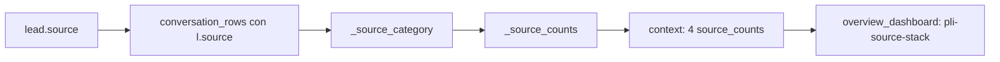

# Plan — Tarjetas de origen de leads en los embudos del CRM

## Objetivo

Agregar, en cada embudo del dashboard de `/analisis-crm/`, una columna de **5 tarjetas pequeñas apiladas** que muestren la distribución de los leads por **origen** (campo `source` de la tabla `lead`). Las tarjetas se colocan **antes de la tarjeta "Ingresaron"**, tienen el **mismo ancho** que una tarjeta KPI del embudo, y su **altura total equivale a la altura de la tarjeta "Ingresaron"**. El conjunto se muestra con **scroll horizontal** para que todas las tarjetas entren.

Cada tarjeta muestra solo: **nombre del origen · cantidad de leads · % del total del embudo**.

## Requisitos confirmados

- Mapeo por coincidencia de subcadena (insensible a mayúsculas) del campo `source`:
  - contiene `meta` → **Meta Ad**
  - contiene `whatsapp` → **Whatsapp**
  - contiene `web` o `form` → **Web**
  - contiene `referido` → **Referido**
  - resto (incluido vacío/NULL) → **Ingreso manual**
- Orden fijo de las 5 tarjetas: Meta Ad, Whatsapp, Web, Referido, Ingreso manual.
- Se aplica a los **4 embudos**: General, Captaciones, Compradores y Sin campaña/Otros.
- El porcentaje es sobre el total de leads (`entered`) del propio embudo.

## Diseño

### 1. Backend — `webapp/lead_intelligence/services.py`

1. Agregar `l.source` al `SELECT` de la consulta `conversation_rows` de `get_management_dashboard` (junto a `campaign_name`).
2. Nuevo helper de clasificación:

   ```python
   SOURCE_LABELS = [
       ("meta_ad", "Meta Ad"),
       ("whatsapp", "Whatsapp"),
       ("web", "Web"),
       ("referido", "Referido"),
       ("manual", "Ingreso manual"),
   ]

   def _source_category(source):
       s = (source or "").strip().lower()
       if "meta" in s:
           return "meta_ad"
       if "whatsapp" in s:
           return "whatsapp"
       if "web" in s or "form" in s:
           return "web"
       if "referido" in s:
           return "referido"
       return "manual"
   ```

3. Nuevo helper que arma la lista de 5 tarjetas:

   ```python
   def _source_counts(metrics, total=None):
       if total is None:
           total = len(metrics)
       counts = Counter(_source_category(m["source"]) for m in metrics)
       return [
           {
               "key": key,
               "label": label,
               "count": counts.get(key, 0),
               "pct": round(counts.get(key, 0) / total * 100, 1) if total else 0,
           }
           for key, label in SOURCE_LABELS
       ]
   ```

4. En el bucle que construye `conversation_metrics`, añadir:
   `"source": row.get("source")` y `"source_category": _source_category(row.get("source"))`.
5. Calcular y devolver en el contexto:
   - `source_counts` (embudo general, sobre `selected_metrics`)
   - `captaciones_source_counts`
   - `compradores_source_counts`
   - `otros_source_counts`

### 2. API — `webapp/lead_intelligence/views.py`

- En `management_summary_api`, exponer los 4 `*_source_counts` en el JSON, igual que los cohorts.

### 3. Estilos — `webapp/lead_intelligence/templates/lead_intelligence/_dashboard_styles.html`

- Nueva clase contenedora con scroll horizontal:

  ```css
  .pli-funnel-rail{display:flex;gap:12px;overflow-x:auto;padding-bottom:8px;align-items:stretch}
  .pli-funnel-rail > *{flex:0 0 auto}
  ```

- **REQUISITO DE ALTURA:** la suma de las alturas de las 5 tarjetas debe ser **igual** a la altura de la tarjeta "Ingresaron". Se garantiza con:
  - El rail usa `align-items:stretch` (por defecto en flex), así la pila de origen se estira hasta igualar la altura del KPI más alto (Ingresaron).
  - La pila es `display:flex; flex-direction:column` con `height:100%`.
  - Cada tarjeta usa `flex:1 1 0` y `min-height:0`, de modo que las 5 dividen la altura total en partes iguales → `suma(alturas 5 tarjetas) = altura Ingresaron`.

  ```css
  .pli-funnel-rail{display:flex;gap:12px;overflow-x:auto;padding-bottom:8px;align-items:stretch}
  .pli-funnel-rail > *{flex:0 0 auto}
  .pli-source-stack{display:flex;flex-direction:column;gap:6px;height:100%;width:180px}
  .pli-source-card{background:var(--pli-soft,#f2f4f7);border-radius:10px;flex:1 1 0;min-height:0;padding:8px 10px}
  .pli-source-card small{display:block;color:var(--pli-muted,#667085);font-size:.62rem;text-transform:uppercase}
  .pli-source-card strong{display:block;font-size:1.05rem}
  .pli-source-card span{color:var(--pli-muted,#667085);font-size:.7rem}
  ```

- Los KPI dentro del rail conservan un ancho mínimo para alinear columnas (p. ej. `min-width:170px`).

### 4. Plantilla — `webapp/lead_intelligence/templates/lead_intelligence/overview_dashboard.html`

- En **cada uno** de los 4 embudos, reemplazar el contenedor `pli-grid-6` por un `pli-funnel-rail` cuyo **primer hijo** es la pila de origen y luego las 6 tarjetas KPI existentes:

  ```html
  <div class="pli-funnel-rail">
    <div class="pli-source-stack">
      
      <div class="pli-source-card"><small>{{ src.label }}</small><strong>{{ src.count }}</strong><span>{{ src.pct }}% del total</span></div>
      
    </div>
    <a class="pli-card pli-kpi pli-kpi-link" href="...">Ingresaron ...</a>
    ... (5 tarjetas KPI restantes)
  </div>
  ```

- Variables por embudo: `source_counts`, `captaciones_source_counts`, `compradores_source_counts`, `otros_source_counts`.

## Flujo de datos



## Archivos a modificar

| Archivo | Cambio |
|---|---|
| `webapp/lead_intelligence/services.py` | consulta + helpers + 4 source_counts |
| `webapp/lead_intelligence/views.py` | exponer source_counts en el API |
| `webapp/lead_intelligence/templates/lead_intelligence/overview_dashboard.html` | pila de origen en los 4 embudos |
| `webapp/lead_intelligence/templates/lead_intelligence/_dashboard_styles.html` | clases rail / stack / card |

## Verificación

- `py -m py_compile lead_intelligence/services.py lead_intelligence/views.py`.
- Compilar plantillas con el loader de Django.
- Ejecutar `get_management_dashboard` para un día y comprobar que la suma de `pct` de cada embudo ≈ 100 y que `sum(counts) == entered`.
- Revisar en pantalla el scroll horizontal y que la altura de la pila iguale la del KPI.

## Despliegue

- Commit de los 4 archivos → push a `origin main` → GitHub Actions despliega a `granextractorservice` (igual que la feature anterior).
