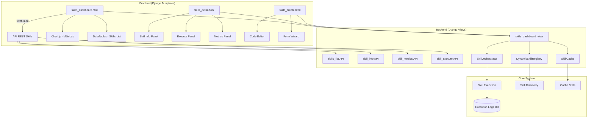
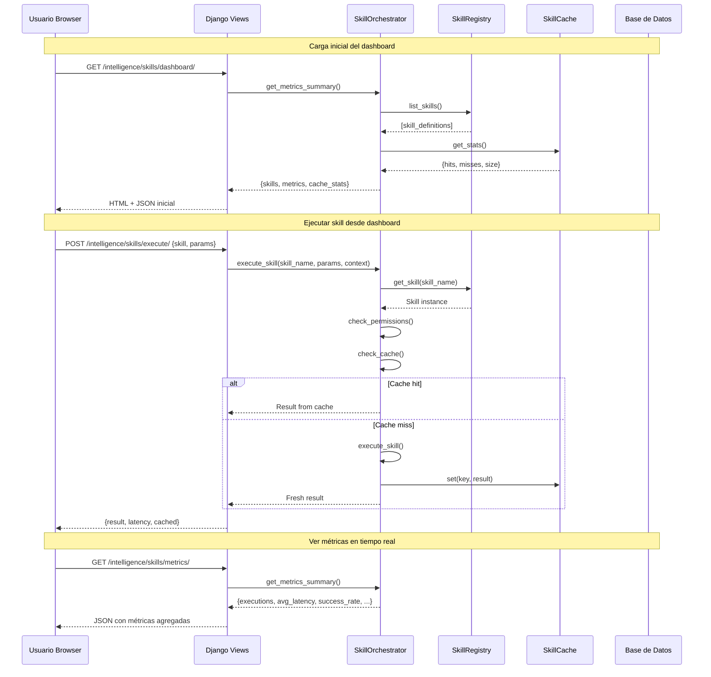

# SPEC-011: Dashboard de Skills Profesional

> **Estado:** Propuesto  
> **Prioridad:** Alta  
> **Dependencias:** Sistema de Skills existente, Sistema de Login/Roles (SPEC-009)  
> **Versión:** 1.0  
> **Fecha:** Abril 2026  

---

## 1. VISIÓN GENERAL

### 1.1 Propósito

Crear un **dashboard profesional** para gestionar, monitorear y administrar el sistema de Skills de Propifai Intelligence. Este dashboard permitirá a usuarios técnicos y administradores:

- Visualizar todas las skills registradas con su estado en tiempo real
- Monitorear métricas de ejecución (latencia, tasa de éxito, hits de cache)
- Ejecutar skills manualmente para pruebas
- Crear nuevas skills desde una interfaz web
- Gestionar permisos por skill y por rol de usuario
- Ver logs de ejecución histórica

### 1.2 Usuarios objetivo

| Perfil | Nivel | Acceso |
|--------|-------|--------|
| **Administrador** | Level 5 | Full: crear, editar, ejecutar, ver métricas, gestionar permisos |
| **Desarrollador** | Level 4 | Crear/editar skills, ejecutar pruebas, ver métricas |
| **Analista** | Level 3 | Ejecutar skills, ver dashboard, ver logs |
| **Usuario básico** | Level 1-2 | Solo ver skills disponibles (read-only) |

### 1.3 Ubicación en el sistema

```
webapp/intelligence/
├── templates/
│   └── intelligence/
│       ├── skills_dashboard.html        ← NUEVO: Dashboard principal
│       ├── skills_detail.html           ← NUEVO: Detalle de skill
│       ├── skills_create.html           ← NUEVO: Crear skill
│       ├── skills_metrics.html          ← NUEVO: Métricas globales
│       └── skills_logs.html            ← NUEVO: Logs de ejecución
├── static/
│   └── intelligence/
│       ├── css/
│       │   └── skills_dashboard.css     ← NUEVO: Estilos del dashboard
│       └── js/
│           ├── skills_dashboard.js      ← NUEVO: Lógica del dashboard
│           ├── skills_metrics.js        ← NUEVO: Charts de métricas
│           └── skills_executor.js       ← NUEVO: Ejecutor de skills
├── views.py                            ← MODIFICAR: +4 vistas
├── urls.py                             ← MODIFICAR: +6 URLs
└── serializers.py                      ← MODIFICAR: +2 serializers
```

---

## 2. ARQUITECTURA DEL DASHBOARD

### 2.1 Diagrama de componentes



### 2.2 Flujo de datos del dashboard



---

## 3. ESPECIFICACIÓN DE VISTAS (PANTALLAS)

### 3.1 Dashboard Principal — `skills_dashboard.html`

#### Layout

```
┌─────────────────────────────────────────────────────────────┐
│  🛠️ Skills Dashboard                    [Admin] [Logout]    │
├─────────────────────────────────────────────────────────────┤
│  ┌──────────┐ ┌──────────┐ ┌──────────┐ ┌────────────────┐ │
│  │ Skills    │ │ Ejec.    │ │ Cache    │ │ Latencia       │ │
│  │ Activas   │ │ Hoy      │ │ Hit Rate │ │ Promedio       │ │
│  │ 12        │ │ 1,234    │ │ 87%      │ │ 342ms          │ │
│  └──────────┘ └──────────┘ └──────────┘ └────────────────┘ │
├─────────────────────────────────────────────────────────────┤
│  ┌──────────────────────────────────────────────────────┐   │
│  │ Skills Registry                        [+ New Skill] │   │
│  ├──────────────────────────────────────────────────────┤   │
│  │ Skill Name │ Category │ Status │ Executions │ Actions│   │
│  ├──────────────────────────────────────────────────────┤   │
│  │ acm_analisis │ reporte │ 🟢 Active │ 456 │ [▶] [📊] [⚙]│   │
│  │ matching...  │ accion  │ 🟢 Active │ 234 │ [▶] [📊] [⚙]│   │
│  │ busqueda...  │ query   │ 🟢 Active │ 892 │ [▶] [📊] [⚙]│   │
│  │ reporte_...  │ reporte │ 🔴 Error  │ 12  │ [▶] [📊] [⚙]│   │
│  └──────────────────────────────────────────────────────┘   │
├─────────────────────────────────────────────────────────────┤
│  ┌──────────────────────────┐ ┌──────────────────────────┐  │
│  │ Ejecuciones (últimas 24h)│ │ Cache Performance        │  │
│  │ [Chart.js Line Chart]    │ │ [Chart.js Donut Chart]   │  │
│  └──────────────────────────┘ └──────────────────────────┘  │
├─────────────────────────────────────────────────────────────┤
│  ┌──────────────────────────────────────────────────────┐   │
│  │ Últimas Ejecuciones                    [View All]    │   │
│  ├──────────────────────────────────────────────────────┤   │
│  │ Time │ Skill │ User │ Status │ Latency │ Details    │   │
│  ├──────────────────────────────────────────────────────┤   │
│  │ 10:32 │ acm... │ admin │ ✅ OK │ 245ms │ [🔍]      │   │
│  │ 10:31 │ match..│ anal. │ ✅ OK │ 892ms │ [🔍]      │   │
│  │ 10:30 │ busq...│ user1 │ ❌ Err │ 0ms   │ [🔍]      │   │
│  └──────────────────────────────────────────────────────┘   │
└─────────────────────────────────────────────────────────────┘
```

#### Componentes

1. **Header Bar**: Título "🛠️ Skills Dashboard", breadcrumb, user info + logout
2. **KPI Cards** (4 cards con datos en tiempo real):
   - Skills Activas: conteo de skills registradas con `is_active=True`
   - Ejecuciones Hoy: total de ejecuciones en el día
   - Cache Hit Rate: porcentaje de hits en cache (SkillCache stats)
   - Latencia Promedio: tiempo de respuesta promedio (ms)
3. **Skills Registry Table**: DataTable con búsqueda, filtros por categoría/estado, paginación. Acciones por fila: ▶ Ejecutar, 📊 Métricas, ⚙ Configurar. Botón "+ New Skill".
4. **Charts Panel**: Line chart de ejecuciones (24h) + Donut chart de cache performance
5. **Recent Activity Log**: Últimas 20 ejecuciones con timestamp, skill, usuario, estado, latencia

### 3.2 Detalle de Skill — `skills_detail.html`

```
┌─────────────────────────────────────────────────────────────┐
│  ← Back to Dashboard    Skill: acm_analisis                 │
├─────────────────────────────────────────────────────────────┤
│  ┌──────────────────────┐ ┌──────────────────────────────┐  │
│  │ Información General  │ │ Métricas de Rendimiento      │  │
│  │──────────────────────│ │──────────────────────────────│  │
│  │ Name: acm_analisis   │ │ Avg Latency: 245ms           │  │
│  │ Category: reporte    │ │ Success Rate: 98.2%          │  │
│  │ Status: 🟢 Active    │ │ Cache Hit Rate: 76%          │  │
│  │ Level Req: 2         │ │ Total Exec: 456              │  │
│  │ Created: 2026-03-15  │ │ Last Exec: 2 min ago         │  │
│  │ Description: ACM...  │ └──────────────────────────────┘  │
│  └──────────────────────┘                                   │
├─────────────────────────────────────────────────────────────┤
│  Parámetros de Entrada                                       │
│  ┌──────────────────────────────────────────────────────┐   │
│  │ Parameter │ Type │ Required │ Default │ Description  │   │
│  ├──────────────────────────────────────────────────────┤   │
│  │ propiedad_id │ int │ Sí │ — │ ID de la propiedad   │   │
│  │ zona        │ str │ No │ null │ Zona a comparar    │   │
│  └──────────────────────────────────────────────────────┘   │
├─────────────────────────────────────────────────────────────┤
│  Panel de Ejecución                                          │
│  ┌──────────────────────────────────────────────────────┐   │
│  │ Parámetros (JSON editor)                              │   │
│  │ ┌──────────────────────────────────────────────────┐ │   │
│  │ │ {"propiedad_id": 123, "zona": "Cayma"}           │ │   │
│  │ └──────────────────────────────────────────────────┘ │   │
│  │ [▶ Execute] [Clear Cache] [View Source Code]        │   │
│  │                                                      │   │
│  │ Resultado:                                            │   │
│  │ ┌──────────────────────────────────────────────────┐ │   │
│  │ │ { "success": true, "data": {...}, "latency":234 }│ │   │
│  │ └──────────────────────────────────────────────────┘ │   │
│  └──────────────────────────────────────────────────────┘   │
├─────────────────────────────────────────────────────────────┤
│  Historial de Ejecuciones (últimas 50)                       │
│  ┌──────────────────────────────────────────────────────┐   │
│  │ Time │ User │ Status │ Latency │ Params     │ Result│   │
│  ├──────────────────────────────────────────────────────┤   │
│  │ 10:32 │ admin │ ✅ OK │ 245ms │ {...}      │ {...} │   │
│  │ 10:15 │ anal. │ ✅ OK │ 312ms │ {...}      │ {...} │   │
│  └──────────────────────────────────────────────────────┘   │
└─────────────────────────────────────────────────────────────┘
```

#### Componentes

1. **Info Panel**: Metadatos de la skill (nombre, categoría, descripción, nivel requerido, fechas)
2. **Metrics Panel**: KPIs específicos de la skill (latencia, success rate, cache hit rate, total ejecuciones)
3. **Parameters Table**: Lista de parámetros con tipo, requerido, default, descripción
4. **Execution Panel**: Editor JSON con syntax highlighting, botones Execute/Clear Cache/View Source, área de resultado formateado
5. **Execution History**: Tabla paginada con historial de ejecuciones

### 3.3 Crear/Editar Skill — `skills_create.html`

```
┌─────────────────────────────────────────────────────────────┐
│  ← Back to Dashboard    Create New Skill                    │
├─────────────────────────────────────────────────────────────┤
│  ┌──────────────────────────────────────────────────────┐   │
│  │ Step 1: Información Básica                           │   │
│  │ Skill Name: [________________________]               │   │
│  │ Description: [___________________________________]   │   │
│  │ Category: [▼ reporte]   Required Level: [▼ 2]       │   │
│  │ Is Active: [✅]                                      │   │
│  └──────────────────────────────────────────────────────┘   │
│                                                              │
│  ┌──────────────────────────────────────────────────────┐   │
│  │ Step 2: Parámetros                                   │   │
│  │ [+ Add Parameter]                                    │   │
│  │ ┌──────────────────────────────────────────────────┐ │   │
│  │ │ Name │ Type │ Required │ Default │ Description  │ │   │
│  │ ├──────────────────────────────────────────────────┤ │   │
│  │ │ prop │ int  │ ✅       │ —       │ ID propiedad│ │   │
│  │ │ zona │ str  │ ❌       │ null    │ Zona ACM    │ │   │
│  │ └──────────────────────────────────────────────────┘ │   │
│  └──────────────────────────────────────────────────────┘   │
│                                                              │
│  ┌──────────────────────────────────────────────────────┐   │
│  │ Step 3: Código de la Skill                           │   │
│  │ ┌──────────────────────────────────────────────────┐ │   │
│  │ │ from intelligence.skills.base import Skill        │ │   │
│  │ │ class MiNuevaSkill(Skill):                       │ │   │
│  │ │     name = "mi_nueva_skill"                      │ │   │
│  │ │     description = "..."                          │ │   │
│  │ │     def execute(self, **kwargs) -> SkillResult:  │ │   │
│  │ │         # Tu lógica aquí                         │ │   │
│  │ │         pass                                     │ │   │
│  │ └──────────────────────────────────────────────────┘ │   │
│  │ [📋 Validate Code] [💾 Save Skill]                   │   │
│  └──────────────────────────────────────────────────────┘   │
└─────────────────────────────────────────────────────────────┘
```

#### Componentes

1. **Wizard de 3 pasos**: Información básica → Parámetros → Código
2. **Code Editor**: Editor con syntax highlighting (Python), validación de sintaxis
3. **Validate Button**: Verifica que el código Python sea válido y herede de `Skill`
4. **Save Button**: Guarda la skill como archivo `.py` en `intelligence/skills/` y la registra

### 3.4 Métricas Globales — `skills_metrics.html`

```
┌─────────────────────────────────────────────────────────────┐
│  ← Back to Dashboard    Global Metrics                      │
├─────────────────────────────────────────────────────────────┤
│  ┌──────────┐ ┌──────────┐ ┌──────────┐ ┌────────────────┐ │
│  │ Total    │ │ Avg      │ │ Success  │ │ Cache          │ │
│  │ Ejec.    │ │ Latency  │ │ Rate     │ │ Efficiency     │ │
│  │ 12,456   │ │ 312ms    │ │ 96.4%    │ │ 83%            │ │
│  └──────────┘ └──────────┘ └──────────┘ └────────────────┘ │
├─────────────────────────────────────────────────────────────┤
│  ┌────────────────────────────┐ ┌────────────────────────┐  │
│  │ Ejecuciones por Skill      │ │ Latencia por Skill     │  │
│  │ [Chart.js Bar Chart]       │ │ [Chart.js Bar Chart]   │  │
│  └────────────────────────────┘ └────────────────────────┘  │
├─────────────────────────────────────────────────────────────┤
│  ┌────────────────────────────┐ ┌────────────────────────┐  │
│  │ Timeline (7 días)          │ │ Success Rate por Cat   │  │
│  │ [Chart.js Line Chart]      │ │ [Chart.js Radar Chart] │  │
│  └────────────────────────────┘ └────────────────────────┘  │
├─────────────────────────────────────────────────────────────┤
│  Tabla de Rendimiento por Skill                              │
│  ┌──────────────────────────────────────────────────────┐   │
│  │ Skill │ Exec │ Avg Lat │ P95 Lat │ Success │ Cache  │   │
│  ├──────────────────────────────────────────────────────┤   │
│  │ acm.. │ 456  │ 245ms   │ 412ms   │ 98.2%   │ 76%    │   │
│  │ match │ 234  │ 892ms   │ 1.2s    │ 94.5%   │ 45%    │   │
│  └──────────────────────────────────────────────────────┘   │
└─────────────────────────────────────────────────────────────┘
```

### 3.5 Logs de Ejecución — `skills_logs.html`

```
┌─────────────────────────────────────────────────────────────┐
│  ← Back to Dashboard    Execution Logs                      │
├─────────────────────────────────────────────────────────────┤
│  [Skill: ▼ All] [Status: ▼ All] [Date Range: [··] to [··]] │
│  [Search: ________________] [🔍 Search] [📥 Export CSV]    │
├─────────────────────────────────────────────────────────────┤
│  ┌──────────────────────────────────────────────────────┐   │
│  │ Timestamp │ Skill │ User │ Params │ Status │ Latency│   │
│  ├──────────────────────────────────────────────────────┤   │
│  │ 2026-04-30 10:32:15 │ acm_analisis │ admin │ {...}  │   │
│  │ ✅ Success │ 245ms │ [🔍 Detail]                     │   │
│  ├──────────────────────────────────────────────────────┤   │
│  │ 2026-04-30 10:31:42 │ matching... │ analista │ {...} │   │
│  │ ✅ Success │ 892ms │ [🔍 Detail]                     │   │
│  ├──────────────────────────────────────────────────────┤   │
│  │ 2026-04-30 10:30:01 │ busqueda... │ user1 │ {...}   │   │
│  │ ❌ Error: "Timeout" │ 0ms │ [🔍 Detail]              │   │
│  └──────────────────────────────────────────────────────┘   │
│  [<< Prev] Page 1 of 23 [Next >>]                            │
└─────────────────────────────────────────────────────────────┘
```

---

## 4. API ENDPOINTS

### 4.1 Endpoints existentes (ya implementados en `views.py`)

| Método | URL | Descripción | Estado |
|--------|-----|-------------|--------|
| `GET` | `/intelligence/skills/` | Listar todas las skills | ✅ |
| `GET` | `/intelligence/skills/{name}/` | Info de una skill | ✅ |
| `GET` | `/intelligence/skills/metrics/` | Métricas globales | ✅ |
| `POST` | `/intelligence/skills/execute/` | Ejecutar una skill | ✅ |

### 4.2 Nuevos endpoints requeridos

| Método | URL | Descripción | View Function |
|--------|-----|-------------|---------------|
| `GET` | `/intelligence/skills/dashboard/` | Dashboard principal (HTML) | `skills_dashboard_view` |
| `GET` | `/intelligence/skills/{name}/detail/` | Detalle de skill (HTML) | `skill_detail_view` |
| `GET` | `/intelligence/skills/create/` | Formulario crear skill (HTML) | `skill_create_view` |
| `POST` | `/intelligence/skills/create/` | Guardar nueva skill | `skill_create_view` |
| `GET` | `/intelligence/skills/{name}/edit/` | Formulario editar skill (HTML) | `skill_edit_view` |
| `POST` | `/intelligence/skills/{name}/edit/` | Guardar edición de skill | `skill_edit_view` |
| `GET` | `/intelligence/skills/metrics/global/` | Página métricas globales (HTML) | `skill_metrics_view` |
| `GET` | `/intelligence/skills/logs/` | Página de logs (HTML) | `skill_logs_view` |
| `GET` | `/intelligence/skills/api/logs/` | API JSON de logs | `skill_logs_api` |
| `POST` | `/intelligence/skills/{name}/clear-cache/` | Limpiar cache de skill | `skill_clear_cache` |
| `POST` | `/intelligence/skills/{name}/toggle/` | Activar/desactivar skill | `skill_toggle_active` |
| `GET` | `/intelligence/skills/api/stats/` | Stats agregados para charts | `skill_stats_api` |

### 4.3 Formato de respuestas API

#### `GET /intelligence/skills/api/stats/`

```json
{
  "skills_count": 12,
  "active_count": 11,
  "total_executions_today": 1234,
  "total_executions_all": 12456,
  "avg_latency_ms": 312,
  "success_rate": 0.964,
  "cache_hit_rate": 0.83,
  "executions_by_hour": {
    "00": 12, "01": 5, "...": "...", "23": 45
  },
  "executions_by_skill": {
    "acm_analisis": 456,
    "matching_oferta_demanda": 234,
    "busqueda_exacta": 892,
    "reporte_precios_zona": 178
  },
  "latency_by_skill": {
    "acm_analisis": 245,
    "matching_oferta_demanda": 892,
    "busqueda_exacta": 123,
    "reporte_precios_zona": 456
  },
  "success_rate_by_category": {
    "reporte": 0.98,
    "accion": 0.94,
    "query": 0.99
  }
}
```

#### `GET /intelligence/skills/api/logs/?page=1&skill=acm_analisis&status=error`

```json
{
  "count": 234,
  "page": 1,
  "page_size": 50,
  "results": [
    {
      "id": "uuid",
      "skill_name": "acm_analisis",
      "user_name": "admin",
      "parameters": {"propiedad_id": 123},
      "status": "success",
      "latency_ms": 245,
      "error_message": null,
      "cached": false,
      "executed_at": "2026-04-30T10:32:15Z"
    }
  ]
}
```

---

## 5. MODELO DE DATOS

### 5.1 Modelos existentes (ya en `models.py`)

Los modelos `Role`, `User`, `AppConfig` ya existen y se reutilizan para permisos.

### 5.2 Nuevo modelo requerido: `SkillExecution`

```python
class SkillExecution(models.Model):
    """Registro de ejecución de una skill para persistencia a largo plazo."""
    id = models.UUIDField(primary_key=True, default=uuid.uuid4, editable=False)
    skill_name = models.CharField(max_length=100, db_index=True)
    user = models.ForeignKey(User, on_delete=models.SET_NULL, null=True)
    conversation = models.ForeignKey(Conversation, on_delete=models.SET_NULL, null=True)
    parameters = models.JSONField(default=dict)
    result = models.JSONField(default=dict, null=True, blank=True)
    status = models.CharField(max_length=20, choices=[
        ('success', 'Success'),
        ('error', 'Error'),
        ('timeout', 'Timeout'),
        ('cached', 'Cached'),
    ], db_index=True)
    latency_ms = models.FloatField(default=0)
    error_message = models.TextField(null=True, blank=True)
    cached = models.BooleanField(default=False)
    executed_at = models.DateTimeField(auto_now_add=True, db_index=True)

    class Meta:
        db_table = 'intelligence_skill_execution'
        indexes = [
            models.Index(fields=['skill_name', 'executed_at']),
            models.Index(fields=['status', 'executed_at']),
        ]
```

> **Nota:** Este modelo es para persistencia a largo plazo. Las métricas en tiempo real se obtienen del `SkillOrchestrator.get_metrics_summary()` y del `SkillCache.get_stats()`.

---

## 6. PERMISOS Y SEGURIDAD

### 6.1 Matriz de permisos

| Acción | Admin (L5) | Developer (L4) | Analyst (L3) | Basic (L1-2) |
|--------|-----------|----------------|--------------|--------------|
| Ver dashboard | ✅ | ✅ | ✅ | ✅ |
| Ver detalle skill | ✅ | ✅ | ✅ | ✅ |
| Ejecutar skill | ✅ | ✅ | ✅ | ❌ |
| Ver métricas | ✅ | ✅ | ✅ | ❌ |
| Ver logs | ✅ | ✅ | ✅ | ❌ |
| Crear skill | ✅ | ✅ | ❌ | ❌ |
| Editar skill | ✅ | ✅ | ❌ | ❌ |
| Activar/desactivar | ✅ | ❌ | ❌ | ❌ |
| Limpiar cache | ✅ | ✅ | ❌ | ❌ |
| Ver código fuente | ✅ | ✅ | ❌ | ❌ |
| Gestionar permisos | ✅ | ❌ | ❌ | ❌ |

### 6.2 Decoradores a usar

```python
from .permissions import admin_required, level_required

@level_required(1)
def skills_dashboard_view(request):
    ...

@level_required(2)
def skill_detail_view(request, skill_name):
    ...

@level_required(4)
def skill_create_view(request):
    ...

@admin_required
def skill_toggle_active(request, skill_name):
    ...
```

---

## 7. PLAN DE IMPLEMENTACIÓN

### Fase 1: Backend API (Día 1-2)

| # | Tarea | Archivos | Dependencias |
|---|-------|----------|--------------|
| 1.1 | Crear modelo `SkillExecution` | `models.py` | Migración DB |
| 1.2 | Agregar serializers | `serializers.py` | Modelo |
| 1.3 | Implementar `skills_dashboard_view` | `views.py` | — |
| 1.4 | Implementar `skill_detail_view` | `views.py` | — |
| 1.5 | Implementar `skill_create_view` | `views.py` | — |
| 1.6 | Implementar `skill_edit_view` | `views.py` | — |
| 1.7 | Implementar `skill_metrics_view` | `views.py` | — |
| 1.8 | Implementar `skill_logs_view` + API | `views.py` | Modelo |
| 1.9 | Implementar `skill_clear_cache` | `views.py` | Orchestrator |
| 1.10 | Implementar `skill_toggle_active` | `views.py` | Registry |
| 1.11 | Implementar `skill_stats_api` | `views.py` | Orchestrator |
| 1.12 | Registrar URLs | `urls.py` | Views |

### Fase 2: Frontend Templates (Día 3-4)

| # | Tarea | Archivos | Dependencias |
|---|-------|----------|--------------|
| 2.1 | Crear `skills_dashboard.html` | templates/ | Fase 1 |
| 2.2 | Crear `skills_detail.html` | templates/ | Fase 1 |
| 2.3 | Crear `skills_create.html` | templates/ | Fase 1 |
| 2.4 | Crear `skills_metrics.html` | templates/ | Fase 1 |
| 2.5 | Crear `skills_logs.html` | templates/ | Fase 1 |
| 2.6 | Crear `skills_dashboard.css` | static/ | — |
| 2.7 | Crear `skills_dashboard.js` | static/ | — |
| 2.8 | Crear `skills_metrics.js` (Chart.js) | static/ | Chart.js |
| 2.9 | Crear `skills_executor.js` | static/ | — |

### Fase 3: Integración y Pruebas (Día 5)

| # | Tarea | Descripción |
|---|-------|-------------|
| 3.1 | Probar flujo completo | Crear skill → Ejecutar → Ver métricas → Ver logs |
| 3.2 | Probar permisos | Verificar matriz de permisos |
| 3.3 | Probar cache | Verificar hit/miss, clear cache |
| 3.4 | Probar edge cases | Skill con error, timeout, parámetros inválidos |
| 3.5 | Documentar | Actualizar este SPEC con hallazgos |

---

## 8. TECNOLOGÍAS FRONTEND

| Tecnología | Uso | Versión | CDN |
|------------|-----|---------|-----|
| **Chart.js** | Gráficos de métricas | 4.x | `https://cdn.jsdelivr.net/npm/chart.js` |
| **DataTables** | Tablas con búsqueda/paginación | 2.x | `https://cdn.datatables.net/` |
| **Highlight.js** | Syntax highlighting para JSON/código | 11.x | `https://cdnjs.cloudflare.com/ajax/libs/highlight.js/` |
| **Font Awesome** | Iconos | 6.x | `https://cdnjs.cloudflare.com/ajax/libs/font-awesome/` |
| **Google Fonts** | Tipografía (Inter) | — | `https://fonts.googleapis.com/css2?family=Inter` |

> **Nota:** Se usan CDNs para evitar agregar dependencias pesadas al proyecto. Si se requiere offline, se pueden descargar los assets.

---

## 9. DISEÑO VISUAL

### 9.1 Paleta de colores

| Elemento | Color | Hex | Uso |
|----------|-------|-----|-----|
| Background | Dark | `#0d1117` | Fondo principal (consistente con charts existentes) |
| Surface | Darker | `#161b22` | Cards, tablas, paneles |
| Border | Gray | `#30363d` | Bordes de componentes |
| Primary | Blue | `#58a6ff` | Botones, links, acentos |
| Success | Green | `#3fb950` | Status OK, success rate |
| Error | Red | `#f85149` | Status error |
| Warning | Orange | `#d29922` | Warning, timeout |
| Text | White | `#c9d1d9` | Texto principal |
| Text Dim | Gray | `#8b949e` | Texto secundario |

### 9.2 Estilos base (CSS)

```css
/* Tema oscuro consistente con el ecosistema Propifai */
.skills-dashboard {
    background-color: #0d1117;
    color: #c9d1d9;
    font-family: 'Inter', -apple-system, sans-serif;
    padding: 24px;
    min-height: 100vh;
}

.skill-card {
    background: #161b22;
    border: 1px solid #30363d;
    border-radius: 8px;
    padding: 20px;
    transition: border-color 0.2s ease;
}

.skill-card:hover {
    border-color: #58a6ff;
}

.skill-table {
    width: 100%;
    border-collapse: collapse;
}

.skill-table th {
    background: #161b22;
    color: #8b949e;
    text-transform: uppercase;
    font-size: 12px;
    letter-spacing: 0.5px;
    padding: 12px 16px;
    border-bottom: 1px solid #30363d;
}

.skill-table td {
    padding: 12px 16px;
    border-bottom: 1px solid #21262d;
}

.status-badge {
    display: inline-flex;
    align-items: center;
    gap: 6px;
    padding: 4px 12px;
    border-radius: 12px;
    font-size: 12px;
    font-weight: 500;
}

.status-badge.active {
    background: rgba(63, 185, 80, 0.15);
    color: #3fb950;
}

.status-badge.error {
    background: rgba(248, 81, 73, 0.15);
    color: #f85149;
}

.status-badge.inactive {
    background: rgba(139, 148, 158, 0.15);
    color: #8b949e;
}

.kpi-card {
    background: #161b22;
    border: 1px solid #30363d;
    border-radius: 8px;
    padding: 16px 20px;
    display: flex;
    flex-direction: column;
    gap: 4px;
}

.kpi-card .kpi-label {
    color: #8b949e;
    font-size: 12px;
    text-transform: uppercase;
    letter-spacing: 0.5px;
}

.kpi-card .kpi-value {
    color: #c9d1d9;
    font-size: 28px;
    font-weight: 600;
    line-height: 1.2;
}

.btn {
    display: inline-flex;
    align-items: center;
    gap: 6px;
    padding: 8px 16px;
    border-radius: 6px;
    font-size: 14px;
    font-weight: 500;
    cursor: pointer;
    border: 1px solid #30363d;
    background: #21262d;
    color: #c9d1d9;
    transition: all 0.2s ease;
}

.btn:hover {
    background: #30363d;
    border-color: #58a6ff;
}

.btn-primary {
    background: #58a6ff;
    color: #0d1117;
    border-color: #58a6ff;
}

.btn-primary:hover {
    background: #79c0ff;
}

.btn-danger {
    background: transparent;
    color: #f85149;
    border-color: #f85149;
}

.btn-danger:hover {
    background: rgba(248, 81, 73, 0.15);
}

.chart-container {
    background: #161b22;
    border: 1px solid #30363d;
    border-radius: 8px;
    padding: 20px;
    position: relative;
}

.chart-container canvas {
    max-height: 300px;
}

.execution-log {
    font-family: 'JetBrains Mono', 'Fira Code', monospace;
    font-size: 13px;
}

.json-editor {
    background: #0d1117;
    border: 1px solid #30363d;
    border-radius: 6px;
    padding: 12px;
    font-family: 'JetBrains Mono', 'Fira Code', monospace;
    font-size: 13px;
    color: #c9d1d9;
    width: 100%;
    min-height: 80px;
    resize: vertical;
}

.json-result {
    background: #0d1117;
    border: 1px solid #30363d;
    border-radius: 6px;
    padding: 12px;
    font-family: 'JetBrains Mono', 'Fira Code', monospace;
    font-size: 13px;
    color: #c9d1d9;
    white-space: pre-wrap;
    max-height: 400px;
    overflow-y: auto;
}

.filter-bar {
    display: flex;
    gap: 12px;
    align-items: center;
    flex-wrap: wrap;
    margin-bottom: 16px;
}

.filter-bar select,
.filter-bar input {
    background: #0d1117;
    border: 1px solid #30363d;
    border-radius: 6px;
    padding: 8px 12px;
    color: #c9d1d9;
    font-size: 14px;
}

.filter-bar select:focus,
.filter-bar input:focus {
    border-color: #58a6ff;
    outline: none;
}

/* Wizard steps */
.wizard-step {
    display: none;
}

.wizard-step.active {
    display: block;
}

.wizard-nav {
    display: flex;
    gap: 8px;
    margin-bottom: 24px;
}

.wizard-step-indicator {
    flex: 1;
    padding: 12px;
    background: #161b22;
    border: 1px solid #30363d;
    border-radius: 6px;
    text-align: center;
    font-size: 13px;
    color: #8b949e;
}

.wizard-step-indicator.active {
    border-color: #58a6ff;
    color: #58a6ff;
}

.wizard-step-indicator.completed {
    border-color: #3fb950;
    color: #3fb950;
}

/* Scrollbar personalizada */
::-webkit-scrollbar {
    width: 8px;
    height: 8px;
}

::-webkit-scrollbar-track {
    background: #0d1117;
}

::-webkit-scrollbar-thumb {
    background: #30363d;
    border-radius: 4px;
}

::-webkit-scrollbar-thumb:hover {
    background: #484f58;
}

/* Responsive */
@media (max-width: 768px) {
    .skills-dashboard {
        padding: 12px;
    }
    
    .kpi-grid {
        grid-template-columns: 1fr 1fr;
    }
    
    .charts-grid {
        grid-template-columns: 1fr;
    }
    
    .filter-bar {
        flex-direction: column;
    }
}