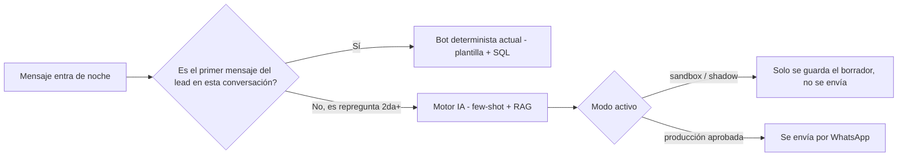
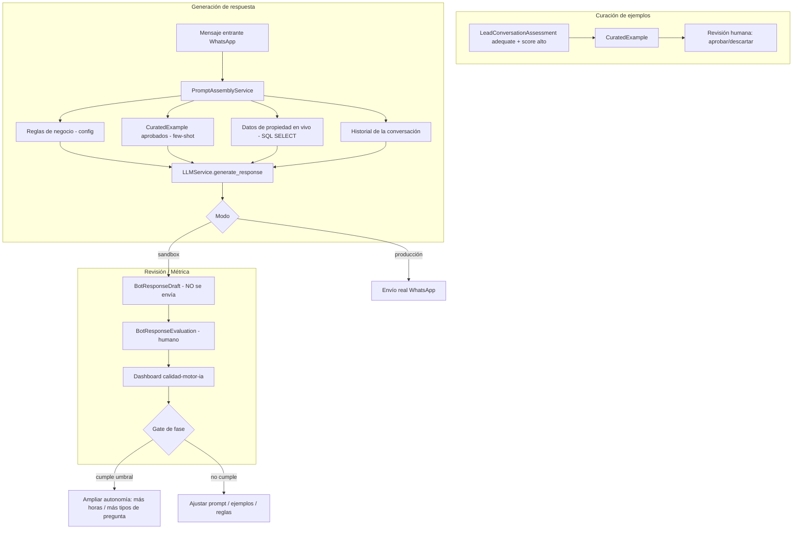

# Spec: Motor de Respuestas IA (Few-Shot + RAG) y Entorno de Pruebas (Sandbox)

> Prometeo · Módulo `response_intelligence` (nuevo, hermano de `lead_intelligence`)
> Vive en Prometeo (BD `default`/`propiextractor`), NO en el CRM. El CRM sigue siendo la herramienta operativa del call center y no se toca — Prometeo solo **lee** conversaciones y datos de propiedad del CRM (SELECT), igual que ya hace `lead_intelligence`.
> Este documento describe cómo pasar del bot basado en plantillas (Fase 1, se mantiene sin cambios para el primer mensaje) a un bot con IA generativa (Fase 2, interviene desde el segundo mensaje del lead) usando few-shot + RAG, y cómo probarlo en un entorno seguro (sandbox dentro de Prometeo) antes de que hable con clientes reales.

---

## 0.1 Separación CRM vs Prometeo

| | CRM | Prometeo |
|---|---|---|
| Usuarios | Agentes de call center | Tú / equipo de análisis |
| Rol | Operación diaria (leads, llamadas, seguimiento) | Análisis, evaluación, entrenamiento del bot |
| Cambios de esta spec | Ninguno | Todo lo nuevo vive aquí |
| Acceso a datos del otro sistema | — | Solo lectura (SELECT) sobre el CRM |

El call center nunca ve el sandbox ni sabe que existe hasta que el bot IA esté aprobado para producción.

---

## 0. Contexto y decisión de diseño

Ya existe `lead_intelligence`, que **evalúa** conversaciones pasadas (calidad, calificación, intención). Ese motor es la fuente perfecta de datos para curar ejemplos: cualquier `LeadConversationAssessment` con `first_response_status = "adequate"` y scores altos (`relevance`, `coverage`, `directness`, `personalization`) es candidato a few-shot example.

Se evita fine-tuning por lo ya conversado: el contexto (propiedad viva desde SQL + reglas de negocio + pocos ejemplos de buen tono) pesa más que el volumen de ejemplos, y evita reentrenar cada vez que cambia el catálogo o el tono de marca.

---

## 1. Objetivo

1. **El primer mensaje del lead siempre lo responde el bot determinista actual** (plantilla + datos de SQL). No cambia nada de lo que ya funciona — es la respuesta más predecible y de mayor volumen, no vale la pena arriesgarla.
2. **A partir del segundo mensaje del lead** (cuando la conversación se vuelve más natural: repreguntas, condiciones, objeciones, "¿y el financiamiento?", etc.), interviene el motor de IA generativa, usando:
   - Datos de propiedad en vivo desde SQL (RAG, mismo mecanismo que ya usa la plantilla).
   - Reglas de negocio explícitas (qué no puede prometer, cuándo escalar).
   - 30-50 ejemplos reales curados desde `LeadConversationAssessment`.
3. Probar cada versión del prompt/modelo en un **sandbox dentro de Prometeo** antes de exponerlo a clientes: generar respuestas "en la sombra" sobre conversaciones reales o simuladas, sin enviarlas por WhatsApp, y calificarlas humanamente con la misma mecánica de revisión que ya usan en `lead_intelligence`.
4. Definir el criterio cuantitativo para pasar de sandbox → producción limitada → producción completa (autonomía por fases).

### 1.1 Lógica de intervención (quién responde qué)

Esto simplifica el riesgo: el volumen más alto (primera respuesta, muy estandarizada) sigue 100% controlado y probado; la IA solo entra donde ya hoy no hay nada automatizado — la repregunta, que hoy probablemente espera hasta que el agente despierta.

---

## 2. Arquitectura general

Reutiliza exactamente el patrón que ya tienen: comando de management + `ThreadPoolExecutor` + `AnalysisRun`-like tracking + `trace_id` para costo, pero para **generación**, no evaluación.

---

## 3. Modelos de datos nuevos (BD `default`)

### 3.1 `CuratedExample`
Banco de ejemplos few-shot, alimentado desde evaluaciones ya existentes.

| Campo | Tipo | Notas |
|---|---|---|
| `source_lead_id` | int | referencia al lead origen |
| `source_assessment` | FK a `LeadConversationAssessment` | trazabilidad |
| `intent_category` | choice | `precio`, `ubicacion`, `visita`, `financiamiento`, `objecion_precio`, `disponibilidad`, `otro` |
| `client_message` | text | mensaje del cliente (anonimizado: sin nombre/teléfono) |
| `agent_response` | text | respuesta real que funcionó |
| `quality_scores` | JSON | copiado de `LeadConversationAssessment` al momento de curar |
| `approved` | bool | revisión humana obligatoria antes de usarse en producción |
| `approved_by` / `approved_at` | | |
| `active` | bool | permite desactivar sin borrar (versión) |

Restricción: máx. ~50-60 activos por `intent_category` combinados, para no inflar el prompt (impacta costo y latencia).

### 3.2 `BusinessRule`
Tabla simple en vez de hardcodear en el prompt, para poder auditar cambios.

| Campo | Tipo |
|---|---|
| `rule_text` | text (ej. "Nunca confirmar disponibilidad sin datos de SQL", "Nunca negociar precio, siempre remitir a agente humano") |
| `category` | `prohibicion` / `tono` / `escalamiento` |
| `active` | bool |

### 3.3 `BotResponseDraft` (equivalente a `LeadConversationAssessment` pero para generación)

| Campo | Tipo | Notas |
|---|---|---|
| `source_lead_id` | int | |
| `client_message` | text | mensaje real o simulado que disparó la respuesta |
| `prompt_snapshot` | text/JSON | prompt completo usado (reglas + ejemplos + datos SQL en ese momento) — clave para debug y auditoría |
| `generated_response` | text | salida del modelo |
| `property_data_used` | JSON | qué filas de SQL se inyectaron (para verificar que no alucinó) |
| `mode` | choice | `sandbox` / `shadow_live` / `production` |
| `model_version` | str | |
| `trace_id` | str | `bot_draft:{id}` para costo, igual patrón que `lead:{id}` |
| `created_at` | | |

`shadow_live` = corre en tiempo real sobre conversaciones reales entrantes, en paralelo al bot de plantillas actual, sin enviar nada — el cliente sigue recibiendo la plantilla de siempre mientras se audita en silencio lo que el bot IA habría respondido.

### 3.4 `BotResponseEvaluation` (mismo patrón que `LeadConversationReview`)

| Campo | Tipo |
|---|---|
| `draft` | FK a `BotResponseDraft` |
| `verdict` | `correcto` / `incorrecto` / `aceptable_con_ajuste` |
| `hallucination_flag` | bool — ¿inventó un dato que no está en `property_data_used`? |
| `tone_flag` | bool — ¿tono fuera de marca? |
| `would_send` | bool — ¿el revisor lo habría enviado tal cual? |
| `notes` | text |
| `reviewed_by` / `reviewed_at` | |

---

## 4. Servicios nuevos

### 4.1 `CurationService` (`response_intelligence/curation.py`)
- `suggest_candidates(min_score=80, limit=200)`: consulta `LeadConversationAssessment` con `first_response_status="adequate"` y promedio de scores alto, agrupa por categoría de intención (usar el mismo `lead_request_items` que ya calculan) y arma cola de candidatos para aprobación humana.
- `promote_to_curated(assessment_id, intent_category)`: crea `CuratedExample(approved=False)`.

### 4.2 `PromptAssemblyService` (`response_intelligence/prompt_assembly.py`)
- `build_system_prompt()`: reglas de negocio activas + tono de marca (config).
- `select_few_shot(client_message, intent_category=None, k=6)`: no mete los 50 ejemplos en cada request — selecciona los k más relevantes (por categoría de intención detectada o similitud simple de keywords; no hace falta embeddings sofisticados para arrancar).
- `fetch_live_property_data(lead_id, parsed_query)`: reutiliza el SELECT que ya usa el bot de plantillas.
- `assemble(lead_id, client_message)` → devuelve el prompt final + guarda `prompt_snapshot`.

### 4.3 `LLMService.generate_response` (extiende el `llm.py` existente)
Mismo patrón que `extract_structured_data`, pero salida en texto libre (no JSON), con `trace_id=f"bot_draft:{draft_id}"` para que el costo por respuesta se agregue igual que ya hacen con costo por lead.

---

## 5. Entorno de pruebas (Sandbox) — cómo probar que responde bien

Tres niveles, igual que un pipeline de CI, de menor a mayor riesgo:

### Nivel 1 — Sandbox offline (conversaciones históricas)
- Comando `generate_draft_responses --mode=sandbox --date_from --date_to`.
- Toma `chat_history` de leads ya cerrados (no van a recibir nada, ya no están activos).
- Genera `BotResponseDraft` para cada mensaje de cliente en esas conversaciones.
- Un humano compara el draft del bot contra lo que el agente realmente respondió (que ya está en el historial) — permite medir "¿el bot lo hubiera hecho igual o mejor?" sin ningún riesgo.
- Métrica base antes de tocar producción.

### Nivel 2 — Shadow mode en vivo
- El bot de plantillas sigue respondiendo normalmente en producción (sin cambios).
- En paralelo, por cada mensaje nocturno real que llega, se genera un `BotResponseDraft(mode="shadow_live")`.
- Nadie lo ve excepto el dashboard de revisión. Esto valida el prompt contra tráfico real y actual (propiedades reales, clientes reales) sin exponer riesgo.
- Corre 1-2 semanas mínimo, o hasta acumular ~150-200 drafts revisados.

### Nivel 3 — Producción limitada (piloto)
- Solo para 1 `intent_category` a la vez (ej. arrancar con "precio" y "ubicación", que son más objetivas — dejar "objeción de precio" para después).
- Solo en horario nocturno (igual que ahora).
- Si `hallucination_flag` o `verdict=incorrecto` supera un umbral (ej. >5% en una semana), corta automáticamente y vuelve a plantilla (fallback duro).

### Gate cuantitativo sugerido para avanzar de nivel
| Métrica | Umbral para pasar a producción limitada |
|---|---|
| `would_send = true` | ≥ 90% de los drafts revisados |
| `hallucination_flag = true` | ≤ 2% |
| `tone_flag = true` | ≤ 5% |
| Costo por respuesta | dentro de presupuesto (ya miden esto igual que con DeepSeek en `lead_intelligence`) |
| Latencia | < X segundos (definir según UX de WhatsApp) |

Estos números son un punto de partida razonable — ajústalos con tus primeros 100-200 drafts revisados; lo importante es que exista un umbral objetivo y no una decisión "a ojo".

---

## 6. Dashboard (extiende el patrón de `analysis_quality_dashboard`)

Nueva ruta dentro de Prometeo (no del CRM), hermana de la que ya existe: `/prometeo/calidad-motor-ia/` (o el prefijo que uses hoy para `lead_intelligence` dentro de Prometeo — el punto es que quede junto al panel de calidad de conversaciones que ya conoces, no en el CRM).
- Cola de revisión de `BotResponseDraft` pendientes (mismo componente visual que la cola de `lead_intelligence`, reutilizable).
- KPIs: % would_send, % hallucination, % tone_flag, costo total/promedio por draft, distribución por `intent_category`.
- Botón para promover/degradar `CuratedExample` directamente desde un draft bien evaluado (cierra el loop: un buen draft real puede convertirse en nuevo ejemplo few-shot).
- Terminal en vivo igual al de `analysis_progress_api`, para runs de generación en modo sandbox masivo.

---

## 7. Guardrails obligatorios (independiente de la fase)

- **Nunca** enviar un draft directo a WhatsApp sin pasar por al menos Nivel 2 con umbral cumplido.
- Validación determinista post-generación: si `property_data_used` está vacío pero la respuesta menciona precio/m²/dirección → forzar `hallucination_flag` y bloquear envío (chequeo automático, no depende del revisor).
- Palabras clave de escalamiento (ej. "abogado", "denuncia", "urgente", "cancelar contrato") → nunca genera con IA, siempre plantilla de "un agente te contactará" + notificación inmediata.
- `BusinessRule` de "nunca negociar precio" se valida también con un check de post-procesamiento (regex simple sobre montos/porcentajes de descuento) además de estar en el prompt — no confiar solo en que el modelo obedezca la instrucción.

---

## 8. Roadmap de implementación sugerido

1. **Semana 1-2**: `CuratedExample` + `CurationService.suggest_candidates` sobre datos ya evaluados por `lead_intelligence` (no requiere nada nuevo del lado de datos, ya tienen el insumo).
2. **Semana 2-3**: `PromptAssemblyService` + `LLMService.generate_response` + comando `generate_draft_responses --mode=sandbox` sobre histórico.
3. **Semana 3-4**: revisar Nivel 1 manualmente, ajustar ejemplos/reglas, medir gate.
4. **Semana 4-6**: Shadow mode en vivo (Nivel 2), dashboard de revisión.
5. **Semana 6+**: piloto de producción limitada por categoría de intención, con fallback automático a plantilla.

---

## 9. Reglas técnicas (heredadas del stack ya definido)

- Solo Django ORM; el CRM (`propifai`) se lee **solo con SELECT** desde Prometeo — nunca se escribe nada en el CRM desde este módulo, ni siquiera en producción (el envío real por WhatsApp lo sigue disparando el bot determinista actual, que vive donde ya vivía).
- Todo lo nuevo (`CuratedExample`, `BotResponseDraft`, `BotResponseEvaluation`, `BusinessRule`) va en BD `default` (`propiextractor`), junto a lo que ya usa `lead_intelligence` — mismo lugar, misma base.
- Azure SQL (mssql) — nada de sintaxis PostgreSQL.
- Reusar `trace_context` (`bind_trace_id`) para que el costo de generación se agregue con el mismo mecanismo que ya usan para costo por lead.
- Precios/modelo configurables por entorno, igual patrón que `DEEPSEEK_PRICE_INPUT_PER_1M`.
- El bot determinista de primera respuesta **no se modifica en ningún punto de esta spec** — sigue exactamente igual que hoy.
