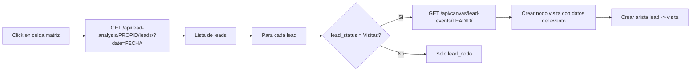

# SPEC: Nodo Visita en Canvas — Vinculación Lead → Evento Visita

> **Objetivo:** Al hacer clic en una celda de la Matriz de Leads, además de crear tarjetas lead_nodo, crear automáticamente nodos "visita" conectados a leads cuyo `lead_status` sea "Visitas", mostrando datos de la tabla `events`.
> **Fecha:** 2026-07-22
> **Versión:** 1.0

---

## 1. Flujo de datos



## 2. Cambios necesarios

### 2.1 Backend — Nuevo endpoint

**Archivo:** [`webapp/canvas/views.py`](webapp/canvas/views.py)

```python
def api_lead_events(request, lead_id):
    """
    GET /canvas/api/lead-events/<lead_id>/
    Retorna eventos de la tabla events vinculados a un lead.
    """
    user = _get_current_user(request)
    if not user:
        return JsonResponse({'error': 'No autenticado'}, status=401)
    
    try:
        from django.db import connections
        with connections['propifai'].cursor() as cursor:
            cursor.execute("""
                SELECT e.id, e.code, e.titulo, e.fecha_evento, 
                       e.hora_inicio, e.hora_fin, e.detalle, e.interesado,
                       e.status, e.property_id, e.event_type_id,
                       et.name AS event_type_name
                FROM events e
                LEFT JOIN event_types et ON et.id = e.event_type_id
                WHERE e.lead_id = %s
                  AND e.is_active = 1
                ORDER BY e.fecha_evento DESC, e.hora_inicio DESC
            """, [lead_id])
            
            eventos = []
            for row in cursor.fetchall():
                eventos.append({
                    'id': row[0],
                    'code': row[1] or '',
                    'titulo': row[2] or '',
                    'fecha_evento': row[3].isoformat() if hasattr(row[3], 'isoformat') else str(row[3]),
                    'hora_inicio': str(row[4]) if row[4] else '',
                    'hora_fin': str(row[5]) if row[5] else '',
                    'detalle': row[6] or '',
                    'interesado': row[7] or '',
                    'status': row[8] or '',
                    'property_id': row[9],
                    'event_type_id': row[10],
                    'event_type_name': row[11] or '',
                })
            
            return JsonResponse({'eventos': eventos, 'total': len(eventos)})
    except Exception as e:
        logger.error(f"Error obteniendo eventos para lead {lead_id}: {e}")
        return JsonResponse({'error': str(e)}, status=500)
```

**URL:** [`webapp/canvas/urls.py`](webapp/canvas/urls.py) — agregar:
```python
path('api/lead-events/<int:lead_id>/', views.api_lead_events, name='api_lead_events'),
```

### 2.2 Frontend — Nuevo tipo de nodo "visita"

**Archivo:** [`webapp/canvas/static/canvas/js/canvas_nodes.js`](webapp/canvas/static/canvas/js/canvas_nodes.js)

#### a) Función createVisitNode(leadId, eventData, leadNodeId, x, y)
- Crea nodo con `tipo: 'visita'`
- Header: badge 🏠 VISITA, título del evento
- Body: fecha, hora, detalle, interesado, tipo_evento
- Doble clic en header abre detalle de evento
- Arista desde el lead_nodo hacia el nodo visita

#### b) En restoreSnapshot — agregar handler para tipo 'visita'
```javascript
} else if (n.tipo === 'visita') {
    STATE.nodos[n.id] = {
        id: n.id, tipo: 'visita', ref_id: n.ref_id,
        x: n.x, y: n.y, width: n.width || 260, height: n.height || 180,
        collapsed: false, color: null, el: null,
        field_data: n.field_data || null,
    };
```

#### c) En renderPlaceholderNodes — agregar render para tipo 'visita'
Template visual con badge "VISITA", título, fecha, hora, detalle.

#### d) En canvas_history.js — agregar render para tipo 'visita'
Mismo template que en canvas_nodes.js para consistencia en undo/redo.

### 2.3 Frontend — Lógica de creación desde matriz

Modificar el handler de click en celda de matriz en [`canvas_nodes.js`](webapp/canvas/static/canvas/js/canvas_nodes.js):

```javascript
// Después de crear cada lead_nodo:
if (lead.lead_status === 'Visitas' || lead.lead_status === 'Visita') {
    fetch('/canvas/api/lead-events/' + lead.id + '/')
        .then(function(r) { return r.json(); })
        .then(function(eventData) {
            var eventos = eventData.eventos || [];
            eventos.forEach(function(ev, evIdx) {
                var visitNodeId = 'visita_' + lead.id + '_' + ev.id;
                if (STATE.nodos[visitNodeId]) return;
                var vx = leadNodeX + 280;
                var vy = leadNodeY + (evIdx * 200);
                createVisitNode(visitNodeId, ev, leadNodeId, vx, vy);
            });
        })
        .catch(function(err) {
            console.warn('[LeadMatrix] Error fetching events for lead', lead.id, err);
        });
}
```

### 2.4 Aristas
- Arista `lead` del nodo matriz al lead_nodo (ya existe)
- Arista `visita` del lead_nodo al nodo visita (nueva)
```javascript
STATE.aristas[edgeId] = {
    id: edgeId, origen: leadNodeId, destino: visitNodeId,
    tipo: 'visita', label: ev.titulo || 'Visita',
};
```

---

## 3. Diseño del nodo Visita

```
┌─────────────────────────────┐
│ 🏠 VISITA  Título evento  ✕│  ← Header (doble clic abre detalle)
├─────────────────────────────┤
│ 📅 15/07/2026               │
│ 🕐 10:00 - 11:30            │
│ 👤 Juan Pérez               │  ← Interesado
│ 🏷️ Cita presencial          │  ← Tipo evento
├─────────────────────────────┤
│ Detalle de la visita...     │  ← Body
│ (texto del detalle)         │
└─────────────────────────────┘
```

---

## 4. Criterios de aceptación

- [ ] Al hacer click en celda de matriz con leads, se crean lead_nodo y los correspondientes nodos visita para leads con status "Visitas"
- [ ] Los nodos visita muestran: título, fecha, hora, interesado, tipo de evento, detalle
- [ ] Arista conecta lead_nodo → nodo visita con label del título
- [ ] Al guardar y recargar el canvas, los nodos visita se restauran correctamente
- [ ] Undo/redo mantiene los nodos visita
- [ ] Botón "Limpiar leads" también remueve nodos visita conectados
- [ ] Doble clic en header del nodo visita abre detalle del evento
