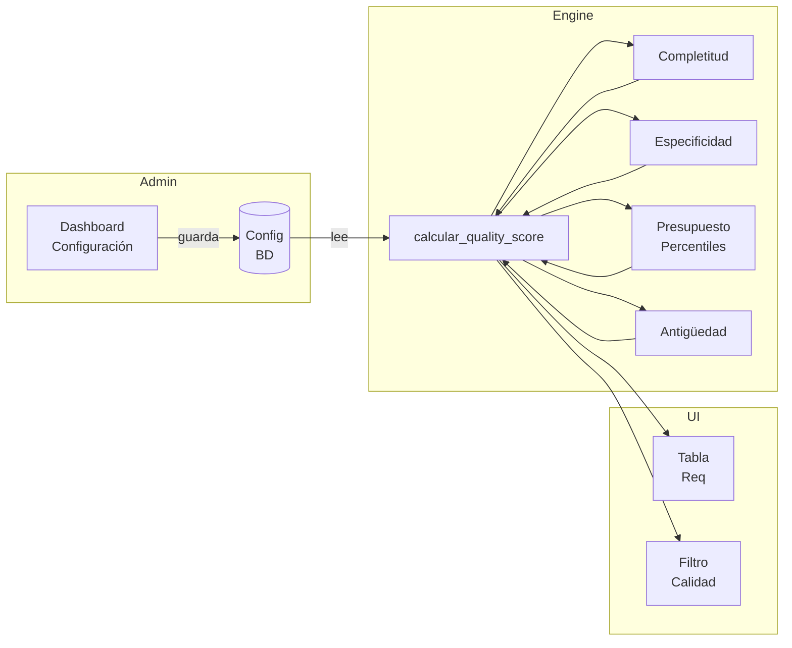

# Propuesta: Sistema de Calidad de Requerimientos con Dashboard Configurable

## 1. Arquitectura General

```
┌─────────────────────────────────────────────────────────────────┐
│                    Quality Score Engine                          │
│                                                                  │
│  Lee config → Calcula scores → Retorna resultado                │
│       ▲                                                         │
│       │ lee de                                                  │
│  ┌────┴──────────┐                                              │
│  │ Configuración  │  ← Dashboard web para editar                │
│  │ (BD)           │                                              │
│  └────────────────┘                                              │
└─────────────────────────────────────────────────────────────────┘
```

---

## 2. Modelo de Configuración

Se crea un modelo simple [`ConfiguracionCalidad`] que guarda todos los parámetros en un solo registro con un campo JSON:

```python
class ConfiguracionCalidad(models.Model):
    # Un solo registro activo
    activo = models.BooleanField(default=True)
    # Toda la configuración en un JSON
    config = models.JSONField(default=dict)
    creado_en = models.DateTimeField(auto_now_add=True)
    actualizado_en = models.DateTimeField(auto_now=True)

    class Meta:
        db_table = 'config_calidad'
```

### Estructura del JSON de configuración:

```json
{
  "pesos_dimensiones": {
    "completitud": 35,
    "especificidad": 25,
    "presupuesto": 25,
    "antiguedad": 15
  },

  "completitud_tiers": {
    "criticos": {
      "campos": ["distritos", "tipo_propiedad", "condicion"],
      "puntos_por_campo": 3
    },
    "importantes": {
      "campos": ["presupuesto_monto", "habitaciones", "urbanizacion", "agente"],
      "puntos_por_campo": 2
    },
    "complementarios": {
      "campos": ["presupuesto_moneda", "presupuesto_forma_pago", "banos",
                 "area_m2", "zona", "cochera", "ascensor", "amueblado"],
      "puntos_por_campo": 1
    }
  },

  "especificidad_niveles": [
    {"nombre": "Muy específico", "min_score": 100,
     "regla": "zona_llena AND urbanizacion_llena AND 1_distrito"},
    {"nombre": "Específico", "min_score": 75,
     "regla": "urbanizacion_llena OR zona_llena"},
    {"nombre": "Preciso", "min_score": 50,
     "regla": "1_distrito"},
    {"nombre": "Amplio", "min_score": 30,
     "regla": "multi_distrito"},
    {"nombre": "Sin ubicación", "min_score": 0,
     "regla": "sin_distrito"}
  ],

  "antiguedad_rangos": [
    {"dias_max": 7, "score": 100},
    {"dias_max": 30, "score": 75},
    {"dias_max": 90, "score": 40},
    {"dias_max": 180, "score": 15},
    {"dias_max": 99999, "score": 5}
  ],

  "presupuesto_percentiles": {
    "p25_score": 100,
    "p25_a_p50_score": 80,
    "p50_a_p75_score": 50,
    "mayor_p75_score": 20,
    "sin_presupuesto_score": 0,
    "min_muestras": 10
  }
}
```

### Valores por defecto (pre-cargados con migración)

Al crear la configuración, se cargan estos defaults. El usuario puede modificarlos desde el dashboard.

---

## 3. Dashboard de Configuración

### Ruta: `/requerimientos/configuracion-calidad/`

Un formulario con secciones visuales:

### 3.1 Pesos de dimensiones (sliders)

```
┌──────────────────────────────────────────────────┐
│ Pesos de cada dimensión (debe sumar 100%)         │
│                                                    │
│ Completitud    ──●──────────────────  35%         │
│ Especificidad  ────●────────────────  25%         │
│ Presupuesto    ────●────────────────  25%         │
│ Antigüedad     ─────────●───────────  15%         │
│                               Total: 100% ✅      │
└──────────────────────────────────────────────────┘
```

### 3.2 Tiers de completitud (inputs numéricos)

```
┌──────────────────────────────────────────────────┐
│ Puntos por campo en cada nivel                    │
│                                                    │
│ Críticos       [3] pts c/u  │ distritos, tipo,    │
│                              │ condicion           │
│ Importantes    [2] pts c/u  │ presupuesto, habs,  │
│                              │ urbanizacion, agente│
│ Complementarios[1] pts c/u  │ baños, área, zona,  │
│                              │ cochera, ascensor...│
└──────────────────────────────────────────────────┘
```

### 3.3 Niveles de especificidad (inputs numéricos)

```
┌──────────────────────────────────────────────────┐
│ Puntaje por nivel geográfico                      │
│                                                    │
│ Muy específico  [100]  zona + urbanizacion        │
│ Específico      [75]   urbanizacion o zona        │
│ Preciso         [50]   1 distrito                 │
│ Amplio          [30]   2+ distritos               │
│ Sin ubicación   [0]    sin distritos              │
└──────────────────────────────────────────────────┘
```

### 3.4 Rangos de antigüedad (inputs)

```
┌──────────────────────────────────────────────────┐
│ Antigüedad en días                                │
│                                                    │
│ ≤ [7]  días → 100 pts                             │
│ ≤ [30] días → 75 pts                              │
│ ≤ [90] días → 40 pts                              │
│ ≤ [180] días → 15 pts                             │
│ > 180 días → 5 pts                                │
└──────────────────────────────────────────────────┘
```

### 3.5 Percentiles de presupuesto

```
┌──────────────────────────────────────────────────┐
│ Puntajes por ubicación en percentil               │
│                                                    │
│ ≤ P25        [100] pts  │ Muy accesible           │
│ P25 - P50    [80]  pts  │ Normal-bajo             │
│ P50 - P75    [50]  pts  │ Normal-alto             │
│ > P75        [20]  pts  │ Presupuesto alto        │
│ Sin monto    [0]   pts  │                         │
│                                                    │
│ Muestras mínimas: [10]                             │
└──────────────────────────────────────────────────┘
```

---

## 4. Funcionamiento del Engine

```python
def get_config():
    """Obtiene la configuración activa, o los defaults si no existe."""
    try:
        cfg = ConfiguracionCalidad.objects.get(activo=True)
        return cfg.config
    except ConfiguracionCalidad.DoesNotExist:
        return CONFIG_DEFAULT  # dict con los defaults

def calcular_quality_score(req):
    cfg = get_config()

    scores = {
        'completitud': _score_completitud(req, cfg),
        'especificidad': _score_especificidad(req, cfg),
        'presupuesto': _score_presupuesto(req, cfg),
        'antiguedad': _score_antiguedad(req, cfg),
    }

    pesos = cfg['pesos_dimensiones']
    total = sum(
        scores[k] * (pesos[k] / 100) for k in pesos
    )

    return {
        'score': round(total, 1),
        'nivel': _nivel_from_score(total),
        'detalle': scores,
    }
```

---

## 5. Visualización en Tabla de Requerimientos

Se agrega una columna "Calidad" después de "Verificado":

```
┌────┬─────────┬──────────────┬──────────┬──────────┐
│ ID │ Cliente │ Distritos    │ Calidad  │ Acciones │
├────┼─────────┼──────────────┼──────────┼──────────┤
│ 42 │ Juan    │ Cayma        │ ████░76 │ [Ver]    │
│    │         │              │ 🟢 Bueno │          │
├────┼─────────┼──────────────┼──────────┼──────────┤
│ 43 │ María   │ Yanahuara    │ ██░░░42 │ [Ver]    │
│    │         │              │ 🟡 Regular│          │
└────┴─────────┴──────────────┴──────────┴──────────┘
```

### Tooltip al hacer hover

```
┌─────────────────────────────────┐
│ 📊 Calidad del requerimiento    │
│                                 │
│ Completitud    ████████░░  64   │
│ Especificidad  ██████████░  75  │
│ Presupuesto    ████████████ 80  │
│ Antigüedad     ████████████ 100 │
│ ─────────────────────────────  │
│ Total          76/100  🟢 Bueno│
└─────────────────────────────────┘
```

### Filtro por nivel de calidad

En la barra de filtros se agrega:

```html
<select name="calidad_minima">
  <option value="">Cualquier calidad</option>
  <option value="excelente">Solo Excelente (80+)</option>
  <option value="bueno">Buena o mejor (60+)</option>
  <option value="regular">Regular o mejor (40+)</option>
</select>
```

---

## 6. Plan de Implementación Completo

| # | Paso | Archivos | Descripción |
|---|---|---|---|
| 1 | Crear modelo `ConfiguracionCalidad` | `models.py` + migración `0010` | Modelo con campo JSON, signal `post_migrate` para crear registro default |
| 2 | Crear funciones de calidad | `analytics.py` | 4 funciones de dimensión + `calcular_quality_score()` que leen de la config |
| 3 | Agregar `@property` al modelo | `models.py` | Propiedad `quality_score` en `Requerimiento` |
| 4 | Crear dashboard de configuración | `views.py` + `configuracion_calidad.html` | Formulario con sliders e inputs para todos los parámetros |
| 5 | Agregar ruta de configuración | `urls.py` | `path('configuracion-calidad/', ...)` |
| 6 | Agregar columna calidad en tabla | `lista.html` | HTML + CSS de barra + tooltip + filtro |
| 7 | Pre-cargar configuración default | migración `0010` o `AppConfig.ready()` | Insertar registro con valores por defecto |

---

## 7. Diagrama de flujo



---

## 8. Preguntas para afinar

1. **¿El dashboard de configuración debería ser una página simple tipo formulario, o prefieres que sea tipo JSON editor (code mirror)?** — El formulario es más amigable, el JSON editor más flexible.

2. **¿Quieres también una página de "Estadísticas de Calidad" que muestre histogramas de cómo están distribuidos los scores en todo el dataset?**

3. **¿El filtro por calidad en la tabla debería ser por nivel textual (excelente/bueno/regular) o por rango numérico (score >= 60)?**
