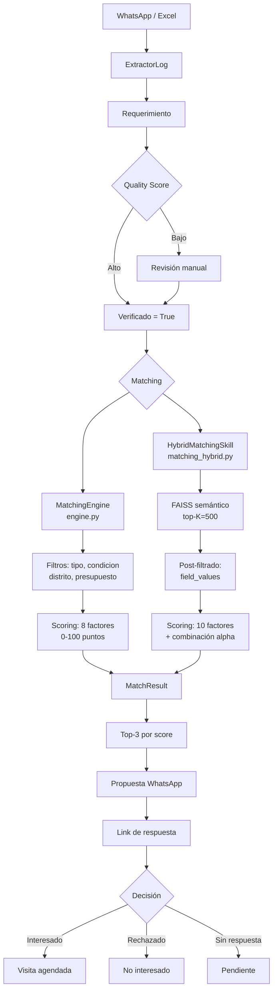
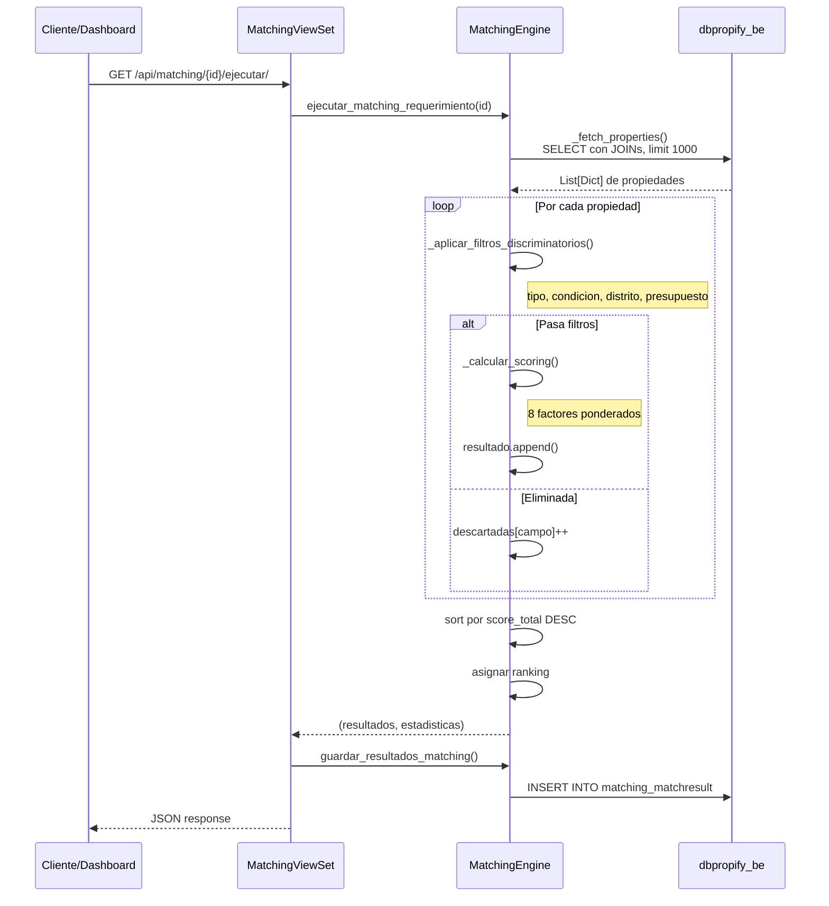
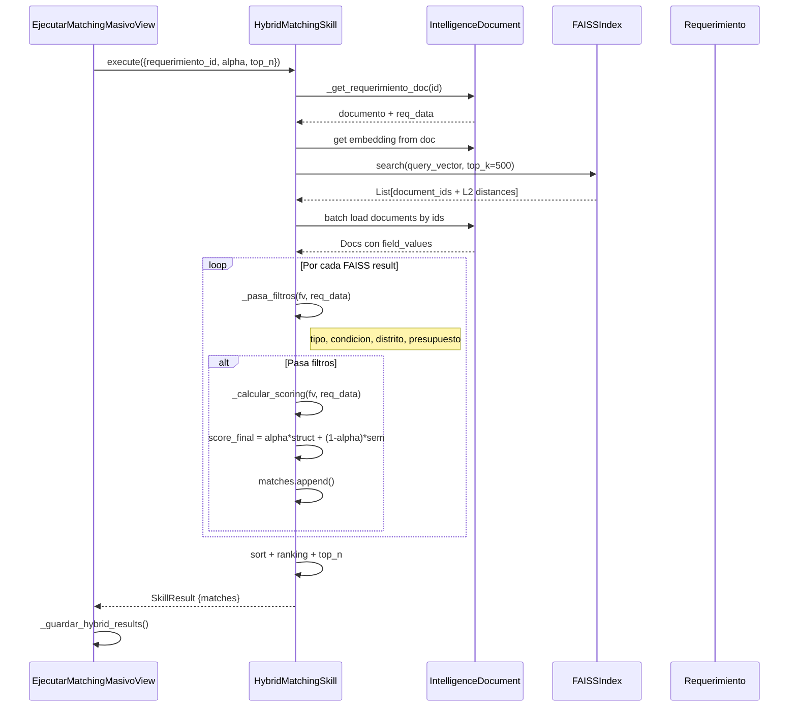
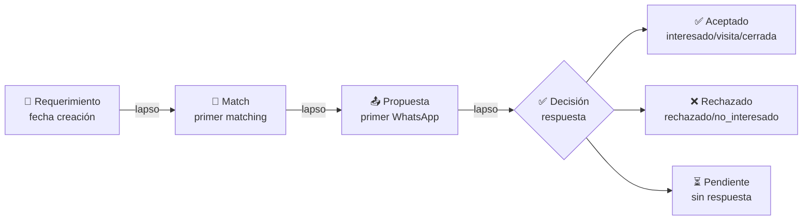
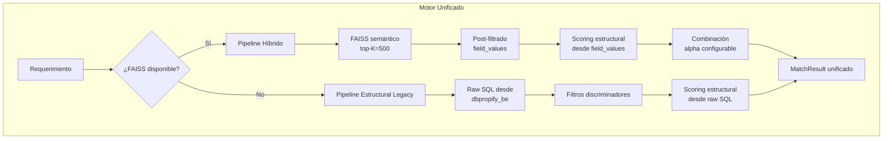
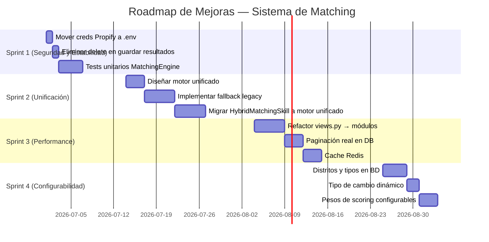

# Análisis del Sistema de Matching — Propifai

> **Versión:** 1.0  
> **Fecha:** 2026-06-26  
> **Autor:** Zoo (Arquitecto)  
> **Propósito:** Documentar la arquitectura actual, flujo de datos, puntos débiles y oportunidades de mejora del módulo `matching/`.

---

## 1. Arquitectura Actual

### 1.1. Componentes del Sistema

El sistema de matching tiene **tres capas** que coexisten:

```
┌─────────────────────────────────────────────────────────────────────┐
│                        CAPA DE PRESENTACIÓN                         │
│                                                                     │
│  Dashboard         Matching Masivo      Calendario      Pipeline    │
│  (dashboard.html)  (masivo.html)       (calendar.html)  (REST API) │
└─────────────────────────────────┬───────────────────────────────────┘
                                  │
┌─────────────────────────────────▼───────────────────────────────────┐
│                       CAPA DE NEGOCIO (views.py ~2817 líneas)       │
│                                                                     │
│  MatchingViewSet    MatchingMasivoView    DetalleHibridoView        │
│  MatchResultViewSet MatchingDashboardView PropuestasDashboardView   │
│  PropuestaWhatsAppViewSet  MatchingCalendarView                     │
│  MatchesDashboardView  PropiedadesMatchesDashboardView              │
└─────────────────────────────────┬───────────────────────────────────┘
                                  │
┌─────────────────────────────────▼───────────────────────────────────┐
│                    MOTORES DE MATCHING (2 vías)                     │
│                                                                     │
│  ┌──────────────────────┐    ┌──────────────────────────────┐      │
│  │  MatchingEngine      │    │  HybridMatchingSkill         │      │
│  │  (engine.py)         │    │  (intelligence/skills/       │      │
│  │                      │    │   matching_hybrid.py)        │      │
│  │  Raw SQL →            │    │                              │      │
│  │  dbpropify_be        │    │  FAISS semántico +           │      │
│  │                      │    │  field_values estructural    │      │
│  │  8 factores           │    │                              │      │
│  │  Filtros → Scoring   │    │  10 factores                 │      │
│  │                      │    │  Filtros → FAISS → Scoring   │      │
│  └──────────────────────┘    └──────────────────────────────┘      │
└─────────────────────────────────┬───────────────────────────────────┘
                                  │
┌─────────────────────────────────▼───────────────────────────────────┐
│                        MODELOS DE DATOS                             │
│                                                                     │
│  MatchResult         PropuestaWhatsApp       Requerimiento          │
│  (matching/models)   (matching/models)      (requerimientos/)       │
│                                                                     │
│  dbpropify_be (BD externa)  ←───  PropifaiProperty (ORM local)     │
│  property + property_specs        PropiedadRaw (ingestas/)          │
└─────────────────────────────────────────────────────────────────────┘
```

### 1.2. MatchingEngine (`engine.py`) — Motor Legacy

**Archivo:** [`webapp/matching/engine.py`](../webapp/matching/engine.py)

El motor principal funciona en **dos fases**:

#### Fase 1: Filtros Discriminatorios (eliminación inmediata)
1. **Tipo de propiedad** — Coincide nombre del tipo usando cache de `property_type`
2. **Condición** — Compra (operation_type_id 1,2) vs Alquiler (operation_type_id 3)
3. **Distrito** — Coincidencia por ID o nombre contra `DISTRITOS` de `mapeo_ubicaciones`
4. **Presupuesto** — Convierte monedas y aplica 10% de tolerancia hacia arriba

#### Fase 2: Scoring Ponderado (0-100)
| Factor | Peso | Descripción |
|--------|------|-------------|
| distrito | 30 | Primer distrito del requerimiento da score 1.0, otros 0.8 |
| tipo_propiedad | 30 | Coincidencia exacta del tipo |
| precio | 30 | Proximidad al presupuesto (dentro de 10% de tolerancia) |
| habitaciones | 3 | Si propiedad tiene >= requeridas → 1.0 |
| banos | 2 | Si propiedad tiene >= requeridos → 1.0 |
| area | 2 | Diferencia porcentual vs tolerancia 10% |
| amenities | 2 | Coincidencias en amenities booleanos |
| ascensor | 1 | Coincide con preferencia sí/no |

**Total:** 100 puntos

#### Fuente de Datos
- Consulta raw SQL a `dbpropify_be` (`connections['propifai']`)
- JOIN entre `property` y `property_specs`
- Cache global de `property_type` y `district`
- Tipo de cambio fijo: `1 USD = 3.75 PEN`

#### Funciones clave
- `ejecutar_matching_requerimiento()` — Matching individual
- `ejecutar_matching_masivo()` — Matching batch (hasta 2000 requerimientos)
- `guardar_resultados_matching()` — Persiste en `MatchResult`
- `obtener_resumen_matching_masivo()` — Dashboard de resultados

### 1.3. HybridMatchingSkill (`matching_hybrid.py`) — Motor Híbrido

**Archivo:** [`webapp/intelligence/skills/matching_hybrid.py`](../webapp/intelligence/skills/matching_hybrid.py)

Pipeline de 6 pasos:

1. **Obtener requerimiento** desde `IntelligenceDocument` (colección `requerimientos_enbedados`)
2. **Extraer embedding** precomputado del requerimiento
3. **Búsqueda FAISS** en `propiedadespropify` (top-K=500)
4. **Post-filtrado** por `field_values` (tipo, condicion, distrito, presupuesto)
5. **Scoring estructural** desde `field_values` (10 factores ponderados)
6. **Combinación**: `score = alpha * struct + (1-alpha) * sem`

#### Diferencias clave vs MatchingEngine

| Aspecto | MatchingEngine | HybridMatchingSkill |
|---------|---------------|---------------------|
| Fuente datos | Raw SQL a dbpropify_be | IntelligenceDocument + FAISS |
| Matching semántico | ❌ No | ✅ Sí (embeddings + FAISS) |
| Filtros | 4 discriminadores | 4 filtros duros |
| Factores scoring | 8 | 10 (agrega antigüedad, estacionamiento) |
| Pesos | distrito/tipo/precio 90% | distrito/tipo/precio 90% |
| Tipo cambio | 3.75 fijo | 3.75 fijo (duplicado) |
| Caché tipos | _PROPERTY_TYPES_CACHE | _TIPO_CACHE (separado) |
| Dependencias | DB propifai + mapeo_ubicaciones | FAISS index + IntelligenceDocument |

### 1.4. Modelos de Datos

#### MatchResult ([`webapp/matching/models.py:52`](../webapp/matching/models.py:52))
- `requerimiento` → FK a `Requerimiento` (db_constraint=False)
- `propiedad` → FK a `PropifaiProperty` (db_constraint=False)
- `score_total` → Decimal(5,2) — Score 0-100
- `score_detalle` → JSONField — Desglose por factor
- `fase_eliminada` → CharField — Por qué filtro fue eliminada
- `ejecutado_en` → DateTime auto_now_add
- `ranking` → PositiveInteger
- **unique_together:** (requerimiento, propiedad, ejecutado_en)

#### PropuestaWhatsApp ([`webapp/matching/models.py:6`](../webapp/matching/models.py:6))
- Tracking de propuestas enviadas por WhatsApp
- Status: enviada → respondida → interesado/rechazado/visita_agendada/cerrada
- Almacena datos de propiedad por si la propiedad se elimina

#### Requerimiento ([`webapp/requerimientos/models.py:73`](../webapp/requerimientos/models.py:73))
- ~30 campos: fuente, agente, condicion, tipo, distritos, presupuesto, specs
- Quality Score: `quality_score`, `quality_nivel`, `quality_detalle` (JSON)
- Hash SHA256 para deduplicación
- Índices compuestos en `condicion+tipo`, `fecha`, `presupuesto`

### 1.5. API REST

**Router:** [`webapp/matching/urls.py`](../webapp/matching/urls.py)

| Endpoint | Método | Descripción |
|----------|--------|-------------|
| `api/matching/{id}/ejecutar/` | GET | Ejecuta matching y guarda resultados |
| `api/matching/{id}/resumen/` | GET | Estadísticas del último matching |
| `api/matching/{id}/guardados/` | GET | Top 3 resultados guardados (score >= 60%) |
| `api/matching/{id}/guardar/` | POST | Guarda resultados manualmente |
| `api/matching/{id}/pipeline/` | GET | Pipeline de vida del requerimiento |
| `api/matching/{id}/pipeline-ramas/` | GET | Pipeline multi-rama con propuestas |
| `api/matching/{id}/pipeline-matches/` | GET | Matches como ramas de pipeline |
| `api/matching/historial/{id}/` | GET | Historial de ejecuciones |
| `api/propuesta/*` | VARIOS | CRUD de propuestas WhatsApp |
| `api/hibrido/detalle/{id}/` | GET | JSON detalle híbrido |

### 1.6. Propify API Client ([`webapp/matching/propify_api.py`](../webapp/matching/propify_api.py))

Cliente HTTP para `api.propify.pe` con autenticación JWT. Expone:
- `get_matches()` — Matches del CRM externo
- `get_requirements()` — Requerimientos del CRM externo
- `get_properties()` — Propiedades del CRM externo
- `get_property_detail()` — Detalle individual

**⚠️ Credenciales hardcodeadas** en el propio archivo.

---

## 2. Flujo de Datos

### 2.1. Flujo Completo: Requerimiento → Match → Propuesta



### 2.2. Flujo Detallado del MatchingEngine



### 2.3. Flujo Detallado del HybridMatchingSkill



### 2.4. Pipeline de Vida del Requerimiento

**Archivo:** [`webapp/matching/pipeline_requerimiento.py`](../webapp/matching/pipeline_requerimiento.py)



Cada etapa registra:
- Fecha/hora del evento
- Lapso desde la etapa anterior (días, horas, minutos)
- Detalle específico (score del match, status de propuesta, etc.)

---

## 3. Puntos Débiles Identificados

### 3.1. CRÍTICOS — Impacto en Producción

| # | Problema | Archivo | Línea | Severidad | Impacto |
|---|----------|---------|-------|-----------|---------|
| 1 | **Dos motores de matching incompatibles** | `engine.py` + `matching_hybrid.py` | — | 🔴 Crítico | Resultados inconsistentes según qué motor se ejecute. Legacy usa raw SQL dbpropify_be, Hybrid usa FAISS. Scores no son comparables. |
| 2 | **Raw SQL con SQL injection potencial** | `engine.py` | 192 | 🔴 Crítico | Uso de f-string en query SQL (`f"""{where_clause}"""`). Aunque `where_clause` es controlada, el patrón es riesgoso. |
| 3 | **Sin deduplicación de MatchResult** | `views.py` | 1701 | 🔴 Crítico | `MatchResult.objects.filter(requerimiento=requerimiento).delete()` se ejecuta antes de guardar nuevos resultados. Esto elimina histórico de matches. |
| 4 | **Unique constraint frágil** | `models.py` | 131 | 🔴 Crítico | `unique_together = [requerimiento, propiedad, ejecutado_en]`. Si dos ejecuciones caen en el mismo microsegundo, hay duplicados. |
| 5 | **Hardcode de tipo de cambio** | `engine.py:31`, `matching_hybrid.py:798` | 31 | 🔴 Crítico | `TIPO_CAMBIO_USD_PEN = 3.75`. Debería ser configurable vía BD o settings. |

### 3.2. ALTOS — Deuda Técnica Significativa

| # | Problema | Archivo | Línea | Severidad | Impacto |
|---|----------|---------|-------|-----------|---------|
| 6 | **views.py de 2817 líneas** | `views.py` | 1-2817 | 🟠 Alto | Monstruo de una sola clase. Viola SRP. Difícil de testear, mantener, debuggear. |
| 7 | **Cache en memoria global** | `views.py` | 29-59 | 🟠 Alto | `_all_matches_cache` es volátil. Se invalida si cambia el cliente, no si cambian los datos. No escala horizontalmente. |
| 8 | **Múltiples queries N+1 en dashboards** | `views.py` | 2144-2155 | 🟠 Alto | Paginación en memoria sin offset DB. Fetch de TODAS las páginas de requerimientos y propiedades. |
| 9 | **Hardcode de credenciales Propify** | `propify_api.py` | 17-18 | 🟠 Alto | `PROPIFY_USERNAME` y `PROPIFY_PASSWORD` hardcodeados. Deberían ir en `.env`. |
| 10 | **Sin tests unitarios** | `tests.py` | — | 🟠 Alto | El archivo tests.py está vacío o no cubre la lógica de matching. |
| 11 | **Lógica duplicada en ambos motores** | `engine.py` + `matching_hybrid.py` | — | 🟠 Alto | Los mismos scorers (precio, área, habitaciones, baños, amenities, ascensor, tipo) están implementados dos veces con lógica casi idéntica. |

### 3.3. MEDIOS — Problemas de Calidad

| # | Problema | Archivo | Línea | Severidad | Impacto |
|---|----------|---------|-------|-----------|---------|
| 12 | **Tipo de cambio obsoleto** | `engine.py:31` | 31 | 🟡 Medio | 3.75 no refleja el tipo de cambio real del mercado peruano actual (~3.60-3.70). Mejor usar API de SUNAT o BCRP. |
| 13 | **Caché de PropertyTypes global mutable** | `engine.py:24-25` | 24 | 🟡 Medio | Variables globales mutables en módulo. Si hay concurrencia, pueden haber race conditions. |
| 14 | **Score de amenities frágil** | `engine.py:644-667` | 644 | 🟡 Medio | Mapeo hardcodeado de palabras clave a campos booleanos. No extensible sin modificar código. |
| 15 | **Distritos de Arequipa hardcodeados** | `propifai/mapeo_ubicaciones.py` | — | 🟡 Medio | `DISTRITOS` en archivo Python en vez de en BD. Si se agrega un distrito nuevo, hay que modificar código. |
| 16 | **MatchResult sin FK constraint** | `models.py:62,69` | 62 | 🟡 Medio | `db_constraint=False` permite orphans. Si se elimina un Requerimiento o PropifaiProperty, los MatchResult quedan huérfanos. |
| 17 | **Pipeline con queries repetitivas** | `pipeline_requerimiento.py:158-177` | 158 | 🟡 Medio | Hace 3 queries separadas a MatchResult cuando podría hacer 1 con annotate. |
| 18 | **Filtro "solo verificados" inconsistente** | `views.py:832-836` | 832 | 🟡 Medio | En algunos endpoints se filtran, en otros no. El dashboard masivo los requiere, pero el individual no. |
| 19 | **Sin logging estructurado** | Todo el módulo | — | 🟡 Medio | Uso de `logger.warning` sin request-id ni contexto de sesión. Dificulta debugging en producción. |

### 3.4. BAJOS — Mejoras Cosméticas

| # | Problema | Archivo | Línea | Severidad | Impacto |
|---|----------|---------|-------|-----------|---------|
| 20 | **HTML/CSS/JS inline en templates** | `dashboard.html` | 1-1451 | 🟢 Bajo | Todo el CSS y JS está inline. No usa archivos estáticos externos. |
| 21 | **Chart.js cargado desde CDN** | `dashboard.html` | 929 | 🟢 Bajo | Dependencia externa sin fallback. Si el CDN falla, el dashboard no funciona. |
| 22 | **Nombres de variables en español e inglés mezclados** | Todo el módulo | — | 🟢 Bajo | `propiedad_id`, `score_total`, `fase_eliminada`, `computed_at` mezclan idiomas. |
| 23 | **Fechas sin timezone consistente** | `pipeline_requerimiento.py:101-107` | 101 | 🟢 Bajo | Conversión manual aware/naive. Podría usar `django.utils.timezone` siempre. |

---

## 4. Oportunidades de Mejora Priorizadas

### 4.1. Prioridad Alta (Hacer Ya)

| # | Mejora | Esfuerzo | Beneficio | Dependencias |
|---|--------|----------|-----------|-------------|
| A1 | **Unificar los dos motores en uno solo** | 2-3 semanas | Elimina inconsistencia de resultados; reduce código duplicado; unifica pipeline de datos | Requiere definir arquitectura del motor unificado |
| A2 | **Mover credenciales Propify a .env** | 1 hora | Seguridad; facilita rotación de credenciales; evita exposición en git | Ninguna |
| A3 | **Eliminar el delete de MatchResult antes de guardar** | 30 min | Preserva histórico de matching; permite auditoría | Ninguna |
| A4 | **Agregar tests unitarios para MatchingEngine** | 3-4 días | Previene regresiones; documenta comportamiento esperado | Mock de conexión propifai |

#### A1 — Unificación de Motores (Detalle)

**Problema:** Dos implementaciones paralelas que hacen lo mismo de formas diferentes.

**Solución propuesta:**



**Criterios:**
- Si FAISS está disponible → pipeline híbrido
- Si no → pipeline legacy (fallback)
- Misma estructura de `score_detalle` en ambos casos
- Alpha y pesos configurables por tenant/config

### 4.2. Prioridad Media (Siguiente Sprint)

| # | Mejora | Esfuerzo | Beneficio | Dependencias |
|---|--------|----------|-----------|-------------|
| B1 | **Refactorizar views.py en múltiples archivos** | 1 semana | Mantenibilidad; cada vista en su propio archivo | Ninguna |
| B2 | **Agregar paginación real en DB (no en memoria)** | 2-3 días | Performance en dashboards con grandes volúmenes | Conocimiento de SQL Server |
| B3 | **Reemplazar cache en memoria por Redis** | 2-3 días | Escalabilidad horizontal; persistencia de cache | Redis ya configurado para Celery |
| B4 | **Mover distritos y tipos de propiedad a BD** | 3-4 días | Configurable desde UI; sin necesidad de deploy | Crear modelos nuevos |
| B5 | **Agregar tipo de cambio dinámico** | 1-2 días | Precisión en conversiones; configurable | API de SUNAT/BCRP o tabla en BD |

### 4.3. Prioridad Baja (Backlog Técnico)

| # | Mejora | Esfuerzo | Beneficio |
|---|--------|----------|-----------|
| C1 | **Mover templates a archivos estáticos (CSS/JS separados)** | 2-3 días | Caché de assets; separación de concerns |
| C2 | **Internacionalizar nombres de variables (todo a inglés o español)** | 1 semana | Consistencia del código |
| C3 | **Agregar índices compuestos faltantes en MatchResult** | 1 hora | Performance en consultas frecuentes |
| C4 | **Reemplazar Chart.js CDN por bundle local** | 30 min | Sin dependencia externa |
| C5 | **Agregar timezone-aware en pipeline_requerimiento** | 1 hora | Consistencia de fechas |

### 4.4. Roadmap Recomendado



---

## 5. Estructura de Archivos del Módulo

```
webapp/matching/
├── __init__.py
├── admin.py                    # Admin de Django
├── apps.py                     # Config de app
├── engine.py                   # ⭐ Motor de matching legacy (746 líneas)
├── models.py                   # MatchResult + PropuestaWhatsApp
├── pipeline_requerimiento.py   # Pipeline de vida del requerimiento
├── propify_api.py              # Cliente API externa de Propify
├── README_MATCHING.md          # Documentación existente
├── serializers.py              # Serializers DRF
├── tests.py                    # ❌ Vacío
├── urls.py                     # Rutas
├── views.py                    # ⚠️ 2817 líneas — monstruo
├── management/
│   └── commands/
│       └── recalcular_matching_calendario.py
├── migrations/
│   └── 0001_initial.py
├── static/matching/
│   └── matching.js
└── templates/matching/
    ├── calendar.html
    ├── dashboard.html
    ├── detalle_hibrido.html
    ├── masivo.html
    ├── matches_dashboard.html
    ├── matches_por_propiedad.html
    ├── propuestas_dashboard.html
    ├── respuesta_propuesta.html
    └── partials/
        └── resumen_requerimiento.html
```

---

## 6. Conclusiones

1. **El sistema funciona** pero tiene dos motores de matching que compiten entre sí, generando resultados inconsistentes. La prioridad #1 es unificarlos.

2. **La deuda técnica es alta**: `views.py` (2817 líneas), lógica duplicada entre engine.py y matching_hybrid.py, credenciales hardcodeadas, sin tests.

3. **La arquitectura de datos es frágil**: `db_constraint=False` en MatchResult permite datos huérfanos, y la deduplicación se hace borrando todo el historial antes de guardar.

4. **El matching semántico (HybridMatchingSkill)** es un paso adelante significativo, pero su dependencia de FAISS + IntelligenceDocument lo hace frágil. Si FAISS no está cargado o los documentos no tienen embeddings, el matching simplemente no funciona.

5. **Oportunidades claras**: con ~3-4 sprints enfocados, el sistema puede pasar de "funciona pero duele" a "sólido, testeable y configurable".
