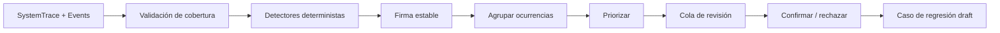

# SPEC N2 — Detección offline de patrones e incidentes

**Nivel:** 2  
**Tipo:** implementación después del gate de Nivel 1  
**Modo:** offline/shadow, sin mutaciones  
**Dependencia obligatoria:** telemetría Nivel 1 estable durante siete días

---

## 1. Resultado esperado

Un proceso programado analizará traces recientes y producirá incidentes candidatos
agrupados, priorizados y acompañados de evidencia. Un operador podrá confirmar o
rechazar cada candidato. Los confirmados se transformarán en casos de regresión.

Este nivel detecta y organiza aprendizaje, pero **no cambia código, prompts,
thresholds, routing ni índices**.

---

## 2. Modelo de datos

### 2.1 `ErrorPattern`

```python
class ErrorPattern(models.Model):
    id = models.UUIDField(primary_key=True, default=uuid.uuid4, editable=False)
    signature = models.CharField(max_length=64, unique=True, db_index=True)
    error_code = models.CharField(max_length=80, db_index=True)
    component = models.CharField(max_length=100, db_index=True)
    severity = models.CharField(max_length=20, db_index=True)
    title = models.CharField(max_length=255)
    description = models.TextField(blank=True, default='')
    first_seen_at = models.DateTimeField()
    last_seen_at = models.DateTimeField(db_index=True)
    occurrence_count = models.IntegerField(default=0)
    affected_versions = models.JSONField(default=list)
    dimensions = models.JSONField(default=dict)
    status = models.CharField(max_length=30, choices=[
        ('candidate', 'Candidate'),
        ('confirmed', 'Confirmed'),
        ('rejected', 'Rejected'),
        ('mitigated', 'Mitigated'),
        ('resolved', 'Resolved'),
        ('regressed', 'Regressed'),
    ], db_index=True)
    confidence = models.FloatField(default=0.0)
    detector_version = models.CharField(max_length=30)
    created_at = models.DateTimeField(auto_now_add=True)
    updated_at = models.DateTimeField(auto_now=True)
```

### 2.2 `PatternOccurrence`

Relaciona patrón y trace sin duplicar payloads:

```python
class PatternOccurrence(models.Model):
    pattern = models.ForeignKey(
        ErrorPattern, on_delete=models.CASCADE, related_name='occurrences'
    )
    trace = models.ForeignKey(SystemTrace, on_delete=models.CASCADE)
    evidence = models.JSONField(default=dict)
    detector_name = models.CharField(max_length=100)
    detector_score = models.FloatField(default=1.0)
    detected_at = models.DateTimeField(auto_now_add=True)
```

Constraint único: `(pattern, trace, detector_name)`.

### 2.3 `PatternReview`

```python
class PatternReview(models.Model):
    pattern = models.ForeignKey(
        ErrorPattern, on_delete=models.CASCADE, related_name='reviews'
    )
    decision = models.CharField(max_length=20, choices=[
        ('confirm', 'Confirm'),
        ('reject', 'Reject'),
        ('needs_data', 'Needs data'),
    ])
    reason_code = models.CharField(max_length=50)
    notes = models.TextField(blank=True, default='')
    reviewer = models.ForeignKey(User, null=True, on_delete=models.SET_NULL)
    created_at = models.DateTimeField(auto_now_add=True)
```

La identidad del reviewer sirve para auditoría, no para personalización.

### 2.4 `RegressionCase`

```python
class RegressionCase(models.Model):
    id = models.UUIDField(primary_key=True, default=uuid.uuid4, editable=False)
    source_pattern = models.ForeignKey(
        ErrorPattern, null=True, on_delete=models.SET_NULL
    )
    name = models.CharField(max_length=255)
    request_kind = models.CharField(max_length=50)
    input_fixture = models.JSONField()
    expected_invariants = models.JSONField()
    forbidden_claims = models.JSONField(default=list)
    dataset_snapshot = models.CharField(max_length=100)
    status = models.CharField(max_length=20, default='draft')
    created_at = models.DateTimeField(auto_now_add=True)
```

---

## 3. Detectores iniciales

Todos deben ser deterministas y versionados.

### D1 — Respuesta de propiedad no fundamentada

Dispara cuando:

- `result_count == 0` y la respuesta contiene una tarjeta, ID, precio o detalle específico;
- se menciona un `property_id` no recuperado;
- un precio mostrado no está en los documentos de evidencia;
- se confirma un campo ausente, por ejemplo estacionamiento.

Código: `UNGROUNDED_PROPERTY_CLAIM`  
Severidad: crítica o alta.

### D2 — Filtro exacto violado

Compara filtros normalizados con resultados:

- distrito;
- tipo;
- operación;
- rango de precio;
- disponibilidad.

Código: `EXACT_FILTER_VIOLATION`  
Severidad: alta.

### D3 — Fallo técnico convertido en “sin resultados”

Si existe `DB_*`, `RETRIEVAL_FAILED`, timeout o error de skill y la respuesta final
afirma simplemente que no hay propiedades.

Código: `FAILURE_MISREPORTED_AS_EMPTY`  
Severidad: alta.

### D4 — Loop o reintento improductivo

- misma skill + mismos parámetros dos o más veces;
- máximo de iteraciones;
- fallback devuelve el mismo error.

Código: `REPEATED_FAILED_ACTION`  
Severidad: media.

### D5 — Routing incompatible

Usa una matriz determinista de `request_kind → agentes/skills permitidos`.
No usa embeddings ni LLM en la primera versión.

Código: `WRONG_AGENT_ROUTE`  
Severidad: media/alta.

### D6 — Error silencioso de extracción

Integra los códigos ya diseñados en `auditoria-errores-silenciosos.md` como eventos
de la taxonomía común.

Código: `SILENT_EXTRACTION_FAILURE`  
Severidad: alta.

### D7 — Degradación por versión

Detecta cambio estadísticamente significativo por versión en:

- error rate;
- empty-result rate;
- grounding failure;
- p95 de latencia;
- loops agotados.

Exigir:

- mínimo 30 muestras por segmento;
- comparación con baseline equivalente;
- intervalo de confianza o test definido;
- no alertar solo por volumen absoluto.

Código: `VERSION_QUALITY_REGRESSION`.

---

## 4. Firma y agrupación

La firma no debe contener usuario, conversación ni texto completo.

Ejemplo:

```python
signature_source = {
    "error_code": "DB_TYPE_CONVERSION",
    "component": "busqueda_propiedades",
    "exception_class": "DataError",
    "normalized_message": "conversion failed nvarchar decimal to int",
    "route": "agent_graph",
}
signature = sha256(canonical_json(signature_source))
```

Para errores funcionales:

```json
{
  "error_code": "EXACT_FILTER_VIOLATION",
  "skill": "busqueda_propiedades",
  "filter_dimension": "district",
  "requested_normalized": "cayma",
  "returned_normalized": "yanahuara"
}
```

Los montos concretos se transforman en bandas cuando no sean esenciales para la firma.

---

## 5. Scoring de prioridad

```text
priority =
  severity_weight
  × log2(occurrence_count + 1)
  × recency_factor
  × confidence
  × affected_version_factor
```

Reglas:

- un caso crítico alerta desde la primera ocurrencia;
- high requiere 2 ocurrencias, salvo grounding;
- medium requiere 5 ocurrencias en 24 horas;
- alertas repetidas usan cooldown de 24 horas;
- una nueva versión afectada puede reabrir el patrón.

---

## 6. Pipeline



Si la cobertura del Nivel 1 cae debajo de 95 %, el job:

- genera incidente de telemetría;
- no calcula ausencia de errores como mejora;
- marca el reporte como incompleto.

---

## 7. Componentes a crear

### `intelligence/learning/detectors/base.py`

```python
class Detector:
    name: str
    version: str
    error_code: str

    def evaluate(self, trace) -> list[Detection]:
        ...
```

### Detectores

- `grounding.py`;
- `exact_filters.py`;
- `failure_masking.py`;
- `agent_loops.py`;
- `routing.py`;
- `silent_extraction.py`;
- `version_regression.py`.

### `intelligence/learning/patterns.py`

- canonicalización;
- firma;
- upsert transaccional;
- cooldown;
- reapertura de patrones.

### Comando `detect_error_patterns`

```text
python manage.py detect_error_patterns \
  --since-hours 24 \
  --mode shadow \
  --detectors all \
  --json
```

Debe ser idempotente.

### Comando `learning_daily_report`

Incluye:

- nuevos patrones;
- críticos abiertos;
- patrones con mayor crecimiento;
- precisión observada de detectores;
- cobertura de telemetría;
- versiones afectadas.

### Dashboard

Filtros:

- estado;
- severidad;
- detector;
- componente;
- versión;
- rango de fecha.

Detalle:

- firma;
- ocurrencias;
- evidencia mínima;
- línea temporal;
- decisiones de revisión;
- botón “crear caso de regresión”.

---

## 8. Workflow humano

### Confirmar

Requiere:

- razón;
- al menos una trace reproducible;
- clasificación de impacto;
- invariantes esperadas.

Genera `RegressionCase(status='draft')`.

### Rechazar

Razones tipificadas:

- falso positivo;
- datos insuficientes;
- comportamiento esperado;
- duplicado;
- telemetría corrupta.

Los rechazos alimentan métricas del detector, pero no entrenan automáticamente nada.

### Resolver

Solo después de:

- vincular cambio o versión;
- ejecutar replay futuro;
- observar una ventana sin recurrencia.

---

## 9. Dataset etiquetado

Construir una muestra estratificada:

- todos los casos críticos;
- 20 casos high;
- 20 medium;
- 20 trazas sanas;
- representación de AgentGraph, LangGraph y ruta directa;
- búsquedas con y sin resultados.

Dos etiquetas independientes cuando sea posible. En desacuerdo, revisión técnica.

Métricas:

- precisión por detector;
- recall por detector;
- F1;
- falsos positivos por 1,000 traces;
- tiempo medio hasta detección.

---

## 10. Pruebas

### Fixtures obligatorios

1. Cayma < USD 160,000 con cuatro propiedades reales.
2. Propiedad inexistente de USD 120,000.
3. “Cercado de Arequipa” normalizado.
4. Error SQL de conversión.
5. Cero resultados genuino.
6. Campo estacionamiento ausente.
7. Skill repetida con mismos parámetros.
8. Routing correcto e incorrecto.

### Unitarias

- firma estable;
- redacción antes de evidencia;
- idempotencia;
- thresholds de ocurrencias;
- cooldown;
- reapertura por regresión;
- cada detector con positivo y negativo.

### Integración

- job sobre lote de traces;
- creación/actualización de patrón;
- review;
- creación de regression case;
- caída de cobertura de telemetría.

---

## 11. Operación

Frecuencia inicial:

- detectores deterministas: cada hora;
- degradación por versión: diaria;
- reporte: diario;
- métricas de precisión: semanal.

Feature flags:

```text
LEARNING_PATTERN_DETECTION_ENABLED
LEARNING_ALERTS_ENABLED
LEARNING_REGRESSION_DRAFTS_ENABLED
```

Todos comienzan en shadow; alertas se habilitan después de una semana.

---

## 12. Criterios de aceptación

Antes del Nivel 3:

- mínimo 30 incidentes revisados o cuatro semanas;
- precisión ≥ 85 % para severidad alta;
- recall ≥ 80 % en errores conocidos;
- duplicados < 10 %;
- 100 % de candidatos con evidencia y versión;
- cero mutaciones de producción;
- job idempotente;
- cobertura insuficiente nunca se interpreta como mejora.

---

## 13. Riesgos y controles

| Riesgo | Control |
|---|---|
| Llenar el sistema de falsos positivos | shadow, thresholds y review |
| Aprender de datos corruptos | gate de cobertura y fixtures |
| Duplicar incidentes | firma canónica y constraint |
| Exponer conversaciones | redacción, hashes y payload mínimo |
| Confundir popularidad con gravedad | severidad independiente de frecuencia |
| Corregir el síntoma | exigir reproducción e invariantes |
| Automatización prematura | no existe ruta de escritura a configuración |

---

## 14. Lo que queda explícitamente para niveles posteriores

- replay automático en CI;
- evaluación candidato vs baseline;
- propuestas de cambios;
- aprobación y versionado de propuestas;
- canary;
- rollback automático;
- autocorrección.

