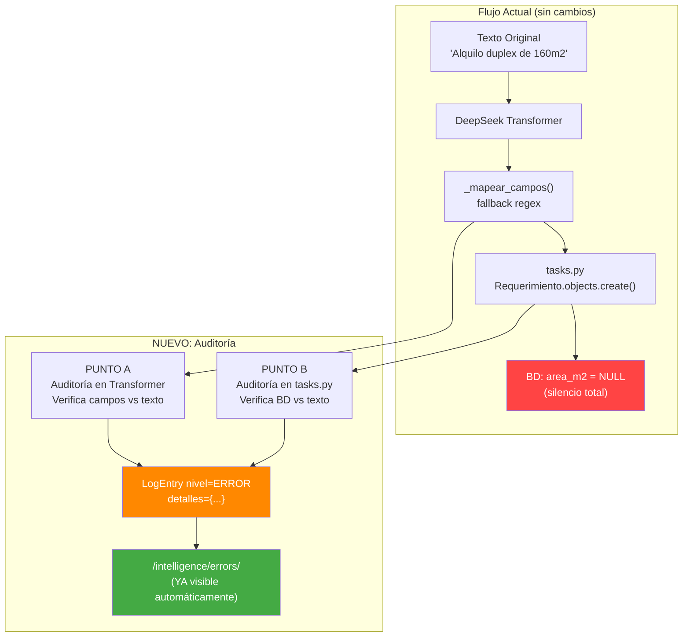

# Plan: Sistema de Auditoría de Errores Silenciosos

## Problema

Actualmente, cuando un campo como `area_m2` no se extrae, el sistema simplemente lo guarda como `NULL` sin registrar que el dato **sí existía en el texto original**. Esto hace que errores de extracción pasen desapercibidos.

## Solución: "Detective de Contradicciones"

Sistema de post-extracción que verifica: *"Si el campo quedó vacío en BD pero el texto original lo menciona → registra un ERROR"*

## Arquitectura



## Puntos de Inyección

### Punto A — Dentro del Transformer
**Archivo**: [`webapp/whatsapp_extractor/services/deepseek_transformer.py`](webapp/whatsapp_extractor/services/deepseek_transformer.py)
**Dónde**: Al final de `_mapear_campos()`, justo antes del `return data`
**Qué hace**: Compara cada campo extraído contra el texto original usando regex. Si el campo está vacío pero el regex encuentra match → crea `LogEntry`.

### Punto B — En tasks.py
**Archivo**: [`webapp/whatsapp_extractor/tasks.py`](webapp/whatsapp_extractor/tasks.py)
**Dónde**: Inmediatamente después de `Requerimiento.objects.create()` (línea ~591)
**Qué hace**: Lee el `Requerimiento` recién creado, verifica campos críticos contra `texto_original`. Si algún campo quedó NULL pero el regex lo detecta → crea `LogEntry`.

## Campos a Auditar

| Campo BD | Regex de detección | Código de error |
|---|---|---|
| `area_m2` | `_extraer_area_regex(texto)` | `SILENT_FAIL_AREA` |
| `habitaciones` | `_extraer_habitaciones_regex(texto)` | `SILENT_FAIL_HABITACIONES` |
| `banos` | `_extraer_banos_regex(texto)` | `SILENT_FAIL_BANOS` |
| `presupuesto_monto` | `_extraer_precio_regex(texto)` (NUEVO) | `SILENT_FAIL_PRECIO` |
| `distritos` | Patrón de distritos conocidos | `SILENT_FAIL_DISTRITOS` |
| `tipo_propiedad` | Keywords: casa/departamento/terreno/local/oficina | `SILENT_FAIL_TIPO` |
| `condicion` | Keywords: compro/vendo/alquilo/busco/necesito | `SILENT_FAIL_CONDICION` |

## Estructura del LogEntry (usando campo `detalles` existente)

```json
{
    "codigo": "SILENT_FAIL_AREA",
    "campo": "area_m2",
    "match_detectado": "160m2",
    "valor_extraido": null,
    "texto_preview": "Alquilo duplex de 160m2 en Cayma...",
    "punto_deteccion": "tasks_post_save"
}
```

## Por qué NO necesitamos migración

- `LogEntry` ya tiene campo `detalles` de tipo `JSONField` → podemos guardar toda la metadata sin migrar
- El nivel `ERROR` ya existe en los choices
- La vista `/intelligence/errors/` ya consulta `LogEntry` con nivel `WARNING`/`ERROR`

## Archivos a crear

### 1. [`webapp/whatsapp_extractor/services/auditor_extraccion.py`](webapp/whatsapp_extractor/services/auditor_extraccion.py) (NUEVO)
Módulo utilitario con:
- `CAMPIOS_CRITICOS` — lista de campos a auditar con su función regex y código de error
- `_extraer_precio_regex(texto)` — nuevo regex para detectar montos en texto
- `_extraer_distrito_regex(texto)` — nuevo regex para detectar distritos conocidos
- `_extraer_tipo_propiedad_regex(texto)` — nuevo regex para detectar tipo
- `_extraer_condicion_regex(texto)` — nuevo regex para detectar condición
- `auditar_campo(texto_original, campo, valor_extraido, extractor_log, punto)` — función principal que crea LogEntry si hay contradicción
- `auditar_extraccion(datos_extraidos, texto_original, extractor_log, punto)` — itera sobre todos los campos críticos

## Archivos a modificar

### 2. [`webapp/whatsapp_extractor/services/deepseek_transformer.py`](webapp/whatsapp_extractor/services/deepseek_transformer.py)
- Importar `auditar_extraccion` al final de `_mapear_campos()` (Punto A)
- Llamar `auditar_extraccion(data, texto, None, punto='transformer_mapeo')` justo antes del return

### 3. [`webapp/whatsapp_extractor/tasks.py`](webapp/whatsapp_extractor/tasks.py)
- Importar `auditar_extraccion`
- Después de `Requerimiento.objects.create()` (línea ~591), llamar:
  ```python
  auditar_extraccion(
      datos_extraidos, texto_original, extractor_log,
      punto='tasks_post_save'
  )
  ```

## Lo que NO cambia

- ❌ No se toca el modelo `LogEntry` (ya tiene `detalles` JSONField)
- ❌ No se toca la vista `intelligence_errors` (ya lee LogEntry)
- ❌ No se toca el template `errors.html` (ya muestra los logs)
- ❌ No se modifica la lógica de extracción existente

## Orden de implementación

1. Crear [`webapp/whatsapp_extractor/services/auditor_extraccion.py`](webapp/whatsapp_extractor/services/auditor_extraccion.py)
2. Modificar [`webapp/whatsapp_extractor/services/deepseek_transformer.py`](webapp/whatsapp_extractor/services/deepseek_transformer.py) — Punto A
3. Modificar [`webapp/whatsapp_extractor/tasks.py`](webapp/whatsapp_extractor/tasks.py) — Punto B
4. Probar con el archivo #58
5. Verificar en `/intelligence/errors/` que aparecen los errores

## Ejemplo de salida esperada

En `/intelligence/errors/` se verá:

| Módulo | Skill / Archivo | Status | Error | Fecha |
|---|---|---|---|---|
| Extractor WhatsApp | LOG_75.txt | ERROR | [SILENT_FAIL_AREA] Campo 'area_m2'=NULL pero se detectó '160m2' en el texto | 28/05/2026 11:45 |
| Extractor WhatsApp | LOG_75.txt | ERROR | [SILENT_FAIL_AREA] Campo 'area_m2'=NULL pero se detectó '800m2' en el texto | 28/05/2026 11:45 |
