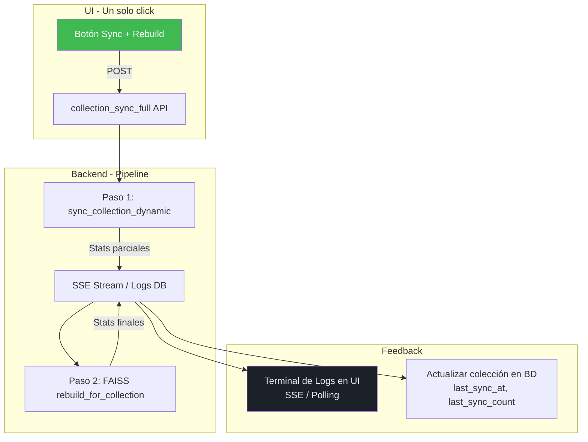
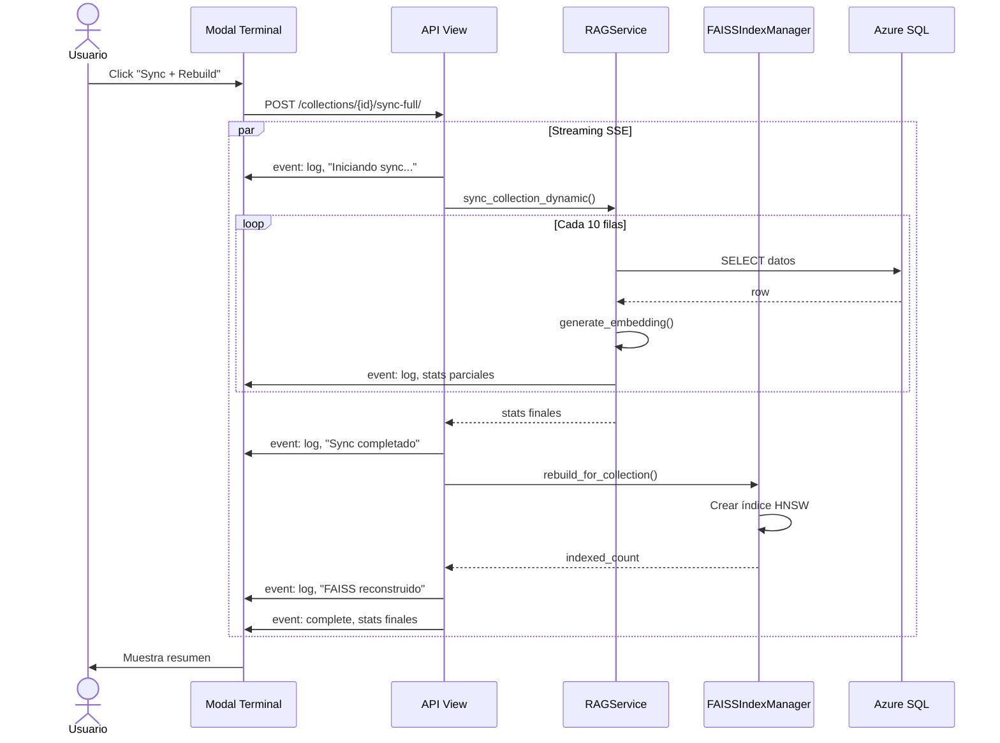

# Propuesta: Automatización de Sincronización de Colecciones RAG

> **Propósito:** Un solo clic para sincronizar colección + rebuild FAISS + log en tiempo real
> **Fecha:** 2026-06-21
> **Estado:** Propuesta

---

## 1. Problema Actual

La colección `propiedadespropify` tiene 131 documentos desactualizados. Para actualizarla:

1. Ir a Colecciones → click en "Sincronizar" (llama a [`sync_collection`](elgranextractor/webapp/intelligence/services/rag.py:432))
2. Esperar sin feedback visual (solo redirect)
3. El índice FAISS **no se reconstruye automáticamente**
4. No hay forma de ver el progreso ni los errores en tiempo real
5. No hay botón "Sync + Rebuild + Log" en un solo paso

---

## 2. Arquitectura Propuesta



### Flujo propuesto

1. **Botón "🔄 Sync + Rebuild"** en la vista de detalle de colección
2. Abre un **modal overlay** con terminal de logs en tiempo real
3. Ejecuta en backend:
   - [`sync_collection_dynamic()`](elgranextractor/webapp/intelligence/services/rag.py:1112) — Sincroniza datos desde BD
   - [`rebuild_for_collection()`](elgranextractor/webapp/intelligence/services/faiss_index.py:290) — Reconstruye índice FAISS
4. Cada paso emite logs vía **SSE** (Server-Sent Events) o **polling**
5. Al terminar, muestra resumen y cierra/actualiza

---

## 3. Componentes a Implementar

### 3.1 API Endpoint: `POST /collections/{id}/sync-full/`

Endpoint que ejecuta el pipeline completo y retorna logs en streaming (SSE) o un task_id para polling.

```python
@api_view(['POST'])
def collection_sync_full(request, collection_id):
    """
    Ejecuta pipeline completo: sync + FAISS rebuild.
    Retorna eventos SSE con logs en tiempo real.
    """
    # 1. Validar colección
    # 2. Emitir eventos SSE:
    #    event: log, data: {"step": "sync", "message": "Iniciando...", "stats": {...}}
    #    event: log, data: {"step": "faiss", "message": "Rebuild...", "indexed": 131}
    #    event: complete, data: {"success": true, "stats": {...}}
```

### 3.2 Management Command: `sync_and_rebuild`

Para ejecución desde terminal (útil para crontab/automatización):

```bash
python manage.py sync_and_rebuild --collection propiedadespropify
```

### 3.3 Modal de Logs en Tiempo Real

Overlay tipo terminal con:
- Scroll automático
- Colores por severidad (verde=OK, rojo=error, amarillo=warning, azul=info)
- Timestamps
- Barra de progreso
- Botón "Cerrar" + "Re-ejecutar"

### 3.4 Auto-sync Programado (Opcional)

Celery Beat task para sync automático cada N horas/días:

```python
@shared_task
def scheduled_collection_sync():
    """Sincroniza todas las colecciones activas cada 6 horas."""
    for collection in IntelligenceCollection.objects.filter(is_active=True):
        sync_and_rebuild(collection.id)
```

---

## 4. Estructura del Log

Cada evento de log tiene el formato:

```json
{
  "timestamp": "2026-06-21T22:00:00Z",
  "level": "INFO",
  "step": "sync",
  "message": "Procesando fila 45/131...",
  "stats": {
    "processed": 45,
    "total": 131,
    "created": 12,
    "updated": 33,
    "errors": 0
  }
}
```

Niveles: `INFO`, `SUCCESS`, `WARNING`, `ERROR`, `DEBUG`

---

## 5. UI Mockup

```
┌─────────────────────────────────────────────────────────────┐
│  🔄 Sincronización de Colección                             │
│  propiedadespropify                                         │
├─────────────────────────────────────────────────────────────┤
│                                                             │
│  [22:00:00] [INFO] Iniciando sincronización...              │
│  [22:00:01] [INFO] Consultando tabla: vwd_propiedades...    │
│  [22:00:02] [INFO] Procesando fila 10/131...               │
│  [22:00:03] [INFO] Generando embedding para fila 10...     │
│  [22:00:05] [SUCCESS] Documento 10 creado                  │
│  [22:00:10] [INFO] Procesando fila 20/131...               │
│  ...                                                        │
│  [22:01:30] [SUCCESS] Sincronización completada             │
│  [22:01:30] [INFO] Reconstruyendo índice FAISS...          │
│  [22:01:31] [SUCCESS] Índice FAISS: 131 vectores           │
│  [22:01:31] [SUCCESS] Pipeline completado exitosamente     │
│                                                             │
│  ─────────────────────────────────────────────────────────  │
│  Procesados: 131  |  Creados: 5  |  Actualizados: 126     │
│  FAISS: 131 vectores  |  Errores: 0                        │
│                                                             │
│              [ Cerrar ]    [ Re-ejecutar ]                  │
└─────────────────────────────────────────────────────────────┘
```

---

## 6. Archivos a Modificar/Crear

| Archivo | Acción | Propósito |
|---------|--------|-----------|
| [`views.py`](elgranextractor/webapp/intelligence/views.py) | Modificar | Agregar `collection_sync_full` endpoint SSE |
| [`urls.py`](elgranextractor/webapp/intelligence/urls.py) | Modificar | Agregar ruta `collections/{id}/sync-full/` |
| `management/commands/sync_and_rebuild.py` | **Nuevo** | Management command para terminal |
| `templates/intelligence/collections/sync_modal.html` | **Nuevo** | Modal de terminal de logs |
| `static/intelligence/js/sync_terminal.js` | **Nuevo** | JS para SSE y terminal interactivo |
| [`rag.py`](elgranextractor/webapp/intelligence/services/rag.py) | Modificar | Emitir logs durante sync |
| [`faiss_index.py`](elgranextractor/webapp/intelligence/services/faiss_index.py) | Modificar | Emitir logs durante rebuild |
| `tasks.py` | Modificar | Agregar Celery task para auto-sync |

---

## 7. Plan de Implementación

| # | Tarea | Depende de | Esfuerzo |
|---|-------|-----------|----------|
| 1 | Crear `sync_and_rebuild` management command | — | 2h |
| 2 | Agregar endpoint SSE `collection_sync_full` | — | 3h |
| 3 | Crear modal de terminal HTML+JS | (2) | 4h |
| 4 | Integrar botón "Sync + Rebuild" en vista de colección | (3) | 1h |
| 5 | Agregar Celery task programada (opcional) | (1) | 2h |
| 6 | Probar pipeline completo | (4) | 2h |

**Total estimado:** ~14 horas (2 días)

---

## 8. Diagrama de Secuencia del Pipeline



---

## 9. Preguntas a Resolver

1. **SSE vs Polling:** ¿Prefieres logs en tiempo real (SSE) o polling cada 2 segundos?
2. **Auto-sync programado:** ¿Quieres que se sincronice automáticamente cada N horas vía Celery Beat?
3. **Colecciones múltiples:** ¿Botón individual por colección o también un "Sync All" global?
4. **Retención de logs:** ¿Guardar historial de sincronizaciones en BD?
