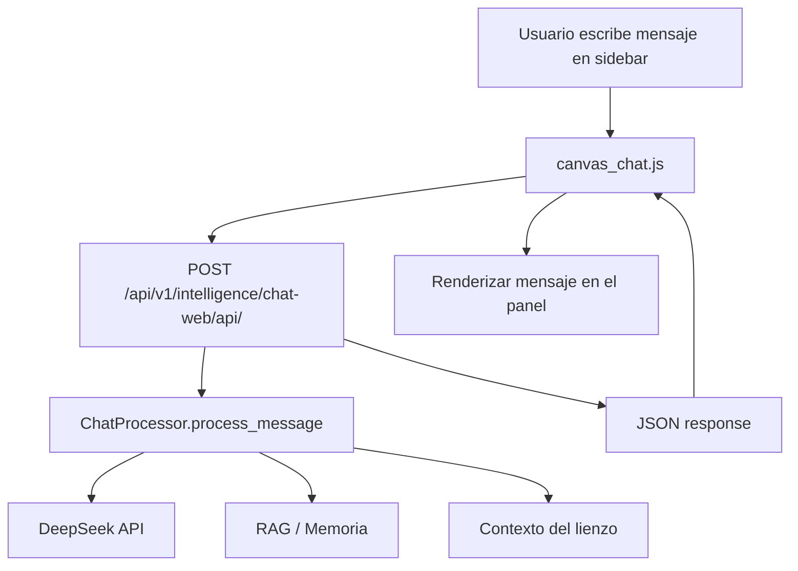

# Plan: Chat en Sidebar del Canvas

## Objetivo
Agregar una pestaña **Chat** en la barra lateral del Canvas que se conecte al sistema de inteligencia existente (`chat-web` API), permitiendo conversar con el asistente IA directamente desde el lienzo.

## Arquitectura



## API existente

**Endpoint:** `POST /api/v1/intelligence/chat-web/api/`

**Request:**
```json
{
  "message": "texto del usuario",
  "conversation_id": null,
  "user_id": null,
  "use_memory": true,
  "use_rag": true,
  "collections": [],
  "metadata": {}
}
```

**Response:**
```json
{
  "success": true,
  "conversation_id": "uuid",
  "message_id": "uuid",
  "response": "texto respuesta",
  "html": null,
  "metadata": {},
  "context_summary": "...",
  "timestamp": "..."
}
```

## Archivos a modificar

### 1. [`webapp/canvas/templates/canvas/editor.html`](webapp/canvas/templates/canvas/editor.html)

**Agregar pestaña Chat** (junto a las existentes Agente, Campos, Lienzo):
```html
<div class="cv-sidebar__tab" data-tab="chat">Chat</div>
```

**Agregar panel Chat** (después del panel Lienzo):
```html
<div class="cv-sidebar__panel" id="tab-chat">
  <div class="cv-chat-header">
    <div class="cv-chat-title">Asistente IA</div>
    <button class="cv-chat-clear" id="chat-clear" title="Nueva conversación">+ Nuevo</button>
  </div>
  <div class="cv-chat-messages" id="chat-messages">
    <div class="cv-chat-msg cv-chat-msg--system">
      Hola! Soy tu asistente. Pregúntame sobre las propiedades, requerimientos o el mercado inmobiliario.
    </div>
  </div>
  <div class="cv-chat-input-area">
    <textarea class="cv-chat-input" id="chat-input" rows="2" placeholder="Escribe un mensaje..."></textarea>
    <button class="cv-chat-send" id="chat-send" title="Enviar">➤</button>
  </div>
</div>
```

**Agregar script** al final:
```html
<script src="?v=1"></script>
```

### 2. [`webapp/canvas/static/canvas/css/canvas.css`](webapp/canvas/static/canvas/css/canvas.css)

Agregar estilos para el chat:

```css
/* ── CHAT PANEL ── */
.cv-chat-header {
  display: flex;
  align-items: center;
  justify-content: space-between;
  padding: 6px 0;
  border-bottom: 1px solid var(--cv-border);
  flex-shrink: 0;
}
.cv-chat-title {
  font-size: 12px;
  font-weight: 600;
  color: var(--cv-text-pri);
}
.cv-chat-clear {
  background: transparent;
  border: 1px solid var(--cv-border);
  color: var(--cv-text-muted);
  font-size: 10px;
  padding: 3px 8px;
  border-radius: 4px;
  cursor: pointer;
  transition: color 0.15s, border-color 0.15s;
}
.cv-chat-clear:hover {
  color: var(--cv-text-pri);
  border-color: var(--cv-border-act);
}

.cv-chat-messages {
  flex: 1;
  overflow-y: auto;
  padding: 8px 0;
  display: flex;
  flex-direction: column;
  gap: 6px;
}
.cv-chat-messages::-webkit-scrollbar { width: 4px; }
.cv-chat-messages::-webkit-scrollbar-thumb { background: var(--cv-border); border-radius: 2px; }

.cv-chat-msg {
  padding: 6px 10px;
  border-radius: 6px;
  font-size: 11px;
  line-height: 1.45;
  word-break: break-word;
  white-space: pre-wrap;
}
.cv-chat-msg--user {
  background: rgba(92, 107, 192, 0.15);
  color: var(--cv-text-pri);
  align-self: flex-end;
  border: 1px solid rgba(92, 107, 192, 0.25);
}
.cv-chat-msg--assistant {
  background: var(--cv-surface-2);
  color: var(--cv-text-sec);
  align-self: flex-start;
  border: 1px solid var(--cv-border);
}
.cv-chat-msg--system {
  background: transparent;
  color: var(--cv-text-muted);
  font-style: italic;
  font-size: 10px;
  text-align: center;
}
.cv-chat-msg--loading {
  background: var(--cv-surface-2);
  color: var(--cv-text-muted);
  align-self: flex-start;
  border: 1px solid var(--cv-border);
  font-style: italic;
}

.cv-chat-input-area {
  display: flex;
  gap: 6px;
  padding: 8px 0;
  border-top: 1px solid var(--cv-border);
  flex-shrink: 0;
  align-items: flex-end;
}
.cv-chat-input {
  flex: 1;
  background: var(--cv-surface-2);
  border: 1px solid var(--cv-border);
  border-radius: 6px;
  color: var(--cv-text-pri);
  font-size: 12px;
  padding: 6px 10px;
  outline: none;
  resize: none;
  font-family: inherit;
  line-height: 1.4;
  max-height: 80px;
}
.cv-chat-input:focus {
  border-color: var(--cv-border-act);
}
.cv-chat-input::placeholder {
  color: var(--cv-text-muted);
}
.cv-chat-send {
  width: 32px;
  height: 32px;
  border: 1px solid var(--cv-border-act);
  border-radius: 6px;
  background: rgba(92, 107, 192, 0.2);
  color: #8896f0;
  font-size: 16px;
  cursor: pointer;
  display: flex;
  align-items: center;
  justify-content: center;
  flex-shrink: 0;
  transition: background 0.15s;
}
.cv-chat-send:hover {
  background: rgba(92, 107, 192, 0.35);
}
.cv-chat-send:disabled {
  opacity: 0.4;
  cursor: not-allowed;
}
```

### 3. [`webapp/canvas/static/canvas/js/canvas_sidebar.js`](webapp/canvas/static/canvas/js/canvas_sidebar.js)

En `initSidebar()`, agregar:
```javascript
setupChatTab();
```

Agregar la función `setupChatTab()`:
```javascript
function setupChatTab() {
  // Inicializar el chat al activar la pestaña (lazy init)
  const chatTab = document.querySelector('.cv-sidebar__tab[data-tab="chat"]');
  if (chatTab && typeof initCanvasChat === 'function') {
    // Inicializar solo la primera vez que se hace clic en Chat
    let chatInitialized = false;
    chatTab.addEventListener('click', () => {
      if (!chatInitialized) {
        chatInitialized = true;
        initCanvasChat();
      }
    });
  }
}
```

### 4. [`webapp/canvas/static/canvas/js/canvas_chat.js`](webapp/canvas/static/canvas/js/canvas_chat.js) — **NUEVO ARCHIVO**

```javascript
/**
 * canvas_chat.js — Chat IA en la sidebar del Canvas
 * 
 * Se conecta al sistema de inteligencia existente (chat-web API)
 * para permitir conversaciones contextuales sobre propiedades,
 * requerimientos y matching desde el lienzo.
 */

let canvasChatState = {
  conversationId: null,
  loading: false,
};

function initCanvasChat() {
  const input = document.getElementById('chat-input');
  const sendBtn = document.getElementById('chat-send');
  const clearBtn = document.getElementById('chat-clear');
  const messages = document.getElementById('chat-messages');

  if (!input || !sendBtn) return;

  // Enviar con Enter (Shift+Enter para nueva línea)
  input.addEventListener('keydown', (e) => {
    if (e.key === 'Enter' && !e.shiftKey) {
      e.preventDefault();
      sendChatMessage();
    }
  });

  sendBtn.addEventListener('click', sendChatMessage);

  clearBtn.addEventListener('click', () => {
    canvasChatState.conversationId = null;
    messages.innerHTML = `
      <div class="cv-chat-msg cv-chat-msg--system">
        Hola! Soy tu asistente. Pregúntame sobre las propiedades, 
        requerimientos o el mercado inmobiliario.
      </div>
    `;
  });

  // Auto-ajuste de altura del textarea
  input.addEventListener('input', () => {
    input.style.height = 'auto';
    input.style.height = Math.min(input.scrollHeight, 80) + 'px';
  });
}

async function sendChatMessage() {
  const input = document.getElementById('chat-input');
  const sendBtn = document.getElementById('chat-send');
  const messages = document.getElementById('chat-messages');
  const text = input.value.trim();

  if (!text || canvasChatState.loading) return;

  // Limpiar input y reset altura
  input.value = '';
  input.style.height = 'auto';

  // Agregar mensaje del usuario
  addMessage('user', text);

  // Mostrar indicador de carga
  const loadingId = addMessage('loading', 'Escribiendo...');

  canvasChatState.loading = true;
  sendBtn.disabled = true;

  try {
    const res = await fetch('/api/v1/intelligence/chat-web/api/', {
      method: 'POST',
      headers: {
        'Content-Type': 'application/json',
        'X-CSRFToken': CSRF,
      },
      body: JSON.stringify({
        message: text,
        conversation_id: canvasChatState.conversationId,
        use_memory: true,
        use_rag: true,
        metadata: {
          source: 'canvas',
          lienzo_id: LIENZO_ID,
        },
      }),
    });

    const data = await res.json();

    // Remover indicador de carga
    removeMessage(loadingId);

    if (data.success) {
      canvasChatState.conversationId = data.conversation_id;
      addMessage('assistant', data.response);
    } else {
      addMessage('assistant', 'Error: ' + (data.error || 'No se pudo obtener respuesta'));
    }
  } catch (err) {
    removeMessage(loadingId);
    addMessage('assistant', 'Error de conexión. Intenta de nuevo.');
    console.error('Chat error:', err);
  } finally {
    canvasChatState.loading = false;
    sendBtn.disabled = false;
    input.focus();
  }
}

function addMessage(role, text) {
  const messages = document.getElementById('chat-messages');
  const div = document.createElement('div');
  div.className = 'cv-chat-msg cv-chat-msg--' + role;
  div.textContent = text;
  div.dataset.msgId = 'msg_' + Date.now() + '_' + Math.random().toString(36).substr(2, 4);
  messages.appendChild(div);
  // Auto-scroll al último mensaje
  messages.scrollTop = messages.scrollHeight;
  return div.dataset.msgId;
}

function removeMessage(msgId) {
  const el = document.querySelector('[data-msgId="' + msgId + '"]');
  if (el) el.remove();
}
```

## Resumen de cambios

| Archivo | Acción |
|---------|--------|
| [`editor.html`](webapp/canvas/templates/canvas/editor.html) | Agregar tab Chat + panel + script reference |
| [`canvas.css`](webapp/canvas/static/canvas/css/canvas.css) | Agregar estilos del chat |
| [`canvas_sidebar.js`](webapp/canvas/static/canvas/js/canvas_sidebar.js) | Agregar `setupChatTab()` a `initSidebar()` |
| **NUEVO** [`canvas_chat.js`](webapp/canvas/static/canvas/js/canvas_chat.js) | Lógica del chat: enviar mensajes, recibir respuestas, manejar estado |

## Flujo de uso

1. Usuario abre el Canvas, ve la pestaña **Chat** en la sidebar
2. Hace clic en **Chat** → se inicializa el chat (lazy init)
3. Aparece mensaje de bienvenida del sistema
4. Usuario escribe en el textarea y presiona Enter o clic en ➤
5. El mensaje se envía a la API `/api/v1/intelligence/chat-web/api/`
6. Mientras espera, aparece indicador "Escribiendo..."
7. La respuesta se renderiza como burbuja del asistente
8. El chat mantiene la `conversation_id` para continuidad
9. Botón **+ Nuevo** reinicia la conversación

## Consideraciones

- **Contexto del lienzo**: Se pasa `lienzo_id` en metadata para que el asistente pueda contextualizar. En el futuro se podría pasar el snapshot actual (nodos y aristas) como contexto adicional.
- **Autenticación**: Usa la misma sesión/CSRF que el resto del canvas. Si el usuario no está autenticado, la API devolverá 401.
- **No rompe nada existente**: El chat es un tab adicional en la sidebar. No modifica la lógica de Agente, Campos, Lienzo, ni afecta los nodos del canvas.
