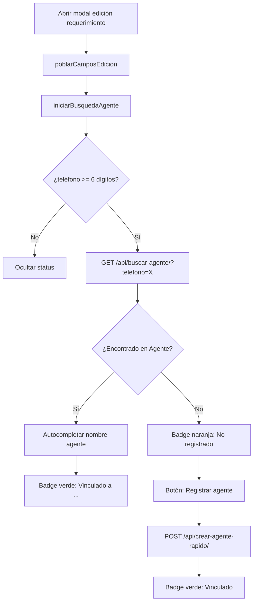

# Plan: Enlazar Agente ↔ Requerimiento vía Teléfono

## Resumen
Cuando se edita un [`Requerimiento`](webapp/requerimientos/models.py:72) en el modal de [`lista.html`](webapp/requerimientos/templates/requerimientos/lista.html), al ingresar el teléfono del agente (`agente_telefono`), el sistema buscará automáticamente en la tabla [`Agente`](webapp/agentes/models.py:66) si ese teléfono está registrado y autocompletará el nombre. Si no existe, dará la opción de crear un nuevo agente.

---

## Arquitectura

```
[Modal Edición] 
    │ al escribir teléfono (con debounce 500ms)
    ▼
[BuscarAgentePorTelefonoView]  ← GET /requerimientos/api/buscar-agente/?telefono=XXX
    │
    ├── ✅ Encontrado → { encontrado: true, id, nombre_completo, tipo_agente }
    │                    → JS autocompleta nombre + badge verde "✓ Vinculado"
    │
    └── ❌ No encontrado → { encontrado: false }
                         → JS badge naranja "⚠ No registrado"
                         → Botón "➕ Registrar agente"
                              │
                              ▼
                         [CrearAgenteRapidoView]  ← POST /requerimientos/api/crear-agente-rapido/
                              │                    Body: { telefono, nombre_completo }
                              │                    → Crea Agente con tipo_agente=INDEPENDIENTE
                              ▼
                         → { ok: true, id, nombre_completo }
                         → JS badge verde "✓ Vinculado"
```

---

## Cambios necesarios

### 1. [`webapp/requerimientos/views.py`](webapp/requerimientos/views.py) — 2 nuevas vistas

#### `BuscarAgentePorTelefonoView`
- **Tipo**: `View` con método `GET`
- **URL**: `/requerimientos/api/buscar-agente/`
- **Parámetro**: `?telefono=999888777`
- **Lógica**:
  ```python
  from agentes.models import Agente
  agente = Agente.objects.filter(telefono=telefono).first()
  if agente:
      return JsonResponse({
          'encontrado': True,
          'id': agente.id,
          'nombre_completo': agente.nombre_completo,
          'tipo_agente': agente.tipo_agente,
      })
  return JsonResponse({'encontrado': False})
  ```
- **Validación**: Si `telefono` está vacío o tiene menos de 6 dígitos, retorna `{ encontrado: false }` sin consultar BD

#### `CrearAgenteRapidoView`
- **Tipo**: `View` con método `POST`
- **URL**: `/requerimientos/api/crear-agente-rapido/`
- **Body JSON**: `{ telefono: "...", nombre_completo: "..." }`
- **Lógica**:
  ```python
  # Si ya existe un agente con ese teléfono, retornarlo (idempotente)
  agente = Agente.objects.filter(telefono=telefono).first()
  if not agente:
      agente = Agente.objects.create(
          telefono=telefono,
          nombre_completo=nombre_completo or telefono,
          tipo_agente=Agente.TipoAgente.INDEPENDIENTE,
      )
  return JsonResponse({ 'ok': True, 'id': agente.id, 'nombre_completo': agente.nombre_completo })
  ```

**Importar `from django.views import View` y `from django.http import JsonResponse`** (ya existe en el archivo).

### 2. [`webapp/requerimientos/urls.py`](webapp/requerimientos/urls.py) — 2 nuevas rutas

```python
path('api/buscar-agente/', views.BuscarAgentePorTelefonoView.as_view(), name='buscar_agente'),
path('api/crear-agente-rapido/', views.CrearAgenteRapidoView.as_view(), name='crear_agente_rapido'),
```

### 3. [`webapp/requerimientos/templates/requerimientos/lista.html`](webapp/requerimientos/templates/requerimientos/lista.html) — JS + HTML

#### A. Nuevo contenedor de estado en el modal (después del campo `editAgenteTelefono`)

Agregar dentro del grupo de campo "Agente" en la columna izquierda del modal, justo después del input `editAgenteTelefono`:

```html
<!-- Estado de vinculación con tabla Agentes -->
<div id="agenteVinculadoStatus" style="margin-top: 6px; display: none;">
    <span id="agenteStatusBadge" class="badge" style="font-size: 11px; padding: 3px 10px; border-radius: 4px;"></span>
    <button type="button" id="btnRegistrarAgente" class="btn btn-sm" style="display: none; background-color: #238636; color: #fff; border: none; padding: 3px 10px; border-radius: 4px; font-size: 11px; margin-left: 4px;">
        <i class="bi bi-plus-circle me-1"></i>Registrar agente
    </button>
</div>
```

#### B. Nueva función JS `buscarAgente(telefono)` con debounce

```javascript
let timeoutBuscarAgente = null;

function iniciarBusquedaAgente() {
    clearTimeout(timeoutBuscarAgente);
    timeoutBuscarAgente = setTimeout(function() {
        var telefono = document.getElementById('editAgenteTelefono').value.trim();
        buscarAgente(telefono);
    }, 500); // debounce 500ms
}

function buscarAgente(telefono) {
    var statusDiv = document.getElementById('agenteVinculadoStatus');
    var badge = document.getElementById('agenteStatusBadge');
    var btnRegistrar = document.getElementById('btnRegistrarAgente');
    
    if (!telefono || telefono.length < 6) {
        statusDiv.style.display = 'none';
        return;
    }
    
    fetch('/requerimientos/api/buscar-agente/?telefono=' + encodeURIComponent(telefono))
        .then(function(r) { return r.json(); })
        .then(function(data) {
            statusDiv.style.display = 'block';
            if (data.encontrado) {
                // Autocompletar nombre del agente
                document.getElementById('editAgente').value = data.nombre_completo;
                badge.textContent = '✓ Vinculado a ' + data.nombre_completo;
                badge.style.backgroundColor = 'rgba(35, 134, 54, 0.2)';
                badge.style.color = '#3fb950';
                badge.style.border = '1px solid rgba(35, 134, 54, 0.3)';
                btnRegistrar.style.display = 'none';
            } else {
                badge.textContent = '⚠ No registrado en agentes';
                badge.style.backgroundColor = 'rgba(210, 153, 34, 0.15)';
                badge.style.color = '#d29922';
                badge.style.border = '1px solid rgba(210, 153, 34, 0.3)';
                btnRegistrar.style.display = 'inline-block';
            }
        })
        .catch(function(err) {
            console.error('Error al buscar agente:', err);
            statusDiv.style.display = 'none';
        });
}
```

#### C. Vincular evento `oninput` al campo teléfono

En `poblarCamposEdicion`, después de establecer el valor de `editAgenteTelefono`:
```javascript
document.getElementById('editAgenteTelefono').addEventListener('input', iniciarBusquedaAgente);
```

Y al final de `poblarCamposEdicion`, llamar a `iniciarBusquedaAgente()` para que al abrir el modal ya verifique el número existente.

#### D. Función para el botón "Registrar agente"

```javascript
document.getElementById('btnRegistrarAgente').addEventListener('click', function() {
    var telefono = document.getElementById('editAgenteTelefono').value.trim();
    var nombre = document.getElementById('editAgente').value.trim() || telefono;
    
    fetch('/requerimientos/api/crear-agente-rapido/', {
        method: 'POST',
        headers: { 'X-CSRFToken': '{{ csrf_token }}', 'Content-Type': 'application/json' },
        body: JSON.stringify({ telefono: telefono, nombre_completo: nombre })
    })
    .then(function(r) { return r.json(); })
    .then(function(data) {
        if (data.ok) {
            // Actualizar badge a vinculado
            document.getElementById('editAgente').value = data.nombre_completo;
            buscarAgente(telefono); // re-ejecuta búsqueda
        }
    })
    .catch(function(err) { console.error('Error al crear agente:', err); });
});
```

#### E. CSS adicional

```css
/* ── Badge de vinculación agente ──────────── */
#agenteVinculadoStatus {
    display: flex;
    align-items: center;
    gap: 6px;
    flex-wrap: wrap;
}
#btnRegistrarAgente:hover {
    background-color: #2ea043 !important;
}
```

---

## Lo que NO cambia

- **Modelo `Requerimiento`**: No se modifica. Los campos `agente` y `agente_telefono` siguen siendo CharField. No se necesita migración.
- **Modelo `Agente`**: No se modifica.
- **Vista `EditarRequerimientoView`**: No se modifica. El guardado sigue funcionando igual.
- **Flujo de guardado**: No cambia. El nombre del agente se guarda en `agente` y el teléfono en `agente_telefono`.

---

## Diagrama de flujo



---

## Resumen de archivos a modificar/crear

| Archivo | Acción |
|---|---|
| [`webapp/requerimientos/views.py`](webapp/requerimientos/views.py) | Agregar 2 clases: `BuscarAgentePorTelefonoView`, `CrearAgenteRapidoView` |
| [`webapp/requerimientos/urls.py`](webapp/requerimientos/urls.py) | Agregar 2 rutas |
| [`webapp/requerimientos/templates/requerimientos/lista.html`](webapp/requerimientos/templates/requerimientos/lista.html) | Agregar HTML de status, JS de búsqueda/creación, CSS |
