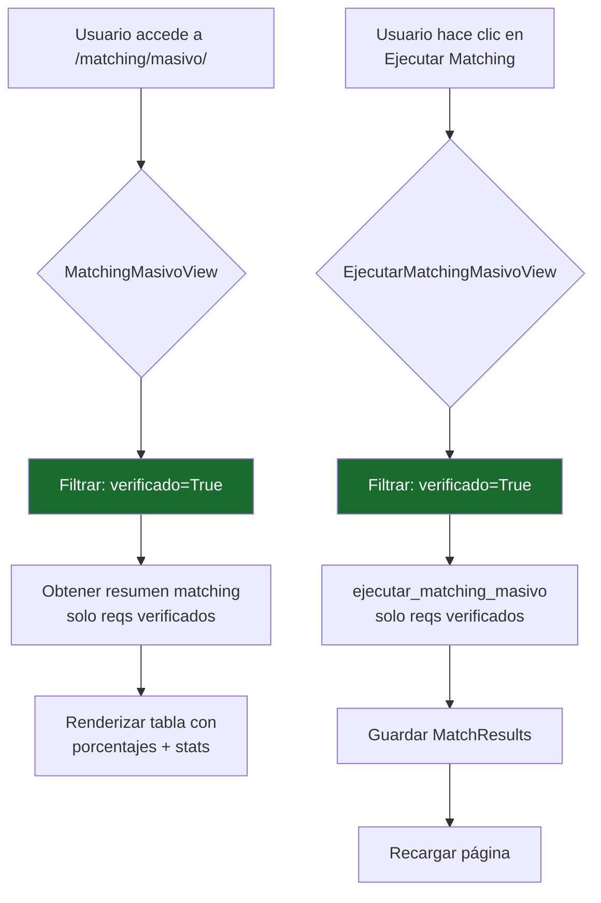

# Plan: Restringir Matching Masivo a Requerimientos Verificados

## Objetivo

En la URL `/matching/masivo/`:
1. **Mostrar solo** requerimientos con `verificado = True`
2. **Solo permitir ejecución de matching** (no otras operaciones que no sean matching)

---

## Análisis del Código Actual

### Flujo de datos actual

```
MatchingMasivoView.get_context_data()
  ├── requerimientos_qs = Requerimiento.objects.all()  ← SIN filtro
  ├── resumen = obtener_resumen_matching_masivo()       ← SIN filtro
  └── Stats: total_requerimientos = count sin filtro

EjecutarMatchingMasivoView.post()
  └── ejecutar_matching_masivo()       ← procesa TODOS los requerimientos

obtener_resumen_matching_masivo()
  └── MatchResult.objects.values()     ← trae resultados de TODOS los reqs
```

### Puntos de cambio necesarios

| # | Archivo | Línea | Cambio |
|---|---------|-------|--------|
| 1 | `webapp/matching/views.py` | ~887 | Filtrar `requerimientos_qs` con `.filter(verificado=True)` |
| 2 | `webapp/matching/views.py` | ~969 | Stats: contar solo verificados |
| 3 | `webapp/matching/views.py` | ~1514 | Pasar solo verificados a `ejecutar_matching_masivo()` |
| 4 | `webapp/matching/engine.py` | ~825-878 | Filtrar resumen para incluir solo verificados |
| 5 | `webapp/matching/templates/matching/masivo.html` | ~640 | Añadir indicador visual "Solo verificados" |

---

## Cambios Detallados

### 1. [`MatchingMasivoView.get_context_data()`](webapp/matching/views.py:869)

**Actual:**
```python
requerimientos_qs = Requerimiento.objects.all().order_by('-fecha', '-hora')
```

**Nuevo:**
```python
requerimientos_qs = Requerimiento.objects.filter(verificado=True).order_by('-fecha', '-hora')
```

**Impacto:**
- La tabla solo mostrará requerimientos verificados
- La paginación contará solo sobre verificados
- El filtro por agente aplicará sobre el subconjunto verificado
- Los stats (`total_requerimientos`) se actualizarán automáticamente porque usan `requerimientos_qs.count()`

### 2. [`obtener_resumen_matching_masivo()`](webapp/matching/engine.py:825)

**Actual:**
```python
reqs_map = {r.id: r for r in Requerimiento.objects.filter(id__in=req_ids)}
```

**Nuevo:**
```python
reqs_map = {r.id: r for r in Requerimiento.objects.filter(id__in=req_ids, verificado=True)}
```

**Impacto:**
- El resumen de porcentajes solo incluirá requerimientos verificados que tengan MatchResult
- Esto sincroniza el `porcentajes_por_requerimiento` con lo que se muestra en la tabla

### 3. [`EjecutarMatchingMasivoView.post()`](webapp/matching/views.py:1505)

**Actual:**
```python
resultados = ejecutar_matching_masivo(
    limite_por_requerimiento=limite_por_requerimiento
)
```

**Nuevo:**
```python
from requerimientos.models import Requerimiento
requerimientos_verificados = Requerimiento.objects.filter(verificado=True)
resultados = ejecutar_matching_masivo(
    requerimientos=requerimientos_verificados,
    limite_por_requerimiento=limite_por_requerimiento
)
```

**Impacto:**
- El matching masivo solo se ejecutará sobre requerimientos verificados
- No se desperdiciará tiempo de procesamiento en requerimientos pendientes de revisión

### 4. Template — Indicador Visual

En el header del template, después del título, añadir:

```html
<div style="display:flex;align-items:center;gap:8px;margin-top:8px;">
    <span style="display:inline-flex;align-items:center;gap:4px;
                 background-color:rgba(63,185,80,0.15);color:#3fb950;
                 padding:4px 12px;border-radius:12px;font-size:12px;font-weight:500;">
        ✅ Mostrando solo requerimientos verificados
    </span>
</div>
```

---

## Diagrama del flujo modificado



---

## Archivos a modificar

| Archivo | Tipo de cambio |
|---------|---------------|
| [`webapp/matching/views.py`](webapp/matching/views.py) | 2 cambios (view + ejecutar endpoint) |
| [`webapp/matching/engine.py`](webapp/matching/engine.py) | 1 cambio (resumen matching) |
| [`webapp/matching/templates/matching/masivo.html`](webapp/matching/templates/matching/masivo.html) | 1 cambio (badge visual) |

---

## Pruebas sugeridas

1. **Verificar filtro:** Acceder a la página con requerimientos verificados y no verificados — solo deben aparecer los verificados
2. **Verificar matching:** Ejecutar matching masivo — solo debe procesar verificados
3. **Verificar stats:** El contador de "Total Requerimientos" debe reflejar solo verificados
4. **Verificar resumen:** Los porcentajes de match deben corresponder solo a verificados
