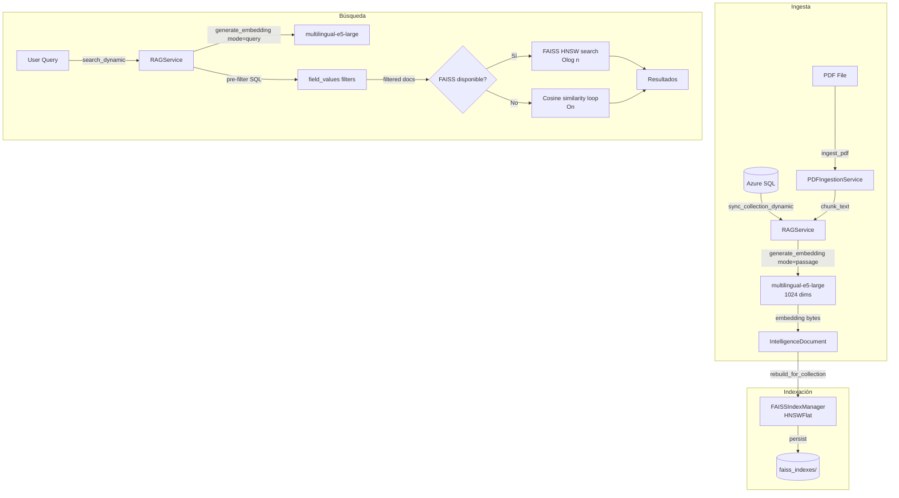

# Plan de Implementación — Mejoras RAG (PropiFai Intelligence Layer)

> Basado en la Spec proporcionada por el usuario.
> Fecha: 2026-05-03
> Estado: Pendiente de aprobación

---

## Resumen Ejecutivo

Se implementarán 4 mejoras prioritarias sobre el sistema RAG actual en [`webapp/intelligence/services/rag.py`](../webapp/intelligence/services/rag.py):

| # | Mejora | Impacto | Dependencias |
|---|--------|---------|--------------|
| 1 | Migrar modelo de embeddings a `intfloat/multilingual-e5-large` | +166% dimensiones (384→1024), +300% tokens (128→512) | `sentence-transformers` ya instalado |
| 2 | Agregar FAISS HNSW como índice vectorial | O(n) → O(log n) en búsqueda | `faiss-cpu` nueva dependencia |
| 3 | Pre-filtrado en SQL antes de similitud coseno | Evita cargar documentos no relevantes | Solo cambios en `search_dynamic` |
| 4 | Pipeline de ingesta de PDFs | Nuevo endpoint + chunking | `pymupdf` nueva dependencia |

**Orden recomendado:** 1 → 2 → 3 → 4 (cada paso es incremental sobre el anterior)

---

## Prioridad 1: Migración de Modelo de Embeddings

### Archivos a modificar

| Archivo | Cambio |
|---------|--------|
| [`webapp/intelligence/services/rag.py`](../webapp/intelligence/services/rag.py) | Constantes, `generate_embedding`, prefijos query/passage |
| [`webapp/intelligence/models.py`](../webapp/intelligence/models.py) | Actualizar `help_text` del campo `embedding` |
| [`webapp/intelligence/management/commands/reindex_all_collections.py`](../webapp/intelligence/management/commands/reindex_all_collections.py) | **Nuevo** comando de management |

### Cambios específicos

#### 1.1 Constantes del modelo (líneas 49-52)

**Actual:**
```python
EMBEDDING_MODEL = "jaimevera1107/all-MiniLM-L6-v2-similarity-es"
EMBEDDING_DIMENSIONS = 384
```

**Nuevo:**
```python
EMBEDDING_MODEL = "intfloat/multilingual-e5-large"
EMBEDDING_DIMENSIONS = 1024
```

#### 1.2 Prefijos query/passage en `generate_embedding` (línea 158)

El modelo `multilingual-e5-large` requiere prefijos específicos:
- **Query:** `"query: {text}"` — para textos de búsqueda
- **Passage:** `"passage: {text}"` — para documentos almacenados

**Cambio:** Añadir parámetro `mode: str = 'passage'` a [`generate_embedding`](../webapp/intelligence/services/rag.py:158):

```python
@classmethod
def generate_embedding(cls, text: str, use_cache: bool = True, mode: str = 'passage') -> Optional[bytes]:
    """
    Genera embedding vectorial con prefijo según modo.
    
    Args:
        text: Texto a convertir en embedding
        use_cache: Usar caché para consultas frecuentes
        mode: 'passage' para documentos, 'query' para búsquedas
    """
    if not text or not text.strip():
        return None
    
    # Aplicar prefijo según modo (requerido por multilingual-e5-large)
    if mode == 'query':
        prefixed_text = f"query: {text}"
    else:
        prefixed_text = f"passage: {text}"
    
    # ... resto igual pero usando prefixed_text para embedding
```

#### 1.3 Actualizar llamadas existentes

| Lugar | Llamada actual | Nueva llamada |
|-------|---------------|--------------|
| [`search`](../webapp/intelligence/services/rag.py:568) | `cls.generate_embedding(query)` | `cls.generate_embedding(query, mode='query')` |
| [`search_dynamic`](../webapp/intelligence/services/rag.py:1477) | `cls.generate_embedding(query)` | `cls.generate_embedding(query, mode='query')` |
| [`sync_collection_dynamic`](../webapp/intelligence/services/rag.py:1219) | `cls.generate_embedding(content)` | `cls.generate_embedding(content, mode='passage')` |
| [`sync_collection_dynamic`](../webapp/intelligence/services/rag.py:1229) | `cls.generate_embedding(content)` | `cls.generate_embedding(content, mode='passage')` |

#### 1.4 Caché de embeddings

La caché LRU actual usa `hashlib.md5(text.encode('utf-8'))` como key. Como ahora el texto incluye el prefijo, la caché diferenciará automáticamente entre queries y passages. **No requiere cambios.**

#### 1.5 Comando de reindexación

Crear [`webapp/intelligence/management/commands/reindex_all_collections.py`](../webapp/intelligence/management/commands/reindex_all_collections.py):

```python
from django.core.management.base import BaseCommand
from intelligence.services.rag import RAGService

class Command(BaseCommand):
    help = 'Reindexa todas las colecciones con el nuevo modelo de embeddings'
    
    def add_arguments(self, parser):
        parser.add_argument('--collection', type=str, help='Nombre específico de colección')
        parser.add_argument('--force', action='store_true', help='Forzar reindexación completa')
    
    def handle(self, *args, **options):
        # 1. Forzar reinicialización del embedder
        RAGService.initialize_embedder(force=True)
        
        # 2. Limpiar caché de embeddings
        RAGService.clear_embedding_cache()
        
        # 3. Reindexar colecciones
        # ... lógica de reindexación
```

### Migración de datos

1. El campo `embedding` en [`IntelligenceDocument`](../webapp/intelligence/models.py:349) es `BinaryField(null=True)` — no requiere migración de esquema.
2. Los embeddings existentes (384 dims) serán reemplazados por nuevos (1024 dims) durante la reindexación.
3. **Riesgo:** Durante la transición, los documentos con embeddings viejos (384) no serán compatibles con queries nuevas (1024). Ejecutar `reindex_all_collections` inmediatamente después del cambio.

---

## Prioridad 2: FAISS HNSW Index

### Archivos a crear/modificar

| Archivo | Acción |
|---------|--------|
| [`webapp/intelligence/services/faiss_index.py`](../webapp/intelligence/services/faiss_index.py) | **Nuevo** — Clase `FAISSIndexManager` |
| [`webapp/intelligence/services/rag.py`](../webapp/intelligence/services/rag.py) | Modificar `search_dynamic` y `sync_collection_dynamic` |
| [`webapp/intelligence/apps.py`](../webapp/intelligence/apps.py) | Modificar — Cargar índices al iniciar |
| `requirements.txt` | Añadir `faiss-cpu` |

### 2.1 Nuevo archivo: `faiss_index.py`

```python
"""
FAISS Index Manager para búsqueda vectorial eficiente.
Usa índice HNSWFlat para búsqueda aproximada O(log n).

Estructura:
- Un índice FAISS por colección
- Persistencia en disco (carpeta data/faiss_indexes/)
- Reconstrucción automática después de sync
"""

import os
import pickle
import numpy as np
import faiss
from typing import Dict, List, Optional, Any
import logging

logger = logging.getLogger(__name__)

class FAISSIndexManager:
    """
    Gestiona índices FAISS HNSW para búsqueda vectorial.
    
    HNSWFlat: Hierarchical Navigable Small World graph
    - d=1024 (dimensionalidad del embedding)
    - M=32 (conexiones por nodo)
    - efConstruction=200 (precisión vs velocidad en construcción)
    """
    
    _instances: Dict[str, 'FAISSIndexManager'] = {}
    _index_dir: str = None
    
    def __init__(self, collection_name: str, dimension: int = 1024):
        self.collection_name = collection_name
        self.dimension = dimension
        self.index: Optional[faiss.Index] = None
        self.id_map: Dict[int, str] = {}  # posición FAISS -> document_id UUID
        self.is_loaded = False
        
        # Configuración HNSW
        self.hnsw_m = 32
        self.ef_construction = 200
        self.ef_search = 50  # balance precisión/velocidad en búsqueda
    
    @classmethod
    def get_index_dir(cls) -> str:
        if cls._index_dir is None:
            base = os.path.dirname(os.path.dirname(os.path.abspath(__file__)))
            cls._index_dir = os.path.join(base, 'data', 'faiss_indexes')
            os.makedirs(cls._index_dir, exist_ok=True)
        return cls._index_dir
    
    @classmethod
    def get_instance(cls, collection_name: str, dimension: int = 1024) -> 'FAISSIndexManager':
        """Singleton por colección."""
        if collection_name not in cls._instances:
            cls._instances[collection_name] = cls(collection_name, dimension)
        return cls._instances[collection_name]
    
    def build_index(self, embeddings: List[bytes], doc_ids: List[str]) -> int:
        """
        Construye o reconstruye el índice HNSW.
        
        Args:
            embeddings: Lista de embeddings en bytes
            doc_ids: Lista de UUIDs de documentos
            
        Returns:
            Número de vectores indexados
        """
        if not embeddings:
            logger.warning(f"No hay embeddings para construir índice de '{self.collection_name}'")
            return 0
        
        # Convertir bytes a numpy array
        vectors = np.array([
            np.frombuffer(emb, dtype=np.float32) for emb in embeddings
        ]).astype(np.float32)
        
        # Normalizar vectores (para similitud coseno con IP)
        faiss.normalize_L2(vectors)
        
        # Crear índice HNSWFlat
        self.index = faiss.IndexHNSWFlat(self.dimension, self.hnsw_m)
        self.index.hnsw.efConstruction = self.ef_construction
        
        # Entrenar y añadir
        self.index.train(vectors)
        self.index.add(vectors)
        
        # Mapear posiciones a document_ids
        self.id_map = {i: doc_ids[i] for i in range(len(doc_ids))}
        self.is_loaded = True
        
        # Persistir a disco
        self._save()
        
        logger.info(
            f"Índice FAISS construido para '{self.collection_name}': "
            f"{len(embeddings)} vectores, dimension={self.dimension}"
        )
        return len(embeddings)
    
    def search(self, query_vector: np.ndarray, top_k: int = 10) -> List[Dict[str, Any]]:
        """
        Busca los top_k vecinos más cercanos.
        
        Args:
            query_vector: Vector de query normalizado
            top_k: Número de resultados
            
        Returns:
            Lista de {document_id, similarity, position}
        """
        if not self.is_loaded or self.index is None:
            logger.warning(f"Índice FAISS no cargado para '{self.collection_name}'")
            return []
        
        # Asegurar shape correcto
        if query_vector.ndim == 1:
            query_vector = query_vector.reshape(1, -1)
        
        # Normalizar query vector
        faiss.normalize_L2(query_vector)
        
        # Configurar efSearch para esta búsqueda
        self.index.hnsw.efSearch = self.ef_search
        
        # Buscar
        distances, indices = self.index.search(query_vector, top_k)
        
        results = []
        for i, (dist, idx) in enumerate(zip(distances[0], indices[0])):
            if idx == -1:
                continue  # FAISS retorna -1 cuando no hay suficientes resultados
            
            doc_id = self.id_map.get(int(idx))
            if doc_id:
                # FAISS IP con vectores normalizados = similitud coseno
                similarity = float(dist)
                results.append({
                    'document_id': doc_id,
                    'similarity': similarity,
                    'faiss_position': int(idx)
                })
        
        return results
    
    def _save(self):
        """Persiste el índice y id_map a disco."""
        index_dir = self.get_index_dir()
        
        # Guardar índice FAISS
        faiss_path = os.path.join(index_dir, f"{self.collection_name}.faiss")
        faiss.write_index(self.index, faiss_path)
        
        # Guardar id_map
        map_path = os.path.join(index_dir, f"{self.collection_name}_id_map.pkl")
        with open(map_path, 'wb') as f:
            pickle.dump(self.id_map, f)
        
        logger.debug(f"Índice FAISS persistido para '{self.collection_name}'")
    
    def load(self) -> bool:
        """Carga el índice desde disco."""
        index_dir = self.get_index_dir()
        faiss_path = os.path.join(index_dir, f"{self.collection_name}.faiss")
        map_path = os.path.join(index_dir, f"{self.collection_name}_id_map.pkl")
        
        if not os.path.exists(faiss_path) or not os.path.exists(map_path):
            logger.info(f"No hay índice FAISS persistido para '{self.collection_name}'")
            return False
        
        try:
            self.index = faiss.read_index(faiss_path)
            with open(map_path, 'rb') as f:
                self.id_map = pickle.load(f)
            self.is_loaded = True
            logger.info(
                f"Índice FAISS cargado para '{self.collection_name}': "
                f"{self.index.ntotal} vectores"
            )
            return True
        except Exception as e:
            logger.error(f"Error cargando índice FAISS para '{self.collection_name}': {e}")
            return False
    
    @classmethod
    def load_all(cls):
        """Carga todos los índices FAISS desde disco."""
        index_dir = cls.get_index_dir()
        if not os.path.exists(index_dir):
            return
        
        for fname in os.listdir(index_dir):
            if fname.endswith('.faiss'):
                collection_name = fname[:-6]  # quitar .faiss
                instance = cls.get_instance(collection_name)
                instance.load()
    
    @classmethod
    def rebuild_for_collection(cls, collection_name: str, dimension: int = 1024):
        """
        Reconstruye el índice FAISS para una colección desde los documentos en BD.
        Útil después de sync.
        """
        from ..models import IntelligenceDocument
        
        instance = cls.get_instance(collection_name, dimension)
        
        docs = IntelligenceDocument.objects.filter(
            collection__name=collection_name,
            embedding__isnull=False
        ).values_list('id', 'embedding')
        
        if not docs:
            logger.warning(f"No hay documentos con embedding para '{collection_name}'")
            return 0
        
        doc_ids = [str(doc[0]) for doc in docs]
        embeddings = [doc[1] for doc in docs]
        
        return instance.build_index(embeddings, doc_ids)
```

### 2.2 Modificaciones en `rag.py`

#### En `search_dynamic` (línea 1453)

Reemplazar el loop O(n) de similitud coseno (líneas 1516-1558) con:

```python
# Intentar usar FAISS primero
try:
    from .faiss_index import FAISSIndexManager
    
    for collection in collections:
        faiss_index = FAISSIndexManager.get_instance(
            collection.name, 
            cls.EMBEDDING_DIMENSIONS
        )
        
        if faiss_index.is_loaded:
            # Búsqueda FAISS
            query_vector = np.frombuffer(query_embedding, dtype=np.float32)
            faiss_results = faiss_index.search(query_vector, top_k=top_k)
            
            # Obtener documentos completos desde BD
            doc_ids = [r['document_id'] for r in faiss_results]
            docs = IntelligenceDocument.objects.filter(id__in=doc_ids)
            doc_map = {str(d.id): d for d in docs}
            
            for fr in faiss_results:
                doc = doc_map.get(fr['document_id'])
                if doc and fr['similarity'] >= threshold:
                    # ... construir resultado igual que antes
                    results.append(result)
        else:
            # Fallback: búsqueda O(n) original
            # ... código existente del loop
except ImportError:
    # FAISS no instalado, usar loop O(n)
    # ... código existente del loop
```

#### En `sync_collection_dynamic` (después de línea 1255)

Después de actualizar `last_sync_at`, reconstruir el índice FAISS:

```python
# Reconstruir índice FAISS después de sync
try:
    from .faiss_index import FAISSIndexManager
    FAISSIndexManager.rebuild_for_collection(
        collection.name, 
        cls.EMBEDDING_DIMENSIONS
    )
except ImportError:
    logger.debug("FAISS no disponible, saltando reconstrucción de índice")
except Exception as e:
    logger.warning(f"Error reconstruyendo índice FAISS: {e}")
```

### 2.3 Modificación en `apps.py`

```python
class IntelligenceConfig(AppConfig):
    default_auto_field = 'django.db.models.BigAutoField'
    name = 'intelligence'
    
    def ready(self):
        """Cargar índices FAISS al iniciar la aplicación."""
        try:
            from .services.faiss_index import FAISSIndexManager
            FAISSIndexManager.load_all()
        except Exception as e:
            import logging
            logging.getLogger(__name__).warning(f"No se pudieron cargar índices FAISS: {e}")
```

---

## Prioridad 3: Pre-filtrado en SQL

### Archivos a modificar

| Archivo | Cambio |
|---------|--------|
| [`webapp/intelligence/services/rag.py`](../webapp/intelligence/services/rag.py) | Modificar `search_dynamic` — filtros en SQL antes de cargar documentos |

### 3.1 Cambio en `search_dynamic` (líneas 1501-1511)

**Actual:** Filtrado en Python después de cargar todos los documentos:
```python
if filters:
    for field_name, field_value in filters.items():
        filtered_docs = []
        for doc in documents:
            if field_name in doc.field_values and doc.field_values[field_name] == field_value:
                filtered_docs.append(doc)
        documents = filtered_docs
```

**Nuevo:** Filtrado en SQL usando Django JSONField lookups:
```python
if filters:
    from django.db.models import Q
    filter_q = Q()
    for field_name, field_value in filters.items():
        # Usar JSONField key transform de Django
        # field_values es un JSONField, podemos filtrar por claves
        filter_q &= Q(**{f'field_values__{field_name}': field_value})
    
    documents = documents.filter(filter_q)
```

**Nota:** Si el rendimiento no es suficiente con JSONField lookups, se puede usar `RawSQL` con `JSON_VALUE` de SQL Server:

```python
from django.db.models.expressions import RawSQL

if filters:
    for field_name, field_value in filters.items():
        # JSON_VALUE para SQL Server
        sql = f"JSON_VALUE(field_values, '$.\"{field_name}\"') = %s"
        documents = documents.extra(
            where=[sql],
            params=[str(field_value)]
        )
```

### 3.2 Beneficio

- **Antes:** Se cargaban TODOS los documentos de la colección a memoria, luego se filtraba en Python.
- **Después:** El filtrado ocurre en SQL Server, reduciendo drásticamente el número de documentos a cargar y procesar con similitud coseno.

---

## Prioridad 4: Pipeline de Ingesta de PDFs

### Archivos a crear/modificar

| Archivo | Acción |
|---------|--------|
| [`webapp/intelligence/services/pdf_ingestion.py`](../webapp/intelligence/services/pdf_ingestion.py) | **Nuevo** — `PDFIngestionService` |
| [`webapp/intelligence/views.py`](../webapp/intelligence/views.py) | Nuevo endpoint `rag_ingest_pdf` |
| [`webapp/intelligence/urls.py`](../webapp/intelligence/urls.py) | Nueva ruta `rag/collections/{name}/ingest-pdf/` |

### 4.1 Nuevo archivo: `pdf_ingestion.py`

```python
"""
PDF Ingestion Service para RAG.
Extrae texto de PDFs, lo chunkifica y lo indexa en colecciones vectoriales.

Chunking strategy:
- 400 palabras por chunk
- 50 palabras de overlap
- Respetar límites de "Artículo" en documentos legales
"""

import os
import hashlib
import logging
from typing import List, Optional, Tuple
from datetime import datetime

logger = logging.getLogger(__name__)

class PDFIngestionService:
    """Servicio de ingesta de PDFs para RAG."""
    
    CHUNK_SIZE = 400      # palabras por chunk
    CHUNK_OVERLAP = 50    # palabras de overlap
    
    @classmethod
    def extract_text(cls, pdf_path: str) -> Optional[str]:
        """
        Extrae texto de un PDF usando pymupdf.
        
        Args:
            pdf_path: Ruta al archivo PDF
            
        Returns:
            Texto extraído o None si hay error
        """
        try:
            import fitz  # pymupdf
            
            doc = fitz.open(pdf_path)
            text_parts = []
            
            for page_num, page in enumerate(doc):
                text = page.get_text()
                if text.strip():
                    text_parts.append(text)
            
            doc.close()
            
            full_text = "\n".join(text_parts)
            logger.info(
                f"PDF extraído: {os.path.basename(pdf_path)}, "
                f"{len(text_parts)} páginas, {len(full_text)} caracteres"
            )
            return full_text
            
        except ImportError:
            logger.error("pymupdf no está instalado. Instala con: pip install pymupdf")
            return None
        except Exception as e:
            logger.error(f"Error extrayendo PDF {pdf_path}: {e}")
            return None
    
    @classmethod
    def chunk_text(cls, text: str) -> List[Dict[str, Any]]:
        """
        Divide texto en chunks con overlap.
        
        Para documentos legales (SUNARP, etc.), respeta límites de "Artículo".
        
        Args:
            text: Texto completo a chunkificar
            
        Returns:
            Lista de chunks con {content, chunk_index, metadata}
        """
        # Detectar si es documento legal (tiene "Artículo")
        is_legal_doc = "Artículo" in text
        
        words = text.split()
        chunks = []
        
        start = 0
        chunk_index = 0
        
        while start < len(words):
            end = min(start + cls.CHUNK_SIZE, len(words))
            chunk_words = words[start:end]
            
            # Para documentos legales, ajustar al límite del Artículo
            if is_legal_doc and end < len(words):
                # Buscar "Artículo" hacia atrás desde end
                for i in range(end, start, -1):
                    if i < len(words) and words[i].startswith('Artículo'):
                        end = i
                        chunk_words = words[start:end]
                        break
            
            chunk_text = ' '.join(chunk_words)
            
            chunks.append({
                'content': chunk_text,
                'chunk_index': chunk_index,
                'word_count': len(chunk_words),
                'char_count': len(chunk_text),
                'is_legal_document': is_legal_doc
            })
            
            chunk_index += 1
            
            # Avanzar con overlap
            if is_legal_doc:
                # Para documentos legales, no usar overlap para evitar mezclar artículos
                start = end
            else:
                start = end - cls.CHUNK_OVERLAP
            
            # Evitar loop infinito
            if start >= len(words) or start >= end:
                break
        
        logger.info(
            f"Texto chunkificado: {len(chunks)} chunks, "
            f"{'con' if is_legal_doc else 'sin'} detección legal"
        )
        return chunks
    
    @classmethod
    def ingest_pdf(
        cls,
        pdf_path: str,
        collection_name: str,
        metadata: Dict[str, Any] = None
    ) -> Tuple[bool, str, Dict[str, int]]:
        """
        Ingiere un PDF completo en una colección RAG.
        
        Args:
            pdf_path: Ruta al PDF
            collection_name: Nombre de la colección destino
            metadata: Metadatos adicionales (fuente, fecha, etc.)
            
        Returns:
            Tuple (success, message, stats)
        """
        from ..models import IntelligenceCollection, IntelligenceDocument
        from .rag import RAGService
        
        stats = {
            'chunks_created': 0,
            'errors': 0,
            'total_chunks': 0
        }
        
        try:
            # Verificar que la colección existe
            collection = IntelligenceCollection.objects.get(
                name=collection_name,
                is_active=True
            )
            
            # Extraer texto
            text = cls.extract_text(pdf_path)
            if not text:
                return False, "No se pudo extraer texto del PDF", stats
            
            # Chunkificar
            chunks = cls.chunk_text(text)
            stats['total_chunks'] = len(chunks)
            
            pdf_name = os.path.basename(pdf_path)
            pdf_hash = hashlib.md5(open(pdf_path, 'rb').read()).hexdigest()
            
            # Crear documentos para cada chunk
            for chunk in chunks:
                try:
                    source_id = f"{pdf_hash}_{chunk['chunk_index']}"
                    
                    # Construir field_values
                    field_values = {
                        'fuente': pdf_name,
                        'tipo_documento': 'PDF',
                        'chunk_index': chunk['chunk_index'],
                        'es_documento_legal': chunk['is_legal_document'],
                        'fecha_ingesta': datetime.now().isoformat(),
                    }
                    if metadata:
                        field_values.update(metadata)
                    
                    # Generar embedding
                    embedding = RAGService.generate_embedding(
                        chunk['content'],
                        mode='passage'
                    )
                    
                    # Crear o actualizar documento
                    IntelligenceDocument.objects.update_or_create(
                        collection=collection,
                        source_id=source_id,
                        defaults={
                            'content': chunk['content'],
                            'content_hash': RAGService.calculate_content_hash(chunk['content']),
                            'embedding': embedding,
                            'field_values': field_values
                        }
                    )
                    
                    stats['chunks_created'] += 1
                    
                except Exception as e:
                    logger.error(f"Error procesando chunk {chunk['chunk_index']}: {e}")
                    stats['errors'] += 1
            
            # Actualizar estadísticas de colección
            from django.utils import timezone
            collection.last_sync_at = timezone.now()
            collection.save()
            
            # Reconstruir índice FAISS si está disponible
            try:
                from .faiss_index import FAISSIndexManager
                FAISSIndexManager.rebuild_for_collection(
                    collection.name,
                    RAGService.EMBEDDING_DIMENSIONS
                )
            except ImportError:
                pass
            
            logger.info(
                f"PDF ingestado: {pdf_name} -> {collection_name}, "
                f"{stats['chunks_created']} chunks creados"
            )
            
            return True, f"PDF ingestado: {stats['chunks_created']} chunks", stats
            
        except IntelligenceCollection.DoesNotExist:
            return False, f"Colección '{collection_name}' no encontrada", stats
        except Exception as e:
            logger.error(f"Error en ingesta de PDF: {e}")
            return False, f"Error en ingesta: {str(e)}", stats
```

### 4.2 Nuevo endpoint en `views.py`

```python
@api_view(['POST'])
@permission_classes([AllowAny])
@authentication_classes([])
def rag_ingest_pdf(request, collection_name):
    """
    Ingiere un PDF en una colección RAG.
    Acepta multipart/form-data con archivo PDF.
    """
    try:
        if 'file' not in request.FILES:
            return Response({
                'success': False,
                'error': 'Se requiere un archivo PDF en el campo "file"'
            }, status=status.HTTP_400_BAD_REQUEST)
        
        pdf_file = request.FILES['file']
        
        # Validar extensión
        if not pdf_file.name.lower().endswith('.pdf'):
            return Response({
                'success': False,
                'error': 'El archivo debe ser un PDF'
            }, status=status.HTTP_400_BAD_REQUEST)
        
        # Guardar temporalmente
        import tempfile
        with tempfile.NamedTemporaryFile(delete=False, suffix='.pdf') as tmp:
            for chunk in pdf_file.chunks():
                tmp.write(chunk)
            tmp_path = tmp.name
        
        try:
            from .services.pdf_ingestion import PDFIngestionService
            
            metadata = {
                'nombre_original': pdf_file.name,
                'tamano_bytes': pdf_file.size,
            }
            
            success, message, stats = PDFIngestionService.ingest_pdf(
                pdf_path=tmp_path,
                collection_name=collection_name,
                metadata=metadata
            )
            
            if success:
                return Response({
                    'success': True,
                    'message': message,
                    'stats': stats,
                    'collection_name': collection_name
                })
            else:
                return Response({
                    'success': False,
                    'error': message
                }, status=status.HTTP_400_BAD_REQUEST)
        
        finally:
            # Limpiar archivo temporal
            os.unlink(tmp_path)
    
    except Exception as e:
        import traceback
        return Response({
            'success': False,
            'error': str(e),
            'traceback': traceback.format_exc()
        }, status=status.HTTP_500_INTERNAL_SERVER_ERROR)
```

### 4.3 Nueva ruta en `urls.py`

```python
path('rag/collections/<str:collection_name>/ingest-pdf/', 
     views.rag_ingest_pdf, 
     name='rag_ingest_pdf'),
```

---

## Dependencias Nuevas

Añadir al archivo de requirements (pendiente de localizar el archivo exacto):

```
faiss-cpu>=1.7.4
pymupdf>=1.23.0
```

`sentence-transformers` ya debería estar instalado (se usa actualmente).

---

## Diagrama de Flujo de Datos (Post-Implementación)



---

## Plan de Ejecución por Semana

### Semana 1 — Modelo + FAISS (impacto inmediato)

| Paso | Archivo | Descripción |
|------|---------|-------------|
| 1.1 | `rag.py` | Cambiar constantes `EMBEDDING_MODEL` y `EMBEDDING_DIMENSIONS` |
| 1.2 | `rag.py` | Modificar `generate_embedding` con parámetro `mode` y prefijos |
| 1.3 | `rag.py` | Actualizar todas las llamadas a `generate_embedding` con `mode=` |
| 1.4 | `faiss_index.py` | Crear clase `FAISSIndexManager` completa |
| 1.5 | `rag.py` | Modificar `search_dynamic` para usar FAISS |
| 1.6 | `rag.py` | Modificar `sync_collection_dynamic` para rebuild FAISS post-sync |
| 1.7 | `apps.py` | Cargar índices FAISS en `ready()` |
| 1.8 | `reindex_all_collections.py` | Crear comando de management |
| 1.9 | `requirements.txt` | Añadir `faiss-cpu` |
| 1.10 | — | Ejecutar `reindex_all_collections` para regenerar embeddings |

### Semana 2 — Pre-filtrado + PDF

| Paso | Archivo | Descripción |
|------|---------|-------------|
| 2.1 | `rag.py` | Reemplazar filtrado Python con Django JSONField lookups |
| 2.2 | `rag.py` | Opcional: RawSQL con JSON_VALUE para SQL Server |
| 2.3 | `pdf_ingestion.py` | Crear `PDFIngestionService` completo |
| 2.4 | `views.py` | Crear endpoint `rag_ingest_pdf` |
| 2.5 | `urls.py` | Añadir ruta de ingesta PDF |
| 2.6 | `requirements.txt` | Añadir `pymupdf` |
| 2.7 | — | Pruebas de ingesta con PDFs de SUNARP |

---

## Pruebas de Verificación

### Post-implementación (cada paso)

```bash
# 1. Verificar que el modelo nuevo carga
cd webapp/
python manage.py shell -c "
from intelligence.services.rag import RAGService
RAGService.initialize_embedder(force=True)
print(RAGService.get_embedder_status())
"

# 2. Verificar dimensiones del embedding
python manage.py shell -c "
from intelligence.services.rag import RAGService
emb = RAGService.generate_embedding('test passage', mode='passage')
print(f'Dimensiones: {len(emb) / 4}')  # 1024
"

# 3. Reindexar todas las colecciones
python manage.py reindex_all_collections --force

# 4. Probar búsqueda
python manage.py shell -c "
from intelligence.services.rag import RAGService
results = RAGService.search_dynamic('departamento en cayma', ['propiedades_propifai'])
print(f'Resultados: