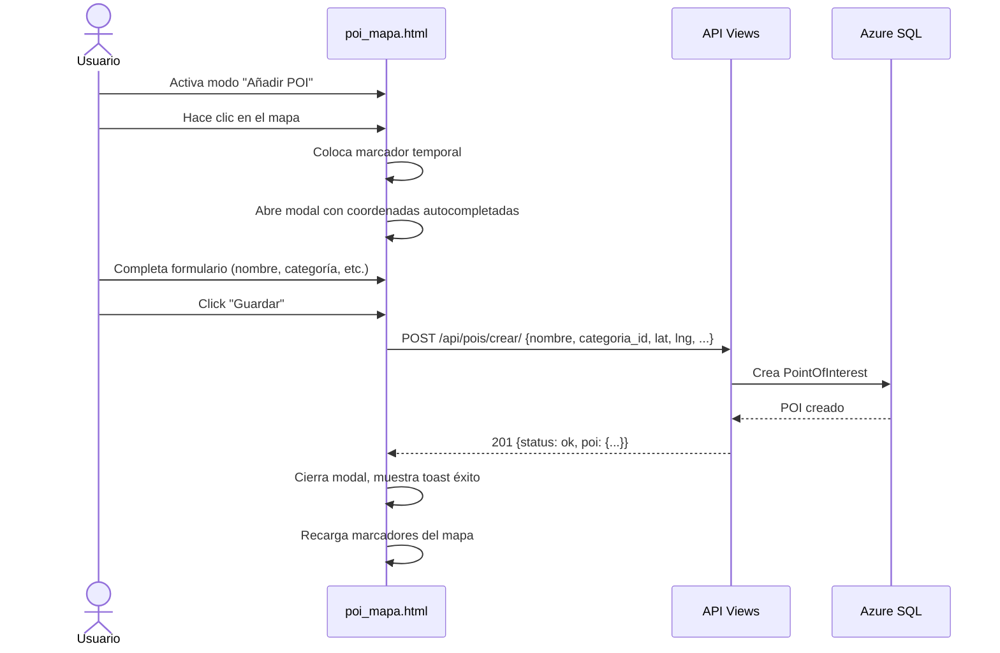

# Plan: Implementar Creación de POIs desde el Mapa

## Resumen del Análisis

El sistema de POIs ya existe con:
- **Modelos**: `CategoriaPOI` y `PointOfInterest` en [`webapp/api/models.py`](../webapp/api/models.py)
- **Migración**: [`webapp/api/migrations/0001_initial.py`](../webapp/api/migrations/0001_initial.py) ya aplicada
- **Admin**: Registrado en [`webapp/api/admin.py`](../webapp/api/admin.py)
- **Endpoints GET**: `/api/pois/capas/`, `/api/pois/all.geojson`, `/api/pois/mapa/`
- **Template**: [`webapp/templates/api/poi_mapa.html`](../webapp/templates/api/poi_mapa.html) — solo lectura, sin creación

**Lo que falta**: No existe endpoint POST para crear POIs, ni serializer, ni interfaz en el mapa para agregar nuevos puntos.

---

## Arquitectura del Flujo



---

## Tareas

### Tarea 1: Crear Serializer para POI

**Archivo**: [`webapp/api/serializers.py`](../webapp/api/serializers.py)

Agregar `POICreateSerializer` con:
- `nombre` (CharField, required)
- `categoria_id` (IntegerField, required) — validar que exista en `CategoriaPOI`
- `latitud` (DecimalField, required)
- `longitud` (DecimalField, required)
- `direccion` (CharField, optional, blank)
- `telefono` (CharField, optional, blank)
- `sitio_web` (URLField, optional, blank)
- `descripcion` (CharField, optional, blank)

Validación personalizada: verificar que `categoria_id` exista y esté activa.

### Tarea 2: Crear Endpoint POST /api/pois/crear/

**Archivo**: [`webapp/api/views.py`](../webapp/api/views.py)

Agregar `CrearPOIAPIView(APIView)`:
- `permission_classes = [AllowAny]` (mismo nivel que los otros endpoints POI)
- Método `post(request)`:
  1. Validar datos con `POICreateSerializer`
  2. Crear `PointOfInterest` con los datos validados
  3. Retornar `Response` con status 201 y el POI creado (incluyendo id)
  4. Manejar errores de validación con status 400

### Tarea 3: Registrar URL

**Archivo**: [`webapp/api/urls.py`](../webapp/api/urls.py)

Agregar:
```python
path('pois/crear/', views.CrearPOIAPIView.as_view(), name='pois-crear'),
```

### Tarea 4: Modificar Template poi_mapa.html

**Archivo**: [`webapp/templates/api/poi_mapa.html`](../webapp/templates/api/poi_mapa.html)

#### 4.1. Agregar botón "Añadir POI" en la toolbar
- Botón con ícono (+) en la toolbar (junto a centrar/recargar)
- Al hacer clic, activa/desactiva el "modo creación"
- Cambia visualmente el cursor del mapa a crosshair

#### 4.2. Evento de clic en el mapa
- Si modo creación activo, al hacer clic en el mapa:
  - Colocar marcador temporal (distinto visualmente, ej: pin rojo pulsante)
  - Abrir modal con formulario

#### 4.3. Modal de creación de POI
Campos del formulario:
| Campo | Tipo | Requerido | Notas |
|-------|------|-----------|-------|
| Nombre | text | Sí | |
| Categoría | select | Sí | Poblado desde `/api/pois/capas/` |
| Latitud | text readonly | Sí | Autocompletado del clic |
| Longitud | text readonly | Sí | Autocompletado del clic |
| Dirección | text | No | |
| Teléfono | text | No | |
| Sitio web | url | No | |
| Descripción | textarea | No | |

#### 4.4. Envío del formulario
- POST AJAX a `/api/pois/crear/`
- Incluir CSRF token
- Mostrar loader durante el envío
- En éxito: cerrar modal, mostrar toast verde "POI creado exitosamente", recargar marcadores
- En error: mostrar errores de validación en el formulario

#### 4.5. Estados visuales
- **Toast de éxito**: Mensaje verde con ícono de check
- **Toast de error**: Mensaje rojo con detalles del error
- **Modo creación**: Indicador visual en la toolbar (botón activo/resaltado)
- **Marcador temporal**: Pin rojo con animación de bounce

---

## Diagrama de Componentes Afectados

```mermaid
graph TD
    subgraph Backend
        M[api/models.py<br/>PointOfInterest] --> S[api/serializers.py<br/>POICreateSerializer NEW]
        S --> V[api/views.py<br/>CrearPOIAPIView NEW]
        V --> U[api/urls.py<br/>pois/crear/ NEW]
    end
    
    subgraph Frontend
        T[api/poi_mapa.html<br/>MODIFICADO] --> |POST| V
        T --> |GET capas| GET_CAPAS[/api/pois/capas/]
        T --> |GET geojson| GET_GEOJSON[/api/pois/all.geojson]
    end
    
    subgraph Database
        DB[(Azure SQL)] --> M
    end
```

---

## Validaciones

### Backend (Serializer)
- `nombre`: obligatorio, max 200 chars
- `categoria_id`: obligatorio, debe existir en `CategoriaPOI` con `is_active=True`
- `latitud`: obligatorio, rango -90 a 90
- `longitud`: obligatorio, rango -180 a 180
- `direccion`: opcional, max 300 chars
- `telefono`: opcional, max 30 chars
- `sitio_web`: opcional, URL válida
- `descripcion`: opcional

### Frontend (JavaScript)
- Nombre requerido (validación antes de enviar)
- Categoría seleccionada
- Confirmación visual antes de enviar

---

## Notas Adicionales

- Los endpoints POI existentes usan `AllowAny`, mantener consistencia
- El modelo `PointOfInterest` ya tiene `created_at` y `updated_at` auto-generados
- La migración `0001_initial.py` ya creó las tablas, no se necesita nueva migración
- El CSRF token debe manejarse correctamente (Django lo requiere para POST)
- Google Maps API ya tiene la librería `places` cargada en el template
