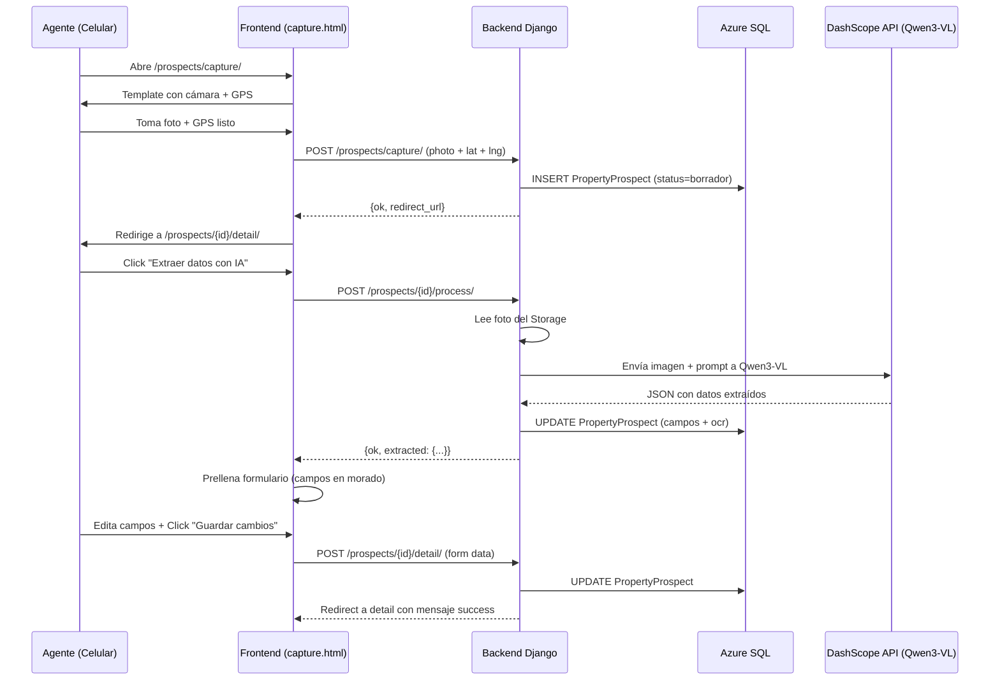

# Plan: Implementar App `prospects` — Captura de Prospectos Inmobiliarios

## Resumen

Crear una nueva app Django `prospects` para que agentes inmobiliarios capturen prospectos desde su celular: foto del anuncio + GPS → procesamiento con IA (Qwen3-VL) → edición manual → seguimiento de estado.

---

## Arquitectura

```mermaid
flowchart TD
    A[Agente en campo] -->|Abre /prospects/capture/| B(Template capture.html)
    B -->|Toma foto + GPS| C[POST /prospects/capture/]
    C -->|Guarda PropertyProspect| D[(Azure SQL - prospects_propertyprospect)]
    D -->|Redirige| E[GET /prospects/{id}/detail/]
    E -->|Botón IA| F[POST /prospects/{id}/process/]
    F -->|Llama Qwen3-VL| G[DashScope API]
    G -->|Devuelve JSON| H[Prellena formulario]
    H -->|Agente edita y guarda| I[POST /prospects/{id}/detail/]
    I --> D
```

---

## Puntos críticos a resolver

### 1. `AUTH_USER_MODEL` no está configurado

El proyecto usa [`intelligence.User`](webapp/intelligence/models.py:39) (tabla `intelligence_users`) con UUID como PK, pero **no hay `AUTH_USER_MODEL` en settings.py**. El modelo `PropertyProspect.agent` usa `settings.AUTH_USER_MODEL` como FK, lo que fallará si no está definido.

**Solución:** Agregar `AUTH_USER_MODEL = 'intelligence.User'` en [`settings.py`](webapp/settings.py).

### 2. `MEDIA_ROOT` y `MEDIA_URL` no están configurados

El modelo usa `ImageField(upload_to='prospects/photos/%Y/%m/')`. Sin `MEDIA_ROOT` y `MEDIA_URL`, Django no puede servir ni guardar archivos subidos.

**Solución:** Agregar en [`settings.py`](webapp/settings.py):
```python
MEDIA_URL = '/media/'
MEDIA_ROOT = BASE_DIR / 'media'
```

### 3. Autenticación personalizada

El middleware [`intelligence.middleware.AuthenticationMiddleware`](webapp/intelligence/middleware.py:27) usa `request.current_user` (NO `request.user`). Las vistas usan `@login_required` y `request.user`, que funcionan con `django.contrib.auth.middleware.AuthenticationMiddleware` (línea 85 de settings), pero el usuario autenticado en Django auth puede no coincidir con `intelligence.User`.

**Solución:** Las vistas CBV usan `@method_decorator(login_required, name='dispatch')` que funciona con Django auth. Pero el modelo `PropertyProspect.agent` apunta a `settings.AUTH_USER_MODEL` que será `intelligence.User`. Hay que asegurar que `request.user` (Django auth) y `request.current_user` (intelligence) estén sincronizados, o cambiar las vistas para usar `request.current_user`.

**Recomendación:** Cambiar las vistas para usar `request.current_user` en lugar de `request.user`, consistente con el resto del proyecto (ej: [`acm/views.py`](webapp/acm/views.py:414)).

### 4. `Qwen API Key` necesita configurarse

La vista [`ProcessImageView`](webapp/acm/views.py:... ) usa `settings.QWEN_API_KEY`. Hay que agregar esta variable a [`settings.py`](webapp/settings.py) y al `.env`.

### 5. Ruta `/prospects/` debe agregarse a `PUBLIC_PATHS` o protegerse

El middleware [`intelligence/middleware.py`](webapp/intelligence/middleware.py:14) lista rutas públicas. Si `/prospects/` no está en esa lista, redirigirá a login. Como las vistas ya usan `@login_required`, **no debe estar en PUBLIC_PATHS** (el middleware redirigirá a login, y luego `@login_required` también lo haría — es redundante pero seguro).

### 6. Template `list.html` no existe

El template [`prospects/list.html`](webapp/prospects/templates/prospects/list.html) es referenciado por [`prospect_list`](webapp/prospects/views.py:...) pero no ha sido creado aún.

---

## Plan de implementación

### Paso 1: Configuración en settings.py

**Archivo:** [`webapp/settings.py`](webapp/settings.py)

- [ ] Agregar `'prospects'` a `INSTALLED_APPS`
- [ ] Agregar `AUTH_USER_MODEL = 'intelligence.User'`
- [ ] Agregar `MEDIA_URL = '/media/'`
- [ ] Agregar `MEDIA_ROOT = BASE_DIR / 'media'`
- [ ] Agregar `QWEN_API_KEY = env('QWEN_API_KEY', default='')`

### Paso 2: Configuración en urls.py principal

**Archivo:** [`webapp/urls.py`](webapp/urls.py)

- [ ] Agregar `path('prospects/', include('prospects.urls'))`
- [ ] Agregar `+ static(settings.MEDIA_URL, document_root=settings.MEDIA_ROOT)` al final de `urlpatterns` (importar `static` de `django.conf.urls.static` y `settings`)

### Paso 3: Crear archivos de la app `prospects`

- [ ] Crear carpeta `webapp/prospects/`
- [ ] Crear `webapp/prospects/__init__.py`
- [ ] Crear `webapp/prospects/apps.py`
- [ ] Crear `webapp/prospects/admin.py` (registrar modelo en admin)
- [ ] Crear `webapp/prospects/models.py` (contenido proporcionado por el usuario)
- [ ] Crear `webapp/prospects/forms.py` (contenido proporcionado)
- [ ] Crear `webapp/prospects/views.py` (contenido proporcionado, pero ajustar `request.user` → `request.current_user`)
- [ ] Crear `webapp/prospects/urls.py` (contenido proporcionado)
- [ ] Crear `webapp/prospects/migrations/__init__.py`
- [ ] Crear `webapp/prospects/templates/prospects/` (carpeta)
- [ ] Crear `webapp/prospects/templates/prospects/capture.html` (template proporcionado por el usuario)
- [ ] Crear `webapp/prospects/templates/prospects/list.html` (template de listado)

### Paso 4: Ajustar vistas para usar `request.current_user`

**Archivo:** [`webapp/prospects/views.py`](webapp/prospects/views.py)

- [ ] En `CaptureView.post()`: cambiar `agent=request.user` → `agent=request.current_user`
- [ ] En `ProspectDetailView.get_prospect()`: cambiar `agent=request.user` → `agent=request.current_user`
- [ ] En `prospect_list()`: cambiar `agent=request.user` → `agent=request.current_user`
- [ ] En `ProcessImageView.post()`: cambiar `agent=request.user` → `agent=request.current_user`

### Paso 5: Migraciones

- [ ] Ejecutar `python manage.py makemigrations prospects`
- [ ] Ejecutar `python manage.py migrate prospects`

### Paso 6: Template `list.html`

- [ ] Crear template de listado de prospectos con tabla, filtros por estado, y cards con foto miniatura

### Paso 7: Verificar y probar

- [ ] Verificar que `django.contrib.humanize` está en INSTALLED_APPS (ya está, línea 54)
- [ ] Verificar que `Pillow` está en requirements.txt (necesario para ImageField)
- [ ] Verificar que `httpx` está en requirements.txt (usado en views.py para llamar Qwen)
- [ ] Probar flujo completo: captura → detalle → procesar IA → editar → guardar

---

## Dependencias a agregar a requirements.txt

- `Pillow>=10.0.0` (para ImageField)
- `httpx>=0.27.0` (para llamar API Qwen3-VL)

---

## Diagrama de flujo de datos



---

## Notas adicionales

1. **El template `capture.html`** ya incluye detección de móvil (`can_process`) para mostrar/ocultar el botón de IA. La vista `ProspectDetailView.get()` ya pasa `can_process: is_mobile_device(request)`.

2. **El campo `phone`** en el modelo es `CharField` (no `PhoneNumberField`) para evitar dependencias adicionales. El agente puede escribir el formato que prefiera.

3. **GPS**: Solo se guardan coordenadas. La dirección se llena manualmente. No hay geocoding inverso.

4. **Estados automáticos**: Cuando el agente guarda un prospecto que tenía datos de OCR (teléfono o nombre), el estado pasa automáticamente de `borrador` → `pendiente`.
