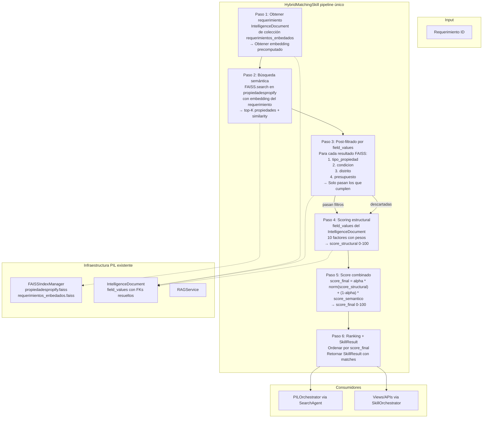
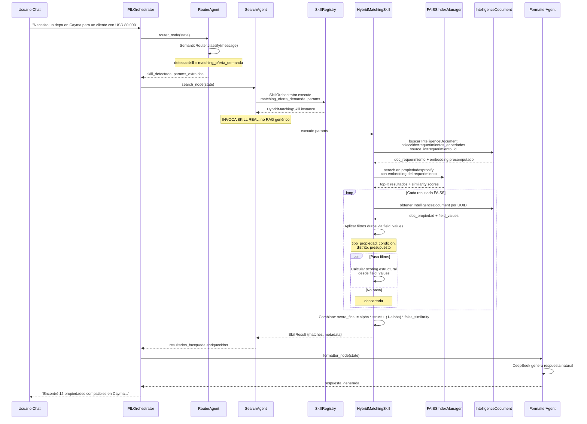

# Plan de Arquitectura: Matching Híbrido (Filtros Duros + Búsqueda Semántica)

> **Contexto:** Propifai — Sistema de inteligencia inmobiliaria
> **Skill única:** `HybridMatchingSkill` (reemplaza TODO el matching existente)
> **Datos:** Colecciones embeddeadas [`propiedadespropify`](../webapp/intelligence/data/faiss_indexes/propiedadespropify.faiss) y [`requerimientos_enbedados`](../webapp/intelligence/data/faiss_indexes/requerimientos_enbedados.faiss)
> **Principio:** Una sola lógica de matching dentro del ecosistema PIL. No hay sistemas paralelos.

---

## 1. Principios Arquitectónicos

```
┌─────────────────────────────────────────────────────────────────────┐
│                    UNA SOLA LÓGICA DE MATCHING                      │
│  HybridMatchingSkill es el ÚNICO sistema de matching.               │
│  Trabaja 100% sobre IntelligenceDocument + FAISS.                  │
│  No consulta dbpropify_be directamente.                            │
│  Views/APIs/PILOrchestrator lo invocan via SkillRegistry.           │
└─────────────────────────────────────────────────────────────────────┘
```

1. **Skill única** — `HybridMatchingSkill` es la única fuente de verdad para matching. No hay `MatchingEngine` paralelo, no hay raw SQL contra `dbpropify_be`.
2. **Datos embeddeados** — Tanto propiedades como requerimientos ya están embeddeados en FAISS. El matching usa esos embeddings precomputados.
3. **`field_values` como fuente de filtros** — Los filtros duros (tipo, condicion, distrito, presupuesto) se aplican contra el JSON `field_values` de `IntelligenceDocument`, que ya tiene nombres resueltos (FKs).
4. **SkillRegistry** — La skill se registra en `SkillRegistry`. Tanto `SearchAgent` (PILOrchestrator) como las views la invocan via `SkillOrchestrator.execute()`.
5. **Datos completos siempre** — Nunca truncar resultados. `top_n` solo afecta el output de la skill, no los datos internos.

---

## 2. Arquitectura General

### 2.1 Flujo completo del matching híbrido



### 2.2 Integración con PIL Orchestrator



---

## 3. Estrategia de Matching Semántico

### 3.1 El pipeline completo en detalle

```python
class HybridMatchingSkill(BaseSkill):
    """
    ÚNICO sistema de matching de Propifai.
    Opera 100% sobre IntelligenceDocument + FAISS.
    No consulta dbpropify_be directamente.
    """

    name = "matching_oferta_demanda"
    description = "Matching híbrido: FAISS semántico + filtros duros en field_values + scoring estructural"
    category = "crm"
    access_level = 1
    is_active = True

    # Pesos estructurales (heredados de MatchingEngine, mismos valores)
    PESOS_ESTRUCTURALES = {
        'precio': 20, 'area': 12, 'habitaciones': 10, 'banos': 7,
        'antiguedad': 5, 'estacionamiento': 5, 'distrito': 15,
        'amenities': 10, 'ascensor': 4, 'tipo_propiedad': 12,
    }

    # Alpha default para combinación de scores
    ALPHA_DEFAULT = 0.6  # 60% estructural, 40% semántico

    def execute(self, params, context=None):
        """
        1. Obtener requerimiento desde IntelligenceDocument (colección requerimientos_enbedados)
        2. Extraer su embedding precomputado
        3. Buscar en FAISS propiedadespropify (top-K grande)
        4. Post-filtrar por field_values (tipo, condicion, distrito, presupuesto)
        5. Scoring estructural desde field_values
        6. Combinar scores
        7. Retornar SkillResult
        """
        requerimiento_id = params.get('requerimiento_id')
        alpha = params.get('alpha', self.ALPHA_DEFAULT)
        top_n = params.get('top_n', 20)

        # Paso 1: Obtener requerimiento embeddeado
        req_doc = IntelligenceDocument.objects.get(
            collection__name='requerimientos_enbedados',
            source_id=str(requerimiento_id)
        )
        req_embedding = req_doc.embedding  # bytes, precomputado

        # Paso 2: Búsqueda FAISS
        faiss_idx = FAISSIndexManager.get_instance('propiedadespropify', 1024)
        if not faiss_idx.is_loaded:
            return SkillResult.error(message="FAISS no disponible")

        query_vector = np.frombuffer(req_embedding, dtype=np.float32)
        faiss_results = faiss_idx.search(query_vector, top_k=500)

        # Paso 3-4-5: Post-filtrar y scorer
        matches = []
        for faiss_result in faiss_results:
            doc = IntelligenceDocument.objects.get(id=faiss_result['document_id'])
            field_values = doc.field_values

            # Paso 3: Filtros duros
            if not self._pasa_filtros(field_values, params):
                continue

            # Paso 4: Scoring estructural
            score_struct = self._calcular_scoring(field_values, params)

            # Paso 5: Combinar
            score_sem = faiss_result['similarity']  # 0-1 de FAISS
            score_final = (alpha * score_struct / 100.0 + (1 - alpha) * score_sem) * 100

            matches.append({
                'property_id': int(doc.source_id),
                'field_values': field_values,
                'score_total': round(score_final, 2),
                'score_structural': score_struct,
                'score_semantico': score_sem,
                'score_detalle': {
                    'precio': self._score_precio(field_values, params),
                    'area': self._score_area(field_values, params),
                    # ... resto de campos estructurales
                    'semantico': score_sem,
                    'alpha': alpha,
                },
            })

        # Paso 6: Ranking
        matches.sort(key=lambda x: x['score_total'], reverse=True)
        for i, m in enumerate(matches, 1):
            m['ranking'] = i

        return SkillResult.ok(
            data={'matches': matches[:top_n], 'total': len(matches)},
            metadata={'modo': 'hybrid', 'alpha': alpha, 'faiss_k': len(faiss_results)},
        )
```

### 3.2 Filtros duros sobre field_values

```python
def _pasa_filtros(self, field_values: dict, params: dict) -> bool:
    """Aplica filtros duros usando field_values del IntelligenceDocument."""
    
    # 1. Tipo de propiedad
    tipo_req = params.get('tipo_propiedad', '').lower().strip()
    if tipo_req and tipo_req not in ('no_especificado', 'todos', ''):
        tipo_prop = str(field_values.get('property_type_name', '')).lower().strip()
        if tipo_prop != tipo_req:
            return False
    
    # 2. Condición (compra/alquiler)
    condicion_req = params.get('condicion', '').lower().strip()
    if condicion_req and condicion_req not in ('no_especificado', ''):
        op_type = str(field_values.get('operation_type_name', '')).lower().strip()
        if condicion_req == 'compra' and op_type not in ('venta', 'compra'):
            return False
        if condicion_req == 'alquiler' and op_type != 'alquiler':
            return False
    
    # 3. Distrito
    distritos_req = params.get('distritos', '').lower()
    if distritos_req:
        distrito_prop = str(field_values.get('district_name', '')).lower().strip()
        if distrito_prop and distrito_prop not in distritos_req:
            return False
    
    # 4. Presupuesto
    presupuesto = params.get('presupuesto_monto')
    if presupuesto:
        precio = field_values.get('price')
        if precio:
            precio = float(precio)
            presupuesto = float(presupuesto)
            if precio > presupuesto * 1.10:  # 10% de tolerancia
                return False
    
    return True
```

### 3.3 Construcción del texto semántico (para el requerimiento)

El requerimiento necesita un texto rico para que el embedding capture su intención. Durante el sync de `requerimientos_enbedados`, el contenido embeddeado debe incluir todos los campos relevantes:

```python
def _build_requerimiento_text(req: Requerimiento) -> str:
    """Construye texto semántico del requerimiento para embedding."""
    parts = []
    
    tipo = req.tipo_propiedad or ''
    if tipo and tipo != 'no_especificado':
        parts.append(f"Busco {tipo}")
    
    condicion = req.condicion or ''
    if condicion and condicion != 'no_especificado':
        parts.append(f"en {condicion}")
    
    if req.distritos:
        parts.append(f"en {req.distritos}")
    
    if req.presupuesto_monto:
        moneda = req.presupuesto_moneda or 'PEN'
        parts.append(f"presupuesto hasta {moneda} {req.presupuesto_monto:,.0f}")
    
    specs = []
    if req.habitaciones:
        specs.append(f"{req.habitaciones} habitaciones")
    if req.banos:
        specs.append(f"{req.banos} baños")
    if req.area_m2:
        specs.append(f"{req.area_m2} m²")
    if specs:
        parts.append(", ".join(specs))
    
    if req.caracteristicas_extra:
        parts.append(f"con {req.caracteristicas_extra}")
    
    return ". ".join(p for p in parts if p)
```

---

## 4. Estrategia de Combinación de Scores

### 4.1 Fórmula

```
score_final = (alpha * score_structural / 100 + (1 - alpha) * score_semantico) * 100
```

Donde:
- `score_structural` = 0-100 (10 factores ponderados desde field_values)
- `score_semantico` = 0-1 (similitud coseno de FAISS, Inner Product con vectores normalizados)
- `alpha` = configurable, default 0.6

### 4.2 Configuración de alpha

| Contexto | alpha | Efecto |
|----------|-------|--------|
| Requerimiento con specs detalladas (precio, habs, baños, área) | 0.7 | Prioriza estructura |
| Requerimiento con descripción larga (texto libre, amenities narrativas) | 0.4 | Prioriza semántica |
| Default | 0.6 | Balance |

---

## 5. Manejo del Problema FAISS + Filtros

FAISS no soporta filtros nativos. Estrategia: **Post-filtrado con K grande**.

```python
def _hybrid_search(self, req_embedding, params, top_k=500):
    """
    Búsqueda FAISS con post-filtrado.
    
    1. Buscar top-K grande en FAISS (K=500, suficiente para cubrir)
    2. Para cada resultado, cargar IntelligenceDocument
    3. Aplicar filtros duros sobre field_values
    4. Calcular scoring estructural
    5. Combinar con similarity de FAISS
    """
    faiss_idx = FAISSIndexManager.get_instance('propiedadespropify', 1024)
    if not faiss_idx.is_loaded:
        return []

    query_vec = np.frombuffer(req_embedding, dtype=np.float32)
    faiss_results = faiss_idx.search(query_vec, top_k=top_k)
    
    if not faiss_results:
        return []

    # Batch load: todos los documentos FAISS de una sola vez
    doc_ids = [r['document_id'] for r in faiss_results]
    docs_map = {
        str(d.id): d
        for d in IntelligenceDocument.objects.filter(id__in=doc_ids)
        .only('id', 'source_id', 'field_values')
    }

    matches = []
    for fr in faiss_results:
        doc = docs_map.get(fr['document_id'])
        if not doc:
            continue

        fv = doc.field_values or {}
        
        # Post-filtrado
        if not self._pasa_filtros(fv, params):
            continue

        # Scoring estructural
        score_struct = self._calcular_scoring(fv, params)
        
        # Combinación
        score_final = (self.alpha * score_struct / 100.0 + (1 - self.alpha) * fr['similarity']) * 100

        matches.append({
            'property_id': int(doc.source_id),
            'property_doc_id': str(doc.id),
            'field_values': fv,
            'score_total': round(score_final, 2),
            'score_structural': score_struct,
            'score_semantico': fr['similarity'],
            'score_detalle': {**self._calcular_score_detalle(fv, params), 
                              'semantico': fr['similarity'], 'alpha': self.alpha},
        })

    return matches
```

**Performance:** 
- FAISS search con K=500: < 10ms (HNSW, O(log n))
- Batch load de 500 documentos: ~50ms (una query SQL)
- Post-filtrado + scoring: ~2ms (puro Python, sin IO)
- **Total estimado: < 100ms para fase semántica**

---

## 6. Migración — Sin Romper Nada

### Fase 0: Entender el estado actual
- [ ] Examinar qué campos tiene `field_values` en `propiedadespropify` y `requerimientos_enbedados`
- [ ] Verificar que los FAISS indexes están cargados correctamente
- [ ] Probar búsqueda FAISS manual desde shell de Django
- [ ] Mapear los campos de `field_values` necesarios para filtros duros y scoring estructural

### Fase 1: Crear HybridMatchingSkill (skill única)
- [ ] Crear `webapp/intelligence/skills/matching.py` con `HybridMatchingSkill`
- [ ] Implementar `_pasa_filtros()` sobre `field_values` (tipo, condicion, distrito, presupuesto)
- [ ] Implementar `_calcular_scoring()` sobre `field_values` (10 factores con pesos)
- [ ] Implementar `_hybrid_search()`: FAISS → post-filtro → scoring → combinación
- [ ] Registrar en `SkillRegistry` como `matching_oferta_demanda`
- [ ] Incluir modo `legacy` (solo FAISS + filtros, sin scoring estructural) para comparación

### Fase 2: Modificar SearchAgent
- [ ] Modificar `SearchAgent.run()`: si `skill_detectada == 'matching_oferta_demanda'` → invocar `SkillOrchestrator.execute()`
- [ ] Eliminar `SearchAgent._get_collections_for_skill()` para matching (ya no usa RAG genérico)
- [ ] Mapear `SkillResult` → `PILAgentState.resultados_busqueda`

### Fase 3: Migrar consumidores
- [ ] Views/APIs: delegar a `SkillOrchestrator.execute('matching_oferta_demanda', params)`
- [ ] Deprecar `MatchingEngine` y `MatchingOfertaDemandaSkill` viejos

---

## 7. Estructura de Archivos Final

```
webapp/
├── intelligence/
│   ├── skills/
│   │   ├── matching.py              ← ÚNICA lógica de matching: HybridMatchingSkill
│   │   └── ...
│   ├── agents/
│   │   ├── orchestrator.py          ← PILAgentState extendido
│   │   ├── search_agent.py          ← MODIFICADO: invoca SkillRegistry para matching
│   │   └── ...
│   └── services/
│       ├── rag.py                   ← Sin cambios
│       └── faiss_index.py           ← Sin cambios
├── matching/                        ← Solo modelos (MatchResult), views delegan a Skill
│   ├── models.py
│   ├── views.py                     ← MODIFICADO: delega a SkillOrchestrator
│   └── ...
└── plans/
    └── matching_hibrido_embeddings.md
```

**No hay `hybrid_engine.py` separado. No hay funciones sueltas de `_fetch_properties()`. La lógica COMPLETA vive en `HybridMatchingSkill`.**

---

## 8. Riesgos y Mitigaciones

| Riesgo | Impacto | Mitigación |
|--------|---------|------------|
| FAISS desync: propiedades nuevas sin embedding | Propiedades no aparecen en matching | Post-sync validation. Programa sync_vector_collections periódico. |
| field_values incompletos: faltan campos para filtros/scoring | Filtros fallan, scores incorrectos | Validar sync: verificar que todos los campos necesarios están en field_values. |
| Latencia: FAISS + batch load de 500 docs | ~100ms, aceptable | Si crece, implementar paginación o reducir K dinámicamente. |
| Regresión: resultados diferentes al MatchingEngine actual | Agentes confundidos | Modo `legacy` para comparar. Ejecutar evaluación paralela antes de migrar. |

---

*Documento actualizado: Junio 2026*
*Corrección principal: Matching unificado dentro de PIL, sin raw SQL contra dbpropify_be.*

---

## 9. Estado de Implementación

### ✅ Fase 0: Entender el estado actual (Completada)
- Examinado field_values en colecciones `propiedadespropify` y `requerimientos_enbedados`
- Verificados FAISS indexes cargados correctamente
- Mapeados campos de field_values para filtros duros y scoring estructural

### ✅ Fase 1: Crear HybridMatchingSkill (Completada)
- [x] Crear [`webapp/intelligence/skills/matching_hybrid.py`](../webapp/intelligence/skills/matching_hybrid.py) con `HybridMatchingSkill`
- [x] Implementar `_pasa_filtros()` sobre `field_values` (tipo, condicion, distrito, presupuesto)
- [x] Implementar `_calcular_scoring()` sobre `field_values` (10 factores con pesos heredados de MatchingEngine v3)
- [x] Implementar `_hybrid_search()`: FAISS → post-filtro → scoring → combinación
- [x] Registrar en `SkillRegistry` como `matching_hibrido` (registrado en [`apps.py`](../webapp/intelligence/apps.py:61))
- [x] Creada skill con `name="matching_hibrido"` (skill paralela, no reemplaza la legacy)

### ✅ Fase 2: Modificar SearchAgent (Completada)
- [x] SearchAgent.run() ahora detecta `matching_hibrido` y delega en `SkillOrchestrator.execute()`
- [x] Agregado `_run_hybrid_matching()` que mapea params → SkillResult → state

### ✅ Fase 3: Migrar consumidores — MatchingMasivoView (Completada)
- [x] `EjecutarMatchingMasivoView.post()` delegado a `SkillOrchestrator.execute('matching_hibrido', ...)`
- [x] Resultados guardados en `MatchResult` con el mismo formato que el engine legacy
- [x] Respuesta JSON compatible con el frontend existente

### ⏳ Fase 3b: Migrar consumidores — MatchingMasivoView (Pendiente)
- [ ] `MatchingMasivoView.get_context_data()` usa `obtener_resumen_matching_masivo()` del engine — evaluar si migrar
- [ ] Deprecar formalmente `MatchingEngine` y `MatchingOfertaDemandaSkill` legacy
- [ ] Agregar templates semánticos para `matching_hibrido` en `semantic_router.py`
