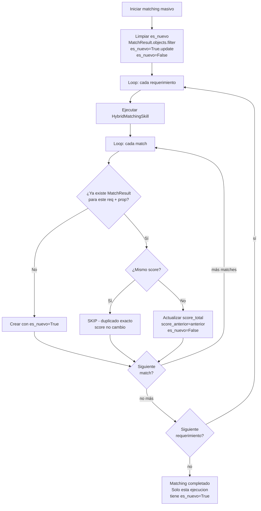

# Plan: Matching Idempotente con Upsert (sin eliminar histórico)

## Problema

Actualmente [`_guardar_hybrid_results()`](../webapp/matching/views.py:1682) hace `MatchResult.objects.create()` para cada match, sin verificar duplicados. Si el matching se corta a la mitad y se re-ejecuta:

- Los requerimientos ya procesados generan NUEVOS rows con distinto timestamp
- Mismo `requerimiento` + `propiedad` aparece múltiples veces
- El [lienzo](../webapp/canvas/models.py:34) referencias `MatchResult` por ID, y los históricos no pueden eliminarse porque:
  - Son referenciados en snapshots de lienzos guardados
  - Sirven para análisis futuro y entrenamiento ML (identificar patrones de matches que llevaron a ventas)

## Restricciones del usuario

1. ❌ **No eliminar** matches existentes — nunca, bajo ninguna circunstancia
2. ✅ **Detectar duplicado exacto** (mismo `requerimiento_id` + `propiedad_id` + `score_total`) → **skip**, no insertar
3. ✅ **Mismo par pero score diferente** → **actualizar** el `score_total` y `score_detalle` del row existente, marcar como `actualizado`
4. ✅ **Par completamente nuevo** → insertar con flag `es_nuevo = True`

## Solución: Upsert en `_guardar_hybrid_results`

### Cambio 1: Nuevos campos en `MatchResult`

Agregar dos campos booleanos al modelo [`MatchResult`](../webapp/matching/models.py:52):

```python
class MatchResult(models.Model):
    # ... campos existentes ...
    
    es_nuevo = models.BooleanField(
        default=True,
        help_text='True si es la primera vez que aparece este match'
    )
    score_anterior = models.DecimalField(
        max_digits=5, decimal_places=2, null=True, blank=True,
        help_text='Score anterior si este match fue actualizado'
    )
```

- `es_nuevo=True` para matches que aparecen en la ÚLTIMA ejecución
- `es_nuevo=False` para matches de ejecuciones anteriores (ya no son nuevos)
- `score_anterior=XX` para matches cuyo score cambió respecto a la ejecución anterior
- Si el score no cambia → el match no se toca (skip)

**Comportamiento del flag `es_nuevo`:**
- Al INICIAR cada ejecución de matching masivo: `MatchResult.objects.filter(es_nuevo=True).update(es_nuevo=False)` — limpia el flag de TODOS los matches anteriores
- Durante la ejecución: los matches NUEVOS se crean con `es_nuevo=True`
- Resultado: después del matching, solo los matches recién creados tienen `es_nuevo=True`. Los de ejecuciones anteriores pasan a `False` automáticamente

### Cambio 2: Lógica de upsert en `_guardar_hybrid_results`

Reemplazar el `create()` directo con esta lógica:

```python
for match in matches:
    property_id = match.get('property_id')
    score_total = Decimal(str(match.get('score_total', 0)))
    
    # Buscar match existente para este par (requerimiento + propiedad)
    existente = MatchResult.objects.filter(
        requerimiento=requerimiento,
        propiedad_id=property_id
    ).first()
    
    if existente:
        if existente.score_total == score_total:
            # Caso 1: DUPLICADO EXACTO → skip
            continue
        else:
            # Caso 2: MISMO PAR, SCORE DIFERENTE → actualizar
            existente.score_anterior = existente.score_total
            existente.score_total = score_total
            existente.score_detalle = score_detalle_clean
            existente.es_nuevo = False
            existente.save(update_fields=[
                'score_total', 'score_detalle', 'score_anterior', 'es_nuevo'
            ])
    else:
        # Caso 3: PAR NUEVO → crear con es_nuevo=True (default)
        MatchResult.objects.create(
            requerimiento=requerimiento,
            propiedad=propiedad,
            score_total=score_total,
            score_detalle=score_detalle_clean,
            fase_eliminada=None,
            porcentaje_compatibilidad=score_total,
            ranking=match.get('ranking'),
            es_nuevo=True,
        )
```

### Cambio 3: Etiqueta visual en el Lienzo

El snapshot del [Lienzo](../webapp/canvas/models.py:49) guarda nodos y aristas. Las aristas que conectan propiedades con requerimientos se generan desde los `MatchResult`. 

Cuando se refresca el lienzo, se consultan los matches actualizados y se agrega metadata:

```python
# En la view que genera las aristas del lienzo
arista_metadata = {}
if match.es_nuevo:
    arista_metadata['etiqueta'] = '🆕 Nuevo'
    arista_metadata['color'] = '#22c55e'  # verde
elif match.score_anterior is not None:
    delta = match.score_total - match.score_anterior
    arista_metadata['etiqueta'] = f'📈 Actualizado ({delta:+.1f})'
    arista_metadata['color'] = '#eab308'  # amarillo
else:
    arista_metadata['etiqueta'] = '✓ Existente'
    arista_metadata['color'] = '#6b7280'  # gris
```

El frontend del canvas (JS) puede usar estos metadatos para pintar etiquetas y colores en las aristas.

### ¿Qué pasa si el matching se corta a la mitad?

- Reqs A, B procesados → matches guardados/actualizados
- Matching se corta en Req C
- Se re-ejecuta:
  - Req A, B: upsert detecta duplicados o scores iguales → **skip** (no hay duplicados, no hay nuevos creates)
  - Req C: primera vez que se procesa → se crean con `es_nuevo=True`

**No se generan filas duplicadas.**

### ¿Qué pasa si se agregan 10 requerimientos nuevos?

- Reqs existentes: upsert detecta que ya existen con mismos scores → **skip**
- Reqs nuevos: se crean con `es_nuevo=True`
- En el lienzo, los nuevos matches aparecen con etiqueta 🆕 Nuevo

### ¿Qué pasa si cambia el score de un match existente?

Por ejemplo, si se cambia el umbral, el alpha, o se agregan nuevas propiedades que afectan el ranking:

- El upsert detecta que el score es diferente → actualiza el row existente
- `score_anterior` guarda el valor previo para trazabilidad
- En el lienzo aparece 📈 Actualizado (+5.2)

## Diagrama de flujo



## Tareas de implementación

### Fase 1: Modelo

- [ ] 1.1 Agregar campos `es_nuevo` y `score_anterior` a [`MatchResult`](../webapp/matching/models.py:52)
- [ ] 1.2 Crear migración: `python manage.py makemigrations matching`
- [ ] 1.3 Migrar datos existentes: todos los `MatchResult` actuales deben tener `es_nuevo=False` (no se sabe si fueron nuevos). Opcionalmente el primero de cada par puede marcarse como `es_nuevo=True`.

### Fase 2: Lógica de upsert

- [ ] 2.1 Reemplazar `MatchResult.objects.create()` en [`_guardar_hybrid_results()`](../webapp/matching/views.py:1705-1745) con la lógica de upsert (buscar existente → skip/update/create)
- [ ] 2.2 Solo tocar [`webapp/matching/views.py`](../webapp/matching/views.py), ningún otro archivo

### Fase 3: Lienzo — etiquetas visuales

- [ ] 3.1 En la view del canvas que genera aristas, consultar `es_nuevo` y `score_anterior` de cada `MatchResult` para agregar metadata de etiqueta y color
- [ ] 3.2 En el frontend JS del canvas, renderizar las etiquetas en las aristas según la metadata

### Fase 4: Dashboard

- [ ] 4.1 Agregar columna/indicador en el dashboard de matching que muestre si un match es nuevo o actualizado
- [ ] 4.2 Mostrar `score_anterior → score_total` cuando hay actualización

## No tocar

- ❌ No se agregan nuevos modelos
- ❌ No se eliminan campos ni tablas
- ❌ No se tocan endpoints de API que filtran por `ejecutado_en` (ya funcionan correctamente)
- ❌ No se modifica la lógica de `unique_together`
- ❌ No se elimina ningún `MatchResult` existente
