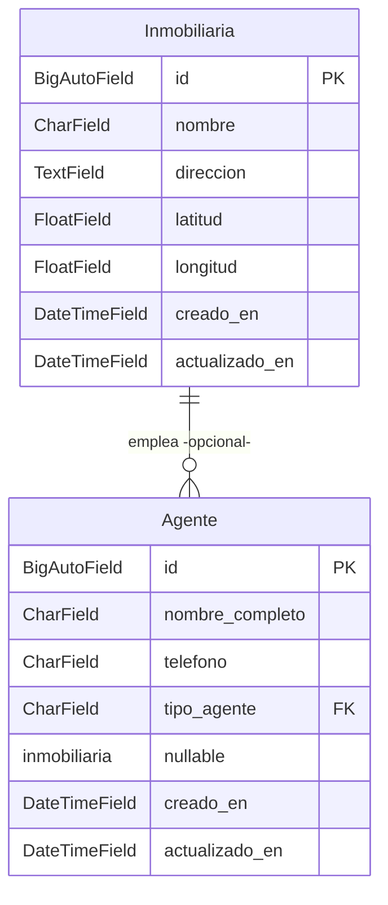

# Spec: Módulo de Agentes e Inmobiliarias — Propifai/Prometeo

**Fecha:** 2026-05-13  
**App:** `agentes` (nueva)  
**Ubicación en menú:** Gestión Inmobiliaria > Agentes (submenú)

---

## 1. Resumen

Crear una nueva app Django llamada **`agentes`** que gestione dos entidades relacionadas:

| Entidad | Descripción |
|---|---|
| **Inmobiliaria** | Empresa inmobiliaria con nombre, dirección, coordenadas geográficas |
| **Agente** | Persona de contacto (nombre completo, teléfono) asociada opcionalmente a una inmobiliaria, o independiente |

---

## 2. Diagrama de Modelos



---

## 3. Especificación de Modelos

### 3.1 `Inmobiliaria`

| Campo | Tipo Django | SQL Server | Restricciones |
|---|---|---|---|
| `id` | `BigAutoField` (PK) | `BIGINT IDENTITY(1,1)` | Auto-generado |
| `nombre` | `CharField(max_length=200)` | `NVARCHAR(200)` | `unique=True`, `db_index=True` |
| `direccion` | `TextField(blank=True)` | `NVARCHAR(MAX)` | Opcional |
| `latitud` | `FloatField(null=True, blank=True)` | `FLOAT` | -90 a 90 |
| `longitud` | `FloatField(null=True, blank=True)` | `FLOAT` | -180 a 180 |
| `creado_en` | `DateTimeField(auto_now_add=True)` | `DATETIME2` | — |
| `actualizado_en` | `DateTimeField(auto_now=True)` | `DATETIME2` | — |

**Meta:**
- `db_table = 'agentes_inmobiliaria'`
- `ordering = ['nombre']`
- `verbose_name = 'Inmobiliaria'` / `verbose_name_plural = 'Inmobiliarias'`

### 3.2 `Agente`

| Campo | Tipo Django | SQL Server | Restricciones |
|---|---|---|---|
| `id` | `BigAutoField` (PK) | `BIGINT IDENTITY(1,1)` | Auto-generado |
| `nombre_completo` | `CharField(max_length=200)` | `NVARCHAR(200)` | `db_index=True` |
| `telefono` | `CharField(max_length=20)` | `NVARCHAR(20)` | — |
| `tipo_agente` | `CharField(max_length=15, choices=INDEPENDIENTE/INMOBILIARIA)` | `NVARCHAR(15)` | — |
| `inmobiliaria` | `ForeignKey('Inmobiliaria', null=True, blank=True, on_delete=SET_NULL)` | `BIGINT NULL FK` | Solo requerido si `tipo_agente == 'INMOBILIARIA'` |
| `creado_en` | `DateTimeField(auto_now_add=True)` | `DATETIME2` | — |
| `actualizado_en` | `DateTimeField(auto_now=True)` | `DATETIME2` | — |

**Meta:**
- `db_table = 'agentes_agente'`
- `ordering = ['nombre_completo']`
- `verbose_name = 'Agente'` / `verbose_name_plural = 'Agentes'`

---

## 4. Rutas y Vistas

### 4.1 URLs de la app (`agentes/urls.py`)

| Ruta | Vista | Nombre |
|---|---|---|
| `agentes/` | `AgenteListView` | `lista_agentes` |
| `agentes/nuevo/` | `AgenteCreateView` | `crear_agente` |
| `agentes/<id>/editar/` | `AgenteUpdateView` | `editar_agente` |
| `agentes/<id>/eliminar/` | `AgenteDeleteView` | `eliminar_agente` |
| `inmobiliarias/` | `InmobiliariaListView` | `lista_inmobiliarias` |
| `inmobiliarias/nueva/` | `InmobiliariaCreateView` | `crear_inmobiliaria` |
| `inmobiliarias/<id>/editar/` | `InmobiliariaUpdateView` | `editar_inmobiliaria` |
| `inmobiliarias/<id>/eliminar/` | `InmobiliariaDeleteView` | `eliminar_inmobiliaria` |

### 4.2 Router principal (`webapp/urls.py`)

```python
# Agentes e Inmobiliarias
path('agentes/', include('agentes.urls')),
```

---

## 5. Templates

4 templates bajo `webapp/agentes/templates/agentes/`, heredando de `propifai_base.html`:

| Template | Función |
|---|---|
| `lista_agentes.html` | Tabla agentes, filtro tipo/inmobiliaria, botón "Nuevo Agente" |
| `formulario_agente.html` | Formulario crear/editar agente |
| `lista_inmobiliarias.html` | Tabla inmobiliarias, botón "Nueva Inmobiliaria" |
| `formulario_inmobiliaria.html` | Formulario crear/editar inmobiliaria |

---

## 6. Integración en Sidebar

En `propifai_base.html`, justo después de "Matching" (línea ~562) y antes de "Análisis & Mercado" (línea ~564):

```html
<div class="nav-item has-submenu active">
    <a href="#" class="nav-link submenu-toggle">
        <span class="nav-icon">&#x1F465;</span>
        <span>Agentes</span>
        <span class="submenu-arrow">&#x25BC;</span>
    </a>
    <div class="submenu-items">
        <a href="/agentes/" class="submenu-item">Lista de Agentes</a>
        <a href="/inmobiliarias/" class="submenu-item">Inmobiliarias</a>
    </div>
</div>
```

---

## 7. Estructura de Archivos a Crear

```
webapp/agentes/
├── __init__.py
├── apps.py
├── models.py          ← Inmobiliaria, Agente
├── views.py           ← CRUD con CBV
├── urls.py            ← app_name='agentes'
├── admin.py           ← registro de modelos
├── forms.py           ← AgenteForm, InmobiliariaForm
├── migrations/
│   └── __init__.py
└── templates/
    └── agentes/
        ├── lista_agentes.html
        ├── formulario_agente.html
        ├── lista_inmobiliarias.html
        └── formulario_inmobiliaria.html
```

---

## 8. Orden de Ejecución

| Paso | Archivo | Acción |
|---|---|---|
| 1 | `webapp/agentes/` | Crear estructura de app |
| 2 | `webapp/agentes/models.py` | Definir modelos |
| 3 | `webapp/settings.py` | Agregar `'agentes'` a INSTALLED_APPS |
| 4 | Terminal | `makemigrations agentes` |
| 5 | Terminal | `migrate agentes` |
| 6 | `webapp/agentes/admin.py` | Registrar modelos |
| 7 | `webapp/agentes/forms.py` | Crear formularios |
| 8 | `webapp/agentes/views.py` | Implementar vistas CRUD |
| 9 | `webapp/agentes/urls.py` | Definir rutas |
| 10 | `webapp/urls.py` | Incluir rutas en router principal |
| 11 | `webapp/agentes/templates/agentes/` | Crear 4 templates |
| 12 | `webapp/templates/propifai_base.html` | Insertar submenú "Agentes" |
