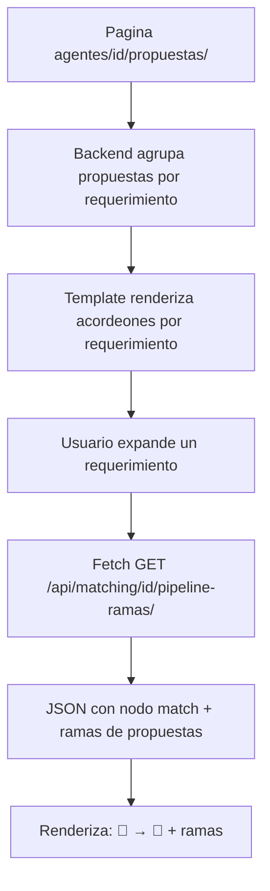

# Plan: Pipeline Multi-Rama por Requerimiento

## Objetivo

Reorganizar el pipeline en `agentes/{id}/propuestas/` para que se agrupe por **requerimiento** y muestre **ramas** cuando se envían múltiples propuestas para distintas propiedades.

## Estructura actual (por propuesta)

Cada fila tiene un botón 📊 que abre el pipeline de esa propuesta individual.

## Estructura deseada (línea temporal con ramas dinámicas)

Las propuestas se ordenan cronológicamente. Cada nueva propuesta se "engancha" al pipeline en el nodo donde se encontraba el pipeline en ese momento. La rama sale desde el estado de la propuesta anterior.

```
Caso: Prop A se envía -> queda "Enviada" -> luego se envía Prop B

📝(20/05) ──→ 🎯(29/05) ──→ 📤 Prop A(03/06) ──→ ✅/❌ Decisión A
                              │
                              └── 📤 Prop B(04/06) ──→ ⏳ Pendiente

Caso: Prop A se envía -> es aceptada -> luego se envía Prop B

📝 ──→ 🎯 ──→ 📤 Prop A ──→ ✅ Aceptado
                                │
                                └── 📤 Prop B ──→ ⏳ Pendiente
```

**Regla de negocio:** La rama se abre desde el estado en que se encontraba el pipeline en el momento exacto del envío de la nueva propuesta.

Donde:
- 📝 Requerimiento — datos del cliente
- 🎯 Match — el mejor score de todos los matches
- Cada **rama** es una PropuestaWhatsApp independiente con su propia decisión

## Pasos de implementación

### Paso 1: Agrupar propuestas por requerimiento en la vista

**Archivo:** [`webapp/agentes/views.py`](webapp/agentes/views.py:114)

Modificar `AgentePropuestasView.get_context_data()` para agrupar las propuestas por `requerimiento_id` y pasarlo al template como:

```python
# En lugar de:
context['propuestas'] = propuestas

# Ahora:
from collections import defaultdict
propuestas_por_req = defaultdict(list)
for p in propuestas:
    propuestas_por_req[p.requerimiento_id].append(p)
context['propuestas_por_req'] = dict(propuestas_por_req)
```

### Paso 2: Nueva función backend para pipeline con ramas

**Archivo:** [`webapp/matching/pipeline_requerimiento.py`](webapp/matching/pipeline_requerimiento.py)

Agregar función `obtener_pipeline_con_ramas(requerimiento_id)` que retorne:

```python
{
    'requerimiento_id': int,
    'requerimiento_texto': str,
    'etapa_requerimiento': { ... },  # Like before
    'etapa_match': { ... },  # Best match
    'ramas': [
        {
            'propuesta_id': int,
            'propiedad_code': str,
            'propiedad_title': str,
            'etapa_propuesta': { ... },
            'etapa_decision': { ... },
        },
        # ... more branches
    ],
    'lapso_total': { ... } or None,
}
```

Nuevo endpoint: `GET /api/matching/{requerimiento_id}/pipeline-ramas/`

### Paso 3: Modificar template pipeline_propuestas.html

**Archivo:** [`webapp/agentes/templates/agentes/pipeline_propuestas.html`](webapp/agentes/templates/agentes/pipeline_propuestas.html)

Reemplazar la tabla plana por:

```
┌─────────────────────────────────────────────────────┐
│ Header: stats por status                            │
├─────────────────────────────────────────────────────┤
│ 📋 Requerimiento #20412                             │
│   Belen Aguilar - Departamentos - S/.433,000        │
│                                                     │
│   📝 ──→ 🎯 (80%)                                   │
│         │                                           │
│         ├── 📤 PROP000077 → ✅ Aceptado  (04/06)    │
│         │    ⏱️ lapso: 4d 19h                        │
│         │                                            │
│         └── 📤 PROP000078 → ⏳ Pendiente (hoy)       │
│              ⏱️ lapso: 2h 30m                         │
│                                                     │
├─────────────────────────────────────────────────────┤
│ 📋 Requerimiento #20415                             │
│   ...                                               │
└─────────────────────────────────────────────────────┘
```

Cada requerimiento se muestra como un **acordeón** expandible con:
- Resumen del requerimiento (quién, qué busca, presupuesto)
- Pipeline principal 📝 → 🎯
- Lista de ramas de propuestas con su estado

### Paso 4: CSS para ramas

```css
.pipeline-branch {
    display: flex;
    flex-direction: column;
    margin-left: 40px;  /* indent from match node */
    border-left: 2px solid var(--border-color);
    padding-left: 12px;
}
.branch-item {
    display: flex;
    align-items: center;
    gap: 8px;
    padding: 4px 0;
}
.branch-marker {
    width: 8px;
    height: 8px;
    border-radius: 50%;
    background: var(--accent-blue);
    flex-shrink: 0;
}
.branch-marker.aceptado { background: var(--accent-green); }
.branch-marker.rechazado { background: var(--accent-red); }
.branch-marker.pendiente { background: var(--accent-orange); }
```

## Diagrama de flujo



## Archivos a modificar

| Archivo | Acción |
|---------|--------|
| [`webapp/matching/pipeline_requerimiento.py`](webapp/matching/pipeline_requerimiento.py) | Agregar `obtener_pipeline_con_ramas()` |
| [`webapp/matching/views.py`](webapp/matching/views.py) | Agregar action `pipeline_ramas` |
| [`webapp/matching/urls.py`](webapp/matching/urls.py) | Agregar ruta |
| [`webapp/agentes/views.py`](webapp/agentes/views.py:114) | Agrupar propuestas por requerimiento |
| [`webapp/agentes/templates/agentes/pipeline_propuestas.html`](webapp/agentes/templates/agentes/pipeline_propuestas.html) | Rediseñar con acordeones y ramas |
