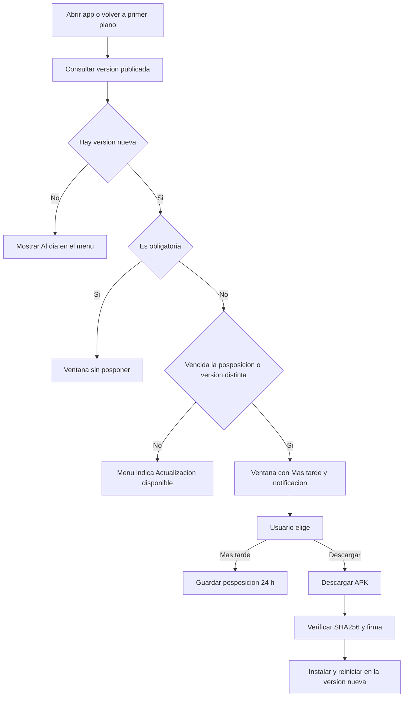

# Plan — Recordatorio de actualizaciones en la APK Propitools

## 1. Problema reportado

1. Al abrir la app aparece la ventana de actualización, pero si el usuario pulsa **"Más tarde"**, **nunca vuelve a aparecer**.
2. No hay forma de ver la **versión instalada** ni un botón de **"Buscar actualizaciones"**.
3. No hay ningún **recordatorio/aviso** de que hay una actualización pendiente.

## 2. Diagnóstico (causa raíz)

En [`AppUpdateGate.kt`](C:/Users/USUARIO/AndroidStudioProjects/propitools/app/src/main/java/com/example/propitools/AppUpdateGate.kt:23):

```kotlin
var hidden by remember { mutableStateOf(false) }
...
dismissButton = { if (!required) TextButton(onClick = { hidden = true }) { Text("Más tarde") } }
if (info != null && (!hidden || required)) { AlertDialog(...) }
```

- `hidden` es **estado en memoria** (`remember`). Al pulsar "Más tarde" queda en `true` y **no se reinicia nunca** (ni siquiera al volver a la app con `ON_RESUME`, que solo re-consulta el estado pero el guard sigue activo).
- Mientras el proceso Android siga vivo —lo normal al "salir y volver a entrar"— la ventana queda silenciada para siempre.
- No existe **posposición persistente**, ni módulo de versión, ni aviso.

## 3. Lógica recomendada

Es el patrón estándar de actualización in-app:

| Regla | Comportamiento |
|---|---|
| Consulta | Al abrir la app y al volver a primer plano (`ON_RESUME`), más un botón manual. |
| Recordatorio | Si el usuario pospone, se vuelve a recordar **a las 24 h** (posposición persistente en disco, no en memoria). |
| Versión nueva | Si aparece una versión **más nueva** que la pospuesta, se recuerda **de inmediato** (no espera 24 h). |
| Obligatoria | Si `force_update` es verdadero, la ventana **no se puede posponer**. |
| Visibilidad permanente | El menú muestra **siempre** el estado: "Al día" o "Actualización disponible". |
| Acción manual | Módulo **Versión y actualizaciones** con datos y botón **Buscar actualizaciones** + descargar/instalar. |
| Aviso | **Notificación local** en la bandeja cuando hay una pendiente y toca recordar (se reemplaza, no se duplica). |
| Descarga | Estado compartido: descargando / lista para instalar / error; se **reanuda** si el usuario cierra y reabre la app. |

### Flujo de decisión



## 4. Implementación propuesta

### 4.1 Nuevo archivo — `AppUpdateCenter.kt`

Centro único de estado y reglas. Expone flujos observables (Compose) y:

- `refresh(context)` — consulta al servidor y publica el resultado.
- `info()` / `isRequired()` — versión disponible.
- `shouldRemind(context, versionCode)` — decide si toca recordar (posposición vencida o versión distinta).
- `snooze(context, versionCode)` — guarda posposición de 24 h en `SharedPreferences`.
- `clearSnooze(context)` — al quedar al día.
- `restorePendingDownload` / `startDownload` / `markDownloaded` / `markDownloadFailed` / `install(context)` — ciclo de descarga e instalación.
- `notifyPendingUpdate(context, info)` — notificación en canal `app_updates` (se reemplaza con el mismo id).

Persistencia en `SharedPreferences` (`app_update`): `snooze_until`, `snoozed_version_code`, `download_id`, `sha256`.

### 4.2 Modificar `AppUpdateGate.kt`

- Eliminar `hidden` en memoria y usar `AppUpdateCenter.shouldRemind(...)`.
- Mantener un `deferred` **solo de sesión** para no repintar la ventana justo después de posponer; se limpia en cada `ON_RESUME`.
- Vigilante de la descarga sobre el `downloadId` compartido (descarga en curso → "Instalar").
- Al detectar pendiente y toca recordar: disparar la notificación local.

### 4.3 Modificar `MainActivity.kt`

- Añadir `VERSION` al enum `ProspectScreen`.
- Nuevo ítem en el menú **"Versión y actualizaciones"**, mostrando el estado:
  - "Al día" o **"Actualización disponible"** (indicador visible sin abrir la ventana).
- Nueva pantalla `AppVersionScreen`:
  - Versión **instalada** (`BuildConfig.VERSION_NAME` / `VERSION_CODE`).
  - **Última publicada** (código, notas).
  - Botón **"Buscar actualizaciones"** (fuerza `refresh`, muestra spinner y resultado).
  - Botón **"Descargar/Instalar"** cuando hay actualización, reutilizando el estado compartido.

### 4.4 Sin cambios

- [`AppVersion.kt`](C:/Users/USUARIO/AndroidStudioProjects/propitools/app/src/main/java/com/example/propitools/AppVersion.kt) ya aporta `check`, `download`, `installDownloaded`, `canInstallPackages` y `openInstallPermission`.

## 5. Validación

1. `gradlew testDebugUnitTest` y `gradlew assembleRelease` compilan sin errores.
2. Con una versión más alta publicada en PROMETEO: aparece la ventana al abrir.
3. Pulsar "Más tarde" → la ventana se oculta; el menú sigue indicando "Actualización disponible".
4. Salir y volver a la app → **sigue pendiente** (indicador) y la notificación está en la bandeja; la ventana reaparece al vencer la posposición o con una versión más nueva.
5. "Buscar actualizaciones" en el módulo → detecta la versión; descargar → verificar SHA-256 → instalar.
6. Caso obligatorio (`force_update=true`) → ventana sin "Más tarde".

## 6. Publicación

1. Subir `versionCode` por encima de la instalada y compilar release firmada.
2. Copiar el APK a `webapp/static/apk/` en PROMETEO y registrar la versión en `MobileAppVersion` (panel `/analisis-crm/control/apk/`).
3. Subir el código Android a `sistemapropify/propitools`.
