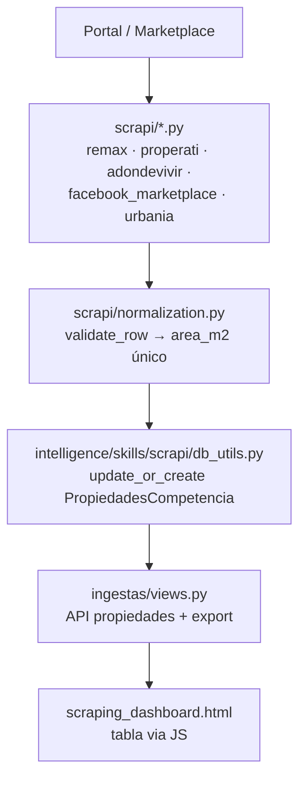

# Plan: distinguir Área de terreno y Área construida en el scraping

## Problema
En [`/ingestas/scraping/dashboard/`](webapp/ingestas/views.py:1887) la tabla de la competencia
tiene una sola columna **«Área m²»**. Pero la descripción de un anuncio puede traer **dos**
superficies distintas (ej. Marketplace):

```
🏡 ÁREA DE TERRENO: 120 m2
🏡 ÁREA CONSTRUIDA: 185 m2
```

El pipeline actual las **colapsa en un solo `area_m2`** y se pierde una de las dos.

## Dónde ocurre (pipeline actual)


- Modelo: [`PropiedadesCompetencia`](webapp/ingestas/models.py:240) solo tiene `area_m2` (más `descripcion`).
- Scrapers usan `calcular_area_m2()` (o el primer `m²`) → un solo valor.
- `normalization.validate_row` normaliza a `area_m2`.
- `db_utils.guardar_propiedades` persiste solo los campos que existen en el modelo.

## Cambios propuestos

### 1. Modelo + migración (`ingestas/models.py`)
- Añadir a `PropiedadesCompetencia`:
  - `area_terreno` → `DecimalField(10,2, null=True, blank=True, verbose_name='Área de terreno (m²)')`
  - `area_construida` → `DecimalField(10,2, null=True, blank=True, verbose_name='Área construida (m²)')`
- Mantener `area_m2` como valor primario/legado (sin romper API ni export).
- Crear migración `makemigrations ingestas`.

### 2. Extracción de ambas áreas desde la descripción
- Nueva utilidad `extraer_areas_de_texto(texto)` (en `scrapi/normalization.py` o `scrapi/areas.py`) que
  detecta etiquetas y devuelve `(terreno, construida)`:
  - `ÁREA DE TERRENO: 120 m2`, `ÁREA CONSTRUIDA: 185 m2`
  - variantes: `área de terreno`, `area del terreno`, `área construida`, `area construida`, `terreno … m²`, `construcción … m²`
  - unidades `m2` / `m²` / `mts2` / `metros cuadrados`.

### 3. Scrapers (`scrapi/*.py`)
- `facebook_marketplace_scraper.py`: usar `extraer_areas_de_texto` sobre `title + description`
  (hoy solo captura el primer `m²`). `area_m2` = construida (o terreno si es terreno).
- `remax_scraper.py`, `properati_scraper.py`, `adondevivir_scraper.py`: sustituir `calcular_area_m2`
  por `calcular_areas` que devuelva ambas (ya leen `Area Construida` / `Area Terreno`), emitiendo
  `area_terreno` y `area_construida` en el registro.
- `urbania_scraper.py`: mapear `Area Total` → terreno y `Area` → construida.

### 4. Normalización + persistencia
- `scrapi/normalization.py`: que `validate_row` **pase** `area_terreno`/`area_construida` y no las colapse.
- `db_utils.py`: guardia de columna (patrón `_precision_disponible_en_bd`) para `area_terreno`/`area_construida`
  (el código no debe romper si llega antes que la migración). La persistencia ya copia automáticamente
  cualquier campo que exista en el modelo (`defaults`).

### 5. Dashboard + API + export
- `/ingestas/scraping/propiedades/` y `/ingestas/scraping/propiedades/exportar/` (en `ingestas/views.py`):
  exponer `area_terreno` y `area_construida`.
- [`scraping_dashboard.html`](webapp/templates/ingestas/scraping_dashboard.html:602): reemplazar la columna
  «Área m²» por dos columnas **«Área terreno»** y **«Área construida»** (o mostrar `T / C`). Ajustar el
  renderizador JS de `#tablaBody` y la exportación.

### 6. Backfill histórico (opcional, fase 2)
- Comando de management que recorra `PropiedadesCompetencia` con `descripcion` y llene
  `area_terreno`/`area_construida` con `extraer_areas_de_texto`.

## Validación
- `manage.py makemigrations ingestas` + `migrate` (BD local / Azure).
- Prueba con el texto de ejemplo: `terreno=120`, `construida=185`.
- `node --check` del JS del template; render del dashboard 200; export Excel con las dos columnas.
- Commit, push, verificar despliegue.

## ⚠️ Cuidado con el estado del repositorio
- Hay **cambios sin commitear** en `webapp/ingestas/views.py`, `webapp/ingestas/urls.py` y
  `webapp/templates/ingestas/scraping_dashboard.html` (trabajo en curso de otra sesión), y la rama
  local está **28 commits detrás** de `origin/main`.
- Esta feature toca `scraping_dashboard.html` e `ingestas/views.py`, así que al commitear se
  incluiría ese WIP. **Decidir antes**: (a) stashear ese WIP, (b) commitearlo aparte, o (c) asumir
  que es parte del trabajo y commitearlo junto.
