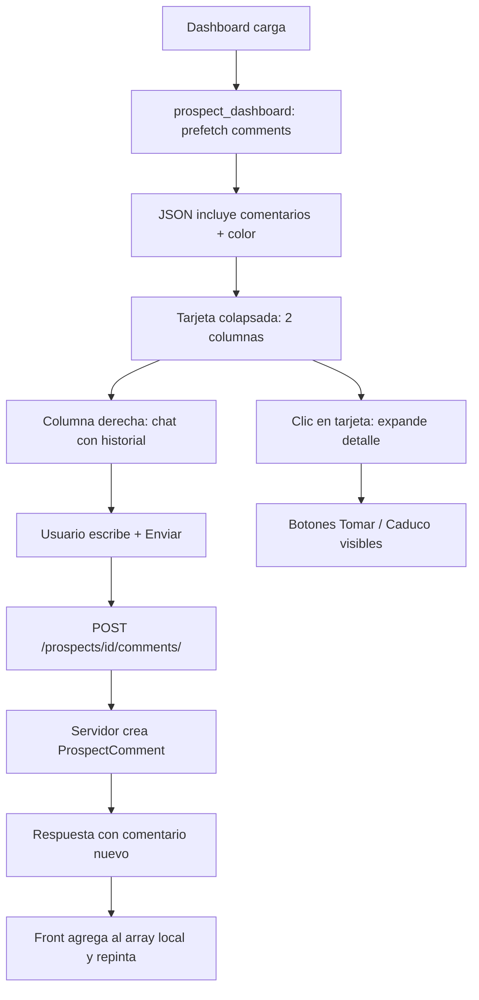

# Plan: Mini-chat de comentarios en las tarjetas de prospección

## Objetivo

En `https://acm.propifai.com/marketing/prospeccion/` (`/prospects/dashboard/`), transformar la tarjeta colapsada de cada prospección:

1. Dividir la tarjeta en dos mitades iguales.
2. **Izquierda**: foto + datos actuales (sin cambios de contenido).
3. **Derecha**: un mini-módulo de conversación donde cualquier usuario Propify puede escribir comentarios. Cada comentario muestra nombre de usuario (con color automático por usuario), fecha y hora.
4. Debajo de los comentarios: campo de texto + botón "Enviar".
5. Los botones "Tomar Prospección" y "Prospección caducó" **desaparecen del estado colapsado** y solo aparecen al hacer clic en la tarjeta (detalle expandido).

Alcance: solo **agregar** comentarios (sin editar ni borrar). Color de usuario automático y determinístico.

## Cambios en backend (`webapp/prospects/`)

### 1. Modelo nuevo `ProspectComment`
Archivo: [`webapp/prospects/models.py`](webapp/prospects/models.py)

```python
class ProspectComment(models.Model):
    prospect = models.ForeignKey(PropertyProspect, on_delete=models.CASCADE, related_name='comments')
    author_username = models.CharField(max_length=150)  # username Propify
    text = models.TextField()
    created_at = models.DateTimeField(auto_now_add=True)

    class Meta:
        ordering = ['created_at']
```

- No se guarda el color: se deriva del username (hash → paleta) tanto en servidor como en cliente para que sea estable.
- Migración: `0012_prospectcomment.py` (crear tabla).

### 2. Endpoint `GET`/`POST /prospects/<pk>/comments/`
Archivo: [`webapp/prospects/views.py`](webapp/prospects/views.py) + [`webapp/prospects/urls.py`](webapp/prospects/urls.py)

- Vista `prospect_comments` con `@csrf_exempt` + `@propify_web_required`.
- `GET`: lista de comentarios del prospecto → `{ok: true, results: [{id, author_username, color, text, created_at}]}`.
- `POST`: crea un comentario con `author_username = propify_user.username`, `text = request.POST['text']`. Devuelve el comentario creado.
- `color` se calcula en servidor con una función determinística `color_para_usuario(username)` (misma paleta que el front).

### 3. Incluir comentarios en el JSON del dashboard
Archivo: [`webapp/prospects/views.py`](webapp/prospects/views.py) (función `prospect_dashboard`)

- Prefetch de comentarios: `PropertyProspect.objects.prefetch_related('comments')`.
- Añadir a cada `data` un campo `comentarios` con la lista serializada (id, author_username, color, text, created_at formateado).
- Así las tarjetas colapsadas pintan el chat sin hacer N peticiones. Al enviar, se actualiza el array local.

## Cambios en frontend (`webapp/prospects/templates/prospects/dashboard.html`)

### 4. Layout de tarjeta colapsada en dos columnas
- CSS: `.ppc-card-grid { display: grid; grid-template-columns: 1fr 1fr; gap: 12px; }`.
- `resumenTarjetaHtml(p)` pasa a renderizar:
  - Columna izquierda: `.ppc-summary` (foto + título/tipo/distrito/precio/teléfono/estado/captado) — igual que hoy.
  - Columna derecha: `.ppc-comments` (mini-chat).
- Quitar de `resumenTarjetaHtml` las filas `.ppc-tomar-row` y `.ppc-caduco-row`.

### 5. Módulo de comentarios `.ppc-comments`
- Cabecera: "Comentarios (N)".
- Lista con `max-height` y scroll: cada comentario muestra username coloreado + fecha/hora + texto.
- Campo de texto + botón "Enviar" (también con Enter).
- Al enviar: `POST /prospects/<id>/comments/`, al tener `ok:true` se agrega al array local `p.comentarios` y se repinta el chat de esa tarjeta.

### 6. Botones solo en el detalle expandido
- Mover `controlTomarHtml(p)` y `controlCaducoHtml(p)` a `filasDetalleHtml(p)` (se renderizan dentro de `.prospect-detail-inline`, que solo se muestra con la clase `open`).
- El guard existente `if (e.target.closest('.prospect-detail-inline')) return;` ya evita que clics en esos botones colapsen la tarjeta.
- Añadir guard en el click de la tarjeta: `if (e.target.closest('.ppc-comments')) return;` para que escribir en el chat no expanda/colapse la tarjeta.

### 7. Color automático por usuario
- Función `colorUsuario(username)` (hash simple → índice en una paleta de ~12 colores legibles sobre fondo oscuro).
- Se usa en servidor (JSON) y en cliente (al renderizar comentarios nuevos/recibidos).

## Flujo



## Archivos a modificar

- `webapp/prospects/models.py` — modelo `ProspectComment`.
- `webapp/prospects/migrations/0012_prospectcomment.py` — migración nueva.
- `webapp/prospects/views.py` — `prospect_comments` (GET/POST) + `prospect_dashboard` (prefetch + campo `comentarios`).
- `webapp/prospects/urls.py` — ruta `comments/`.
- `webapp/prospects/templates/prospects/dashboard.html` — CSS + `resumenTarjetaHtml` + `filasDetalleHtml` + `pintarListaPanel` + funciones del chat.

## Supuestos

- Solo agregar comentarios (confirmado por el usuario).
- Color automático determinístico, sin guardar en BD.
- Los comentarios son visibles por todo el equipo con sesión Propify.
- El envío es por `fetch` sin recargar la página.
