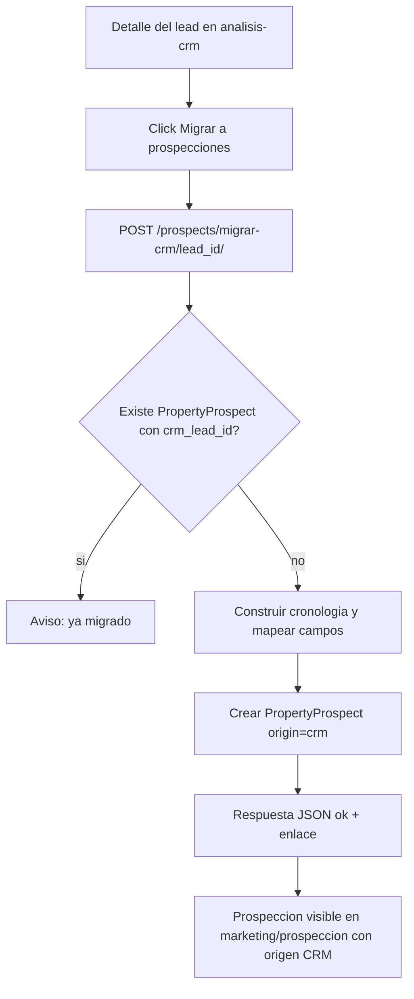

# Plan: Origen "CRM" y botón "Migrar a prospecciones"

## Objetivo

1. Agregar un nuevo origen `CRM` al módulo de prospección (`/marketing/prospeccion/`).
2. Este origen **no** se crea desde el formulario de captura; se crea migrando manualmente un lead del CRM mediante un botón **"Migrar a prospecciones"** ubicado en el detalle del lead (`/analisis-crm/resultados/<lead_id>/`).
3. Al migrar, se crea un `PropertyProspect` con estos datos del lead: **número de lead, nombre, teléfono, responsable actual, fecha de ingreso y cronología del lead**.

## Tablas / apps involucradas

| Capa | App / tabla | Base de datos | Rol |
|---|---|---|---|
| Lead (origen) | `analisis_crm.Lead` → tabla `crm_leads` (managed=False) | `propifai` (dbpropify_be) | Lectura |
| Prospección (destino) | `prospects.PropertyProspect` | `default` (Azure SQL) | Escritura |
| Usuario (responsable) | `analisis_crm.User` → tabla `users` | `propifai` | Solo lectura (nombre) |

El lead y la prospección viven en **bases distintas**, por lo que la migración lee con `connections["propifai"]` / `Lead` y escribe `PropertyProspect` normalmente.

## Cambios en backend

### 1. `prospects/models.py` — `PropertyProspect`
- Agregar a [`ORIGIN_CHOICES`](webapp/prospects/models.py:105): `('crm', 'CRM')`.
- Agregar campo de trazabilidad/dedupe:
  ```python
  crm_lead_id = models.BigIntegerField(null=True, blank=True, db_index=True, verbose_name='Lead CRM origen')
  ```
  (permite saber de qué lead proviene y evitar duplicados si se pulsa dos veces).

### 2. Migración
- `webapp/prospects/migrations/0013_propertyprospect_origin_crm.py`:
  - `AlterField` de `origin` (agregar la opción `crm`).
  - `AddField` de `crm_lead_id`.
- Se aplica sola en el deploy (startup.sh ejecuta `migrate`).

### 3. Endpoint de migración — `prospects/views.py` + `prospects/urls.py`
- Vista `migrar_lead_a_prospeccion(request, lead_id)` con `POST` (y protección igual al detalle del lead: `@management_access_required`).
- Lógica:
  1. `lead = get_lead_conversation(lead_id)` (ya devuelve `display_name`, `phone`, `agent_name`, `entered_at`, `timeline_events`).
  2. Si ya existe `PropertyProspect.objects.filter(crm_lead_id=lead_id)` → devolver `{ok: false, error: 'Este lead ya fue migrado.'}`.
  3. Construir la cronología como texto (timestamp en hora de Perú, remitente/actividad y texto/descripción).
  4. Crear `PropertyProspect` con el mapeo de la tabla de abajo.
  5. Devolver JSON `{ok: true, prospect_id, url}` para redirigir o mostrar confirmación.
- URL: `path('migrar-crm/<int:lead_id>/', views.migrar_lead_a_prospeccion, name='migrar_crm')`.

### Mapeo de campos lead → PropertyProspect

| Campo del lead | Campo en PropertyProspect |
|---|---|
| Número de lead (`lead.id`) | `crm_lead_id` (y `origin_other = f'Lead CRM #{id}'`) |
| Nombre (`display_name`) | `owner_name` |
| Teléfono (`phone`) | `phone` |
| Responsable actual (`agent_name`) | `notes` (encabezado "Responsable actual: ...") y `captured_by_username = request.user.username` (quién pulsó el botón) |
| Fecha de ingreso (`entered_at`) | `notes` (encabezado "Ingreso: ...") y `status='pendiente'` |
| Cronología (`timeline_events`) | `notes` (texto formateado de mensajes + actividades) |
| — | `origin='crm'`, `captado=False` |

> Decisión: el responsable actual queda en `notes` porque no se puede asignar el FK `agent` entre bases distintas de forma confiable; si el nombre coincide con un usuario Django, se puede intentar resolver el FK en una mejora posterior.

## Cambios en frontend

### 4. Botón en el detalle del lead — `lead_intelligence/templates/lead_intelligence/lead_conversation.html`
- En el perfil lateral (`aside.pli-profile`) o bajo el título, agregar:
  ```html
  <button type="button" id="btn-migrar-prospeccion" data-lead-id="{{ lead.id }}">Migrar a prospecciones</button>
  ```
- JavaScript: al pulsar, `fetch('/prospects/migrar-crm/{{ lead.id }}/', {method:'POST'})` con cabecera `Accept: application/json`.
  - Si `ok:true` → mensaje de éxito y enlazar/redirigir al prospecto creado.
  - Si ya migrado → mostrar aviso "Este lead ya fue migrado" y deshabilitar el botón.

### 5. Filtro de origen — `prospects/templates/prospects/dashboard.html`
- Agregar la opción CRM al selector de origen:
  ```html
  <option value="crm">CRM</option>
  ```
  (junto a Calle, Marketplace, Otros). El display ya saldrá de `get_origin_display()` → "CRM".

## Flujo



## Archivos a modificar

- `webapp/prospects/models.py` — ORIGIN_CHOICES + `crm_lead_id`.
- `webapp/prospects/migrations/0013_propertyprospect_origin_crm.py` — migración nueva.
- `webapp/prospects/views.py` — `migrar_lead_a_prospeccion`.
- `webapp/prospects/urls.py` — ruta `migrar-crm/`.
- `webapp/lead_intelligence/templates/lead_intelligence/lead_conversation.html` — botón + JS.
- `webapp/prospects/templates/prospects/dashboard.html` — opción CRM en el filtro de origen.

## Validación

- `py_compile`, `manage.py check`, `get_template` del lead_conversation y dashboard.
- Deploy: migración `0013` aplicada por startup.sh; verificar `/` 200.
- Prueba manual: abrir un lead, pulsar el botón, verificar que la prospección aparece en el dashboard con origen CRM y los datos migrados; pulsar de nuevo → mensaje "ya migrado".
