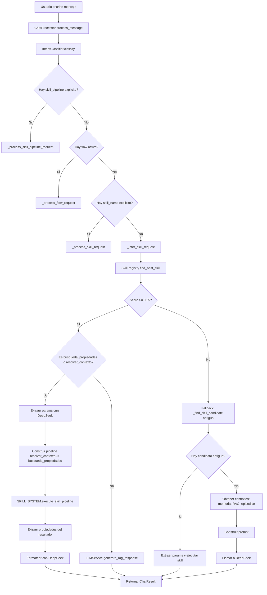

# Resumen Técnico del Sistema de Inteligencia — Propifai

> Documento generado para análisis por IA externa. Contiene la arquitectura completa del sistema de skills, orquestador, RAG y pipeline de chat.

---

## 1. ARQUITECTURA GENERAL

```
Usuario → ChatWeb → ChatProcessor → [SkillRegistry | RAG | DeepSeek] → Respuesta
```

### Flujo de procesamiento de mensaje [`ChatProcessor.process_message()`](webapp/intelligence/services/chat_processor.py:111)

1. **Guardar mensaje del usuario** en la conversación
2. **Clasificar intención** via `IntentClassifier.classify()`
3. **Si hay pipeline explícito** (`ctx.skill_pipeline`) → `_process_skill_pipeline_request()`
4. **Si hay flujo de conversación activo** → `_process_flow_request()`
5. **Si hay skill explícita** (`ctx.skill_name`) → `_process_skill_request()`
6. **Inferir skill automáticamente** via `_infer_skill_request()`:
   - Primero intenta con `SkillRegistry.find_best_skill()` (nuevo sistema)
   - Si no encuentra match, cae al sistema antiguo `_find_skill_candidate()`
   - Si tampoco hay match, retorna `None` → continúa con RAG puro
7. **Obtener contextos**: memoria, RAG, episódico
8. **Construir prompt** con todo el contexto
9. **Llamar a DeepSeek** para generar respuesta
10. **Guardar respuesta**, episodio y extraer hechos

---

## 2. SISTEMA DE SKILLS

### 2.1 SkillRegistry [`SkillRegistry`](webapp/intelligence/skills/registry.py:41)

**Propósito:** Registro central de skills. Singleton que mantiene el catálogo.

**Método de selección** [`find_best_skill()`](webapp/intelligence/skills/registry.py:114):
- Extrae tokens del mensaje del usuario (palabras >= 3 caracteres)
- Detecta si la consulta es sobre propiedades usando `_KEYWORDS_PROPIEDADES` (lista de ~40 palabras clave)
- Si es consulta de propiedades:
  - Score base 0.3 para skills de categoría `busqueda`
  - + proporción de tokens coincidentes entre mensaje y descripción de la skill (máx 0.5)
  - + 0.2 si el nombre de la skill aparece en el mensaje
- Si NO es consulta de propiedades:
  - Score = proporción de tokens coincidentes
  - + 0.2 por nombre en mensaje
  - + 0.1 por categoría en mensaje
- **Umbral mínimo:** 0.25 (constante `MIN_CONFIDENCE_THRESHOLD`)
- Si ninguna skill supera el umbral, retorna `None`

**Skills registradas:**
| Skill | Categoría | Descripción |
|---|---|---|
| `busqueda_propiedades` | busqueda | Búsqueda semántica y SQL de propiedades |
| `resolver_contexto` | custom | Resuelve contexto conversacional |
| `acm_analisis` | reporte | Análisis Comparativo de Mercado |
| `reporte_precios_zona` | reporte | Reporte de precios por zona |
| `matching_oferta_demanda` | crm | Matching oferta-demanda |
| `busqueda_exacta` | busqueda | Búsqueda exacta por filtros |
| `clasificar_intencion_whatsapp` | crm | Clasificación de intenciones WhatsApp |
| `suma`, `resta`, etc. | ejemplos | Skills matemáticas de ejemplo |

### 2.2 SkillOrchestrator [`SkillOrchestrator`](webapp/intelligence/skills/orchestrator.py:63)

**Propósito:** Coordina la ejecución de skills con validación, cache, métricas y persistencia.

**Métodos principales:**

#### `execute_skill()` (línea 80)
1. Crea registro `SkillExecution` en BD (con `user`, `conversation`, `parameters`, `status`)
2. Valida existencia de la skill en el registry
3. Verifica permisos del usuario
4. Genera cache key y verifica cache
5. Ejecuta `skill.execute(parameters, context)`
6. Cachea resultado si fue exitoso
7. Registra métricas
8. Persiste resultado en `SkillExecution`

#### `execute_skill_pipeline()` (línea 275)
- Acepta lista de `SkillPipelineStep` (name, parameters, inject_previous_result, result_key)
- Modos: `sequential` (default) o `parallel`
- `stop_on_error`: si es `True`, detiene el pipeline al primer error

#### Pipeline secuencial [`_execute_skill_pipeline_sequential()`](webapp/intelligence/skills/orchestrator.py:323)
```python
pipeline_data: Dict[str, Any] = {}
for step in steps:
    if step.inject_previous_result and previous_result is not None:
        step_parameters['previous_result'] = previous_result.data
    result = self.execute_skill(step.name, step_parameters, context)
    if result.success:
        key = step.result_key or step.name
        pipeline_data[key] = result.data  # ← SOLO result.data, NO el SkillResult completo
        previous_result = result
    else:
        if stop_on_error: return error
```

**⚠️ INCONSISTENCIA CRÍTICA:** En la línea 354, `pipeline_data[key] = result.data` almacena **solo el `.data`** del `SkillResult`, no el objeto completo. Para `busqueda_propiedades`, `result.data` es una **lista** de dicts (cada uno con `field_values`). Pero el código en `chat_processor.py:1255` originalmente asumía que era un `dict`. Esto se corrigió en Fix 6 para manejar ambos formatos.

### 2.3 ExecutionContext [`ExecutionContext`](webapp/intelligence/skills/orchestrator.py:20)

```python
@dataclass
class ExecutionContext:
    user_id: Optional[str] = None
    session_id: Optional[str] = None
    conversation_id: Optional[str] = None  # ← AÑADIDO en Fix 4
    permissions: List[str] = field(default_factory=list)
    environment: str = "production"
    timeout: int = 30
    metadata: Dict[str, Any] = field(default_factory=dict)
```

### 2.4 SkillPipelineResult [`SkillPipelineResult`](webapp/intelligence/skills/orchestrator.py:53)

```python
@dataclass
class SkillPipelineResult:
    success: bool
    steps: List[Dict[str, Any]] = field(default_factory=list)
    data: Dict[str, Any] = field(default_factory=dict)
    error_message: Optional[str] = None
    metadata: Dict[str, Any] = field(default_factory=dict)
```

---

## 3. PIPELINE `resolver_contexto → busqueda_propiedades`

### 3.1 Activación

En [`_infer_skill_request()`](webapp/intelligence/services/chat_processor.py:774):
```python
if best_skill.name in ('busqueda_propiedades', 'resolver_contexto'):
    # Extraer parámetros con DeepSeek usando el schema de busqueda_propiedades
    params = LLMService.extract_skill_params(ctx.message, schema_params)
    ctx.skill_name = 'busqueda_propiedades'
    ctx.skill_params = params or {}
    return cls._process_skill_request(ctx, trace_id)
```

### 3.2 Construcción del pipeline

En [`_process_skill_request()`](webapp/intelligence/services/chat_processor.py:1209):
```python
if ctx.skill_name == 'busqueda_propiedades':
    contexto_activo = cls._get_contexto_activo(ctx.conversation)
    historial = cls._get_historial_mensajes(ctx.conversation)
    
    pipeline_steps = [
        SkillPipelineStep(
            name='resolver_contexto',
            parameters={
                'mensaje_actual': ctx.message,
                'contexto_activo': contexto_activo,
                'historial_mensajes': historial,
            },
            inject_previous_result=False,
            result_key='contexto_resuelto',
        ),
        SkillPipelineStep(
            name='busqueda_propiedades',
            parameters=ctx.skill_params or {},
            inject_previous_result=True,  # ← Inyecta resultado de resolver_contexto
            result_key='resultado_busqueda',
        ),
    ]
    
    pipeline_result = SKILL_SYSTEM.execute_skill_pipeline(
        pipeline_steps, execution_context,
        mode='sequential', stop_on_error=True,
    )
```

### 3.3 Skill `resolver_contexto`

**Propósito:** Hereda parámetros de búsqueda del turno anterior (distrito, tipo_propiedad, etc.)

**Flujo:**
1. Recibe `mensaje_actual`, `contexto_activo` (del turno anterior), `historial_mensajes`
2. Si hay `contexto_activo` con valores, los retorna como `params_resueltos`
3. Si no hay contexto, retorna `{}` vacío
4. El resultado se inyecta como `previous_result` en `busqueda_propiedades`

### 3.4 Skill `busqueda_propiedades`

**Propósito:** Busca propiedades usando RAG semántico + filtros SQL.

**Modos de operación** [`_determinar_modo()`](webapp/intelligence/skills/propiedades/skill.py:285):
- `solo_sql`: Solo filtros SQL (cuando hay distrito/tipo específicos)
- `solo_semantico`: Solo búsqueda semántica (cuando hay query semántica)
- `hibrido`: Ambos (cuando hay ambos tipos de parámetros)
- `sin_parametros`: Sin criterios (retorna error)

**Parámetros que acepta** (via `parameters_schema`):
- `distrito` / `district`: Nombre del distrito
- `tipo_propiedad` / `property_type`: Tipo de propiedad
- `precio_min` / `precio_max`: Rango de precio
- `operacion`: Tipo de operación (venta/alquiler)
- `habitaciones`: Número de habitaciones
- `area_min` / `area_max`: Rango de área
- `semantic_query`: Consulta en lenguaje natural para búsqueda semántica

**Ejecución** [`execute()`](webapp/intelligence/skills/propiedades/skill.py:159):
1. Determina modo según parámetros
2. Si `inject_previous_result=True`, extrae `params_resueltos` del `previous_result`
3. Filtra por SQL si hay filtros estructurados
4. Hace reranking semántico si hay `semantic_query`
5. Retorna lista de resultados con `field_values`

**Resultado:** `SkillResult.ok(data=resultados)` donde `resultados` es una **lista** de dicts:
```python
resultados = [
    {
        'document_id': str(doc.id),
        'collection_name': doc.collection.name,
        'source_id': doc.source_id,
        'similarity': score,
        'field_values': {
            'title': '...',
            'district_name': '...',
            'price': '...',
            'property_type_id': '...',
            'built_area': '...',
            'bedrooms': '...',
            'description': '...',
            'operation_type': '...',
            'address': '...',
            # ... más campos
        },
        'created_at': '...',
    }
]
```

### 3.5 Post-procesamiento de respuesta

En [`_process_skill_request()`](webapp/intelligence/services/chat_processor.py:1252):

1. Extrae `resultado_busqueda_raw` de `pipeline_result.data.get('resultado_busqueda', [])`
2. **⚠️ INCONSISTENCIA CORREGIDA:** Originalmente asumía `dict`, pero es `list`. Ahora maneja ambos:
   - Si es `list`: itera directamente
   - Si es `dict`: extrae `data` y `message`
3. Para cada item, extrae `field_values` y construye texto legible
4. Envía a DeepSeek con prompt para generar respuesta natural
5. Si DeepSeek falla, usa mensaje de la skill como fallback

---

## 4. SISTEMA DE CONTEXTO

### 4.1 Contexto Activo [`_get_contexto_activo()`](webapp/intelligence/services/chat_processor.py:1089)

- Lee `conversation.metadata['contexto_activo_busqueda']`
- **Fix 4:** Hace `refresh_from_db()` antes de leer para evitar datos stale
- También busca en `SkillExecution` previas si no hay metadata

### 4.2 Guardado de Contexto [`_guardar_contexto_activo()`](webapp/intelligence/services/chat_processor.py:1168)

- Guarda en `conversation.metadata['contexto_activo_busqueda']`
- Prioridad: `params_resueltos` del resolver_contexto > `skill_params` originales

### 4.3 SkillExecution (Modelo BD)

- `skill_name`: Nombre de la skill
- `user`: FK a User
- `conversation`: FK a Conversation (añadido en Fix 4)
- `parameters`: JSONField con parámetros
- `result`: JSONField con resultado
- `status`: pending/success/error
- `latency_ms`: Tiempo de ejecución
- `cached`: Si vino de cache

---

## 5. SISTEMA RAG

### 5.1 Colecciones

- `propiedades_propify`: 85 vectores, dimensión 1024 (FAISS index)
- Modelo de embeddings: `intfloat/multilingual-e5-large`

### 5.2 Búsqueda

- `RAGService.search()`: Búsqueda semántica + reranking
- `RAGService.search_by_sql()`: Filtros SQL directos
- Modo híbrido: combina ambos

---

## 6. FLUJO COMPLETO PARA "que propiedades me puede mostrar en las que pueda construir un colegio"

Basado en logs reales:

```
1. IntentClassifier.classify() → intención: busqueda_propiedades (confianza: 0.35)
2. SkillRegistry.find_best_skill() → busqueda_propiedades (score: 0.36, umbral: 0.25)
3. LLMService.extract_skill_params() → {'tipo_propiedad': 'Terreno', 'semantic_query': 'construir un colegio'}
4. _process_skill_request() → construye pipeline:
   - resolver_contexto (contexto vacío, primer turno)
   - busqueda_propiedades (modo: hibrido)
5. busqueda_propiedades.execute() con params:
   - tipo_propiedad: Terreno
   - semantic_query: 'construir un colegio'
   - previous_result: {} (contexto vacío)
6. Skill ejecutada con éxito → resultados []
7. DeepSeek recibe prompt sin propiedades → responde "no se encontraron"
```

**⚠️ PROBLEMA IDENTIFICADO:** La búsqueda RAG no encuentra documentos que coincidan con "Terreno" + "construir un colegio". Esto puede deberse a:
- No hay terrenos en la colección RAG
- Los terrenos existentes no tienen descripciones que mencionen "colegio" o "educación"
- El embedding semántico no captura la relación "terreno → construir colegio"

---

## 7. INCONSISTENCIAS IDENTIFICADAS

### 7.1 CRÍTICAS

| # | Inconsistencia | Archivo | Línea |
|---|---|---|---|
| 1 | `pipeline_data[key] = result.data` almacena lista, pero código aguas abajo asumía dict | `orchestrator.py` | 354 |
| 2 | `SkillRegistry.find_best_skill()` usa matching de tokens, no semántica real. "construir un colegio" no tiene tokens en `_KEYWORDS_PROPIEDADES` | `registry.py` | 25-38 |
| 3 | Dos sistemas de skills coexisten (nuevo SkillRegistry + antiguo `_find_skill_candidate`) sin coordinación clara | `chat_processor.py` | 748-867 |
| 4 | `resolver_contexto` retorna `{}` vacío en primer turno, pero `busqueda_propiedades` igual se ejecuta con `sin_parametros` | `chat_processor.py` | 1209-1237 |

### 7.2 MEDIAS

| # | Inconsistencia | Archivo | Línea |
|---|---|---|---|
| 5 | `extract_skill_params()` de DeepSeek puede fallar con typos o consultas ambiguas sin fallback claro | `llm.py` | ~359 |
| 6 | El contexto activo se guarda en `conversation.metadata` pero también en `SkillExecution.parameters` — dos fuentes de verdad | `chat_processor.py` | 1089-1179 |
| 7 | `_get_contexto_activo()` busca en `SkillExecution` con `latest('created_at')` que puede no ser el más relevante | `chat_processor.py` | 1104-1132 |
| 8 | No hay logging de qué documentos específicos retornó la búsqueda RAG (solo "éxito" o "error") | `skill.py` | 159-281 |
| 9 | El prompt de formateo para DeepSeek (Fix 6) no incluye los IDs de documento ni enlaces para ver detalles | `chat_processor.py` | 1380-1394 |

### 7.3 DE ARQUITECTURA

| # | Inconsistencia | Descripción |
|---|---|---|
| 10 | **Doble ruta de ejecución:** `_infer_skill_request()` puede ejecutar skills via `_process_skill_request()` (pipeline) o via `LLMService.generate_rag_response()` (RAG directo) — dos caminos diferentes para el mismo propósito |
| 11 | **SkillExecution sin conversación:** Si `context.conversation_id` no está seteado, `SkillExecution` se crea sin FK a conversación, perdiendo trazabilidad |
| 12 | **Cache sin invalidación por contexto:** El cache key no incluye `conversation_id`, por lo que dos usuarios diferentes con mismos parámetros reciben el mismo resultado cacheado |
| 13 | **Sin rate limiting por skill:** No hay control de cuántas veces un usuario puede ejecutar una skill costosa (como búsqueda semántica) |

---

## 8. DIAGRAMA DE FLUJO



---

## 9. HISTORIAL DE FIXES APLICADOS

| Fix | Problema | Solución | Archivo |
|---|---|---|---|
| 1 | HTTP 500 con typos | Validar `extract_skill_params()` vacío | `chat_processor.py:772` |
| 2 | JSON crudo en respuesta | Pasar resultados por DeepSeek para formateo natural | `chat_processor.py:1234` |
| 3 | Contexto perdido por `return None` | Siempre ejecutar pipeline aunque params esté vacío | `chat_processor.py:772` |
| 4a | `SkillExecution` sin conversación | Añadir `conversation_id` a `ExecutionContext` | `orchestrator.py:23` |
| 4b | Metadata stale en memoria | `refresh_from_db()` antes de leer metadata | `chat_processor.py:1091` |
| 5 | SkillRegistry elige `resolver_contexto` en vez de `busqueda_propiedades` | Redirigir ambas al pipeline | `chat_processor.py:774` |
| 6 | DeepSeek ignora resultados | Extraer `field_values` como texto legible en prompt | `chat_processor.py:1252-1415` |
| 6b | `resultado_busqueda` es lista, no dict | Manejar ambos formatos (list y dict) | `chat_processor.py:1270-1280` |

---

## 10. RECOMENDACIONES PARA OTRO MODELO DE IA

Al analizar este sistema, enfocarse en:

1. **¿Por qué el SkillRegistry no detecta "construir un colegio" como búsqueda de propiedades?** — Las palabras "construir" y "colegio" no están en `_KEYWORDS_PROPIEDADES`.

2. **¿El pipeline secuencial es la mejor arquitectura?** — `resolver_contexto` siempre se ejecuta primero, incluso cuando no hay contexto previo, añadiendo latencia innecesaria.

3. **¿La doble ruta de ejecución de skills (nuevo registry vs antiguo) causa comportamientos impredecibles?** — Dependiendo de qué sistema detecte la skill primero, el flujo puede ser diferente.

4. **¿El umbral de 0.25 es demasiado bajo?** — Con ese umbral, cualquier coincidencia mínima dispara el pipeline de skills, incluso cuando el RAG puro sería más apropiado.

5. **¿La falta de datos en la colección RAG es el problema real?** — El sistema funciona correctamente, pero no hay datos de terrenos aptos para colegio en la base vectorial.
