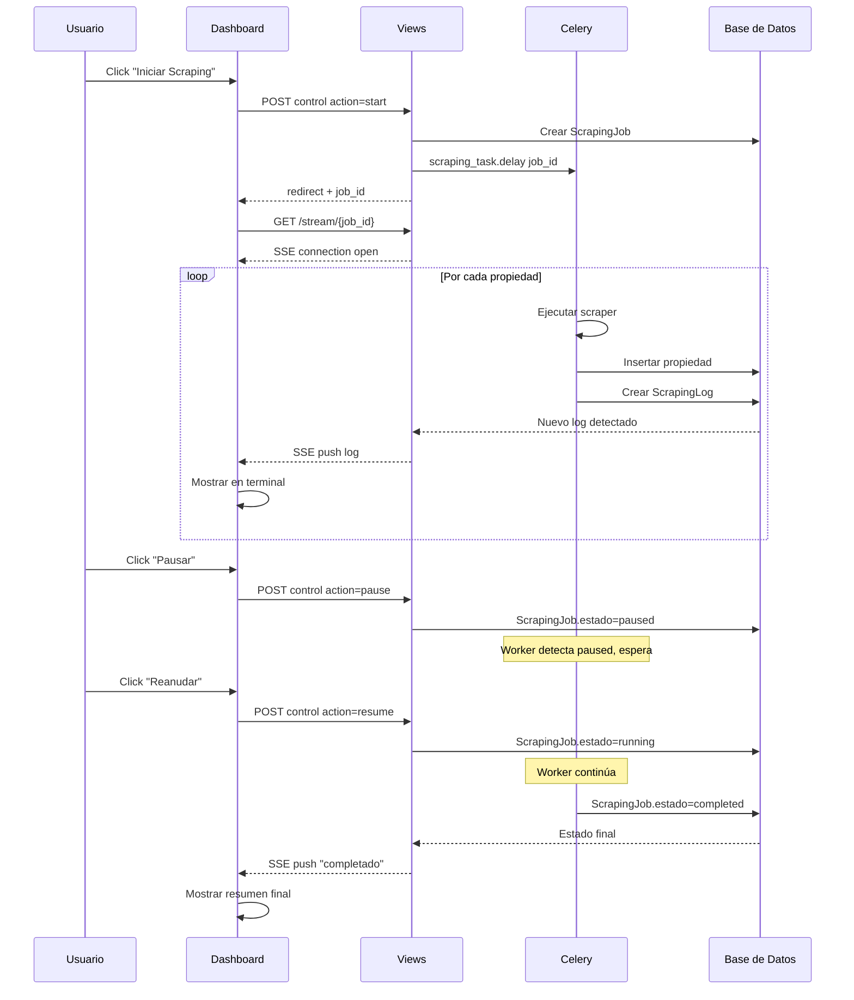

# Plan: Dashboard de Scraping con Terminal en Tiempo Real

## 1. Resumen

Crear un dashboard web para gestionar, monitorear y controlar la ejecución de los scrapers de portales inmobiliarios (Remax, Adondevivir, Properati, Urbania) con:

- **Terminal en vivo** que muestra registro por registro cómo se suben las propiedades
- **Controles** para Iniciar, Pausar, Reanudar y Detener
- **Tabla de propiedades** scrapeadas con filtros
- **Estadísticas** por portal

---

## 2. Arquitectura

```
Cliente (Browser)                Servidor Django                 Celery Worker
┌─────────────────┐             ┌──────────────────────┐       ┌──────────────┐
│ Dashboard HTML   │──HTTP GET──▶│ Views:               │       │              │
│ + Terminal Live  │             │ - dashboard          │       │ ScrapingTask │
│ + SSE Listener   │◀──SSE───────│ - sse_stream         │──ask──▶ (ejecuta     │
│ + Tabla          │             │ - control (start/    │       │  scraper)    │
│ + Controles      │             │   pause/resume/stop) │       │              │
└─────────────────┘             │ - status             │       └──────────────┘
                                └──────────────────────┘
                                        │
                                        ▼
                                ┌──────────────────────┐
                                │ Modelos:              │
                                │ - ScrapingJob (estado)│
                                │ - PropiedadesCompeten│
                                │ - ScrapingLog (logs)  │
                                └──────────────────────┘
```

## 3. Modelos de Datos

### `ScrapingJob` — Estado del trabajo de scraping

Se agrega en [`ingestas/models.py`](webapp/ingestas/models.py):

| Campo | Tipo | Descripción |
|---|---|---|
| `id` | AutoField | PK |
| `estado` | CharField | `idle`, `running`, `paused`, `completed`, `error` |
| `portal_actual` | CharField(50) | Portal que se está scrapeando ahora |
| `progreso` | IntegerField | % de progreso (0-100) |
| `total_propiedades` | IntegerField | Total de propiedades encontradas |
| `procesadas` | IntegerField | Propiedades procesadas |
| `nuevas` | IntegerField | Propiedades nuevas insertadas |
| `actualizadas` | IntegerField | Propiedades actualizadas |
| `errores` | IntegerField | Propiedades con error |
| `iniciado_en` | DateTimeField | Cuándo inició |
| `completado_en` | DateTimeField | Cuándo terminó |
| `parametros` | JSONField | Parámetros de ejecución |

### `ScrapingLog` — Logs en tiempo real

| Campo | Tipo | Descripción |
|---|---|---|
| `id` | AutoField | PK |
| `job` | ForeignKey(ScrapingJob) | Job al que pertenece |
| `nivel` | CharField | `info`, `success`, `warning`, `error`, `debug` |
| `mensaje` | TextField | Mensaje del log |
| `portal` | CharField(50) | Portal relacionado (opcional) |
| `propiedad_id` | CharField(100) | ID de propiedad (opcional) |
| `timestamp` | DateTimeField | Cuándo ocurrió |

---

## 4. Flujo de Ejecución

### 4.1 Iniciar scraping

```
Usuario click "Iniciar Scraping"
  → POST /ingestas/scraping/control/ {action: "start", portales: [...]}
  → View crea ScrapingJob (estado="running")
  → View lanza Celery task (scraping_task.delay(job_id))
  → View redirige a dashboard
  → Dashboard abre SSE /ingestas/scraping/stream/{job_id}/
  → SSE empuja logs en tiempo real
```

### 4.2 Durante la ejecución

```
Celery task:
  for each portal:
    job.estado = "running", job.portal_actual = portal
    scraping_result = scraper_skill.execute()
    
    for each property:
      # Guardar en DB
      guardar_propiedades([prop], portal)
      
      # Crear log individual
      ScrapingLog.create(
        job=job,
        nivel="success" if ok else "error",
        mensaje=f"[{portal}] Propiedad {id}: {titulo}",
        portal=portal,
        propiedad_id=prop['id_origen']
      )
      
      # Actualizar contadores
      job.procesadas += 1
      job.save()
    
    # Siguiente portal...
  
  job.estado = "completed"
  job.save()
```

### 4.3 Pausar/Reanudar/Detener

```
POST /ingestas/scraping/control/ {action: "pause"}
  → job.estado = "paused"
  → Celery task detecta el cambio y espera

POST /ingestas/scraping/control/ {action: "resume"}
  → job.estado = "running"
  → Celery task continúa

POST /ingestas/scraping/control/ {action: "stop"}
  → job.estado = "stopped"
  → Celery task termina
```

---

## 5. URLs

Se agregan a [`ingestas/urls.py`](webapp/ingestas/urls.py):

| URL | View | Método | Descripción |
|---|---|---|---|
| `scraping/dashboard/` | `ScrapingDashboardView` | GET | Dashboard principal |
| `scraping/control/` | `ScrapingControlView` | POST | Start/Pause/Resume/Stop |
| `scraping/stream/{job_id}/` | `ScrapingStreamView` | GET | SSE endpoint |
| `scraping/status/{job_id}/` | `ScrapingStatusView` | GET | JSON estado actual |
| `scraping/propiedades/` | `ScrapingPropiedadesView` | GET | Tabla JSON filtrable |
| `scraping/historial/` | `ScrapingHistorialView` | GET | Historial de jobs |

---

## 6. Vistas (Backend)

### `ScrapingDashboardView` (TemplateView)
- Renderiza el template del dashboard
- Pasa contexto: jobs recientes, estadísticas por portal

### `ScrapingControlView` (View)
- Recibe `action` y `portales` (array opcional)
- `start`: Crea job, lanza Celery task
- `pause`: Cambia estado a paused
- `resume`: Cambia estado a running
- `stop`: Cambia estado a stopped
- Retorna JSON `{success: true, job_id: N}`

### `ScrapingStreamView` (View)
- Endpoint SSE (Server-Sent Events)
- Escucha nuevos ScrapingLog del job
- Los empuja al cliente como `data: {json}\n\n`
- Mantiene conexión abierta

### `ScrapingStatusView` (View)
- Retorna JSON con estado actual del job
- El frontend lo consulta periódicamente

### `ScrapingPropiedadesView` (ListView)
- Retorna HTML de tabla filtrable
- Filtros: fuente, distrito, tipo_inmueble, fecha

---

## 7. Template: Dashboard

### Estructura del template

```
┌─────────────────────────────────────────────────────────┐
│  HEADER: "Scraping de Portales"                         │
├──────────────────────────┬──────────────────────────────┤
│  PANEL DE CONTROL        │  ESTADÍSTICAS RÁPIDAS        │
│  ┌────────────────────┐  │  ┌──────────┐ ┌──────────┐   │
│  │ [▶ Iniciar]        │  │  │ Remax    │ │Adondevivir│  │
│  │ [⏸ Pausar]         │  │  │ 45 props │ │ 60 props  │  │
│  │ [▶ Reanudar]       │  │  └──────────┘ └──────────┘   │
│  │ [⏹ Detener]        │  │  ┌──────────┐ ┌──────────┐   │
│  │ Portales: [☑ Remax] │  │  │Properati │ │ Urbania  │   │
│  │          [☑ Adonde..]│  │  │ 30 props │ │ 50 props  │   │
│  │          [☑ Proper..]│  │  └──────────┘ └──────────┘   │
│  │          [☑ Urbania] │  └──────────────────────────────┘
│  └────────────────────┘                                    │
├──────────────────────────────────────────────────────────┤
│  TERMINAL EN VIVO                                         │
│  ┌──────────────────────────────────────────────────────┐│
│  │ [15:30:01] [INFO] Scraper Remax iniciado...          ││
│  │ [15:30:02] [OK]   Propiedad #123 - Casa en Cayma    ││
│  │ [15:30:02] [OK]   Propiedad #124 - Depto Yanahuara  ││
│  │ [15:30:03] [WARN] Propiedad #125 sin coordenadas    ││
│  │ [15:30:03] [OK]   Propiedad #126 - Terreno Sachaca  ││
│  │ [15:30:04] [ERROR] Propiedad #127 - error conexión  ││
│  │ ... auto-scroll hacia abajo                          ││
│  └──────────────────────────────────────────────────────┘│
├──────────────────────────────────────────────────────────┤
│  TABLA: PROPIEDADES SCRAPEADAS                           │
│  ┌─────┬────────┬──────────┬────────┬────────┬────────┐ │
│  │ #   │ Portal │ Tipo     │ Precio │ Distrito│Fecha   │ │
│  ├─────┼────────┼──────────┼────────┼────────┼────────┤ │
│  │ 123 │ remax  │ Casa     │$120,000│ Cayma  │2026-07 │ │
│  │ 124 │adonde..│Depto     │$80,000 │Yanahua │2026-07 │ │
│  │ ... │ ...    │ ...      │ ...    │ ...    │ ...    │ │
│  └─────┴────────┴──────────┴────────┴────────┴────────┘ │
│  [Primera] [<] [1] [2] [3] [>] [Última]                 │
└──────────────────────────────────────────────────────────┘
```

### Comportamiento del terminal
- **Auto-scroll**: Las nuevas líneas aparecen abajo y el scroll baja automáticamente
- **Colores por nivel**: `INFO`=gris, `OK`=verde, `WARN`=amarillo, `ERROR`=rojo
- **Timestamps**: cada línea muestra hora:minuto:segundo
- **Sin recargar**: usa SSE para recibir logs en vivo
- **Persistencia**: los logs se guardan en DB, al recargar la página se ve el historial

---

## 8. Sidebar — Nuevo menú "Scraping"

Se agrega en [`templates/base.html`](webapp/templates/base.html:1089) como un submenú:

```html
<li class="has-submenu active">
    <a href="#">
        <i class="bi bi-robot"></i>
        <span>Scraping</span>
        <i class="bi bi-chevron-down ms-auto"></i>
    </a>
    <ul class="submenu">
        <li>
            <a href="/ingestas/scraping/dashboard/"
               class="active">
                <i class="bi bi-speedometer2"></i>
                <span>Dashboard</span>
            </a>
        </li>
        <li>
            <a href="/ingestas/scraping/historial/"
               class="active">
                <i class="bi bi-clock-history"></i>
                <span>Historial</span>
            </a>
        </li>
    </ul>
</li>
```

---

## 9. Celery Task

### `scraping_task(job_id)`

```python
@shared_task(bind=True)
def scraping_task(self, job_id):
    """
    Tarea Celery que ejecuta los scrapers en secuencia.
    Lee el estado del job para pausar/reanudar/detener.
    """
    from ingestas.models import ScrapingJob, ScrapingLog
    
    job = ScrapingJob.objects.get(id=job_id)
    portales = job.parametros.get('portales', ORDEN_DEFECTO)
    
    for portal in portales:
        # Verificar si debemos detener/pausar
        job.refresh_from_db()
        if job.estado == 'stopped':
            ScrapingLog.log(job, 'info', f'Scraping detenido en portal {portal}')
            return
        while job.estado == 'paused':
            time.sleep(1)
            job.refresh_from_db()
            if job.estado == 'stopped':
                return
        
        # Ejecutar scraper
        job.portal_actual = portal
        job.save()
        
        skill = _instanciar_skill(portal)
        ScrapingLog.log(job, 'info', f'Iniciando scraper {portal}')
        
        try:
            # Ejecutar con callback para logs individuales
            resultado = skill.execute({'max_paginas': 0})
            # ... procesar resultado
        except Exception as e:
            ScrapingLog.log(job, 'error', f'Error en {portal}: {e}')
    
    job.estado = 'completed'
    job.save()
```

---

## 10. Orden de Implementación

### Paso 1: Modelos `ScrapingJob` + `ScrapingLog`
- Agregar en [`ingestas/models.py`](webapp/ingestas/models.py)
- Migración

### Paso 2: Celery task `scraping_task`
- Agregar en [`colas/tasks.py`](webapp/colas/tasks.py)

### Paso 3: Vistas Django
- `ScrapingDashboardView`
- `ScrapingControlView`
- `ScrapingStreamView` (SSE)
- `ScrapingStatusView`
- `ScrapingPropiedadesView`
- Agregar URLs en [`ingestas/urls.py`](webapp/ingestas/urls.py)

### Paso 4: Template del Dashboard
- `templates/ingestas/scraping_dashboard.html`
- HTML+CSS+JS con terminal en vivo, controles, tabla

### Paso 5: Sidebar
- Agregar menú "Scraping" en [`templates/base.html`](webapp/templates/base.html)

---

## 11. Tecnología Tiempo Real

Para el terminal en vivo se usa **SSE (Server-Sent Events)**:

| Aspecto | Decisión | Por qué |
|---|---|---|
| Protocolo | SSE (no WebSocket) | Más simple, unidireccional servidor→cliente, no requiere librerías extra |
| Endpoint | `/ingestas/scraping/stream/{job_id}/` | Cada job tiene su propio stream |
| Frecuencia | Log por cada propiedad procesada | El usuario ve cada registro en vivo |
| Reconexión | SSE reconecta automáticamente | Si el frontend se cae, al recargar ve el historial |

### SSE Stream format:
```
data: {"timestamp": "15:30:01", "nivel": "info", "mensaje": "Scraper Remax iniciado", "portal": "remax", "progreso": 5}

data: {"timestamp": "15:30:02", "nivel": "success", "mensaje": "Propiedad #123 guardada", "portal": "remax", "progreso": 10}

data: {"timestamp": "15:30:03", "nivel": "error", "mensaje": "Error en propiedad #124", "portal": "remax", "progreso": 10}
```

---

## 12. Diagrama de Flujo


