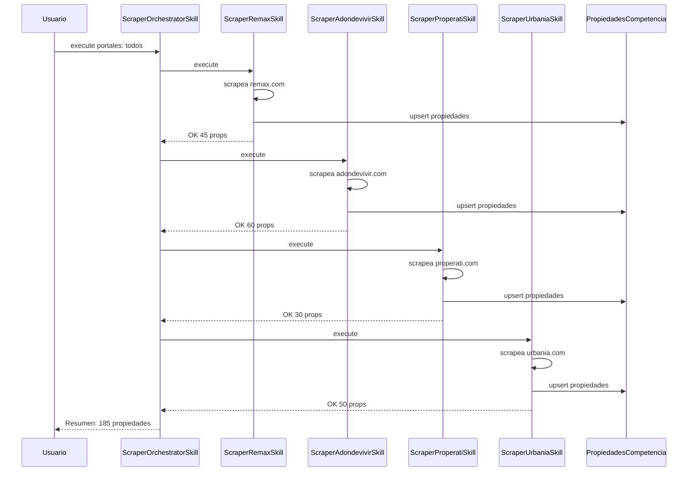

# Plan: Scraper Skills Independientes → Base de Datos `propiedades_competencia`

## 1. Visión General

Convertir los 4 scrapers actuales (`adondevivir`, `remax`, `properati`, `urbania`) de exportación a Excel a guardado en base de datos, manteniendo cada scraper como una **skill independiente** dentro del sistema de skills existente, y agregando una **skill orquestadora** que los ejecuta en secuencia.

---

## 2. Arquitectura (CORREGIDA)

```
webapp/
├── scrapi/                                    ← Scripts scraper originales (NO SE TOCAN)
│   ├── adondevivir_scraper.py
│   ├── remax_scraper.py
│   ├── properati_scraper.py
│   └── urbania_scraper.py
│
├── ingestas/                                  ← App existente (AQUÍ VA EL MODELO)
│   ├── models.py                              ← + PropiedadesCompetencia (nuevo modelo)
│   └── migrations/                            ← + migración nueva
│
└── intelligence/skills/                       ← Sistema de skills EXISTENTE (AQUÍ VAN LAS SKILLS)
    ├── __init__.py
    ├── base.py
    ├── registry.py
    ├── orchestrator.py
    ├── scrapi/                                ← NUEVO subdirectorio para scrapers
    │   ├── __init__.py
    │   ├── scraper_remax.py                   ← Skill: Remax → DB
    │   ├── scraper_adondevivir.py             ← Skill: Adondevivir → DB
    │   ├── scraper_properati.py               ← Skill: Properati → DB
    │   ├── scraper_urbania.py                 ← Skill: Urbania → DB
    │   ├── scraper_orchestrator.py            ← Skill: ejecuta las 4 en secuencia
    │   └── db_utils.py                        ← Función compartida guardar_propiedades()
    ├── propiedades/                           ← Skills existentes (NO TOCAR)
    ├── nuevas/                                ← Skills existentes (NO TOCAR)
    └── examples/                              ← Skills existentes (NO TOCAR)
```

### Principios clave

| Principio | Explicación |
|---|---|
| **Independencia total** | Cada scraper-skill es un módulo autocontenido en su propio archivo. |
| **Usa el sistema de skills existente** | Heredan de `BaseSkill`, se auto-descubren vía `registry.discover_skills()`. Sin tocar el registry ni el orchestrator. |
| **Orquestador = otra skill** | `scraper_orchestrator.py` está al mismo nivel que las demás skills de scraper. |
| **Fácil agregar nuevos portales** | Solo crear `scraper_{portal}.py` con la misma interfaz. |
| **Modelo en app existente** | `PropiedadesCompetencia` va en `ingestas/models.py`, que ya maneja datos de propiedades externas. |

---

## 3. Modelo de Datos: `PropiedadesCompetencia`

Se agrega como nuevo modelo en [`ingestas/models.py`](webapp/ingestas/models.py). La tabla se llama `propiedades_competencia` y vive en la base de datos `default` (Azure SQL).

### Mapeo de campos (estándar unificado)

| Campo DB | Tipo | Origen en scrapers | Descripción |
|---|---|---|---|
| `id` | AutoField | — | PK |
| `fuente` | CharField(50) | `adondevivir`, `remax`, `properati`, `urbania` | Portal de origen |
| `id_origen` | CharField(100) | `id_origen` | ID único en el portal |
| `fecha_extraccion` | DateTimeField | `fecha_extraccion` | Cuándo se scrapeó |
| `titulo` | CharField(255) | `titulo` | Título descriptivo |
| `tipo_inmueble` | CharField(50) | `tipo_inmueble` | Casa, Departamento, Terreno, etc. |
| `tipo_operacion` | CharField(20) | `tipo_operacion` | Venta, Alquiler |
| `precio_soles` | DecimalField(15,2) | `precio_soles` | Precio en soles |
| `precio_usd` | DecimalField(15,2) | `precio_usd` | Precio en dólares |
| `area_m2` | DecimalField(10,2) | `area_m2` | Área total en m² |
| `dormitorios` | IntegerField(null=True) | `dormitorios` | N° habitaciones |
| `banos` | IntegerField(null=True) | `banos` | N° baños |
| `estacionamientos` | IntegerField(null=True) | `estacionamientos` | N° cocheras |
| `distrito` | CharField(100, null=True) | `distrito` | Distrito |
| `provincia` | CharField(100, null=True) | `provincia` | Provincia |
| `departamento` | CharField(100, null=True) | — | Departamento |
| `direccion_texto` | TextField(null=True) | `direccion_texto` | Dirección completa |
| `descripcion` | TextField(null=True) | `descripcion` | Descripción |
| `amenities` | TextField(null=True) | `amenities` | Servicios |
| `latitud` | DecimalField(10,7, null=True) | `latitud` | Coordenada latitud |
| `longitud` | DecimalField(10,7, null=True) | `longitud` | Coordenada longitud |
| `url` | URLField(500, null=True) | `url` | URL en el portal |
| `imagen_url` | URLField(500, null=True) | `imagen_url` | URL de imagen |
| `antiguedad_anios` | IntegerField(null=True) | `antiguedad_anios` | Antigüedad |
| `agencia_agente` | CharField(200, null=True) | `agencia_agente` | Agencia o agente |
| `datos_crudos` | JSONField(null=True) | — | RAW original del scraper |
| `creado_en` | DateTimeField(auto_now_add) | — | Fecha de creación |
| `actualizado_en` | DateTimeField(auto_now) | — | Última actualización |

✅ **Unique**: `Meta.unique_together = [['fuente', 'id_origen']]` — evita duplicados al re-scrapear.

---

## 4. Interfaz de cada Scraper Skill

Cada scraper-skill vive en [`intelligence/skills/scrapi/`](webapp/intelligence/skills/scrapi/) y sigue esta interfaz:

```python
from intelligence.skills.base import BaseSkill, SkillResult

class ScraperAdondevivirSkill(BaseSkill):
    name = "scraper_adondevivir"
    description = "Extrae propiedades de Adondevivir.com en Arequipa y las guarda en PropiedadesCompetencia"
    category = "custom"
    access_level = 1
    is_active = True
    
    parameters_schema = {
        'max_paginas': {
            'type': 'integer',
            'description': 'Máximo de páginas a scrapear. 0 = todas.',
            'required': False,
        },
    }

    def execute(self, params, context=None) -> SkillResult:
        """Ejecuta scraping y guarda en DB"""
        # 1. Importar lógica core desde scrapi/adondevivir_scraper.py
        # 2. Ejecutar scraping (asyncio.run())
        # 3. Estandarizar cada propiedad
        # 4. Llamar a db_utils.guardar_propiedades()
        # 5. Retornar SkillResult

    def validate_params(self, params) -> bool:
        return True
```

### Flujo interno de execute():

```
1. Importar funciones de extracción desde scrapi/{portal}_scraper.py (reutilizar, no duplicar)
2. Ejecutar scraping
3. Para cada propiedad, llamar a estandarizar() existente
4. Llamar a db_utils.guardar_propiedades(props_estandarizadas, fuente="adondevivir")
5. Retornar SkillResult { "portal": "adondevivir", "total": 45, "nuevas": 40, "actualizadas": 5 }
```

---

## 5. Skill Orquestadora

Vive en [`intelligence/skills/scrapi/scraper_orchestrator.py`](webapp/intelligence/skills/scrapi/scraper_orchestrator.py):

```python
class ScraperOrchestratorSkill(BaseSkill):
    name = "scraper_orchestrator"
    description = "Ejecuta todos los scrapers de portales inmobiliarios en secuencia"
    category = "custom"
    access_level = 1
    is_active = True
    
    parameters_schema = {
        'portales': {
            'type': 'array',
            'description': 'Lista de portales a scrapear. Default: todos.',
            'required': False,
        },
        'max_paginas': {
            'type': 'integer',
            'description': 'Máximo de páginas por scraper.',
            'required': False,
        },
    }

    def execute(self, params, context=None) -> SkillResult:
        """Ejecuta scrapers en secuencia"""
        portales = params.get('portales', ['remax', 'adondevivir', 'properati', 'urbania'])
        resultados = []
        
        for portal in portales:
            skill = self._instanciar_skill(portal)
            resultado = skill.execute({"max_paginas": params.get("max_paginas", 0)})
            resultados.append(resultado)
            # Si falla, log error pero CONTINUAR con el siguiente
        
        return SkillResult.ok({
            "resultados": resultados,
            "resumen": f"{sum(...)} propiedades totales"
        })
```

---

## 6. Estrategia de Inserción en DB

### db_utils.py — Función compartida

```python
from ingestas.models import PropiedadesCompetencia

def guardar_propiedades(propiedades: list[dict], fuente: str) -> dict:
    """
    Upsert: inserta o actualiza por fuente+id_origen.
    Retorna { nuevas: N, actualizadas: M, total: len(propiedades) }
    """
    nuevas = 0
    actualizadas = 0
    
    for prop in propiedades:
        obj, created = PropiedadesCompetencia.objects.update_or_create(
            fuente=fuente,
            id_origen=prop['id_origen'],
            defaults=prop
        )
        if created:
            nuevas += 1
        else:
            actualizadas += 1
    
    return {"nuevas": nuevas, "actualizadas": actualizadas, "total": len(propiedades)}
```

---

## 7. Orden de Implementación

### Paso 1: Agregar modelo `PropiedadesCompetencia` en [`ingestas/models.py`](webapp/ingestas/models.py)
- Agregar la clase `PropiedadesCompetencia` con todos los campos mapeados
- Ejecutar `makemigrations ingestas` + `migrate`

### Paso 2: Crear [`intelligence/skills/scrapi/`](webapp/intelligence/skills/scrapi/) con su `__init__.py`

### Paso 3: Crear [`db_utils.py`](webapp/intelligence/skills/scrapi/db_utils.py)
- Función `guardar_propiedades()` con upsert

### Paso 4: Crear cada scraper-skill (4 archivos)
Cada uno importa funciones del scraper original en [`scrapi/`](webapp/scrapi/) y cambia `guardar_excel()` por `guardar_propiedades()`:

1. **`scraper_remax.py`** — Reutiliza `scrapi/remax_scraper.py`
2. **`scraper_adondevivir.py`** — Reutiliza `scrapi/adondevivir_scraper.py`
3. **`scraper_properati.py`** — Reutiliza `scrapi/properati_scraper.py`
4. **`scraper_urbania.py`** — Reutiliza `scrapi/urbania_scraper.py`

### Paso 5: Crear [`scraper_orchestrator.py`](webapp/intelligence/skills/scrapi/scraper_orchestrator.py)
- Orquestador que ejecuta las 4 skills en secuencia

### Paso 6: Probar
- Probar cada scraper individualmente
- Probar el orquestador

---

## 8. Beneficios de esta Arquitectura

| Aspecto | Beneficio |
|---|---|
| **Sin sistemas nuevos** | Skills dentro de `intelligence/skills/` existente. Modelo en `ingestas/` existente. |
| **Auto-descubrimiento** | `registry.discover_skills("intelligence.skills.scrapi")` las registra automáticamente. |
| **Independencia** | Cada scraper es un archivo. Nuevo portal = nuevo archivo. |
| **Resiliencia** | Si un scraper falla, el orquestador continúa con los demás. |
| **Sin duplicados** | Upsert por `fuente + id_origen`. |
| **Scrapers originales intactos** | Las skills importan y reutilizan, no duplican lógica. |

---

## 9. Flujo de Ejecución


