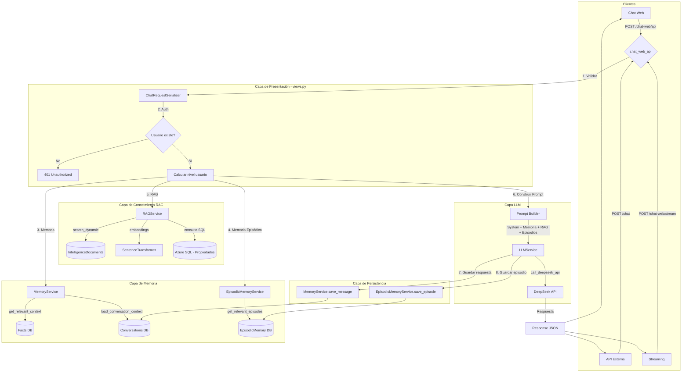
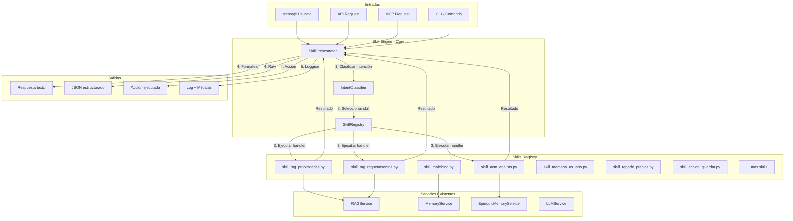
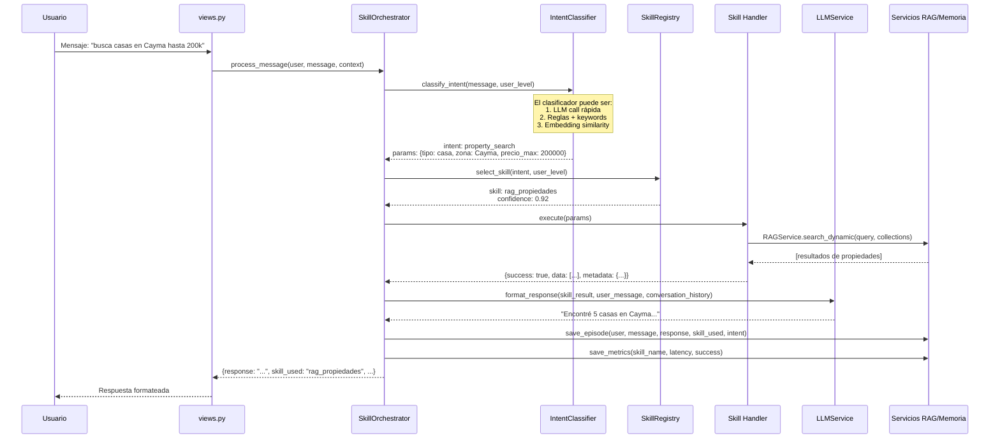
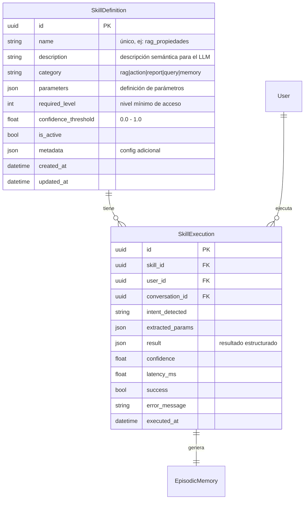
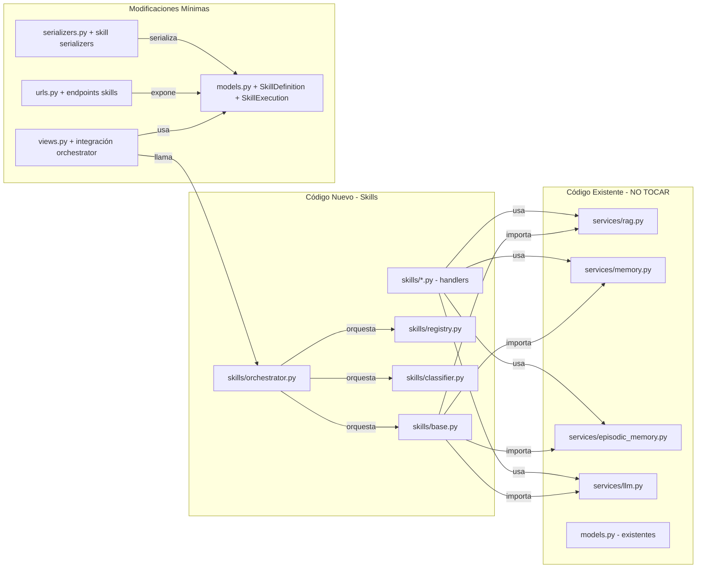
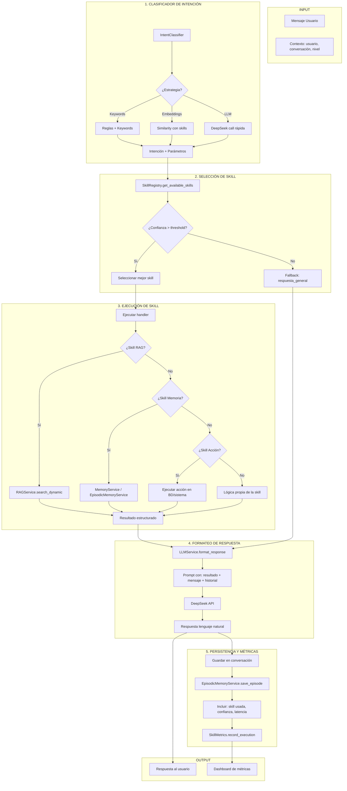

# Sistema de Skills para Propifai Intelligence

## Arquitectura Completa del Sistema

---

## 1. VISIÓN GENERAL DEL SISTEMA ACTUAL

### Diagrama de flujo del sistema intelligence existente



### Problemas del sistema actual

1. **Todo el flujo está en `views.py`** — 3590 líneas, lógica de negocio mezclada con HTTP
2. **El prompt del sistema está hardcodeado** — no hay separación entre "qué sabe el sistema" y "cómo responde"
3. **No hay clasificador de intención** — el LLM recibe todo el contexto siempre, sin filtrar
4. **No hay sistema de Skills** — cada nueva capacidad requiere modificar views.py, el prompt, y los servicios
5. **Acoplamiento total** — no se puede reutilizar la lógica en otros contextos (WhatsApp, API externa, MCP)

---

## 2. ARQUITECTURA PROPUESTA: SISTEMA DE SKILLS

### 2.1 Concepto

Una **Skill** es una capacidad autónoma que:
- Tiene un **nombre** y **descripción semántica** (para que el LLM entienda cuándo usarla)
- Pertenece a una **categoría** (RAG, acción, reporte, consulta)
- Define **parámetros de entrada** con tipos y descripciones
- Tiene un **handler Python** que ejecuta la lógica
- Devuelve un **resultado estructurado** (dict)
- Es **independiente** — no depende de views.py ni del chat
- Es **portable** — se puede usar desde chat web, API REST, MCP server, CLI

### 2.2 Arquitectura general del nuevo sistema



### 2.3 Flujo detallado de procesamiento de un mensaje



### 2.4 Estructura de una Skill

```python
# Cada skill es un archivo independiente en intelligence/skills/

class BaseSkill(ABC):
    """Clase base que toda skill debe implementar."""
    
    # Metadatos de la skill (usados por el clasificador)
    name: str                          # "rag_propiedades"
    description: str                   # "Busca propiedades en la base de datos usando RAG semántico"
    category: str                      # "rag" | "action" | "report" | "query" | "memory"
    parameters: List[ParameterDef]     # Parámetros que extrae del mensaje
    required_level: int                # Nivel mínimo de acceso
    confidence_threshold: float        # Confianza mínima para auto-ejecutar
    
    @abstractmethod
    def execute(self, params: dict, context: ExecutionContext) -> SkillResult:
        """Ejecuta la lógica de la skill."""
        pass
```

### 2.5 Modelo de datos



### 2.6 Catálogo inicial de Skills propuesto

| Skill | Categoría | Descripción | Handler |
|-------|-----------|-------------|---------|
| `rag_propiedades` | RAG | Buscar propiedades por texto semántico | `skills/rag_propiedades.py` |
| `rag_requerimientos` | RAG | Buscar requerimientos de clientes | `skills/rag_requerimientos.py` |
| `acm_analisis` | Reporte | Generar ACM de una propiedad | `skills/acm_analisis.py` |
| `matching_oferta_demanda` | Acción | Cruzar requerimientos con propiedades | `skills/matching.py` |
| `reporte_precios_zona` | Reporte | Precios promedio por zona/tipo | `skills/reporte_precios.py` |
| `consulta_memoria_usuario` | Memoria | Recordar información del usuario | `skills/memoria_usuario.py` |
| `guardar_preferencia` | Acción | Guardar preferencia del usuario | `skills/guardar_preferencia.py` |
| `busqueda_exacta` | Query | Búsqueda por filtros exactos (BD directa) | `skills/busqueda_exacta.py` |
| `respuesta_general` | Query | Responder sin ejecutar skills (chat general) | `skills/respuesta_general.py` |

---

## 3. ESTRUCTURA DE ARCHIVOS PROPUESTA

```
webapp/intelligence/
├── skills/                          # ← NUEVA: Sistema de Skills
│   ├── __init__.py
│   ├── base.py                      # BaseSkill, SkillResult, ParameterDef, ExecutionContext
│   ├── registry.py                  # SkillRegistry: descubre y registra skills
│   ├── orchestrator.py              # SkillOrchestrator: coordina el flujo completo
│   ├── classifier.py                # IntentClassifier: clasifica intención del mensaje
│   ├── metrics.py                   # SkillMetrics: registro de ejecuciones y métricas
│   │
│   ├── rag_propiedades.py           # Skill: búsqueda RAG de propiedades
│   ├── rag_requerimientos.py        # Skill: búsqueda RAG de requerimientos
│   ├── acm_analisis.py              # Skill: análisis comparativo de mercado
│   ├── matching.py                  # Skill: matching oferta-demanda
│   ├── reporte_precios.py           # Skill: reporte de precios por zona
│   ├── memoria_usuario.py           # Skill: consultar memoria del usuario
│   ├── guardar_preferencia.py       # Skill: guardar preferencia del usuario
│   ├── busqueda_exacta.py           # Skill: búsqueda por filtros en BD
│   └── respuesta_general.py         # Skill: respuesta general (fallback)
│
├── services/                        # EXISTENTE: se mantiene igual
│   ├── __init__.py
│   ├── rag.py
│   ├── memory.py
│   ├── episodic_memory.py
│   ├── llm.py
│   └── schema_discovery.py
│
├── models.py                        # MODIFICADO: agregar SkillDefinition, SkillExecution
├── serializers.py                   # MODIFICADO: agregar serializers de skills
├── views.py                         # MODIFICADO: integrar SkillOrchestrator
├── urls.py                          # MODIFICADO: agregar endpoints de skills
├── admin.py                         # MODIFICADO: registrar modelos en admin
└── tests/
    ├── test_skills/                 # Tests del sistema de skills
    │   ├── test_base.py
    │   ├── test_classifier.py
    │   ├── test_orchestrator.py
    │   └── test_skills.py
    └── ...
```

---

## 4. FLUJO DE INTEGRACIÓN CON EL SISTEMA EXISTENTE

### 4.1 Puntos de integración (sin romper nada existente)



### 4.2 Estrategia de implementación por fases

**Fase 1: Fundación (sin cambiar el flujo actual)**
1. Crear `skills/base.py` con clases base
2. Crear `skills/registry.py` con registro automático
3. Crear `skills/classifier.py` con clasificador básico (reglas + keywords)
4. Crear modelos `SkillDefinition` y `SkillExecution`
5. Migración de base de datos

**Fase 2: Skills core (paralelo al sistema actual)**
6. Implementar skills: `rag_propiedades`, `rag_requerimientos`, `respuesta_general`
7. Implementar `skills/orchestrator.py`
8. Tests unitarios de cada skill

**Fase 3: Integración en chat web**
9. Modificar `chat_web_api` y `chat_web_stream` para usar el orchestrator
10. Mantener el flujo antiguo como fallback
11. Agregar endpoint `/skills/execute/` para pruebas

**Fase 4: Skills avanzadas**
12. `acm_analisis`, `matching`, `reporte_precios`
13. `memoria_usuario`, `guardar_preferencia`
14. `busqueda_exacta` (SQL directo contra Azure SQL)

**Fase 5: Clasificador inteligente**
15. Mejorar `IntentClassifier` para usar embeddings + LLM
16. Sistema de feedback: el usuario puede corregir la skill seleccionada
17. Dashboard de métricas de skills

---

## 5. ESPECIFICACIÓN DETALLADA DE COMPONENTES

### 5.1 BaseSkill (`skills/base.py`)

```python
@dataclass
class ParameterDef:
    name: str
    type: str  # "string" | "number" | "boolean" | "list" | "dict"
    description: str
    required: bool = False
    default: Any = None

@dataclass
class SkillResult:
    success: bool
    data: Any = None
    error: str = None
    metadata: dict = None  # confidence, source, latency, etc.

@dataclass
class ExecutionContext:
    user: User
    conversation: Conversation
    user_level: int
    app_id: str
    message_history: list
    timestamp: datetime

class BaseSkill(ABC):
    name: str
    description: str
    category: str  # "rag" | "action" | "report" | "query" | "memory"
    parameters: List[ParameterDef]
    required_level: int = 1
    confidence_threshold: float = 0.7
    
    @abstractmethod
    def execute(self, params: dict, context: ExecutionContext) -> SkillResult:
        pass
    
    def validate_params(self, params: dict) -> tuple[bool, str]:
        """Valida que los parámetros requeridos estén presentes."""
        for p in self.parameters:
            if p.required and p.name not in params:
                return False, f"Parámetro requerido: {p.name}"
        return True, ""
```

### 5.2 IntentClassifier (`skills/classifier.py`)

```python
class IntentClassifier:
    """
    Clasifica la intención del mensaje del usuario.
    
    Estrategias (en orden de prioridad):
    1. Keywords + Reglas (rápido, sin LLM)
    2. Embedding similarity (compara con descripciones de skills)
    3. LLM call (preciso, más lento - opcional)
    """
    
    @classmethod
    def classify(cls, message: str, available_skills: List[BaseSkill], 
                 user_level: int = 1) -> IntentResult:
        """
        Retorna:
        - intent_name: str (nombre de la skill seleccionada)
        - confidence: float
        - extracted_params: dict
        - strategy_used: str ("rules" | "embedding" | "llm")
        """
        pass
```

### 5.3 SkillRegistry (`skills/registry.py`)

```python
class SkillRegistry:
    """
    Registro central de todas las skills disponibles.
    
    - Auto-descubre skills en el paquete skills/
    - Provee lista de skills para el clasificador
    - Filtra por nivel de acceso del usuario
    """
    
    _skills: Dict[str, BaseSkill] = {}
    
    @classmethod
    def discover_skills(cls):
        """Escanea skills/ y registra todas las subclases de BaseSkill."""
        pass
    
    @classmethod
    def get_skill(cls, name: str) -> Optional[BaseSkill]:
        pass
    
    @classmethod
    def get_available_skills(cls, user_level: int = 1) -> List[BaseSkill]:
        """Retorna skills que el usuario puede ejecutar."""
        pass
```

### 5.4 SkillOrchestrator (`skills/orchestrator.py`)

```python
class SkillOrchestrator:
    """
    Orquesta el flujo completo:
    1. Clasificar intención
    2. Seleccionar skill
    3. Ejecutar skill
    4. Formatear respuesta (con LLM)
    5. Guardar en memoria episódica
    6. Registrar métricas
    """
    
    @classmethod
    def process_message(cls, user: User, message: str, 
                        conversation: Conversation, 
                        user_level: int = 1) -> OrchestratorResult:
        pass
```

---

## 6. DIAGRAMA DE FLUJO COMPLETO: SISTEMA INTELIGENCE + SKILLS



---

## 7. EJEMPLO DE SKILL CONCRETA

### `skills/rag_propiedades.py`

```python
class RagPropiedadesSkill(BaseSkill):
    name = "rag_propiedades"
    description = "Busca propiedades inmobiliarias usando búsqueda semántica. Ideal para: 'busca casas en Cayma', 'departamentos en Yanahuara', 'terrenos baratos cerca a la UNSA'"
    category = "rag"
    required_level = 2
    confidence_threshold = 0.7
    
    parameters = [
        ParameterDef("query", "string", "Texto de búsqueda del usuario", required=True),
        ParameterDef("collection", "string", "Nombre de colección RAG", default="propiedades_propifai"),
        ParameterDef("top_k", "number", "Máximo de resultados", default=5),
    ]
    
    def execute(self, params: dict, context: ExecutionContext) -> SkillResult:
        try:
            results = RAGService.search_dynamic(
                query=params["query"],
                collection_names=[params.get("collection", "propiedades_propifai")],
                top_k=params.get("top_k", 5)
            )
            return SkillResult(
                success=True,
                data=results,
                metadata={"total_results": len(results), "collection": params["collection"]}
            )
        except Exception as e:
            return SkillResult(success=False, error=str(e))
```

---

## 8. PLAN DE IMPLEMENTACIÓN (TODOs)

### Fase 1: Fundación
- [ ] Crear `intelligence/skills/__init__.py`
- [ ] Crear `intelligence/skills/base.py` — BaseSkill, SkillResult, ParameterDef, ExecutionContext
- [ ] Crear `intelligence/skills/registry.py` — SkillRegistry con auto-descubrimiento
- [ ] Crear `intelligence/skills/classifier.py` — IntentClassifier con reglas + keywords
- [ ] Agregar modelos `SkillDefinition` y `SkillExecution` a `models.py`
- [ ] Crear migración de base de datos
- [ ] Agregar serializers en `serializers.py`
- [ ] Agregar endpoints en `urls.py`
- [ ] Registrar en `admin.py`

### Fase 2: Skills Core
- [ ] Implementar `skills/respuesta_general.py` — fallback
- [ ] Implementar `skills/rag_propiedades.py` — búsqueda RAG de propiedades
- [ ] Implementar `skills/rag_requerimientos.py` — búsqueda RAG de requerimientos
- [ ] Implementar `skills/memoria_usuario.py` — consultar facts del usuario
- [ ] Implementar `skills/guardar_preferencia.py` — extraer y guardar facts
- [ ] Crear `skills/orchestrator.py` — orquestador completo

### Fase 3: Integración
- [ ] Modificar `chat_web_api` en `views.py` para usar orchestrator
- [ ] Modificar `chat_web_stream` en `views.py` para usar orchestrator
- [ ] Agregar endpoint `/skills/execute/` para ejecución directa
- [ ] Agregar endpoint `/skills/list/` para listar skills disponibles
- [ ] Agregar endpoint `/skills/metrics/` para métricas de uso

### Fase 4: Skills Avanzadas
- [x] Implementar `skills/acm_analisis.py`
- [x] Implementar `skills/matching.py`
- [x] Implementar `skills/reporte_precios.py`
- [x] Implementar `skills/busqueda_exacta.py`

### Fase 5: Mejoras
- [ ] Clasificador con embeddings (comparar mensaje vs descripción de skills)
- [ ] Clasificador con LLM (DeepSeek para extracción precisa de intención)
- [ ] Dashboard de métricas de skills
- [ ] Sistema de feedback del usuario
- [ ] Tests unitarios y de integración

---

## 9. PRINCIPIOS DE DISEÑO

1. **Zero breakage**: el sistema actual sigue funcionando exactamente igual. La integración es opt-in.
2. **Skills autocontenidas**: cada skill es un archivo `.py` que se puede copiar a otro proyecto.
3. **Registro automático**: no hay que configurar nada, el registry descubre skills por herencia.
4. **Fallback graceful**: si no hay skill que coincida, se usa `respuesta_general` (chat normal).
5. **Métricas nativas**: cada ejecución se loguea automáticamente.
6. **Niveles de acceso**: las skills respetan el sistema de roles existente.
7. **Portabilidad**: el SkillOrchestrator no depende de Django REST Framework, solo de modelos Django.
