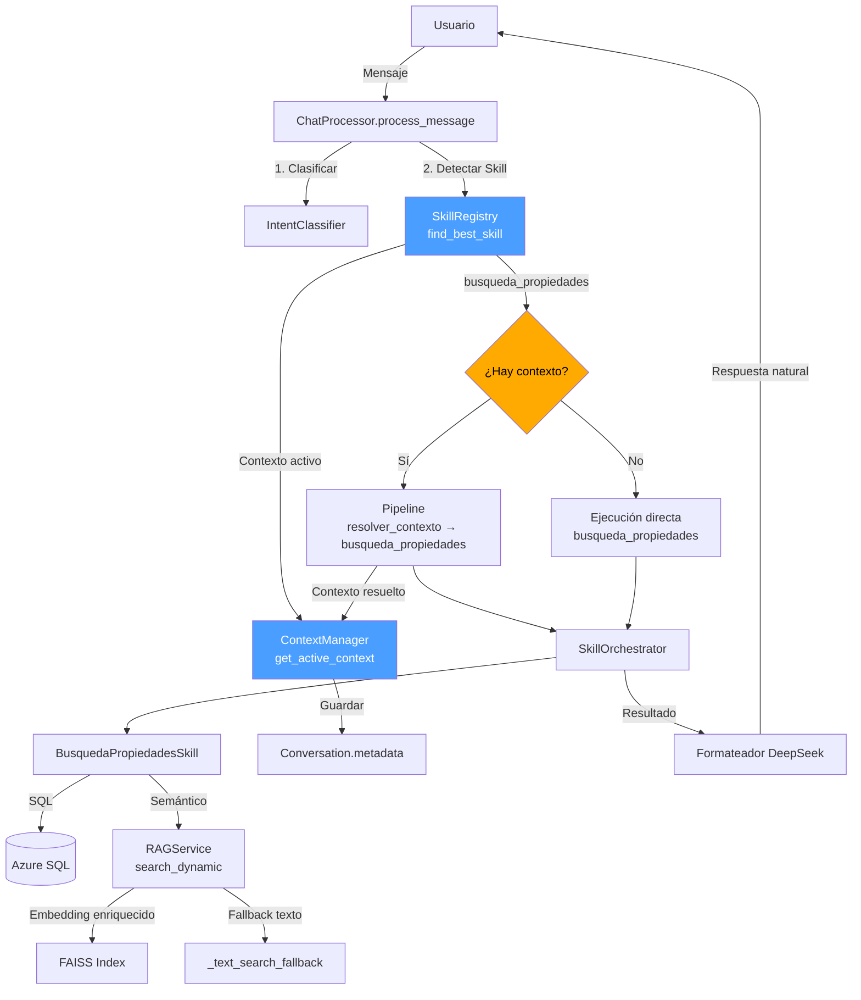

# Especificación Técnica de Refactorización — Sistema de Inteligencia Propifai

> **Versión:** 1.0
> **Fecha:** 2026-05-11
> **Autor:** Arquitecto de Software Senior
> **Propósito:** Especificación detallada para refactorizar el sistema de skills, contexto y pipeline del asistente conversacional Propifai.

---

## Índice de Refactorizaciones

| Ref | Nombre | Prioridad | Problemas que resuelve |
|-----|--------|-----------|----------------------|
| **A** | Unificación del Sistema de Contexto | 🔴 Alta | C1, M1, M2, M5, L4 |
| **B** | Unificación del SkillRegistry | 🔴 Alta | C2, C4, M6, L1, L2 |
| **C** | Pipeline Condicional | 🟡 Media | C1, M5 |
| **D** | Enriquecimiento de Embeddings RAG | 🟢 Baja | C2 (parcial) |

---

## Refactor A — Unificación del Sistema de Contexto

### Problema

El contexto activo de búsqueda se gestiona en **tres lugares diferentes**:
1. [`SkillExecution.parameters`](webapp/intelligence/models.py:789) — Guardado por el orchestrator
2. [`conversation.metadata['contexto_activo_busqueda']`](webapp/intelligence/models.py:231) — Guardado por `_guardar_contexto_activo()`
3. [`_get_contexto_activo()`](webapp/intelligence/services/chat_processor.py:1089) — Lee de ambos con lógica de fallback

Además, el contexto se guarda sin normalizar (M2) y se filtra con una lista hardcodeada de campos (L4).

### Solución Propuesta

**Crear un `ContextManager` como servicio centralizado** que unifique la lectura/escritura del contexto activo.

#### Nuevo archivo: `webapp/intelligence/services/context_manager.py`

```python
@dataclass
class ActiveContext:
    """Contexto activo de búsqueda normalizado."""
    distrito: Optional[str] = None
    tipo_propiedad: Optional[str] = None
    operacion: Optional[str] = None
    precio_min: Optional[float] = None
    precio_max: Optional[float] = None
    habitaciones: Optional[int] = None
    banos: Optional[int] = None
    area_min: Optional[float] = None
    area_max: Optional[float] = None
    condicion: Optional[str] = None
    semantic_query: Optional[str] = None

    def is_empty(self) -> bool:
        return all(v is None for v in self.__dict__.values())

    def merge(self, other: 'ActiveContext') -> 'ActiveContext':
        """Fusiona dos contextos, priorizando valores no-None del otro."""
        merged = ActiveContext()
        for field in self.__dict__:
            setattr(merged, field, 
                    getattr(other, field) or getattr(self, field))
        return merged

    def to_dict(self) -> Dict[str, Any]:
        return {k: v for k, v in self.__dict__.items() if v is not None}


class ContextManager:
    """
    Servicio centralizado para gestionar el contexto activo de búsqueda.
    
    Responsabilidades:
    - Leer contexto activo desde SkillExecution o conversation.metadata
    - Guardar contexto activo normalizado
    - Fusionar contexto nuevo con contexto existente
    - Proveer contexto para resolver_contexto
    """
    
    # Mapeo de nombres de campo normalizados → posibles nombres en field_values
    FIELD_ALIASES = {
        'distrito': ['distrito', 'district', 'district_name', 'zona'],
        'tipo_propiedad': ['tipo_propiedad', 'property_type', 'property_type_id', 'tipo'],
        'operacion': ['operacion', 'operation_type', 'tipo_operacion'],
        'precio_min': ['precio_min', 'price_min', 'min_price'],
        'precio_max': ['precio_max', 'price_max', 'max_price'],
        'habitaciones': ['habitaciones', 'bedrooms', 'dormitorios', 'cuartos'],
        'banos': ['banos', 'bathrooms', 'banios'],
        'area_min': ['area_min', 'min_area', 'built_area_min'],
        'area_max': ['area_max', 'max_area', 'total_area_max'],
        'condicion': ['condicion', 'condition', 'estado'],
        'semantic_query': ['semantic_query', 'query', 'busqueda'],
    }
    
    @classmethod
    def get_active_context(cls, conversation: Conversation) -> ActiveContext:
        """Obtiene el contexto activo desde la fuente más reciente."""
        # 1. Intentar desde SkillExecution
        from ..models import SkillExecution
        ultima = SkillExecution.objects.filter(
            conversation=conversation,
            skill_name='busqueda_propiedades',
            status='success',
        ).order_by('-executed_at').first()
        
        if ultima and ultima.parameters:
            return cls._normalize_context(ultima.parameters)
        
        # 2. Fallback a metadata
        metadata = conversation.metadata or {}
        raw = metadata.get('contexto_activo_busqueda', {})
        return cls._normalize_context(raw)
    
    @classmethod
    def save_active_context(cls, conversation: Conversation, context: ActiveContext) -> None:
        """Guarda el contexto activo normalizado en conversation.metadata."""
        if context.is_empty():
            return
        metadata = conversation.metadata or {}
        metadata['contexto_activo_busqueda'] = context.to_dict()
        conversation.metadata = metadata
        conversation.save(update_fields=['metadata'])
    
    @classmethod
    def _normalize_context(cls, raw: Dict[str, Any]) -> ActiveContext:
        """Normaliza un dict raw a ActiveContext usando FIELD_ALIASES."""
        context = ActiveContext()
        for field_name, aliases in cls.FIELD_ALIASES.items():
            for alias in aliases:
                value = raw.get(alias)
                if value is not None:
                    setattr(context, field_name, value)
                    break
        return context
```

### Cambios Requeridos

| Archivo | Cambio |
|---------|--------|
| `chat_processor.py:1089-1144` | Reemplazar `_get_contexto_activo()` por `ContextManager.get_active_context()` |
| `chat_processor.py:1168-1179` | Reemplazar `_guardar_contexto_activo()` por `ContextManager.save_active_context()` |
| `chat_processor.py:1121-1125` | Eliminar `campos_contexto` hardcodeado |
| `chat_processor.py:1248-1250` | Usar `ContextManager.save_active_context()` con `ActiveContext.merge()` |
| `orchestrator.py:80-273` | Asegurar que `SkillExecution.parameters` use nombres normalizados |

---

## Refactor B — Unificación del SkillRegistry

### Problema

Existen **dos sistemas de detección de skills** (C4):
1. **SkillRegistry.find_best_skill()** — Scoring por keywords (registry.py:114)
2. **`_find_skill_candidate()`** — Búsqueda por descripción + heurísticas (chat_processor.py:870)

Además, `_KEYWORDS_PROPIEDADES` está incompleto (C2) y hardcodeado (L2).

### Solución Propuesta

**Unificar en un solo método** dentro de `SkillRegistry` y hacer los keywords configurables.

#### Cambios en `webapp/intelligence/skills/registry.py`

**1. Hacer `_KEYWORDS_PROPIEDADES` configurable:**

```python
class SkillRegistry:
    # Keywords por defecto (pueden sobrescribirse desde settings)
    _KEYWORDS_PROPIEDADES = None  # Se carga en __init__
    
    def __init__(self):
        if self._KEYWORDS_PROPIEDADES is None:
            self._load_keywords()
    
    def _load_keywords(self):
        """Carga keywords desde settings o usa defaults."""
        from django.conf import settings
        custom_keywords = getattr(settings, 'PROPIFAI_KEYWORDS_PROPIEDADES', None)
        if custom_keywords:
            SkillRegistry._KEYWORDS_PROPIEDADES = frozenset(custom_keywords)
        else:
            # Default ampliado
            SkillRegistry._KEYWORDS_PROPIEDADES = frozenset({
                'casa', 'casas', 'departamento', 'departamentos', 
                'terreno', 'terrenos', 'propiedad', 'propiedades',
                'alquiler', 'venta', 'precio', 'precios',
                'cuarto', 'cuartos', 'habitacion', 'habitaciones',
                'dormitorio', 'dormitorios', 'banio', 'banos',
                'estacionamiento', 'estacionamientos', 'cochera', 'cocheras',
                'metro', 'metros', 'area', 'areas',
                'construido', 'construida', 'construccion', 'construir',
                'edificio', 'edificios', 'local', 'locales',
                'oficina', 'oficinas', 'comercial', 'industria', 'industrial',
                'cayma', 'yanahuara', 'cercado', 'miraflores',
                'sachaca', 'cerro', 'colorado',
                'colegio', 'escuela', 'educacion', 'universidad',
                'remodelado', 'estreno', 'oportunidad',
                'presupuesto', 'rango', 'alquiler',
            })
```

**2. Eliminar `_find_skill_candidate()` de `chat_processor.py`:**

```python
# chat_processor.py:869-886 — ELIMINAR
@classmethod
def _find_skill_candidate(cls, message: str) -> Optional[Dict[str, Any]]:
    ...
```

**3. Simplificar `_infer_skill_request()`:**

```python
@classmethod
def _infer_skill_request(cls, ctx, intent, trace_id):
    if ctx.skill_name:
        return None
    
    # Único punto de detección: SkillRegistry
    registry = SkillRegistry()
    best_skill = registry.find_best_skill(ctx.message, user_level=cls._get_user_level(ctx.user))
    
    if not best_skill:
        return None
    
    # Routing unificado
    if best_skill.name in ('busqueda_propiedades', 'resolver_contexto'):
        # Extraer parámetros y ejecutar pipeline
        ...
    else:
        # Ejecutar skill directa o RAG
        ...
```

**4. Mejorar `find_best_skill()` para aceptar contexto conversacional:**

```python
def find_best_skill(
    self, 
    intent: str, 
    user_level: int = 1,
    active_context: Optional[Dict[str, Any]] = None,  # NUEVO
) -> Optional[BaseSkill]:
    """
    Args:
        intent: Mensaje del usuario
        user_level: Nivel del usuario
        active_context: Contexto activo de búsqueda (opcional)
    """
    # Si hay contexto activo, dar prioridad a busqueda_propiedades
    # para mensajes de seguimiento como "solo departamentos"
    if active_context and self._is_follow_up_message(intent):
        busqueda_skill = self._skills.get('busqueda_propiedades')
        if busqueda_skill:
            return busqueda_skill
    
    # ... resto del algoritmo existente ...
```

### Cambios Requeridos

| Archivo | Cambio |
|---------|--------|
| `registry.py:25-38` | Ampliar `_KEYWORDS_PROPIEDADES` y hacerlo configurable |
| `registry.py:114-216` | Agregar parámetro `active_context` a `find_best_skill()` |
| `chat_processor.py:748-867` | Simplificar `_infer_skill_request()` — eliminar sistema antiguo |
| `chat_processor.py:869-886` | Eliminar `_find_skill_candidate()` |
| `chat_processor.py:888-907` | Eliminar `_find_math_skill_candidate()` (si ya no se usa) |

---

## Refactor C — Pipeline Condicional

### Problema

El pipeline `[resolver_contexto → busqueda_propiedades]` se ejecuta **siempre**, incluso en el primer mensaje de la conversación donde no hay contexto que resolver (C1, M5).

### Solución Propuesta

**Hacer que el pipeline sea condicional:** solo ejecutar `resolver_contexto` cuando haya contexto activo o historial relevante.

#### Cambio en `webapp/intelligence/services/chat_processor.py:1209-1237`

```python
if ctx.skill_name == 'busqueda_propiedades':
    contexto_activo = ContextManager.get_active_context(ctx.conversation)
    historial = cls._get_historial_mensajes(ctx.conversation)
    
    # ── Pipeline condicional ──
    # Solo ejecutar resolver_contexto si hay contexto previo o historial
    if not contexto_activo.is_empty() or len(historial) > 1:
        pipeline_steps = [
            SkillPipelineStep(
                name='resolver_contexto',
                parameters={
                    'mensaje_actual': ctx.message,
                    'contexto_activo': contexto_activo.to_dict(),
                    'historial_mensajes': historial,
                },
                inject_previous_result=False,
                result_key='contexto_resuelto',
            ),
            SkillPipelineStep(
                name='busqueda_propiedades',
                parameters=ctx.skill_params or {},
                inject_previous_result=True,
                result_key='resultado_busqueda',
            ),
        ]
        
        pipeline_result = SKILL_SYSTEM.execute_skill_pipeline(
            pipeline_steps, execution_context,
            mode='sequential', stop_on_error=True,
        )
        
        # Extraer contexto resuelto para guardarlo
        if pipeline_result.success:
            contexto_resuelto = pipeline_result.data.get('contexto_resuelto', {})
            params_resueltos = contexto_resuelto.get('params_resueltos', {})
            contexto_a_guardar = params_resueltos or (ctx.skill_params or {})
            if contexto_a_guardar:
                ContextManager.save_active_context(
                    ctx.conversation, 
                    ContextManager._normalize_context(contexto_a_guardar)
                )
    else:
        # ── Sin contexto: ejecutar busqueda_propiedades directamente ──
        # No necesita resolver_contexto porque no hay herencia de contexto
        pipeline_result = SKILL_SYSTEM.execute_skill(
            'busqueda_propiedades',
            ctx.skill_params or {},
            execution_context,
        )
        # Convertir SkillResult a SkillPipelineResult para mantener compatibilidad
        pipeline_result = SkillPipelineResult(
            success=pipeline_result.success,
            steps=[{
                'name': 'busqueda_propiedades',
                'success': pipeline_result.success,
                'result_data': pipeline_result.data,
                'error_message': pipeline_result.error_message,
            }],
            data={'resultado_busqueda': pipeline_result.data},
            error_message=pipeline_result.error_message,
        )
        
        # Guardar contexto para el próximo turno
        if ctx.skill_params:
            ContextManager.save_active_context(
                ctx.conversation,
                ContextManager._normalize_context(ctx.skill_params)
            )
```

### Cambios Requeridos

| Archivo | Cambio |
|---------|--------|
| `chat_processor.py:1209-1237` | Hacer pipeline condicional según contexto activo |
| `chat_processor.py:1242-1483` | Adaptar extracción de resultados para ambos casos |
| `chat_processor.py:1252-1375` | Unificar lógica de extracción de propiedades |

---

## Refactor D — Enriquecimiento de Embeddings RAG

### Problema

El contenido embeddeado en las colecciones RAG no incluye suficiente información semántica para que la búsqueda vectorial encuentre propiedades por concepto (ej: "construir un colegio" no encuentra terrenos).

### Solución Propuesta

**Enriquecer el contenido de embedding** con metadatos adicionales y sinónimos.

#### Cambio en `webapp/intelligence/services/rag.py:1281-1288`

```python
# Construir texto para embedding con enriquecimiento semántico
content_parts = []
for field in collection.embedding_fields:
    val = field_values.get(field) or row_dict.get(field)
    if val is not None and val != '':
        content_parts.append(str(val))

# ── ENRIQUECIMIENTO SEMÁNTICO ──
# Agregar contexto adicional basado en el tipo de propiedad
tipo = str(field_values.get('tipo_propiedad') or row_dict.get('tipo_propiedad') or '')
tipo_lower = tipo.lower()

# Si es terreno, agregar términos relacionados con construcción
if 'terreno' in tipo_lower:
    content_parts.append("terreno para construir edificar construir colegio escuela casa edificio")
    
# Si es local comercial, agregar términos de negocio
if 'local' in tipo_lower or 'comercial' in tipo_lower:
    content_parts.append("local comercial negocio tienda oficina empresa")

# Agregar distrito como contexto geográfico
distrito = str(field_values.get('district_name') or field_values.get('distrito') or '')
if distrito:
    content_parts.append(f"ubicado en {distrito} arequipa peru")

content = " ".join(content_parts)
```

Además, **agregar un campo `semantic_tags`** a `IntelligenceCollection` para que cada colección pueda definir sus propias reglas de enriquecimiento:

```python
# En IntelligenceCollection (models.py)
semantic_tags = models.JSONField(
    default=dict,
    blank=True,
    verbose_name="Etiquetas semánticas",
    help_text="Reglas de enriquecimiento semántico: {'terreno': ['construir', 'edificar', 'colegio'], ...}"
)
```

### Cambios Requeridos

| Archivo | Cambio |
|---------|--------|
| `rag.py:1281-1288` | Agregar enriquecimiento semántico al contenido de embedding |
| `rag.py:1278-1288` | Usar `semantic_tags` de la colección si está configurado |
| `models.py:301-405` | Agregar campo `semantic_tags` a `IntelligenceCollection` |
| `rag.py:1111-1381` | Actualizar `sync_collection_dynamic` para usar semantic_tags |

---

## 📐 Diagrama de Arquitectura Post-Refactor



---

## 📋 Matriz de Dependencias entre Refactors

| Refactor | Depende de | Requiere migración BD | Rompe compatibilidad |
|----------|-----------|----------------------|---------------------|
| A | Ninguno | No | No (solo refactor interno) |
| B | A (para pasar contexto activo) | No | Sí (elimina `_find_skill_candidate`) |
| C | A (usa ContextManager) | No | No |
| D | Ninguno | Sí (nuevo campo semantic_tags) | No |

**Orden de implementación recomendado:** A → B → C → D
