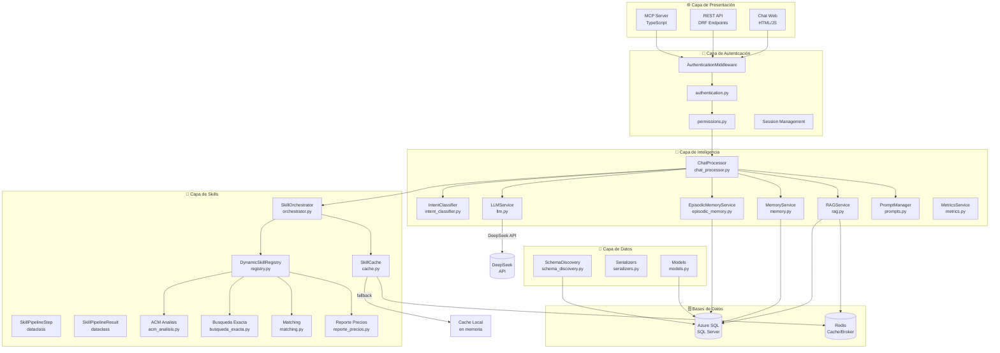
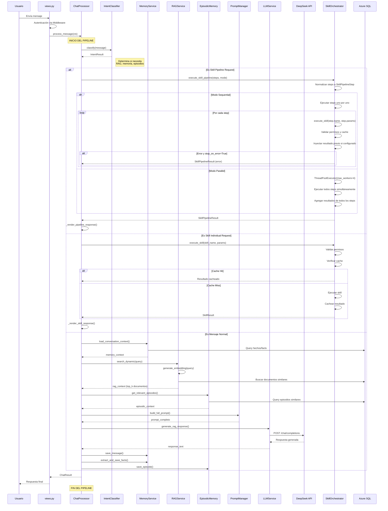
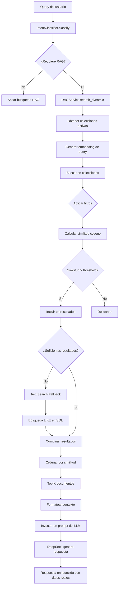
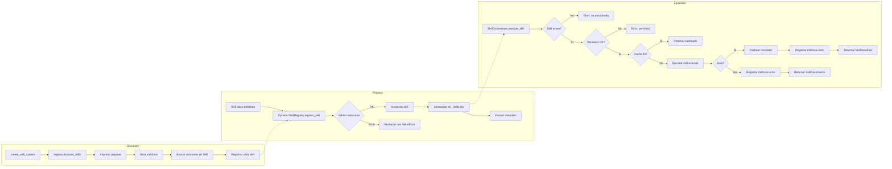
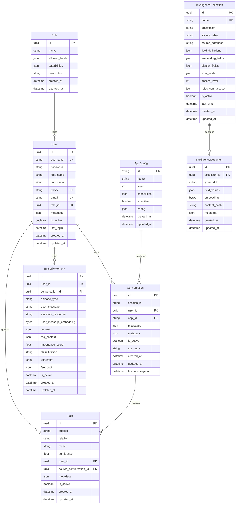
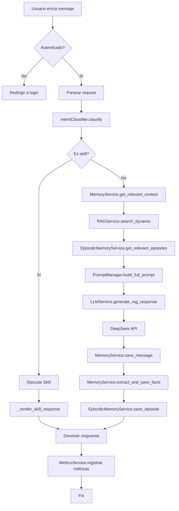
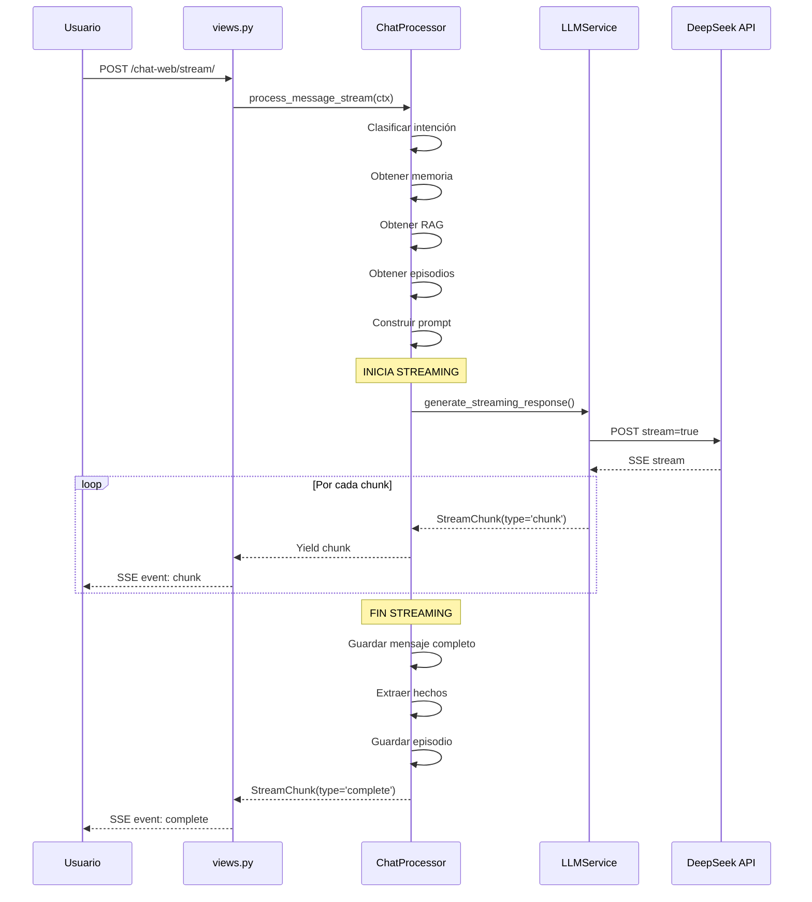

# Diagrama de Flujo Técnico — Sistema Intelligence (Propifai)

> **Propósito:** Este diagrama describe el flujo técnico completo del sistema de inteligencia de Propifai, desde que un usuario envía un mensaje hasta que recibe una respuesta.

---

## 1. Arquitectura General del Sistema



---

## 2. Flujo de Procesamiento de Mensaje (Chat)



---

## 3. Flujo de Búsqueda RAG (Recuperación Aumentada por Generación)



---

## 4. Flujo del Sistema de Skills



---

## 5. Flujo de Pipelines de Skills (Secuenciales y Paralelas)

```mermaid
flowchart TD
    A[ChatProcessor recibe<br/>skill_pipeline en ChatContext] --> B{¿Modo?}
    B -->|sequential| C[execute_skill_pipeline_sequential]
    B -->|parallel| D[execute_skill_pipeline_parallel]

    C --> E[Inicializar pipeline_data = {}]
    E --> F[previous_result = None]
    F --> G[Iterar sobre steps]
    G --> H[Normalizar step a SkillPipelineStep]
    H --> I[Preparar parameters]
    I --> J{inject_previous_result?}
    J -->|Sí| K[parameters['previous_result'] = previous_result.data]
    J -->|No| L[Usar parameters del step]
    K --> M[execute_skill(step.name, parameters)]
    L --> M
    M --> N{Resultado.success?}
    N -->|Sí| O[result_key = step.result_key or step.name]
    N -->|No| P{stop_on_error?}
    P -->|Sí| Q[Retornar SkillPipelineResult(error)]
    P -->|No| R[Continuar con siguiente step]
    O --> S[pipeline_data[result_key] = result.data]
    S --> T[previous_result = result]
    T --> U{Siguiente step?}
    U -->|Sí| G
    U -->|No| V[Retornar SkillPipelineResult(success=True)]

    D --> W[Inicializar step_outputs = []]
    W --> X[Inicializar pipeline_data = {}]
    X --> Y[max_workers = min(len(steps), 4)]
    Y --> Z[ThreadPoolExecutor(max_workers)]
    Z --> AA[Submit todos los futures]
    AA --> BB[as_completed(futures)]
    BB --> CC[Por cada future completado]
    CC --> DD[future.result() -> SkillResult]
    DD --> EE{result.success?}
    EE -->|Sí| FF[key = step.result_key or step.name]
    EE -->|No| GG[Marcar error]
    FF --> HH[pipeline_data[key] = result.data]
    GG --> II[step_outputs.append(step_output)]
    HH --> II
    II --> JJ{Todos completados?}
    JJ -->|No| CC
    JJ -->|Sí| KK[success = all(step['success'] for step in step_outputs)]
    KK --> LL[Retornar SkillPipelineResult]

    V --> MM[ChatProcessor._render_pipeline_response]
    LL --> MM
    MM --> NN[Retornar ChatResult con pipeline data]
```

**Características de los Pipelines:**

- **Secuencial**: Ejecuta skills una tras otra, permite inyección de resultados previos
- **Paralelo**: Ejecuta hasta 4 skills simultáneamente usando ThreadPoolExecutor
- **Manejo de Errores**: Configurable con `stop_on_error` (True por defecto)
- **Persistencia**: Cada skill individual se registra en `SkillExecution`
- **Cache**: Funciona por skill individual, no por pipeline completo
- **Streaming**: Compatible con respuestas streaming en chat

**Ejemplo de Pipeline Secuencial:**
```python
steps = [
    {'name': 'suma', 'parameters': {'a': 100, 'b': 200}, 'result_key': 'ingresos'},
    {'name': 'suma', 'parameters': {'a': 50, 'b': 30}, 'result_key': 'gastos'},
]
result = orchestrator.execute_skill_pipeline(steps, mode='sequential')
# Resultado: {'ingresos': {'resultado': 300}, 'gastos': {'resultado': 80}}
```

**Ejemplo de Pipeline Paralelo:**
```python
steps = [
    {'name': 'suma', 'parameters': {'a': 1, 'b': 2}, 'result_key': 'p1'},
    {'name': 'suma', 'parameters': {'a': 3, 'b': 4}, 'result_key': 'p2'},
]
result = orchestrator.execute_skill_pipeline(steps, mode='parallel')
# Resultado: {'p1': {'resultado': 3}, 'p2': {'resultado': 7}}
```

---

## 6. Modelo de Datos (Entidad-Relación)



---

## 7. Pipeline Completo de Procesamiento



---

## 8. Leyenda de Componentes

| Componente | Archivo | Función Principal |
|---|---|---|
| `ChatProcessor` | [`chat_processor.py`](../intelligence/services/chat_processor.py) | Orquestador central del pipeline de chat |
| `IntentClassifier` | [`intent_classifier.py`](../intelligence/services/intent_classifier.py) | Clasifica intención del mensaje (sin LLM) |
| `RAGService` | [`rag.py`](../intelligence/services/rag.py) | Búsqueda semántica + vectorial en Azure SQL |
| `MemoryService` | [`memory.py`](../intelligence/services/memory.py) | Gestión de memoria de usuario (hechos) |
| `EpisodicMemoryService` | [`episodic_memory.py`](../intelligence/services/episodic_memory.py) | Memoria episódica de interacciones |
| `LLMService` | [`llm.py`](../intelligence/services/llm.py) | Integración con DeepSeek API |
| `PromptManager` | [`prompts.py`](../intelligence/services/prompts.py) | Gestión de prompts desde BD |
| `MetricsService` | [`metrics.py`](../intelligence/services/metrics.py) | Métricas y logging estructurado |
| `SkillOrchestrator` | [`orchestrator.py`](../intelligence/skills/orchestrator.py) | Coordinación de ejecución de skills |
| `DynamicSkillRegistry` | [`registry.py`](../intelligence/skills/registry.py) | Registro y discovery de skills |
| `SkillCache` | [`cache.py`](../intelligence/skills/cache.py) | Cache Redis + local para skills |
| `SchemaDiscoveryService` | [`schema_discovery.py`](../intelligence/services/schema_discovery.py) | Descubrimiento de esquemas SQL |
| `AuthenticationMiddleware` | [`middleware.py`](../intelligence/middleware.py) | Auth + sesión en cada request |

---

## 9. Flujo de Streaming (SSE)



---

*Documento actualizado el 1 de Mayo de 2026*
*Incluye soporte para pipelines de skills secuenciales y paralelas (Fase 5)*
*Basado en el código fuente de [`webapp/intelligence/`](../intelligence/)*
