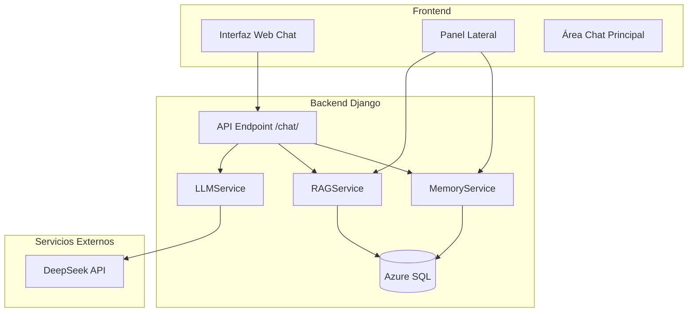

# SPEC-007: INTEGRACIÓN FINAL - CHAT WEB INTERACTIVO (PIL v1.0) - PLAN DE IMPLEMENTACIÓN

## Fecha de Planificación
17 de Abril de 2026

## Estado del Plan
📋 **PENDIENTE DE APROBACIÓN**

## Resumen Ejecutivo
Crear una interfaz web tipo chat (similar a Claude/ChatGPT) que integre todos los servicios PIL (Memoria, RAG, DeepSeek) con un panel lateral para visualizar memoria, instrucciones y archivos. Esta interfaz será el frontend principal para interactuar con el Propifai Intelligence Layer.

## Dependencias Verificadas
- ✅ **SPEC-001**: Propifai Intelligence Layer (PIL v1.0) - COMPLETADO
- ✅ **SPEC-002**: Sistema de Memoria de Conversación - COMPLETADO  
- ✅ **SPEC-003**: Sistema RAG y Colecciones Vectoriales - COMPLETADO
- ✅ **SPEC-006**: Integración DeepSeek - COMPLETADO
- ✅ **DeepSeek API**: Configurada y funcionando
- ✅ **Servicios PIL**: MemoryService, RAGService, LLMService operativos

## Arquitectura Propuesta

### Diagrama de Componentes


### Flujo de Datos
1. **Usuario envía mensaje** → Frontend → POST `/api/v1/intelligence/chat/`
2. **API procesa mensaje** → MemoryService (gestión sesión) → RAGService (búsqueda contexto) → LLMService (generación respuesta)
3. **Respuesta generada** → API → Frontend (muestra en chat)
4. **Panel lateral actualizado** → Consulta datos de memoria y RAG vía endpoints específicos

## Componentes a Implementar

### 1. Vista Django (`intelligence/views.py`)
- **Nueva vista**: `chat_web_view` - Renderiza template principal del chat
- **Endpoints API adicionales**:
  - `GET /intelligence/chat/web/session/` - Obtiene datos de sesión para panel lateral
  - `GET /intelligence/chat/web/facts/` - Obtiene hechos del usuario actual
  - `GET /intelligence/chat/web/rag_context/` - Obtiene documentos RAG relevantes
  - `GET /intelligence/chat/web/capabilities/` - Obtiene capacidades según app y nivel

### 2. Template Principal (`templates/intelligence/chat_web.html`)
- Layout split con panel lateral (30%) y área chat (70%)
- Diseño responsive (mobile-friendly)
- Tema oscuro consistente con dashboard existente
- Componentes:
  - **Panel Lateral**:
    - Sección de perfil de usuario (nombre, app, nivel)
    - Lista de hechos conocidos (extraídos por MemoryService)
    - Instrucciones del sistema (según capacidades de la app)
    - Documentos RAG relevantes (propiedades, noticias)
    - Estado de conexión y estadísticas
  - **Área Chat Principal**:
    - Historial de mensajes con burbujas diferenciadas (usuario/asistente)
    - Input de texto con soporte para markdown básico
    - Botones de acción (adjuntar, limpiar, exportar)
    - Indicador de typing cuando el asistente está procesando

### 3. JavaScript Frontend (`static/intelligence/chat_web.js`)
- **Gestión de estado**: Usuario, sesión, historial de mensajes
- **Comunicación con API**: 
  - `sendMessage()`: Envía mensaje al endpoint chat
  - `loadSessionData()`: Carga datos para panel lateral
  - `streamResponse()`: Soporte para streaming de respuestas (futuro)
- **UI/UX**:
  - Auto-scroll al nuevo mensaje
  - Indicadores de estado (conectado, enviando, error)
  - Manejo de errores con reintentos
  - Persistencia local del historial (localStorage)

### 4. Estilos CSS (`static/intelligence/chat_web.css`)
- Tema oscuro alineado con dashboard existente
- Animaciones suaves para transiciones
- Diseño responsive (breakpoints: mobile, tablet, desktop)
- Componentes específicos:
  - Burbujas de chat con sombras y bordes redondeados
  - Panel lateral colapsable en móviles
  - Input con efectos de focus

### 5. URLs (`intelligence/urls.py`)
```python
urlpatterns = [
    # Chat web interface
    path('chat/web/', views.chat_web_view, name='chat_web'),
    path('chat/web/session/', views.chat_web_session_data, name='chat_web_session'),
    path('chat/web/facts/', views.chat_web_user_facts, name='chat_web_facts'),
    path('chat/web/rag-context/', views.chat_web_rag_context, name='chat_web_rag_context'),
    path('chat/web/capabilities/', views.chat_web_capabilities, name='chat_web_capabilities'),
]
```

## Integración con Servicios PIL Existentes

### MemoryService
```python
# En views.py
from intelligence.services.memory import MemoryService

# Obtener sesión activa
session = MemoryService.get_active_session(user_id, app_id, session_id)

# Cargar contexto completo
context = MemoryService.load_conversation_context(session_id)

# Obtener hechos del usuario
facts = Fact.objects.filter(user_id=user_id).order_by('-confidence')[:10]
```

### RAGService
```python
# En views.py  
from intelligence.services.rag import RAGService

# Búsqueda semántica para contexto relevante
success, message, rag_results = RAGService.search(
    query=ultimo_mensaje,
    access_level=user_access_level,
    limit=3
)
```

### LLMService (via API existente)
- El frontend usará el endpoint existente `/api/v1/intelligence/chat/`
- Headers requeridos: `X-App-ID`, `X-User-ID` (opcional)
- Formato request/response ya definido en SPEC-001

## Plan de Implementación por Fases

### Fase 1: Estructura Base (2-3 días)
1. **Crear vista y template básico**
   - Vista `chat_web_view` que renderiza template vacío
   - Template base con estructura HTML básica
   - URLs configuradas

2. **Implementar panel lateral estático**
   - HTML/CSS para layout split
   - Secciones con datos mock
   - Diseño responsive básico

3. **Integrar con sistema de autenticación existente**
   - Usar sesiones Django o tokens JWT
   - Determinar app_id y user_id desde contexto

### Fase 2: Funcionalidad Chat (3-4 días)
4. **Implementar área de chat principal**
   - Componente de historial de mensajes
   - Input de texto con envío por Enter/Ctrl+Enter
   - Burbujas de mensajes diferenciadas

5. **Integración con API chat existente**
   - JavaScript para enviar/recepcionar mensajes
   - Manejo de estados (enviando, recibido, error)
   - Actualización automática del historial

6. **Panel lateral con datos reales**
   - Endpoints para datos de sesión
   - Integración con MemoryService para hechos
   - Integración con RAGService para documentos relevantes

### Fase 3: Mejoras UX y Features Avanzados (2-3 días)
7. **Mejoras de UI/UX**
   - Animaciones y transiciones
   - Indicadores de typing
   - Auto-scroll suave
   - Notificaciones de nuevos mensajes

8. **Features adicionales**
   - Adjuntar archivos/imágenes
   - Exportar conversación (PDF/JSON)
   - Búsqueda en historial
   - Modo claro/oscuro

9. **Testing y depuración**
   - Pruebas cross-browser
   - Pruebas en dispositivos móviles
   - Optimización de performance

## Consideraciones Técnicas

### Seguridad
- **Autenticación**: Usar sistema existente (JWT o sesiones Django)
- **Autorización**: Verificar que usuario tiene acceso a la app especificada
- **CORS**: Configurar apropiadamente para desarrollo/producción
- **XSS**: Sanitizar inputs del usuario en frontend y backend

### Performance
- **Paginación**: Historial de mensajes paginado para conversaciones largas
- **Caching**: Cachear datos del panel lateral (hechos, capacidades)
- **Lazy loading**: Cargar imágenes/documentos bajo demanda
- **Optimización de queries**: Índices apropiados en modelos relacionados

### Compatibilidad
- **Navegadores**: Chrome, Firefox, Safari, Edge (últimas 2 versiones)
- **Dispositivos**: Desktop, tablet, móvil
- **Accesibilidad**: ARIA labels, keyboard navigation, screen reader support

## Criterios de Éxito

### Funcionales
- [ ] Usuario puede enviar mensajes y recibir respuestas del asistente
- [ ] Panel lateral muestra hechos conocidos del usuario
- [ ] Panel lateral muestra documentos RAG relevantes
- [ ] Interfaz es responsive (funciona en móviles)
- [ ] Historial de conversación se mantiene entre recargas
- [ ] Integración completa con servicios PIL existentes

### No Funcionales  
- [ ] Tiempo de respuesta < 2s para mensajes simples
- [ ] Carga inicial < 3s en conexión promedio
- [ ] Uso de memoria < 100MB en frontend
- [ ] Compatibilidad con navegadores modernos
- [ ] Código documentado y mantenible

## Archivos a Crear/Modificar

### Nuevos Archivos
```
webapp/intelligence/views_chat_web.py          # Vistas específicas para chat web
webapp/templates/intelligence/chat_web.html    # Template principal
webapp/static/intelligence/chat_web.js         # Lógica frontend
webapp/static/intelligence/chat_web.css        # Estilos específicos
webapp/intelligence/SPEC-007_PLAN_IMPLEMENTACION.md  # Este documento
```

### Archivos a Modificar
```
webapp/intelligence/urls.py                    # Agregar URLs de chat web
webapp/intelligence/views.py                   # Agregar imports y funciones auxiliares
webapp/templates/base.html                     # Extender si es necesario
```

## Próximos Pasos

1. **Aprobación de este plan** por parte del usuario
2. **Asignación de recursos** (desarrollador frontend/backend)
3. **Configuración de entorno** de desarrollo
4. **Inicio de implementación** según fases definidas

## Notas Adicionales

### Integración con Dashboard Existente
El chat web debe mantener consistencia visual con el dashboard de intelligence ya implementado (`templates/intelligence/dashboard.html`). Usar misma paleta de colores, tipografía y componentes.

### Soporte para Múltiples Apps
La interfaz debe adaptarse a diferentes apps (web-clientes, dashboard-admin, etc.) mostrando capacidades e instrucciones apropiadas.

### Roadmap Futuro
- **Streaming de respuestas**: Implementar Server-Sent Events o WebSockets
- **Búsqueda en tiempo real**: Autocomplete con sugerencias de propiedades
- **Multimodalidad**: Soporte para imágenes y documentos
- **Colaboración**: Chat multi-usuario para equipos de ventas

---

**Preparado por**: Roo (Agente IA)  
**Fecha**: 17 de Abril de 2026  
**Versión**: 1.0  
**Estado**: 📋 Pendiente de aprobación