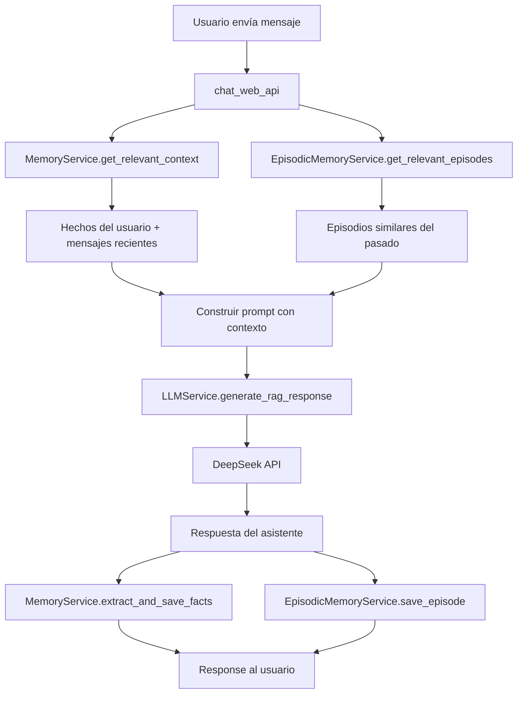

# SPEC-008: Sistema de Memoria Episódica

> **Versión:** 1.0  
> **Fecha:** 23 de Abril de 2026  
> **Estado:** Borrador / Planificación  
> **Propósito:** Agregar memoria episódica al sistema de chat de Propifai para recordar interacciones pasadas completas entre sesiones.

---

## 1. Problema

Actualmente el sistema tiene:

| Tipo de memoria | Qué recuerda | Limitación |
|---|---|---|
| **Corto plazo** | Últimos 10 mensajes de la sesión activa (24h) | Se pierde al cerrar sesión o al pasar 24h sin actividad |
| **Largo plazo (hechos)** | Tripletas `sujeto→relación→objeto` (ej: `usuario busca departamento`) | No guarda el contexto completo de la interacción, solo hechos atómicos |
| **Resumen histórico** | Texto acumulativo de resúmenes de conversación | Es texto plano sin estructura, difícil de buscar/recuperar |

**Lo que falta:** Si un usuario vuelve después de 3 días y pregunta "¿recuerdas aquella propiedad que me gustó en Cayma?", el sistema **no puede** recuperar esa interacción específica porque:
- Los mensajes de la sesión anterior se perdieron (sesión expiró)
- El resumen textual es genérico ("Conversación con 5 mensajes del usuario...")
- Los hechos solo guardan datos atómicos, no el contexto de la interacción

---

## 2. ¿Qué es Memoria Episódica?

La memoria episódica recuerda **eventos completos** del pasado: "el usuario X preguntó por departamentos en Cayma, le mostramos 3 propiedades, hizo clic en la propiedad Y, preguntó por el precio". No solo guarda el hecho ("usuario busca departamento"), sino **toda la escena**: qué se preguntó, qué se respondió, qué acciones ocurrieron, cuándo fue.

### Diferencia con los tipos actuales

```
Memoria Semántica (hechos):  usuario → busca → departamento en Cayma
Memoria Episódica (evento):  El 20/04/2026 a las 15:30, el usuario preguntó
                             "¿Hay departamentos en Cayma?", se le mostraron
                             3 propiedades (IDs: 101, 102, 103), hizo clic
                             en la 102, preguntó "¿tiene cochera?", se le
                             respondió que sí. Calificó la interacción como útil.
```

---

## 3. Arquitectura Propuesta

### 3.1 Nuevo Modelo: `EpisodicMemory`

```python
class EpisodicMemory(models.Model):
    """
    Memoria episódica: eventos completos de interacción usuario-sistema.
    Cada "episodio" es una interacción atómica (mensaje + respuesta + contexto).
    """
    id = models.UUIDField(primary_key=True, default=uuid.uuid4, editable=False)
    user = models.ForeignKey(User, on_delete=models.CASCADE, related_name='episodic_memories')
    conversation = models.ForeignKey(Conversation, on_delete=models.CASCADE, related_name='episodic_memories')
    
    # El episodio en sí
    user_message = models.TextField(verbose_name="Mensaje del usuario")
    assistant_response = models.TextField(verbose_name="Respuesta del asistente")
    timestamp = models.DateTimeField(db_index=True, verbose_name="Momento de la interacción")
    
    # Metadatos estructurados del episodio
    episode_type = models.CharField(
        max_length=50, db_index=True,
        choices=[
            ('property_search', 'Búsqueda de propiedad'),
            ('property_detail', 'Consulta de detalle'),
            ('price_inquiry', 'Consulta de precio'),
            ('matching', 'Matching oferta-demanda'),
            ('acm_analysis', 'Análisis ACM'),
            ('general', 'Consulta general'),
            ('fact_extraction', 'Extracción de hecho'),
            ('user_preference', 'Preferencia del usuario'),
        ],
        default='general',
        verbose_name="Tipo de episodio"
    )
    
    # Contexto enriquecido (JSON)
    context = models.JSONField(
        default=dict,
        verbose_name="Contexto del episodio",
        help_text="""Almacena:
            - properties_mentioned: [IDs de propiedades mencionadas]
            - districts_mentioned: [distritos mencionados]
            - price_range: {min, max, currency}
            - property_types: [tipos de propiedad]
            - actions_taken: [acciones del usuario: click, share, save]
            - sentiment: positivo/neutral/negativo
            - topics: [temas detectados]
            - entities: [entidades nombradas]
            - user_intent: intención detectada
        """
    )
    
    # Relevancia/importancia del episodio
    importance_score = models.FloatField(
        default=0.5,
        validators=[MinValueValidator(0.0), MaxValueValidator(1.0)],
        verbose_name="Puntuación de importancia",
        help_text="0.0 = trivial, 1.0 = muy importante. Se calcula automáticamente."
    )
    
    # Embedding del episodio para búsqueda semántica
    embedding = models.BinaryField(null=True, blank=True, verbose_name="Embedding del episodio")
    embedding_model = models.CharField(max_length=100, blank=True, default='', verbose_name="Modelo de embedding")
    
    # Control
    is_active = models.BooleanField(default=True)
    created_at = models.DateTimeField(auto_now_add=True)
    updated_at = models.DateTimeField(auto_now=True)
    
    class Meta:
        db_table = 'intelligence_episodic_memory'
        verbose_name = 'Memoria Episódica'
        verbose_name_plural = 'Memorias Episódicas'
        indexes = [
            models.Index(fields=['user', '-timestamp']),
            models.Index(fields=['user', 'episode_type']),
            models.Index(fields=['user', 'importance_score']),
        ]
        ordering = ['-timestamp']
```

### 3.2 Integración con el Sistema Actual

```
FLUJO ACTUAL (simplificado):

Usuario → chat_web_api → MemoryService.get_relevant_context()
                        → LLMService.generate_rag_response()
                        → MemoryService.extract_and_save_facts()
                        → Response

FLUJO CON MEMORIA EPISÓDICA:

Usuario → chat_web_api → MemoryService.get_relevant_context()
                        → EpisodicMemoryService.get_relevant_episodes()  ← NUEVO
                        → LLMService.generate_rag_response()
                        → MemoryService.extract_and_save_facts()
                        → EpisodicMemoryService.save_episode()           ← NUEVO
                        → Response
```

### 3.3 Nuevo Servicio: `EpisodicMemoryService`

```
webapp/intelligence/services/
├── memory.py          ← Existente (MemoryService)
├── episodic_memory.py ← NUEVO (EpisodicMemoryService)
├── rag.py             ← Existente (RAGService)
└── llm.py             ← Existente (LLMService)
```

#### Métodos del servicio

| Método | Descripción | ¿Usa DeepSeek? |
|---|---|---|
| `save_episode()` | Guarda un episodio completo (mensaje + respuesta + contexto) | Sí, para clasificar tipo y extraer entidades |
| `get_relevant_episodes()` | Busca episodios similares por embedding semántico + filtros | No, usa embeddings |
| `classify_episode()` | Clasifica el tipo de episodio y extrae entidades | Sí |
| `calculate_importance()` | Calcula qué tan importante es un episodio | Sí |
| `generate_episode_embedding()` | Genera embedding del episodio para búsqueda semántica | No, usa sentence-transformers |
| `prune_old_episodes()` | Elimina episodios de baja importancia viejos | No |
| `get_episode_timeline()` | Retorna línea de tiempo de episodios del usuario | No |

### 3.4 Integración en `chat_web_api`

En [`webapp/intelligence/views.py`](webapp/intelligence/views.py:2179), después de obtener la respuesta del LLM:

```python
# --- ACTUAL (solo facts) ---
extracted_facts = MemoryService.extract_and_save_facts(
    user_id=user.id, message=message, response=response_text
)

# --- NUEVO (también guardar episodio) ---
if use_memory:
    EpisodicMemoryService.save_episode(
        user_id=user.id,
        conversation_id=conversation.id,
        user_message=message,
        assistant_response=response_text,
        rag_context=rag_context,  # opcional
        memory_context=memory_context  # opcional
    )
```

Y antes de generar la respuesta, agregar contexto episódico relevante:

```python
# --- ACTUAL (solo facts y mensajes recientes) ---
memory_context = memory_service.get_relevant_context(query=message, limit=5)

# --- NUEVO (también episodios relevantes) ---
episodic_context = EpisodicMemoryService.get_relevant_episodes(
    user_id=user.id,
    query=message,
    limit=3
)
# Se inyecta en el prompt como "INTERACCIONES ANTERIORES RELEVANTES"
```

---

## 4. Diagrama de Flujo



---

## 5. Plan de Implementación

### Fase 1: Fundación (Modelo + Servicio básico)

| # | Tarea | Archivos | Dependencias |
|---|---|---|---|
| 1.1 | Crear modelo `EpisodicMemory` | [`webapp/intelligence/models.py`](webapp/intelligence/models.py:290) (añadir al final) | Ninguna |
| 1.2 | Crear migración | `python manage.py makemigrations intelligence` | 1.1 |
| 1.3 | Registrar en admin | [`webapp/intelligence/admin.py`](webapp/intelligence/admin.py) | 1.1 |
| 1.4 | Crear `EpisodicMemoryService` con método `save_episode()` | [`webapp/intelligence/services/episodic_memory.py`](webapp/intelligence/services/episodic_memory.py) (nuevo) | 1.1 |
| 1.5 | Implementar `classify_episode()` usando DeepSeek | `episodic_memory.py` | 1.4 |
| 1.6 | Implementar `calculate_importance()` | `episodic_memory.py` | 1.4 |

### Fase 2: Búsqueda semántica de episodios

| # | Tarea | Archivos | Dependencias |
|---|---|---|---|
| 2.1 | Implementar `generate_episode_embedding()` reusando `RAGService.generate_embedding()` | `episodic_memory.py` | 1.4, RAGService |
| 2.2 | Implementar `get_relevant_episodes()` con búsqueda por similitud coseno | `episodic_memory.py` | 2.1 |
| 2.3 | Agregar filtros por tipo de episodio, fecha, importancia | `episodic_memory.py` | 2.2 |

### Fase 3: Integración con el chat

| # | Tarea | Archivos | Dependencias |
|---|---|---|---|
| 3.1 | Modificar `chat_web_api` para guardar episodios después de cada respuesta | [`webapp/intelligence/views.py`](webapp/intelligence/views.py:2486-2507) | 1.4 |
| 3.2 | Modificar `chat_web_api` para inyectar episodios relevantes en el prompt | [`webapp/intelligence/views.py`](webapp/intelligence/views.py:2298-2312) | 2.2 |
| 3.3 | Agregar sección "INTERACCIONES ANTERIORES RELEVANTES" al prompt | [`webapp/intelligence/views.py`](webapp/intelligence/views.py:2334-2448) | 3.2 |

### Fase 4: UI y mantenimiento

| # | Tarea | Archivos | Dependencias |
|---|---|---|---|
| 4.1 | Mostrar línea de tiempo de episodios en el sidebar del chat | [`webapp/templates/intelligence/chat.html`](webapp/templates/intelligence/chat.html:534-568) | 1.4 |
| 4.2 | Implementar `prune_old_episodes()` como comando de management | `webapp/intelligence/management/commands/prune_episodic_memory.py` | 1.4 |
| 4.3 | Agregar tarea Celery para prune automático semanal | `webapp/colas/tareas_captura.py` o nuevo archivo | 4.2 |
| 4.4 | Agregar endpoint API para consultar episodios | [`webapp/intelligence/views.py`](webapp/intelligence/views.py) (nuevo endpoint) | 1.4 |

---

## 6. Ejemplos de Uso

### 6.1 Escenario: Usuario vuelve después de 3 días

```
Usuario: "¿Recuerdas aquel departamento en Cayma que me gustó?"

SIN memoria episódica:
  → Busca hechos: encuentra "usuario → busca → departamento"
  → Busca en RAG: encuentra departamentos en Cayma
  → Responde: "Tengo departamentos en Cayma, ¿cuál te interesa?"
  → ❌ No recuerda la interacción específica

CON memoria episódica:
  → Busca episodios similares: encuentra episodio del 20/04
  → El episodio dice: "Usuario preguntó por deptos en Cayma,
     se le mostraron 3 (IDs 101,102,103), hizo clic en 102,
     preguntó por cochera"
  → Responde: "Sí, recuerdo! El departamento en Cayma que viste
     el 20 de abril, el que tenía cochera. ¿Quieres más detalles?"
  → ✅ Recuerda la interacción específica
```

### 6.2 Escenario: Usuario menciona una propiedad que ya vio

```
Usuario: "Esa propiedad de $80,000 que vimos ayer"

SIN memoria episódica:
  → Busca en RAG: propiedades de $80,000
  → Puede encontrar varias, no sabe cuál
  → ❌ Respuesta genérica

CON memoria episódica:
  → Busca episodios con "80000" en el contexto
  → Encuentra episodio de ayer con property_id=102
  → Responde: "Te refieres a la propiedad en Av. Ejército 305,
     la de 3 dormitorios? Te la muestro de nuevo."
  → ✅ Sabe exactamente a cuál se refiere
```

---

## 7. Consideraciones Técnicas

### 7.1 Embeddings para episodios
- Se reusa el mismo modelo de embeddings (`jaimevera1107/all-MiniLM-L6-v2-similarity-es`) que ya está en `RAGService`
- El texto a embedder es: `user_message + " " + assistant_response + " " + str(context)`
- Los embeddings se almacenan en el campo `embedding` del modelo (BinaryField, 768 bytes para el modelo español)
- Se puede usar la misma tabla `intelligence_embeddings` o almacenar inline en el modelo

### 7.2 Clasificación de episodios con DeepSeek
- Se usa el mismo patrón que [`_extract_facts_with_deepseek`](webapp/intelligence/services/memory.py:421)
- Prompt especializado para clasificar el tipo de episodio y extraer entidades
- La clasificación es **asíncrona** (no bloquea la respuesta al usuario)

### 7.3 Importancia del episodio
Se calcula con estos factores:
- **Acciones del usuario** (+0.3 si hizo clic, guardó o compartió)
- **Sentimiento explícito** (+0.2 si dijo "me gusta", "me interesa")
- **Menciones de precio** (+0.1 si preguntó por precio)
- **Repetición** (+0.1 si ha preguntado por lo mismo varias veces)
- **Tiempo invertido** (+0.1 si la conversación fue larga sobre el tema)

### 7.4 Límites y pruning
- Máximo 500 episodios por usuario
- Episodios con `importance_score < 0.2` y más de 30 días se eliminan automáticamente
- Comando `prune_episodic_memory` para limpieza manual o vía Celery Beat

### 7.5 Impacto en rendimiento
- Guardar episodio: ~200ms (clasificación con DeepSeek + embedding)
- Buscar episodios: ~50ms (búsqueda coseno en memoria, máximo 500 episodios por usuario)
- **No bloquea** la respuesta al usuario: el guardado es post-respuesta
- La búsqueda de episodios se hace en paralelo con la búsqueda de hechos

---

## 8. Estructura de Archivos Resultante

```
webapp/intelligence/
├── models.py                          ← + EpisodicMemory model
├── admin.py                           ← + EpisodicMemoryAdmin
├── services/
│   ├── __init__.py
│   ├── memory.py                      ← Sin cambios
│   ├── episodic_memory.py             ← NUEVO
│   ├── rag.py                         ← Sin cambios
│   └── llm.py                         ← Sin cambios
├── views.py                           ← Modificado (chat_web_api)
├── management/
│   └── commands/
│       └── prune_episodic_memory.py   ← NUEVO
├── migrations/
│   └── XXXX_episodicmemory.py         ← NUEVO (auto-generado)
└── templates/
    └── intelligence/
        └── chat.html                  ← Modificado (timeline en sidebar)
```

---

## 9. Resumen de Cambios por Archivo

| Archivo | Tipo de cambio | Líneas aprox. |
|---|---|---|
| [`webapp/intelligence/models.py`](webapp/intelligence/models.py) | Añadir modelo `EpisodicMemory` | +50 |
| [`webapp/intelligence/admin.py`](webapp/intelligence/admin.py) | Añadir `EpisodicMemoryAdmin` | +25 |
| [`webapp/intelligence/services/episodic_memory.py`](webapp/intelligence/services/episodic_memory.py) | **Nuevo archivo** | +350 |
| [`webapp/intelligence/views.py`](webapp/intelligence/views.py) | Modificar `chat_web_api` (2 secciones) | +30 |
| [`webapp/templates/intelligence/chat.html`](webapp/templates/intelligence/chat.html) | Añadir timeline en sidebar | +40 |
| `webapp/intelligence/management/commands/prune_episodic_memory.py` | **Nuevo archivo** | +80 |
| `webapp/colas/tareas_captura.py` o nuevo | Añadir tarea Celery semanal | +30 |

**Total estimado:** ~605 líneas nuevas / modificadas

---

## 10. Próximos Pasos (Post-Implementación)

1. **Migración de datos históricos**: Script para convertir `Conversation.messages` antiguos en episodios
2. **Dashboard de memoria**: Vista en admin para ver la línea de tiempo episódica de un usuario
3. **API pública**: Endpoint REST para consultar episodios desde el frontend
4. **Exportación**: Permitir al usuario descargar su historial de interacciones

---

*Fin del SPEC-008*
