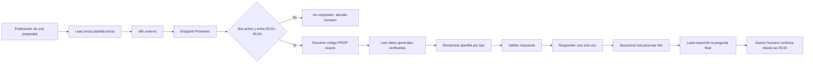

# SPEC — Respondedor nocturno WhatsApp de una propiedad

**Proyecto:** Propifai / Prometeo  
**Versión:** 1.1 — alcance corregido  
**Estado:** Propuesta para revisión, no implementada  
**Stack:** Django 5.0.6, DRF, Azure SQL con `mssql-django`  
**Código activo:** `webapp/`

## 1. Alcance correcto

Este componente no es un bot conversacional general, no administra el CRM y no participa en todo el embudo.

Su única función es reemplazar temporalmente al asesor humano durante la madrugada en el primer contacto de un lead que llega desde la publicación de una propiedad.

El comportamiento es de un solo disparo:

1. El lead envía el mensaje inicial de la publicación:
   `¡Hola! 👋 Más info sobre la casa de Urb. Colonial II (PROP000261)`.
2. n8n, alojado en otra aplicación, envía ese evento al endpoint de Prometeo.
3. Prometeo reconoce el código `PROP000261`.
4. Busca exactamente esa propiedad en `property` y `property_specs`.
5. Determina si es casa, departamento, terreno o local comercial.
6. Completa la plantilla fija correspondiente con datos reales.
7. Devuelve una sola respuesta a n8n.
8. Registra que ya respondió en ese hilo.
9. Queda desactivado para los mensajes siguientes de ese lead.
10. La pregunta final sirve para que el lead deje información. El bot no contesta esa respuesta; el asesor humano la verá y continuará después de las 05:00.

## 2. Lugar dentro del embudo



El bot solo cubre:

```text
lead nuevo → primera respuesta nocturna → espera del asesor
```

No cubre calificación posterior, búsqueda, seguimiento, negociación ni cierre.

## 3. Condiciones para responder

El bot responde únicamente cuando se cumplen todas:

1. Switch general encendido.
2. Hora actual de `America/Lima` dentro de la ventana configurada, inicialmente 00:00–05:00.
3. Mensaje con exactamente un código `PROP`.
4. Código correspondiente a una propiedad exacta.
5. Tipo admitido: casa, departamento, terreno o local comercial.
6. Datos mínimos suficientes para completar la plantilla.
7. No existe una respuesta anterior para ese hilo.
8. El asesor humano no tomó la conversación.

Si falla una condición, devuelve texto vacío. No pide aclaración, no busca otras propiedades y no improvisa.

## 4. Detección de la propiedad

### 4.1 Código

Regex inicial:

```regex
\bPROP\s*0*(\d{1,9})\b
```

Se normaliza al formato canónico y se consulta por `property.code` exacto. No se utiliza RAG, embeddings ni búsqueda semántica.

- Sin código: no responder.
- Dos códigos diferentes: no responder.
- Código inexistente: no responder.
- Código exacto: continuar.

### 4.2 Título

El título incluido en el mensaje es verificación secundaria:

- Código y título compatibles: continuar.
- Código existente pero título claramente distinto: bloquear y enviar a revisión.
- El título nunca sustituye al código en esta primera versión.

Puede reutilizarse la normalización de título de `BusquedaPropiedadesSkill`, pero no debe ejecutarse su búsqueda híbrida completa.

## 5. Respuesta única y desactivación

Después de devolver la plantilla se crea una marca persistente de atención automática. Los mensajes siguientes de ese hilo reciben `action=ignore`, aunque pregunten precio, área o dormitorios.

La llave recomendada es:

```text
external_conversation_id + property_code
```

Si la aplicación externa todavía no envía un ID de hilo, durante integración puede usarse:

```text
phone_normalized + property_code + service_window_date
```

La primera opción debe ser obligatoria antes de producción.

La marca no se elimina automáticamente a las 05:00: indica que la primera etapa de ese hilo ya fue atendida. Una entrada nueva desde otra publicación debe traer otro `external_conversation_id`.

La pregunta final de la plantilla recolecta información para el asesor. La contestación del lead se conserva en el CRM externo, pero Prometeo no la responde.

## 6. Datos y reglas de selección

### 6.1 Fuentes

- `property`: código, título, precio, moneda, ubicación, tipo, estado y visibilidad.
- `property_specs`: dormitorios, baños, `built_area`, `land_area`, estacionamientos.
- Relaciones existentes: tipo, moneda, distrito y urbanización.
- Conexión existente `propifai` hacia `dbpropify_be`.

No se crea otra base de datos ni otro recurso Azure.

### 6.2 Ubicación

Orden determinista:

1. urbanización + distrito, evitando duplicados;
2. `display_address`, si está aprobada para exposición pública;
3. distrito;
4. `map_address` solo si una política autoriza mostrarla.

No se envían coordenadas ni dirección privada exacta por defecto.

### 6.3 Precio

Usar `property.price` y la moneda relacionada:

- USD: `US$ 299,000`;
- PEN: `S/ 1,050,000`.

No convertir monedas ni inferir precios.

### 6.4 Características principales

Máximo dos, siguiendo este orden:

| Tipo | Prioridad |
|---|---|
| Casa | dormitorios → área construida → baños |
| Departamento | dormitorios → área construida → baños |
| Terreno | área de terreno |
| Local comercial | área construida → baños → estacionamientos |

Los valores nulos se omiten. Nunca intercambiar silenciosamente `land_area` y `built_area`.

### 6.5 Datos mínimos

| Tipo | Obligatorios |
|---|---|
| Casa | ubicación, precio y al menos una característica |
| Departamento | ubicación, precio y al menos una característica |
| Terreno | ubicación, `land_area` y precio |
| Local comercial | ubicación, precio y al menos una característica |

Si falta algún mínimo, no responder y marcar revisión.

## 7. Plantillas literales

El texto se construye con código. No se usa un LLM.

### 7.1 Casa

```text
¡Gracias por escribirnos! 😊
Esta casa se encuentra en {ubicación}, tiene {1 o 2 características} y un precio de {precio}.

En este momento estamos fuera del horario de atención. Apenas uno de nuestros asesores esté disponible, continuará la conversación contigo.

Mientras tanto, ¿qué es indispensable para ti en tu nueva casa? Así podemos decirte si esta propiedad cumple con lo que buscas.
```

### 7.2 Departamento

```text
¡Gracias por escribirnos! 😊
Este departamento está ubicado en {ubicación}, cuenta con {1 o 2 características principales} y tiene un precio de {precio}.

En este momento estamos fuera del horario de atención. Apenas uno de nuestros asesores esté disponible, continuará la conversación contigo.

Mientras tanto, ¿qué es indispensable para ti en un departamento? Así puedo decirte si esta propiedad cumple con lo que necesitas.
```

### 7.3 Terreno

```text
¡Gracias por escribirnos! 😊
Este terreno se encuentra en {ubicación}, tiene un área de {área} y un precio de {precio}.

En este momento estamos fuera del horario de atención. Apenas uno de nuestros asesores esté disponible, continuará la conversación contigo.

Mientras tanto, ¿estás pensando en construir tu vivienda o te interesa conocer los parámetros para desarrollar un proyecto?
```

### 7.4 Local comercial

```text
¡Gracias por escribirnos! 😊
Este local comercial está ubicado en {ubicación}, cuenta con {1 o 2 características principales} y tiene un precio de {precio}.

En este momento estamos fuera del horario de atención. Apenas uno de nuestros asesores esté disponible, continuará la conversación contigo.

Mientras tanto, ¿qué tipo de negocio tienes pensado y qué características son indispensables para ti? Así puedo decirte si este local se adapta a lo que buscas.
```

### 7.5 Formato de características

- `1 dormitorio` / `3 dormitorios`;
- `120 m² de área construida`;
- `2 baños`;
- `2 estacionamientos`.

Con dos valores: `3 dormitorios y 120 m² de área construida`.

No agregar código, descripción, disponibilidad, saludo adicional ni otra llamada a la acción.

## 8. Arquitectura interna mínima

Aunque se denomine agente por su función de negocio, esta versión no requiere ReAct, supervisor, memoria episódica semántica ni system prompt.

```text
endpoint
  → guardia de switch/horario
  → verificación one-shot
  → detector de código
  → consulta exacta de propiedad
  → selector de datos por tipo
  → renderer de plantilla
  → validador
  → auditoría
  → respuesta
```

### 8.1 Skill

Crear `webapp/intelligence/skills/propiedades/informacion_inicial_propiedad.py`:

```python
class InformacionInicialPropiedadSkill(BaseSkill):
    name = "informacion_inicial_propiedad"
    category = "busqueda"
    access_level = 1
```

Entrada: `{"property_code": "PROP000261"}`.

Salida interna estructurada:

```json
{
  "property_id": 261,
  "code": "PROP000261",
  "property_type": "casa",
  "location": "Urb. Colonial II, Paucarpata",
  "price": {"amount": "299000.00", "currency": "USD"},
  "features": [
    {"field": "bedrooms", "value": 4, "source": "property_specs.bedrooms"},
    {"field": "built_area", "value": "180.00", "source": "property_specs.built_area"}
  ]
}
```

### 8.2 Agente

Crear `webapp/intelligence/agents/respuesta_inicial_whatsapp_agent.py`.

Permitirá una skill, una iteración y costo LLM cero. El endpoint lo invoca directamente. No se expondrá como opción del supervisor global.

## 9. Endpoint para n8n externo

### 9.1 Ruta

```http
POST /api/n8n/property-bot/v1/initial-response/
Content-Type: application/json
X-N8N-API-Key: <secreto>
X-Idempotency-Key: <message_id>
```

### 9.2 Entrada

```json
{
  "message_id": "wamid.HBgLNTE5...",
  "external_conversation_id": "crm-thread-84721",
  "phone": "+51987654321",
  "text": "¡Hola! 👋Más info sobre la casa de Urb. Colonial II (PROP000261)",
  "contact_name": "Juan Pérez",
  "human_takeover": false
}
```

### 9.3 Salida cuando responde

```json
{
  "success": true,
  "action": "respond_once",
  "reply_text": "<plantilla completa>",
  "interaction_id": "uuid",
  "property_code": "PROP000261",
  "bot_finished_for_conversation": true
}
```

### 9.4 Salida cuando no responde

```json
{
  "success": true,
  "action": "ignore",
  "reply_text": "",
  "reason_code": "ALREADY_RESPONDED",
  "bot_finished_for_conversation": true
}
```

n8n solo envía WhatsApp cuando `action == "respond_once"`.

Razones mínimas: `ANSWER_SENT`, `BOT_DISABLED`, `OUTSIDE_SCHEDULE`, `ALREADY_RESPONDED`, `HUMAN_TAKEOVER`, `NO_PROPERTY_CODE`, `MULTIPLE_PROPERTY_CODES`, `PROPERTY_NOT_FOUND`, `TITLE_CODE_MISMATCH`, `UNSUPPORTED_PROPERTY_TYPE`, `MISSING_REQUIRED_DATA`, `VALIDATION_FAILED`, `INTERNAL_ERROR`.

## 10. Persistencia y base de memoria futura

La Etapa 1 no recupera memoria para producir nuevas respuestas porque solo existe una intervención. Sin embargo, debe guardar desde ahora el episodio completo para que las etapas posteriores puedan recuperar el contexto sin rediseñar el sistema ni perder el historial inicial.

Se reutiliza `EpisodicMemoryService` en modo **escritura únicamente**:

- crear/reutilizar el `User` asociado al teléfono normalizado;
- crear/reutilizar una `Conversation` con `app_id="whatsapp-property-funnel"`;
- guardar `episode_type="property_detail"`;
- guardar `intent_detected="initial_property_interest"`;
- registrar propiedad, código, tipo, datos enviados, pregunta final, etapa del embudo y decisión;
- usar `generate_embedding=False` en esta etapa para evitar costo innecesario;
- no recuperar episodios para contestar mensajes posteriores todavía.

En la Etapa 2 podrá habilitarse la lectura controlada de episodios por el mismo teléfono y conversación.

### 10.1 `PropertyBotInitialResponse`

En la base actual de Prometeo:

- UUID;
- `message_id` único;
- `external_conversation_id` indexado;
- hash del teléfono y últimos cuatro dígitos;
- propiedad, código y tipo;
- texto entrante redactado;
- respuesta exacta;
- acción y razón;
- evidencia JSON;
- estado del switch y horario efectivo;
- latencia;
- `responded_at`;
- estado y nota de revisión.

Debe existir una restricción compatible con SQL Server que impida más de una respuesta por conversación.

### 10.2 `PropertyBotConfiguration`

- `enabled`;
- `start_time=00:00`;
- `end_time=05:00`;
- `timezone_name=America/Lima`;
- `require_external_conversation_id`;
- `updated_at`, `updated_by`.

### 10.3 `PropertyBotControlAudit`

Registra activación, desactivación, cambio de horario y restablecimiento manual.

## 11. Dashboard

Ruta: `/intelligence/whatsapp-initial-responder/`.

### 11.1 Control

- switch Activado/Desactivado;
- estado efectivo;
- horario editable;
- hora actual de Lima;
- apagado inmediato;
- cantidad de hilos ya atendidos;
- restablecimiento manual auditado para pruebas/incidentes.

### 11.2 Evaluación

- mensajes recibidos;
- respuestas únicas;
- mensajes posteriores ignorados;
- propiedades no encontradas;
- tipos no soportados;
- datos mínimos ausentes;
- discrepancias título/código;
- errores internos;
- latencia promedio y P95;
- respuestas marcadas correctas/incorrectas.

### 11.3 Detalle auditable

Mostrar mensaje, propiedad, datos y columnas de origen, plantilla, respuesta, validaciones y botones `Correcta` / `Error` con comentario.

El feedback no modifica reglas automáticamente.

## 12. Guardrails y reglas

### 12.1 Sin system prompt

No hay razonamiento abierto ni redacción libre. Las cuatro plantillas son la política empresarial ejecutable. Un LLM añadiría variabilidad innecesaria.

### 12.2 Guardrails obligatorios

- código exacto y único;
- una propiedad;
- tipo en lista blanca;
- datos mínimos;
- máximo dos características;
- valores trazables a columnas reales;
- plantilla exacta;
- horario y switch;
- una respuesta por hilo;
- silencio tras la pregunta final;
- no buscar alternativas;
- no compartir contexto entre hilos;
- ante error, texto vacío.

### 12.3 Reglas editables desde dashboard

En esta fase: switch, horario, tipos habilitados, prioridad de características y política de estado/visibilidad.

Las plantillas se muestran pero permanecen versionadas en código. La edición dinámica se deja para una fase posterior con borrador, previsualización y aprobación.

## 13. Configuración

```env
PROPERTY_INITIAL_BOT_ENABLED=false
PROPERTY_INITIAL_BOT_START=00:00
PROPERTY_INITIAL_BOT_END=05:00
PROPERTY_INITIAL_BOT_TIMEZONE=America/Lima
PROPERTY_INITIAL_BOT_REQUIRE_CONVERSATION_ID=true
N8N_BRIDGE_API_KEY=<secreto>
```

El default es apagado.

## 14. Archivos

Crear:

- `webapp/intelligence/skills/propiedades/informacion_inicial_propiedad.py`;
- `webapp/intelligence/agents/respuesta_inicial_whatsapp_agent.py`;
- `webapp/n8n_bridge/services/initial_property_responder.py`;
- `webapp/n8n_bridge/services/initial_property_detector.py`;
- `webapp/n8n_bridge/services/initial_property_renderer.py`;
- `webapp/n8n_bridge/services/initial_property_validator.py`;
- templates/static del dashboard;
- pruebas dentro de `webapp/n8n_bridge/tests/`.

Modificar:

- `webapp/n8n_bridge/models.py`;
- `webapp/n8n_bridge/views.py`;
- `webapp/n8n_bridge/urls.py`;
- `webapp/intelligence/apps.py` para registrar la skill;
- `webapp/settings.py`;
- navegación lateral;
- migraciones en `webapp/n8n_bridge/migrations/`.

## 15. Orden de implementación

1. Confirmar esquema real de ubicación, moneda, tipo, estado y visibilidad.
2. Acordar `external_conversation_id` y `message_id` con la app externa.
3. Crear pruebas para los cuatro tipos.
4. Implementar búsqueda exacta por código.
5. Implementar selección de datos.
6. Implementar plantillas y validador.
7. Crear persistencia one-shot, configuración y migración.
8. Implementar endpoint autenticado e idempotente.
9. Implementar dashboard.
10. Desplegar apagado.
11. Probar en modo sombra.
12. Validar casos reales.
13. Conectar n8n.
14. Activar gradualmente de 00:00 a 05:00.

## 16. Pruebas de aceptación

- `PROP000261` devuelve la propiedad exacta.
- El título nunca reemplaza el código.
- Los cuatro tipos usan su plantilla exacta.
- Ubicación, precio y características coinciden con la base.
- Terreno usa `land_area`.
- Máximo dos características.
- Repetir `message_id` no duplica el envío.
- Segundo mensaje del hilo devuelve `ALREADY_RESPONDED`.
- La respuesta del lead a la pregunta final nunca activa al bot.
- Después de las 05:00 no responde.
- Switch apagado no responde.
- Sin código, con dos códigos, código inexistente o datos incompletos no responde.
- Dashboard permite apagar y auditar.
- No se crea otra base de datos ni recurso Azure.

## 17. Decisiones pendientes

1. Confirmar que n8n puede enviar un `external_conversation_id` estable.
2. Definir estados de propiedad publicables.
3. Confirmar si vendida, pausada o invisible bloquean siempre.
4. Aprobar orden de características por tipo.
5. Confirmar si ubicación muestra `display_address` o solo urbanización/distrito.
6. Definir rol autorizado para switch y horario.

Estas decisiones no cambian el alcance: seguirá siendo un respondedor nocturno de una sola vez.

## 18. Escalabilidad por etapas del embudo

La arquitectura debe separar el motor común de las capacidades habilitadas en cada etapa.

```text
Núcleo común
  ├── identidad de lead y conversación
  ├── estado persistente del embudo
  ├── memoria episódica
  ├── políticas y guardrails
  ├── auditoría y dashboard
  ├── idempotencia
  └── entrega al humano

Capacidades por etapa
  ├── Etapa 1: respuesta inicial de una propiedad
  ├── Etapa 2: interpretar la respuesta de calificación
  ├── Etapa 3: solicitar criterios faltantes
  ├── Etapa 4: matching de propiedades verificadas
  └── Etapa 5: acciones comerciales autorizadas
```

### 18.1 Estado del embudo

Desde la primera versión, cada conversación debe tener un estado explícito, no inferido libremente por un LLM:

- `new_lead`;
- `initial_response_sent`;
- `waiting_for_human`;
- estados futuros: `qualification`, `matching`, `appointment`, etc.

En esta SPEC la única transición automática permitida es:

```text
new_lead → initial_response_sent → waiting_for_human
```

### 18.2 Evolución de memoria

- **Etapa 1:** escribir episodios; no recuperarlos para responder.
- **Etapa 2:** recuperar solamente episodios del mismo teléfono/hilo y extraer criterios estructurados.
- **Etapa 3:** mantener contexto de requisitos pendientes y respuestas ya obtenidas.
- **Etapa 4:** usar preferencias confirmadas para matching, sin mezclar propiedades ni conversaciones.
- **Etapa 5:** registrar acciones ejecutadas y resultados para continuidad humano-bot.

La memoria no autoriza acciones por sí sola. Cada etapa decide qué campos puede leer y qué acciones puede ejecutar.

### 18.3 Activación gradual

Cada nueva etapa debe incorporarse inicialmente en modo sombra, disponer de switch independiente, métricas propias y criterios de promoción. Activar una etapa nueva no modifica automáticamente las reglas ya estabilizadas de la Etapa 1.